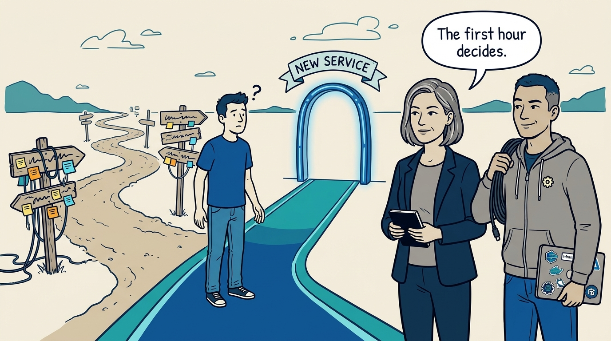
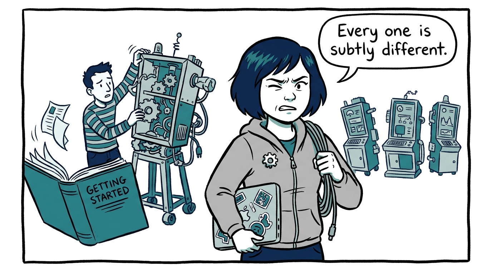
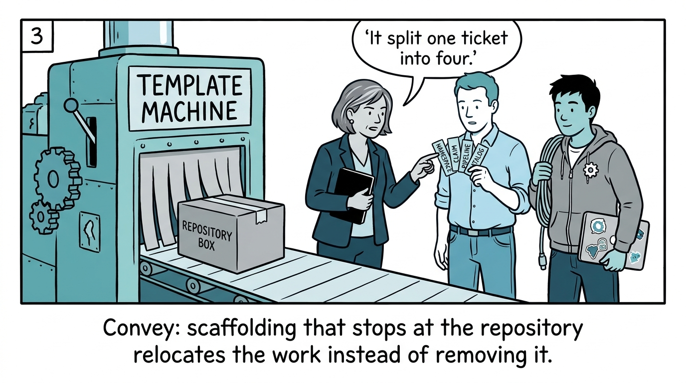
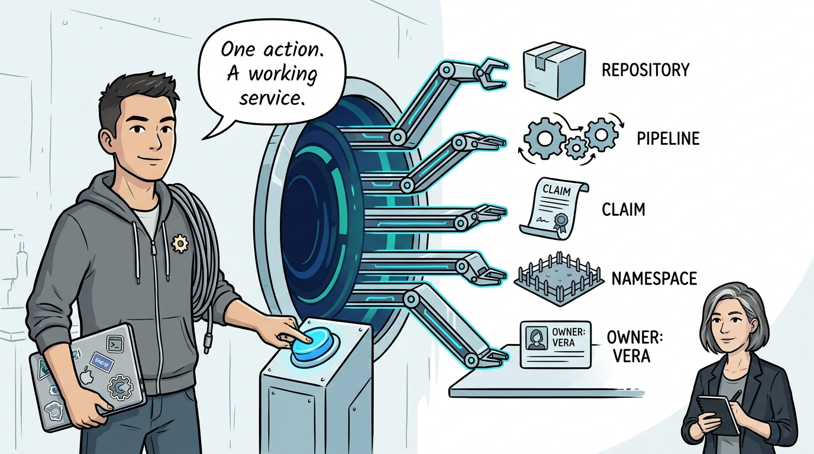
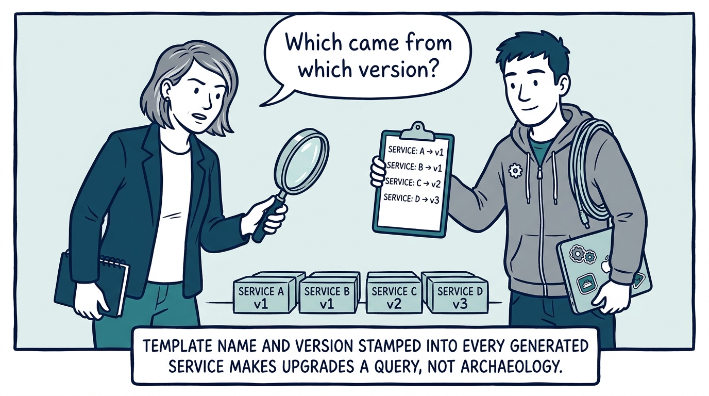
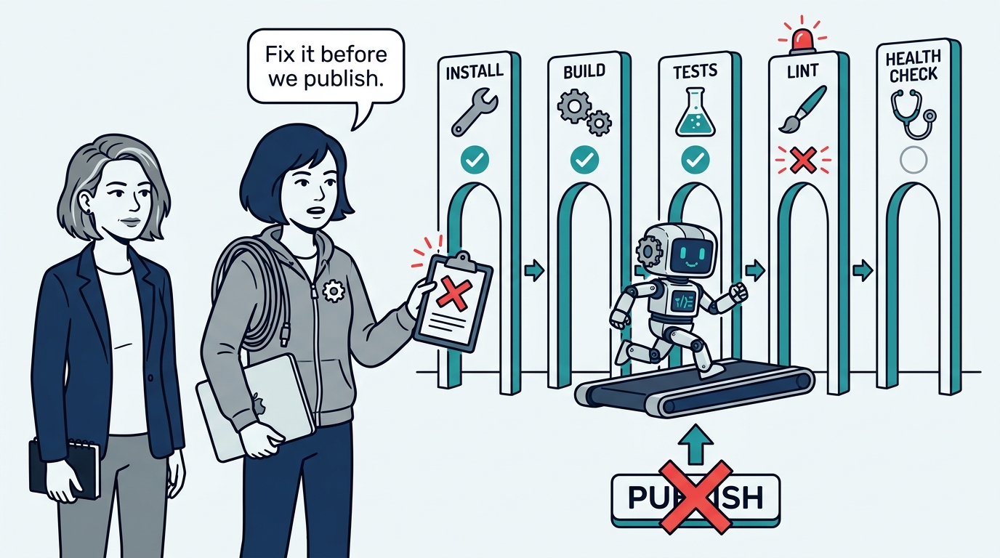
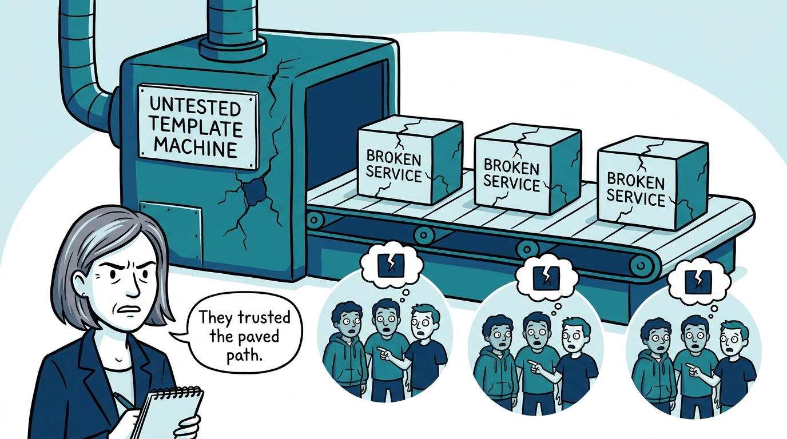
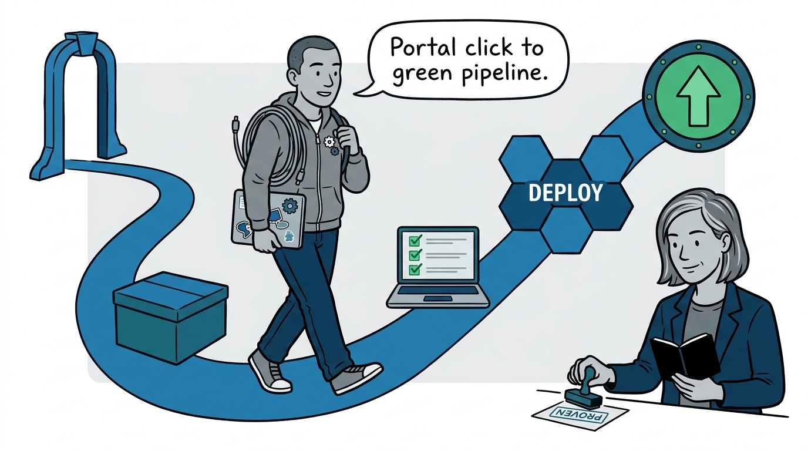
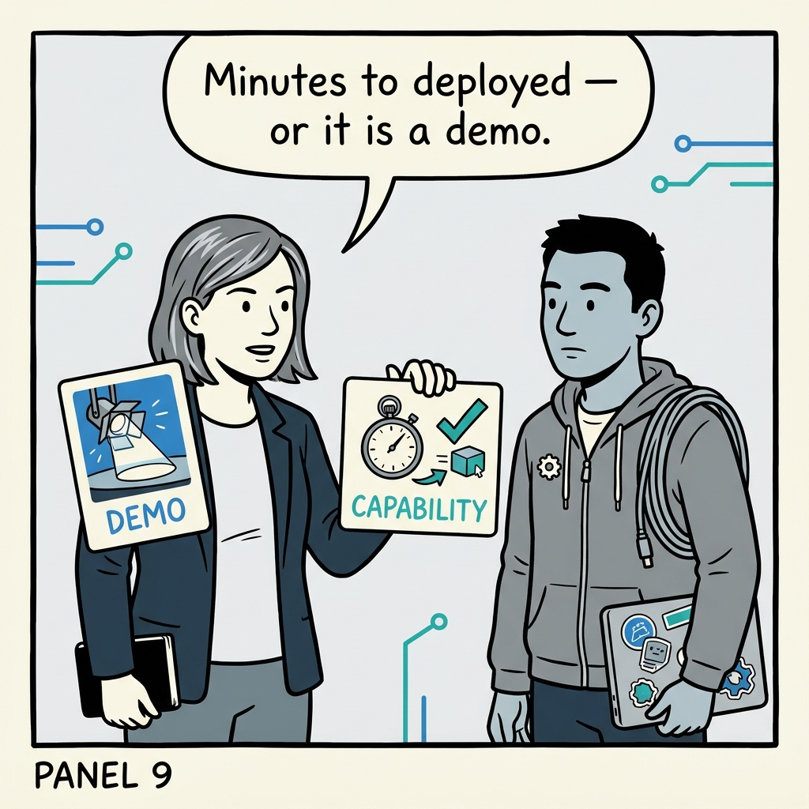

Why a starter kit is a tested, versioned product — and an untested template makes every consuming team the test — in nine panels.

<!-- comic-style
{
  "cast": "VERA: a calm, seasoned engineering executive, short gray-streaked hair, dark blazer over a plain t-shirt, carries a small black notebook. KAI: a hands-on platform engineering lead, short dark hair, gray zip-up hoodie with a small gear pin, laptop covered in infrastructure stickers under one arm, a coil of cable slung over the shoulder.",
  "style": "Clean two-tone explainer comic, thick ink outlines, flat colors with deep blue and teal accents on a light background, generous white space, hand-lettered speech bubbles with SHORT readable text, no photorealism."
}
-->

**Panel 1:** *The hook: a team makes its platform decision in the first hour of a new service — not in the architecture review.*

**Panel 2:** *The problem: the wiki scaffold — every new service hand-assembled, subtly unique, and off the paved path from day one.*

**Panel 3:** *The wrong way: scaffold and vanish — a template that creates the repository and leaves namespace, claim, pipeline, and catalog as follow-up tickets.*

**Panel 4:** *The principle: one portal action produces a working service — repository, pipeline, infrastructure claim, namespace, and catalog entry, with ownership recorded from minute one.*

**Panel 5:** *The product: the template is a versioned product — metadata stamped at generation time turns upgrades into a query and a campaign instead of archaeology.*

**Panel 6:** *The bar: tested like software — generate a test project and make it install, build, test, lint, start, and answer its health check; no publish with known failures.*

**Panel 7:** *What it costs: an untested template makes every consuming team the test — the defect ships at the exact moment teams were most willing to trust the paved path.*

**Panel 8:** *The proof: walk the whole path once, honestly — create through the portal, validate locally, deploy, push a change, watch the pipeline complete.*

**Panel 9:** *The closer: portal click to deployed service in minutes, traceable by template version — anything less is a demo, not a capability.*
