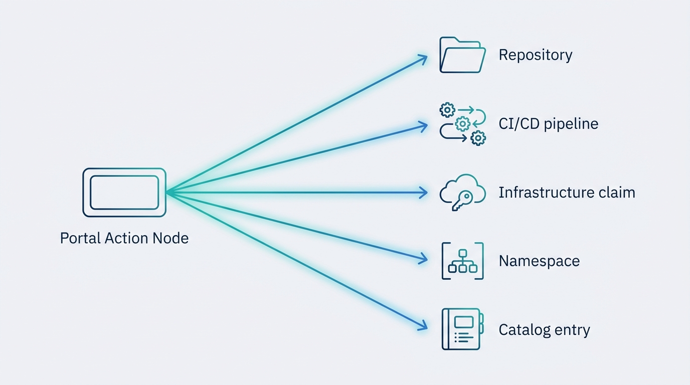
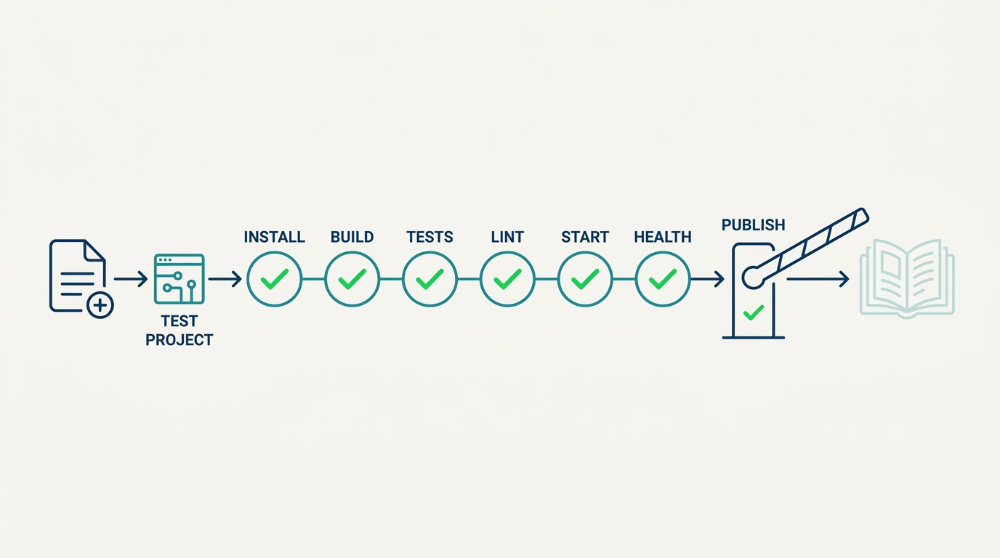
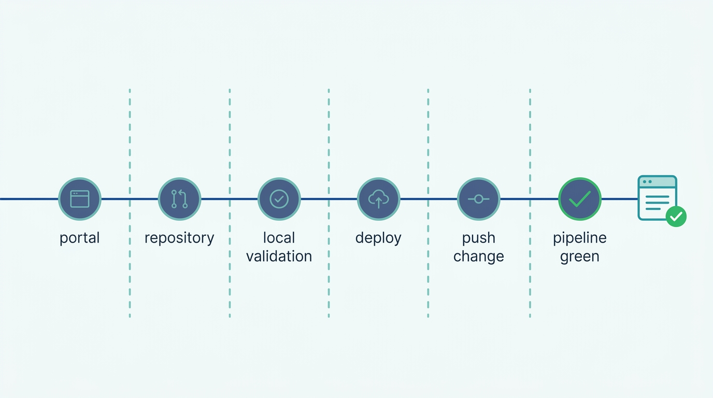

> **Status**: DRAFT
>
> **Principle**: When my organization builds starter kit templates, the finished capability has one shape: **a single portal action produces a working service** — a repository generated from a complete skeleton, a CI/CD pipeline already wired in, an infrastructure claim for what the service needs, a namespace to run in, and a catalog entry that says who owns it. The template is a **versioned product**: it carries platform metadata recording its name and version, so every service it generates can be traced back and upgraded forward. It is **tested like software**: before publishing, a test project is generated and made to install, build, test, lint, start, and answer its health endpoint — every failure fixed first. And it is **proven end to end**: create a service through the portal, validate it locally, deploy it, push a change, and watch the pipeline complete. An untested template makes every consuming team the test.

## Statement

When a platform team in my organization ships a starter kit, this is the shape of the build I hold them to.

**The kit is a complete skeleton, kept as code:**

- **A dedicated templates repository.** Starter kits live in their own repository with a clear structure: one directory per template, each holding the template definition and a skeleton directory with all required starter files.
- **Everything a real service needs on day one.** The skeleton includes the container build file, the CI/CD workflow, the package manifest, a README, and the required source and configuration files — a generated service is a working service, not a stub.
- **Versioned for upgrade tracking.** The manifest carries platform metadata, and the template's name and version are recorded in every generated service — so we can always answer *which services came from which template version*, and drive upgrades later.

**The portal template scaffolds the whole birth, not just the repository:**

- **Parameters that capture real decisions.** Service information, owning team, database options, service port, repository location — the choices a team actually has to make, and nothing more.
- **Steps that finish the job.** The template fetches the skeleton, applies conditional configuration (a database only if one was chosen), generates the infrastructure claim, publishes the repository, creates the runtime namespace, and registers the service in the catalog.
- **A landing, not a dead end.** The run ends with useful output links and next steps — the team knows where their repository, pipeline, and catalog entry are.

**The template is tested like software, before anyone consumes it:**

- **Structural validation.** Template structure, required metadata, and required skeleton files are verified mechanically.
- **A generated test project must actually work.** Dependencies install, the build passes, unit tests pass, linting passes, the application starts, and the health endpoint responds.
- **No publish with known failures.** Every failure is fixed before the template is published — the template's consumers are never its test bed.

**Publishing is controlled, and the proof is end to end:**

- **A publishing pipeline, not a copy-paste.** Portal URL, token, and repository variables are configured; a publishing script runs; validation must succeed; the template is registered in the catalog and visible in the portal.
- **The full path is demonstrated once, honestly.** Create a service through the portal; confirm the repository, namespace, and catalog entry exist; clone and validate the generated service locally — build, tests, lint, container build, infrastructure claim, catalog metadata, local development environment. Then deploy it to the platform cluster, push a code change, and observe the CI/CD pipeline complete. The capability is done when the whole workflow works from template creation through deployment.

## How to Read This

This record is part of the **Reference Implementation** section of this journal — the how-it-concretely-looks companion to the Platform Engineering records. It is grounded in the Starter Kit Template chapter checklist of the *Platform Engineer's Handbook*, a build-it-end-to-end companion that constructs a concrete internal developer platform; this chapter builds the backend-service starter kit. Where [[four-pillars]] states that a platform offers paved paths, consumable self-service, this record is that claim made executable: the paved path for the most consequential recurring act — starting a new service. The runnable version is the **Checklist** tab; the **TL;DR** tab is the management summary; the **Conversation** tab talks it through.

## Reference Stack

The reference build names concrete tools. My commitments are at the capability level — the right-hand column is what actually matters, and it survives a tool swap.

| Role | Reference tool | The property that matters |
| --- | --- | --- |
| Portal and scaffolder | Backstage software templates | One parameterized action runs the whole scaffold; the result is registered in a catalog |
| Repository hosting | GitHub | The generated repository is created and published by the template run, not by hand |
| Infrastructure provisioning | Crossplane claims | The template generates a declarative claim; infrastructure follows the [[self-service-infrastructure]] model |
| Runtime | Kubernetes namespaces | The service's runtime home is created at scaffold time |
| CI/CD | Platform pipeline workflow | The generated repository carries a working pipeline from its first commit — the service defined in [[cicd-as-a-platform-service]] |
| Template versioning | `platformMetadata` in the package manifest | Every generated service records which template and version it came from |

## Rationale

**The first hour decides whether the paved path is real.** A team starting a new service makes its platform decision in the first hour, not in the architecture review. If the paved path is a wiki page of copy-paste steps, every service is hand-assembled, subtly different, and drifting from the platform from day one. A starter kit collapses that hour into one portal action — and because the generated service is complete (build file, pipeline, manifest, README, source files), the team's first commit lands on a service that already builds, deploys, and appears in the catalog. This is [[four-pillars]] pillar one and pillar three meeting in one artifact: a curated opinion, consumed self-service.

**Scaffolding must finish the birth, or it just relocates the tickets.** A template that creates a repository but leaves the namespace, the infrastructure claim, the pipeline wiring, and the catalog registration to manual follow-up has not removed work — it has split one ticket into four. That is why the template's steps run every step of the birth, all the way through to the next-step links. The scaffold is done when the service exists everywhere it needs to exist, with ownership recorded from minute one.

**Figure 1:** *One portal action finishes the whole birth: repository, pipeline, infrastructure claim, namespace, and catalog entry from a single run.*

**Templates are products, and version metadata is what keeps them products.** The moment a template generates its tenth service, the real question becomes: *what happens when the template improves?* Without recorded template name and version in each generated service, the answer is archaeology — nobody can say which services carry the old pipeline, the old base image, the vulnerable dependency. With platform metadata stamped at generation time, upgrades become a query and a campaign instead of a guess. A template without version tracking is a one-way door that looks like a product.

**Testing the template means generating a project and making it live.** Validating the template's structure is necessary and nowhere near sufficient — a template can be syntactically perfect and generate a service that does not compile. The bar is behavioral: generate a test project, install its dependencies, build it, run its tests and linting, start it, and hit its health endpoint. Every failure gets fixed before publishing, because the alternative is worse than no template: **a broken template ships its defect to every team that trusts the paved path**, at the exact moment they were most willing to trust it. This bar has a cost I name and accept: it makes every template change slower to ship — the price of never using consuming teams as the test bed.

**Figure 2:** *The publish gate is behavioral: a generated test project must install, build, test, lint, start, and answer its health check before the template ships.*

**The end-to-end proof is the only honest definition of done.** The final verification — create a service through the portal, validate it locally, deploy it to the cluster, push a change, watch the pipeline complete, see it in the catalog — is the difference between a template that demos and a capability that works. Every seam it crosses (portal to repository, repository to pipeline, claim to infrastructure, deployment to catalog) is a seam that breaks silently when only tested in isolation. I ask for this proof once per template, honestly, before the template is announced — and again whenever the template materially changes.

**Figure 3:** *The proof crosses every seam in one run: from portal click to a green pipeline on a deployed, cataloged service.*

## What This Means in Practice

| What this record says | What it does **not** say |
| --- | --- |
| One portal action produces a working service: repository, pipeline, claim, namespace, catalog entry. | Teams must never create services any other way — the paved path has exits; off-path services still register in the catalog. |
| The generated skeleton is complete enough that the first commit lands on a service that builds and deploys. | The skeleton contains the team's business logic — it is a working start, not the application. |
| Templates carry recorded name and version in every generated service. | Generated services are auto-upgraded — the metadata makes upgrade campaigns possible, not automatic. |
| Templates are tested by generating a project and making it build, test, lint, start, and answer its health check. | Structural validation is enough — a syntactically valid template that generates a broken service fails the bar. |
| Publishing runs through a script with validation; the template appears in the catalog and portal. | Templates are edited directly in the portal — the templates repository is the source of truth. |
| The capability is proven end to end: portal click through deployed service through green pipeline on a pushed change. | The proof recurs on every scaffold — it is run per template, at creation and on material change. |
| Template parameters capture real decisions: name, owner, description, database, port, repository location. | Every option belongs in the form — a template with dozens of parameters is an inventory wearing a form. |

Concretely: the next time a team in my organization starts a backend service, I expect the elapsed time from portal click to a deployed service with a green pipeline to be measured in minutes — and I expect the platform team to be able to list, from metadata alone, every service generated from each template version. **If either claim fails, the starter kit is a demo, not a capability.**

## Anti-Patterns

- **The wiki scaffold.** The "starter kit" is a getting-started page of copy-paste steps. Every new service is hand-assembled, subtly unique, and off the paved path from its first day.
- **Scaffold and vanish.** The template creates a repository and stops — namespace, infrastructure claim, pipeline wiring, and catalog registration become the team's four follow-up tickets. The scaffold relocated the work instead of removing it.
- **The untested template.** Template changes are published on the strength of structural validation alone. The first team to scaffold a service discovers the build failure — and every team after them, until someone fixes it in production trust.
- **The unversioned template.** No platform metadata, no recorded template version in generated services. Two years later, nobody can say which services carry the old pipeline or the vulnerable base image; every upgrade is archaeology.
- **The demo-day template.** Verified to generate files, never to deploy. It works beautifully in the portal and dies at the cluster — the seams (claim, namespace, pipeline, catalog) were never crossed in one run.
- **The kitchen-sink template.** One template, forty parameters, every framework option. Curation abdicated into a form — the team's first platform experience is a questionnaire it cannot answer.
- **Fork-and-forget.** Teams copy last quarter's generated repository instead of running the template, because the template is stale or slow. The paved path exists but nobody rides it — a signal the template stopped being a product.

## Related Records

- [[four-pillars]] — the structural test; this record is pillar one's paved paths and pillar three's self-service made concrete in one artifact.
- [[platform-as-a-product]] — the product operating mechanics that make a template versioned, maintained, and fed by user feedback.
- [[self-service-onboarding]] — the sibling record that gets a team onto the platform; this one gets a service born once the team is on.
- [[cicd-as-a-platform-service]] — the pipeline capability the starter kit wires into every generated repository.
- [[self-service-infrastructure]] — the claim-based infrastructure model the template's generated claim consumes.
- [[platform-creation]] — the environments, GitOps, and mesh foundation the generated service deploys onto.
- [[devex-evaluation]] — how I measure whether the paved path is actually fast and actually used.

## Scope and Revisiting

This record is `draft`. It applies to every starter kit a platform team in my organization publishes, everywhere I am the accountable executive. I revisit it if teams start forking old repositories instead of running templates (the product failing in public), if a template defect ships to multiple generated services (the testing bar failing), if the platform team cannot enumerate services per template version (the metadata failing), or if a new class of service — frontend, data pipeline, ML workload — becomes recurring enough that the single-template reference shape needs to become a governed template catalog.

## Authoritative References

- *Platform Engineer's Handbook* — the Starter Kit Template chapter, whose checklist this record distills; the reference build uses Backstage software templates, GitHub, Crossplane claims, and Kubernetes namespaces.
- Camille Fournier and Ian Nowland, *Platform Engineering: A Guide for Technical, Product, and People Leaders* (O'Reilly, 2024) — the curated-product and self-service pillars this record makes concrete.
