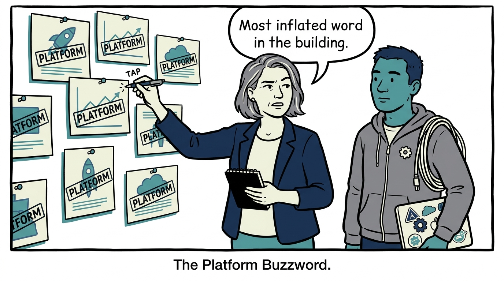
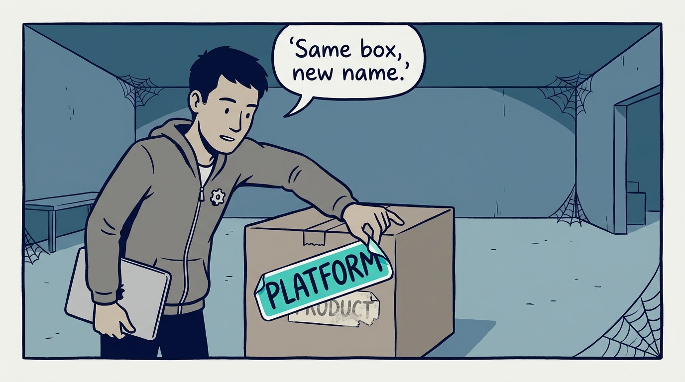
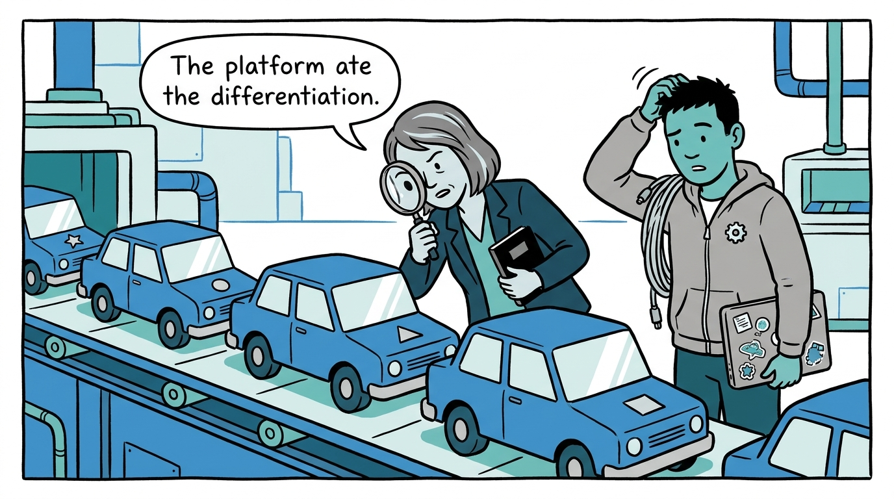
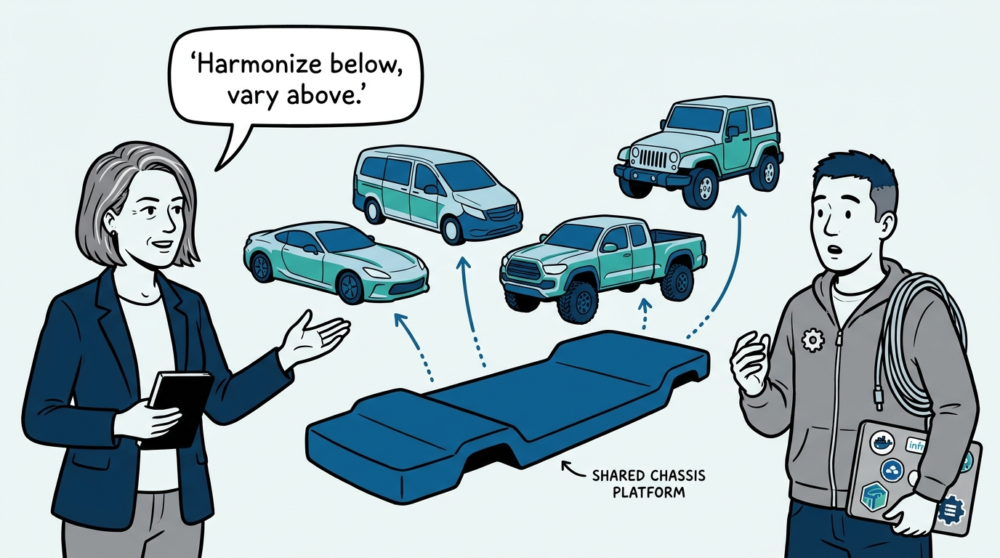
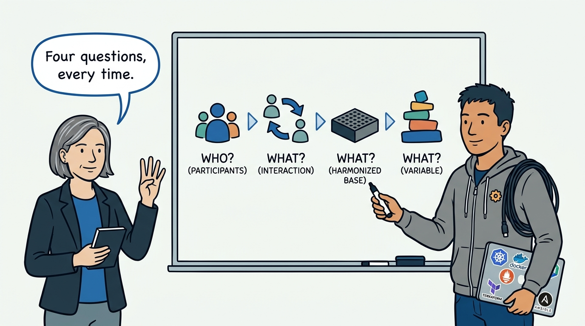
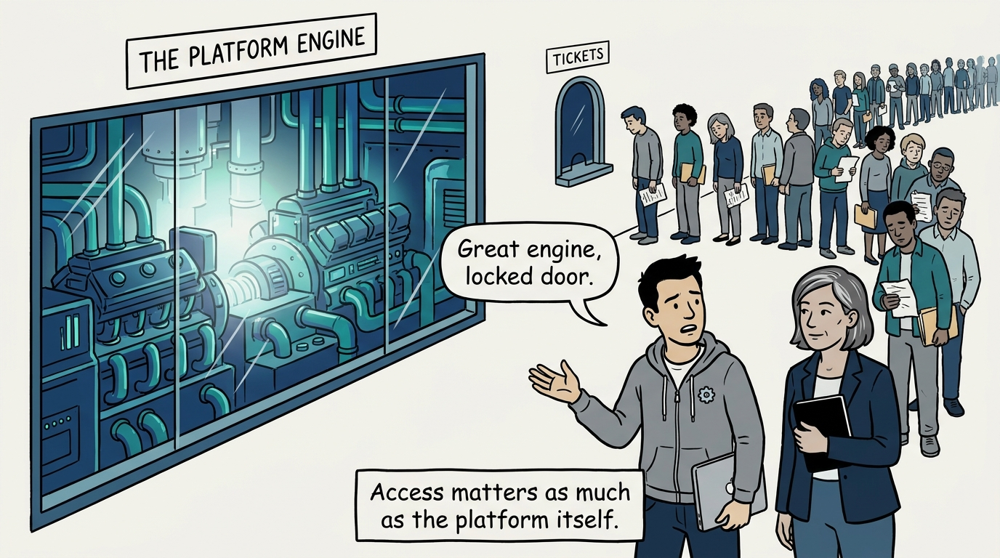
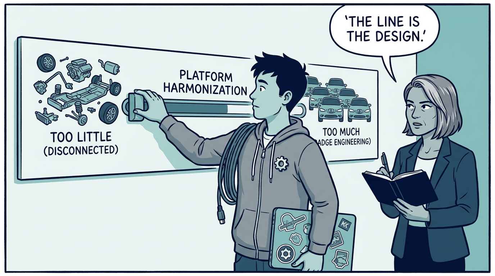
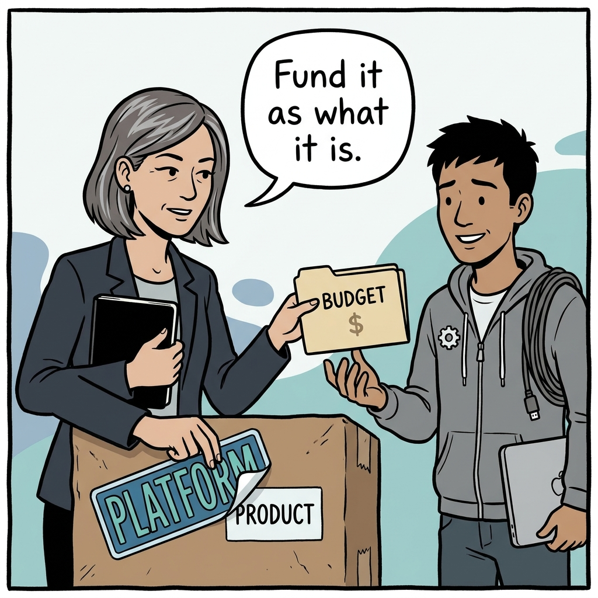

Why "platform" is a test to pass, not a label to claim — in eight panels.

<!-- comic-style
{
  "cast": "VERA: a calm, seasoned engineering executive, short gray-streaked hair, dark blazer over a plain t-shirt, carries a small black notebook. KAI: a hands-on platform engineering lead, short dark hair, gray zip-up hoodie with a small gear pin, laptop covered in infrastructure stickers under one arm, a coil of cable slung over the shoulder.",
  "style": "Clean two-tone explainer comic, thick ink outlines, flat colors with deep blue and teal accents on a light background, generous white space, hand-lettered speech bubbles with SHORT readable text, no photorealism."
}
-->

**Panel 1:** *The hook: every pitch, reorg, and budget request eventually reaches for the word 'platform'.*

**Panel 2:** *The problem: a product relabeled 'platform' is worth nothing extra — and a platform without participants is not a platform.*

**Panel 3:** *The wrong way: badge engineering — standardize so much that the 'differentiated' products on top are near-identical.*

**Panel 4:** *The principle: harmonize the expensive, undifferentiated engineering underneath so diversity increases on top.*

**Panel 5:** *How it plays out: who are the participants, what interaction creates the value, what is harmonized underneath, what stays variable on top.*

**Panel 6:** *The access test: a powerful platform behind a ticket queue is a weak platform — reducing friction and cognitive load is platform work, not a user problem.*

**Panel 7:** *The trade-off: get the harmonization line wrong one way and nothing is reused; wrong the other way and you get badge engineering.*

**Panel 8:** *The closer: if the answers are 'one team, none, everything, nothing' — rename it back and fund it honestly as a product.*
