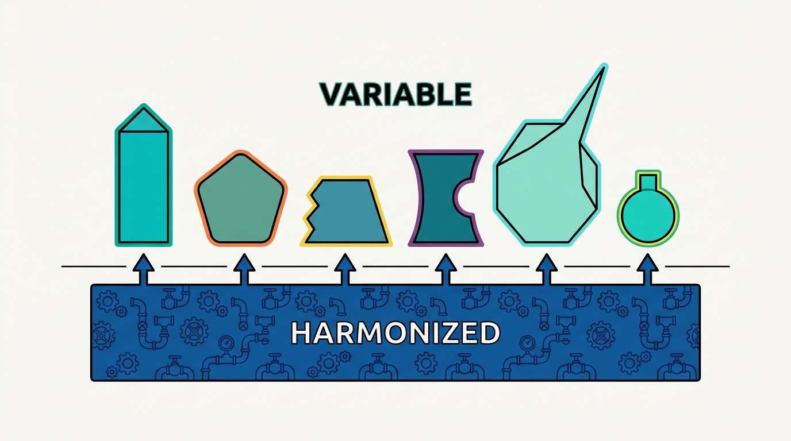
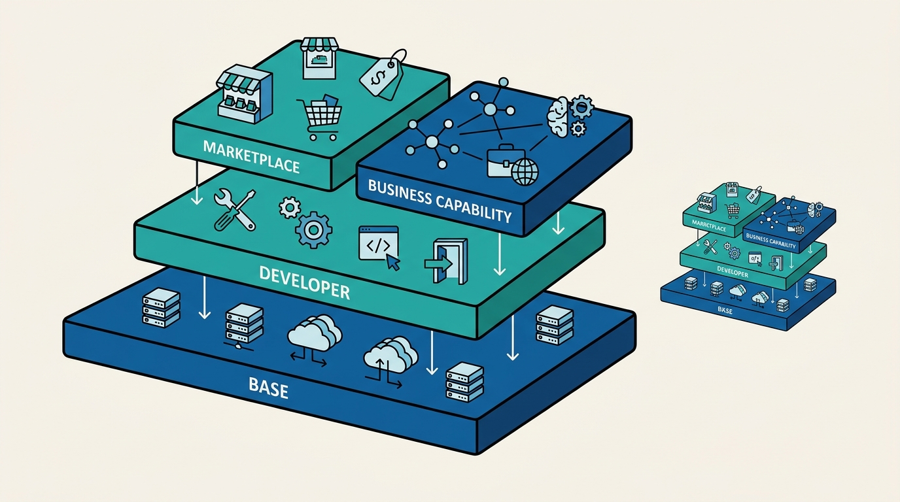
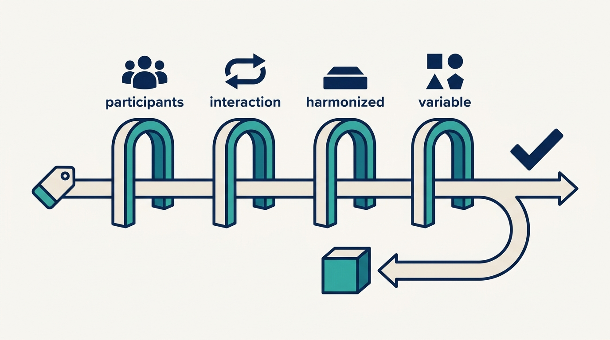

> **Status**: DRAFT
>
> **Principle**: I use the word platform for exactly one thing: something that elevates participants by letting them build on existing capabilities rather than starting from scratch, and that generates its value through the interaction of those participants. A platform without participants is worth little; a product relabeled "platform" is worth nothing extra. The test I hold every platform to is the automotive lesson: harmonize the expensive, undifferentiated engineering underneath so that diversity *increases* on top. When standardization suppresses differentiation instead of enabling it, we have not built a platform — we have built a constraint with a fashionable name.

## Statement

My operating model for understanding platforms has four parts.

What makes something a platform:

- **It elevates participants.** People build on existing capabilities rather than starting from scratch — the platform raises the floor they stand on.
- **Its value comes from interaction.** Platforms generate value through participants benefiting from the presence of other participants and of shared, reusable capabilities. A platform without participants provides little or no value.
- **It is engineered, not relabeled.** Renaming an existing product or service "platform" changes nothing. The question is whether the thing exhibits platform characteristics, not what the slide calls it.

What platforms are for — the five benefits I expect a real one to show:

- **Enable** — make interactions or transactions easier.
- **Democratize** — lower barriers to participation.
- **Self-perpetuate** — create positive feedback loops as participation grows.
- **Accelerate** — remove common or repetitive work so users can focus on differentiation.
- **Avoid unnecessary constraints** — provide reusable capabilities without forcing every participant into the same solution.

The line that makes or breaks a platform — the automotive lesson:

- **Harmonize below, vary above.** Automotive platforms reuse expensive underlying engineering across many vehicle models; done right, standardization *increases* product diversity. The design decision that matters is what gets harmonized in the platform versus what remains variable on top.
- **Beware badge engineering.** Near-identical products with superficial differences are the failure mode: the platform ate the differentiation. Both the platform *and* the differentiated products built on top have to matter.

**Figure 1:** *The automotive lesson as a design rule: harmonize the expensive, undifferentiated engineering below the line so that diversity increases above it.*

The four technology platform types — combinable, not mutually exclusive:

| Type | Purpose | Typical interaction |
| --- | --- | --- |
| **Marketplace** | Facilitate transactions between participant groups | Browser, mobile app, APIs |
| **Base platform** | Rapidly provision technical/IT resources | Console, CLI, APIs, automation |
| **Developer platform** | Increase development speed, reuse, and governance | Portals, command line, APIs |
| **Business capability platform** | Expose business-domain capabilities and enable an ecosystem | APIs and custom integrations |

Marketplaces run on base platforms; developer platforms run on clouds; internal platforms get externalized; business capability platforms help customers build their own marketplaces. Platform ecosystems are layered and fractal, and I treat the types as lenses, not boxes.

**Figure 2:** *Platform ecosystems are layered and fractal: marketplaces run on base platforms, developer platforms run on clouds, and the pattern repeats at every scale.*

## How to Read This

This journal is my platform operating model, one record per source checklist. This record is grounded in the "Understanding Platforms" chapter of Gregor Hohpe's *Platform Strategy: Innovation Through Harmonization* (Leanpub, 2024) — the chapter that supplies the vocabulary everything else in this journal builds on: **what a platform is, what it is for, and the harmonize-below / differentiate-above line that separates real platforms from relabeled products**. The runnable version — the definition test, the benefits list, the four types, and the is-it-really-a-platform evaluation — lives in the **Checklist** tab of this post.

## Rationale

**The word "platform" needs a defended definition because it is the most inflated word in the building.** Every product pitch, every reorg, every budget request eventually reaches for it. Hohpe's starting move is to make the word earn its keep: a platform elevates participants and generates value through their interaction. That definition has teeth — it immediately disqualifies the shared library nobody adopted, the mandatory tool with one captive user, and the product that got a new name but no new participants. **A platform without participants is not a small platform; it is not a platform.**

**The benefits list is a diagnostic, not a brochure.** Enable, democratize, self-perpetuate, accelerate, avoid unnecessary constraints — I read these as five questions to ask of any platform investment. The last one does the most work in an internal setting: it is easy to build something reusable that *forces* every team into the same solution, and the chapter is explicit that this is not a benefit but a defect. A platform that removes choice without removing work has confused its own convenience with its users' productivity.

**The automotive lesson is the deepest idea in the chapter: standardization done right increases diversity.** Car makers did not standardize chassis engineering to make every car identical; they did it so the expensive, invisible engineering could be reused while the visible product line *diversified*. That inverts the intuition most engineers carry — that standardization and innovation trade off against each other. The design question is never "standardize: yes or no" but **"what belongs in the harmonized platform, and what must remain variable on top?"** Get that line wrong in one direction and nothing is reused; wrong in the other and you get badge engineering — near-identical products with superficial differences, the platform world's way of shipping the org chart.

**Access is a first-class capability, not an afterthought.** Cloud platforms teach the second lesson: their value depends not only on what is inside but on how easily users can get at it — console, CLI, APIs, infrastructure-as-code. Reducing friction and cognitive load is what turns capabilities into adoption, and **how users access the platform can be as important as its capabilities**. An internal platform with powerful internals and a ticket queue for a front door fails this test daily.

**The four types keep strategy conversations honest.** Marketplace, base, developer, and business capability platforms have different purposes, different participants, and different economics. The marketplace flywheel (more buyers attract more sellers, more sellers increase selection, greater selection attracts more buyers) and its chicken-or-egg problem simply do not apply to a base platform, and a developer platform's risk profile — the restrictive cloud wrapper that reduces choice — is its own. Naming the type we are building prevents us from importing the wrong success model. And because the types combine and layer, one organization will usually run several at once — which is exactly why the vocabulary matters.

## What This Means in Practice

| What this record says | What it does **not** say |
| --- | --- |
| A platform elevates participants and generates value through their interaction. | Anything reusable is a platform — a library, a shared service, or a renamed product does not qualify by default. |
| Harmonize the expensive, undifferentiated engineering underneath. | Standardize everything — the point of harmonizing below is to *increase* variety on top. |
| Reusable capabilities must leave room for differentiation. | Uniformity is the goal — badge engineering is the failure mode, not the target. |
| How users access the platform matters as much as what is inside it. | Capability wins on its own — a powerful platform behind a ticket queue is a weak platform. |
| Name which of the four types you are building, and use its economics. | The types are silos — they combine and layer, and one organization runs several. |
| Internal platforms can later be externalized into ecosystems and revenue. | Every internal platform should be productized — externalizing adds public APIs, multi-tenancy, scale, security, and legal weight. |
| Evaluate "platform" claims against the characteristics, not the label. | The word on the slide settles the question. |

Concretely: any initiative in my organization that calls itself a platform can answer four questions — **who are the participants, what interaction creates the value, what is harmonized underneath, and what stays variable on top**. If the answers are "one team, none, everything, nothing", we rename it back to what it is and fund it honestly as a product or a shared service.

**Figure 3:** *The four-question test every platform claim must pass; fail it, and the initiative goes back to being funded as a product.*

## Anti-Patterns

- **The relabeled product.** An existing product or service renamed "platform" for the budget cycle — no new participants, no new interaction, no new value.
- **The participant-free platform.** Built to completion before anyone was elevated by it; a platform without participants provides little or no value, however elegant the internals.
- **Badge engineering.** Standardizing so much that the "differentiated" products on top are near-identical with superficial differences — the platform consumed the diversity it was supposed to enable.
- **The restrictive cloud wrapper.** A developer platform that reduces developer choice instead of increasing productivity — governance dressed up as enablement.
- **The powerful platform behind a ticket queue.** Rich capabilities, miserable access; forgetting that reducing friction and cognitive load is platform work, not a user problem.
- **One success model for four types.** Chasing a marketplace flywheel for a base platform, or judging a business capability platform by developer-productivity metrics.
- **Solving the chicken-or-egg problem by decree.** Mandating adoption on both sides of a marketplace instead of making one side genuinely attractive first.

## Related Records

- [[platform-strategy]] — the strategy discipline this vocabulary feeds: once we agree what a platform is, that record governs how we decide why and where to build one.
- [[what-is-platform-engineering]] — the Fournier/Nowland case for platform engineering as a discipline; this record supplies the Hohpe-side definition it operates on.
- [[designing-platforms]] — where the harmonized-vs-variable line drawn here becomes concrete interface and boundary decisions.
- [[growing-platforms]] — the adoption side: how participants actually arrive, which is where the flywheel and chicken-or-egg dynamics play out.

## Scope and Revisiting

This record is `draft`. It governs how the word "platform" is used everywhere I am the accountable executive: any initiative claiming the name is evaluated against the participant, interaction, and harmonization tests here. I revisit it if **portfolio reviews keep surfacing "platforms" with one consumer** (the signal that the definition has stopped being enforced), if a platform's product teams start shipping near-identical results (badge engineering showing up internally), or if a new platform type emerges in our landscape that the four-type taxonomy cannot name.

## Authoritative References

- Gregor Hohpe, *Platform Strategy: Innovation Through Harmonization* (Leanpub, 2024) — the "Understanding Platforms" chapter, whose checklist this record distills.
