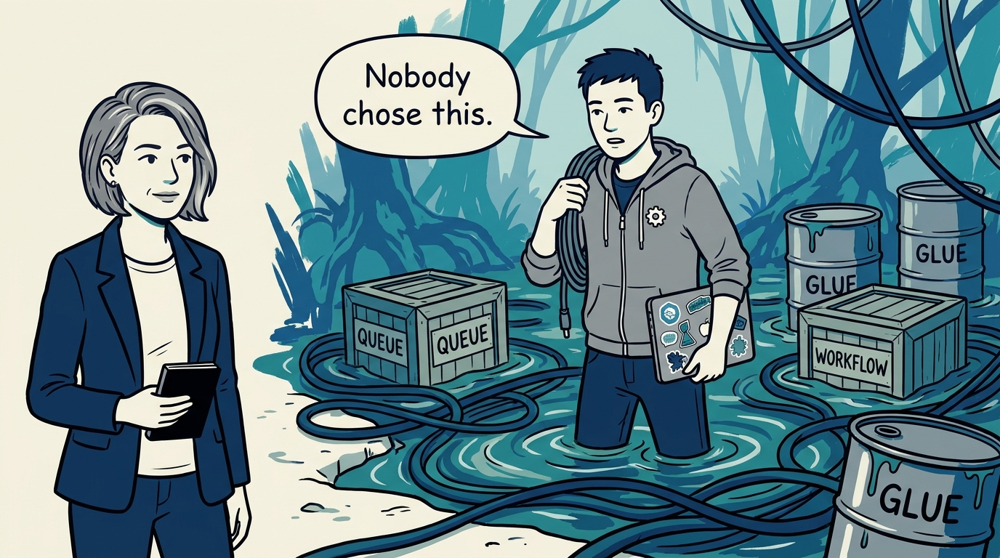
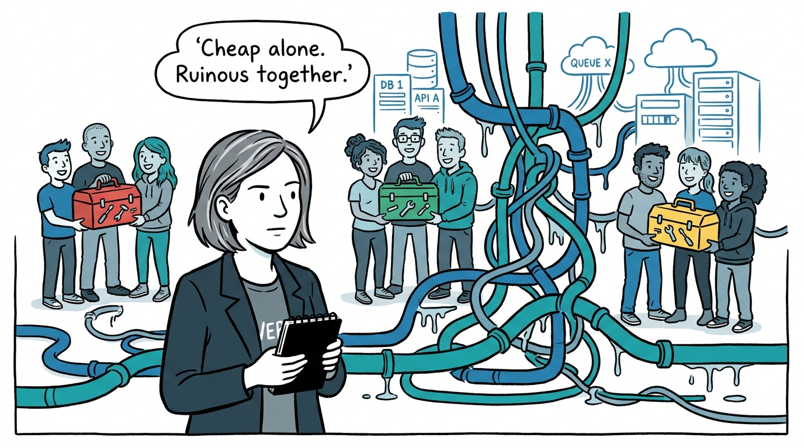
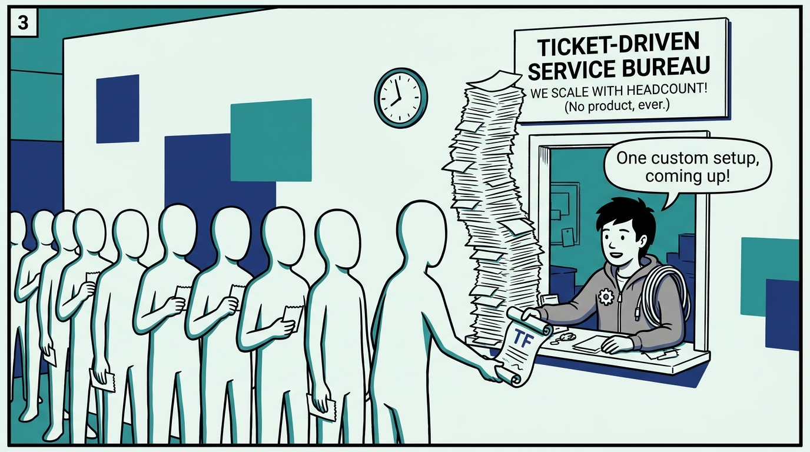
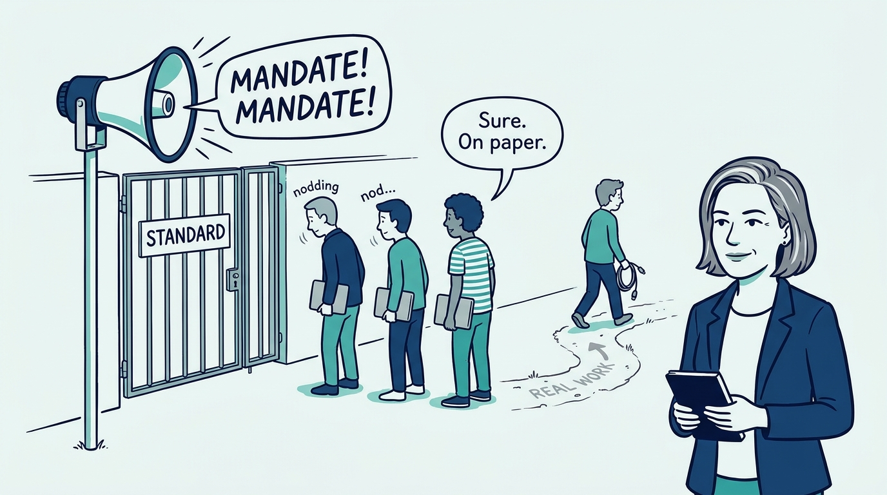
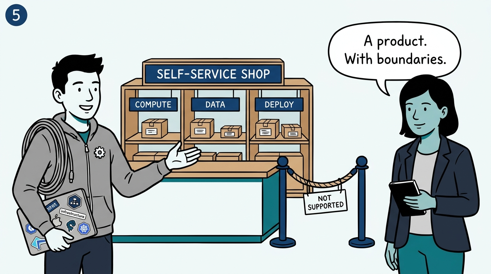
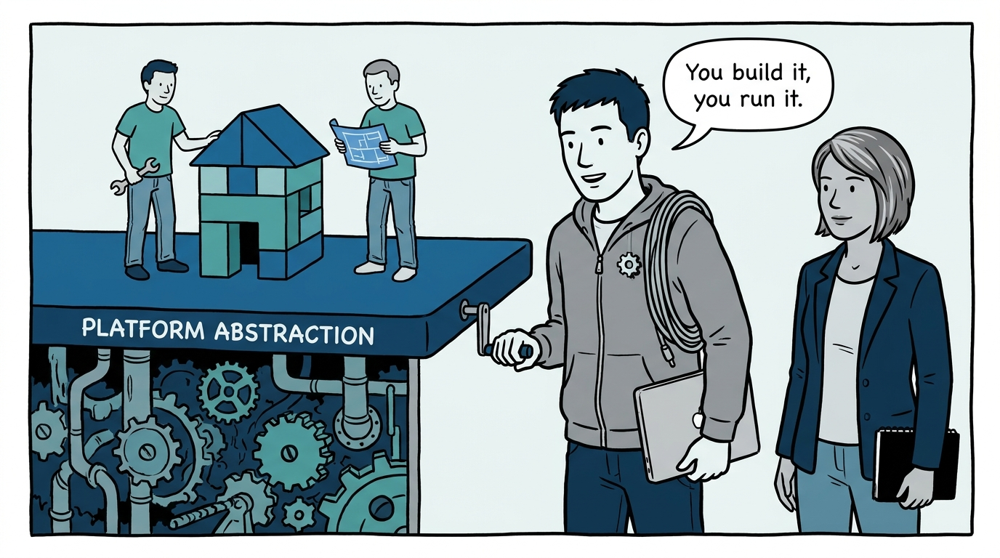
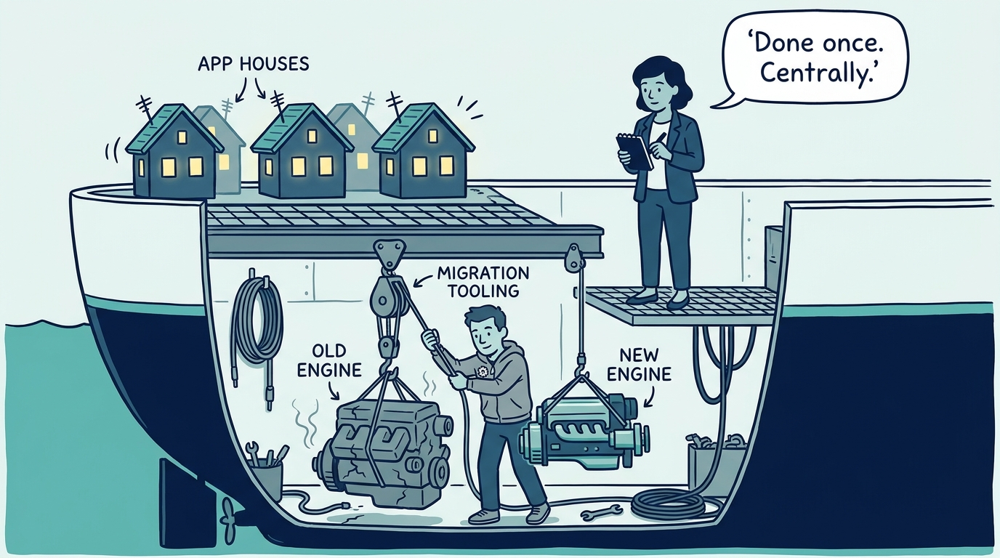
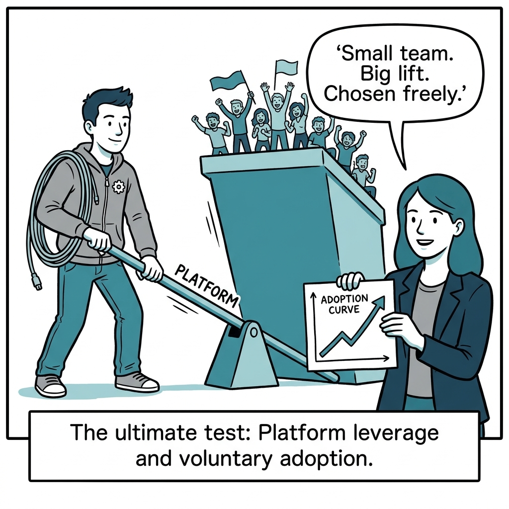

Why platform engineering exists — draining the over-general swamp — in eight panels.

<!-- comic-style
{
  "cast": "VERA: a calm, seasoned engineering executive, short gray-streaked hair, dark blazer over a plain t-shirt, carries a small black notebook. KAI: a hands-on platform engineering lead, short dark hair, gray zip-up hoodie with a small gear pin, laptop covered in infrastructure stickers under one arm, a coil of cable slung over the shoulder.",
  "style": "Clean two-tone explainer comic, thick ink outlines, flat colors with deep blue and teal accents on a light background, generous white space, hand-lettered speech bubbles with SHORT readable text, no photorealism."
}
-->

**Panel 1:** *The hook: the over-general swamp — duplicated tools, per-application glue, systems too expensive to upgrade or leave. Nobody chose it.*

**Panel 2:** *The problem: the swamp accumulates one sensible local choice at a time — until an ever-growing share of engineering time goes to glue and upgrades nobody owns.*

**Panel 3:** *Wrong way one: the ticket-driven service bureau — bespoke work per request, headcount scaling with demand, no self-service product.*

**Panel 4:** *Wrong way two: adoption by decree — the standard is announced, teams comply on paper, and the real work routes around it.*

**Panel 5:** *The principle: the platform is an internal product — curated, self-service, clear boundaries — and saying what it does not support is the defining act.*

**Panel 6:** *How it plays out: abstractions hide complexity instead of relocating it — which is what makes 'you build it, you run it' a fair ask.*

**Panel 7:** *The economics: migrations done once, centrally, with tooling and dependency metadata — instead of dozens of teams rediscovering the same move.*

**Panel 8:** *The closer: the one test — a small platform team makes a much larger organization measurably more productive, and adoption grows because teams choose it.*
