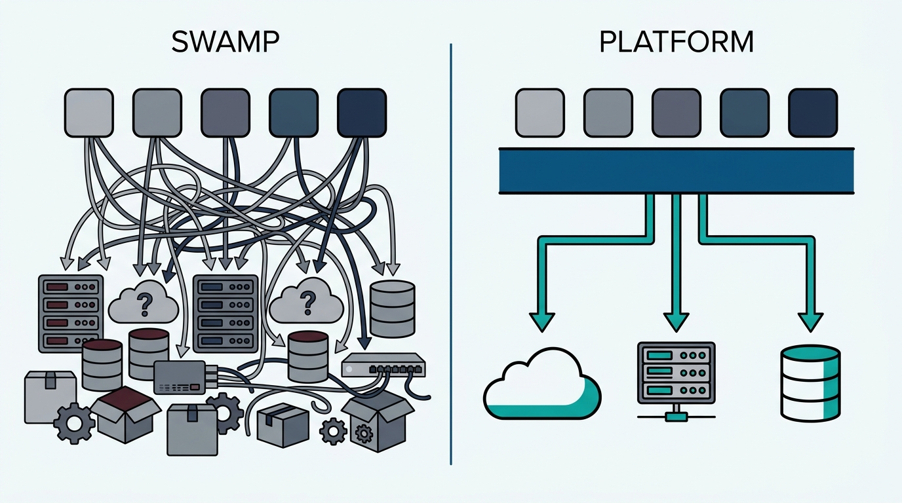
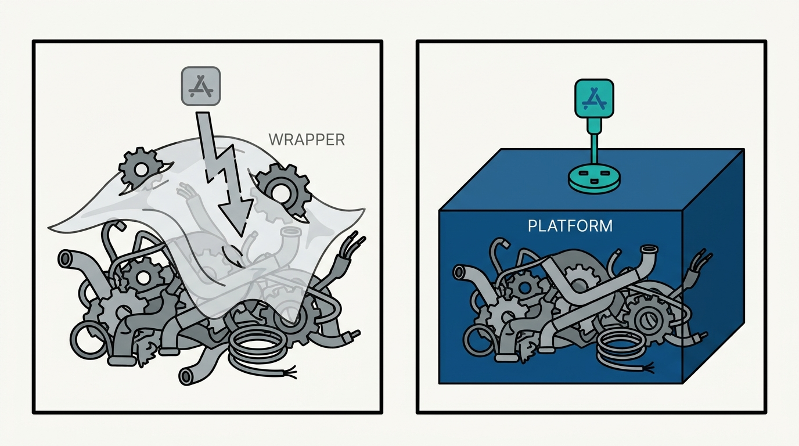
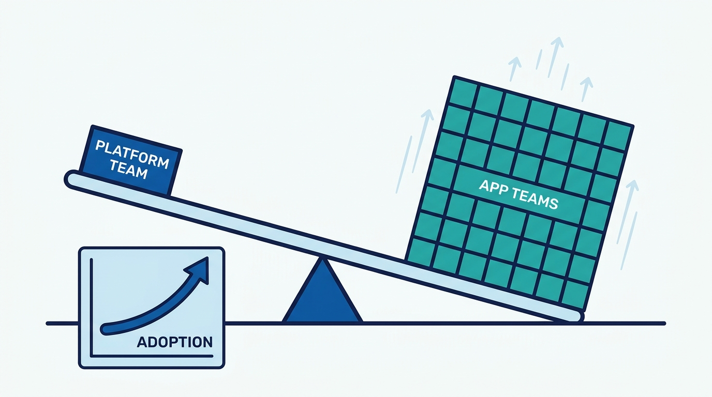

> **Status**: DRAFT
>
> **Principle**: Platform engineering is how I manage the complexity my organization has already bought. Left alone, a growing engineering organization sinks into an over-general swamp: duplicated OSS and cloud services, per-application integration glue, and systems too expensive to upgrade or leave. The way out is a platform treated as an internal product — a curated, self-service set of capabilities with clear boundaries, built and operated by a dedicated team — that hides implementation complexity from application teams instead of relocating it onto them. I hold platform investment to one test: a small platform team must make a much larger engineering organization measurably more productive, and adoption must grow because developers find the platform useful, not because it was mandated.

## Statement

My operating model for why and when platform engineering exists:

- **The platform is an internal product, not a collection of tools.** It has identified customers (the application teams), a dedicated team that develops and operates it, self-service APIs, tools, services, knowledge, and support — and clear boundaries: what it supports and what it intentionally does not.
- **Its job is to drain the over-general swamp.** I inventory the OSS, cloud services, and bespoke systems in use; find the duplication, the per-application glue, and the systems that are expensive to upgrade or maintain; and replace repeated per-application integrations with shared capabilities behind abstractions that hide implementation complexity.
- **Curation over exhaustiveness.** The platform limits the primitives it officially supports, removes low-value or duplicate choices, and ships opinionated defaults — with exceptions allowed when there is a legitimate business or technical reason. Application teams should not have to become infrastructure experts; specialized expertise is centralized where it can serve many teams.
- **The product stance is non-negotiable.** Platform teams interview their developers, prioritize user experience over infrastructure-team convenience, deliver incrementally, gather feedback continuously, and track adoption and satisfaction. Standards are not imposed only by mandate — the preferred path has to demonstrate its value so teams choose it.
- **The platform enables "you build it, you run it".** Application teams operate the software they develop, because resilient platform defaults for networking, compute, storage, deployment, and runtime keep infrastructure out of their incident queue. Operational responsibility for shared infrastructure stays with the platform team.
- **Migrations are a platform responsibility, planned as a normal lifecycle activity.** The platform reduces the number of technologies that may require future migration, encapsulates vendors and OSS behind APIs, tracks which applications depend on what, and builds migration tooling that minimizes application-team work.
- **The test is leverage.** Application teams ship faster, spend less time on infrastructure, and face cheaper upgrades; glue and directly owned primitives decrease; adoption grows voluntarily — and a small platform team makes a much larger engineering organization more productive.

## How to Read This

This journal is my platform operating model, one record per source checklist. This record is grounded in the introductory chapter of Camille Fournier and Ian Nowland's *Platform Engineering: A Guide for Technical, Product, and People Leaders* (O'Reilly, 2024) — the chapter that makes the case for the discipline itself, distilled here into **why I fund a platform and what I hold it accountable to**. The runnable version — from platform foundations through the success criteria — lives in the **Checklist** tab of this post.

## Rationale

**The swamp is the default, not a failure of discipline.** Every reasonable local decision — this team adopts a queue, that team a workflow engine, a third writes its own Terraform — is individually cheap and collectively ruinous. Nobody chooses the over-general swamp; organizations **accumulate it one sensible choice at a time**, until an ever-growing share of engineering time goes to integration glue, upgrades nobody owns, and expertise spread too thin to be expert at anything. That is why platform engineering is not optional at scale: the complexity is already here, already paid for, and already compounding. The only question is whether it is managed deliberately or endured.

**Figure 1:** *The move the record commits to: replace per-application glue with one curated platform layer, so complexity is managed once instead of endured everywhere.*

**A platform without boundaries is just the swamp with a logo.** The defining act of a platform is saying what it does *not* support. A platform that tries to expose every possible option merely re-creates the generality it was meant to tame, and a central team that accepts every request becomes a ticket-driven service bureau — the "Terraform writing service" failure mode, where headcount scales linearly with demand and no durable product ever emerges. **Curation is the product**; the opinionated default is what application teams are actually buying.

**The product stance is what separates a platform from a mandate.** I have watched top-down standardization fail the same way everywhere: the standard is announced, the teams comply on paper, and the real work routes around it. Fournier and Nowland's alternative is to treat developers as customers — interview them, prioritize their experience over the platform team's convenience, ship incrementally, measure adoption and satisfaction. **Voluntary adoption is the only honest signal that the platform is better than the swamp it replaces.** If teams choose the paved path when they are free not to, the platform is working; if they only use it because they must, I am funding compliance, not leverage.

**Abstractions must hide complexity, not relocate it.** The cheap version of a platform hands application teams a thin wrapper and a longer manual — the complexity is still theirs, now with an extra layer. The real version encapsulates underlying systems behind stable interfaces and resilient defaults, so that "you build it, you run it" is a fair ask: teams can own their software in production **because the infrastructure beneath them is not what pages them at night**. Platform reliability is what makes the abstraction trustworthy; an abstraction teams do not trust is one they will tunnel under.

**Figure 2:** *A thin wrapper relocates complexity — teams still face everything underneath, plus the layer. Real encapsulation hides it behind a stable interface and resilient defaults.*

**Migrations are where platform economics are won or lost.** In the swamp, every upgrade is a distributed tax: dozens of teams each rediscovering the same migration. A platform inverts that — fewer underlying technologies to migrate, dependency metadata that says who is affected, and migration tooling owned by the platform team so the work is done once, centrally. **Technology replacement becomes a normal lifecycle activity instead of a multi-year trauma**, and that difference alone can justify the platform team's existence.

**Control that forbids experimentation kills the platform's future.** The platform serves the common cases; it must not become the ceiling on what the organization can try. Teams get room to experiment when platform capabilities genuinely fall short, successful experiments get a path into the supported platform, and shadow platforms are read as **product feedback about unmet needs**, not as insubordination to be stamped out.

## What This Means in Practice

| What this record says | What it does **not** say |
| --- | --- |
| The platform is an internal product with identified customers and a dedicated team. | Every shared library or Terraform repo is "a platform" — without curation, operation, and support it is just shared code. |
| Curate supported primitives and ship opinionated defaults. | No exceptions ever — legitimate business or technical reasons get an explicit exception path. |
| Replace per-application glue with shared, abstracted capabilities. | Centralize everything — application-specific functionality stays with application teams. |
| Win adoption by demonstrating value on the paved path. | Adoption by decree — a mandate without a better product produces workarounds, not leverage. |
| Platform teams own migrations, dependency metadata, and migration tooling. | Application teams are passengers — they still schedule and validate their own moves. |
| Experiments and shadow platforms are signals to harvest. | Anything goes — experiments need a graduation path into the platform, or a wind-down. |
| Success is measured as organizational leverage. | The platform team's own delivery metrics are the score — shipping platform features nobody adopts counts for nothing. |

Concretely: I can name the platform's customers, its boundaries, and its adoption trend; application teams can name what the platform took off their plate this year; and when I ask what the platform intentionally does **not** support, the platform lead has a confident answer — because **a platform that supports everything is the swamp wearing a badge**.

**Figure 3:** *The one test platform investment is held to: a small platform team lifting a much larger organization, with adoption rising because teams choose it.*

## Anti-Patterns

- **The over-general swamp, unmanaged.** Every team picks its own stack; integration glue multiplies; upgrades become archaeology. The complexity bill arrives regardless — it just arrives as attrition and outages instead of a budget line.
- **The ticket-driven service bureau.** A central infrastructure team that writes bespoke Terraform per request, scaling headcount with demand and never building a product anyone can self-serve.
- **Adoption by mandate.** Declaring the standard without making it the best option — teams comply on paper and route the real work around it.
- **The thin-wrapper platform.** Abstractions that relocate complexity instead of removing it: application teams still need to understand everything underneath, plus the wrapper.
- **Infrastructure-convenience prioritization.** Roadmaps built around what the platform team finds interesting or operationally tidy, rather than what application developers actually need.
- **The everything platform.** No boundaries, no curation — every request accepted until the platform is so generic it recreates the complexity it was meant to remove.
- **Migration as someone else's problem.** Shipping technology choices without dependency metadata or migration tooling, then taxing every application team when the reckoning comes.
- **Shadow-platform whack-a-mole.** Treating teams that build around the platform as offenders to shut down, rather than as the clearest product feedback available.

## Related Records

- [[four-pillars]] — the structural definition this record motivates: what a real platform is made of, and the test that separates platforms from tooling.
- [[getting-started]] — how and when to actually start platform engineering once the case in this record applies.
- [[building-platform-teams]] — the full staffing model behind the checklist's team-composition section (infrastructure, DevTools, DevOps, and SRE expertise in balance).
- [[platform-as-a-product]] — the full product operating mechanics behind the product stance this record commits to.
- [[operating-platforms]] — the operating discipline that makes "you build it, you run it" a fair ask.
- [[understanding-platforms]] — Hohpe's strategic view of platforms as harmonization; this record is the engineering-side case for the same investment.

## Scope and Revisiting

This record is `draft`. It governs why and where I fund platform engineering everywhere I am the accountable executive — any shared internal capability serving multiple application teams. I revisit it if platform adoption stalls or grows only under mandate (the signal that the product stance has failed), if application teams' infrastructure and migration burden stops shrinking despite platform investment, or if the platform team's headcount starts scaling linearly with the number of teams it serves — the leverage test failing in plain sight.

## Authoritative References

- Camille Fournier and Ian Nowland, *Platform Engineering: A Guide for Technical, Product, and People Leaders* (O'Reilly, 2024) — the introductory chapter, whose checklist this record distills.
