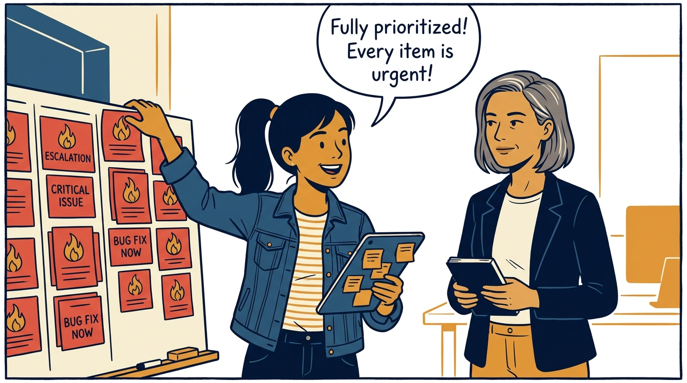
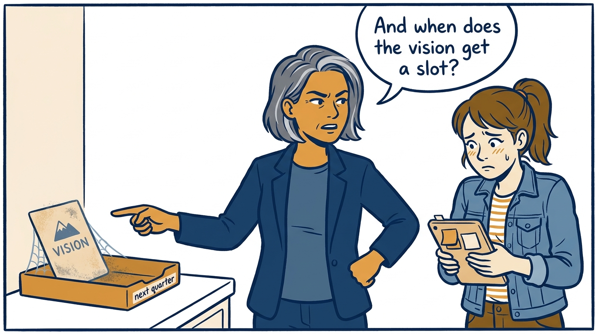
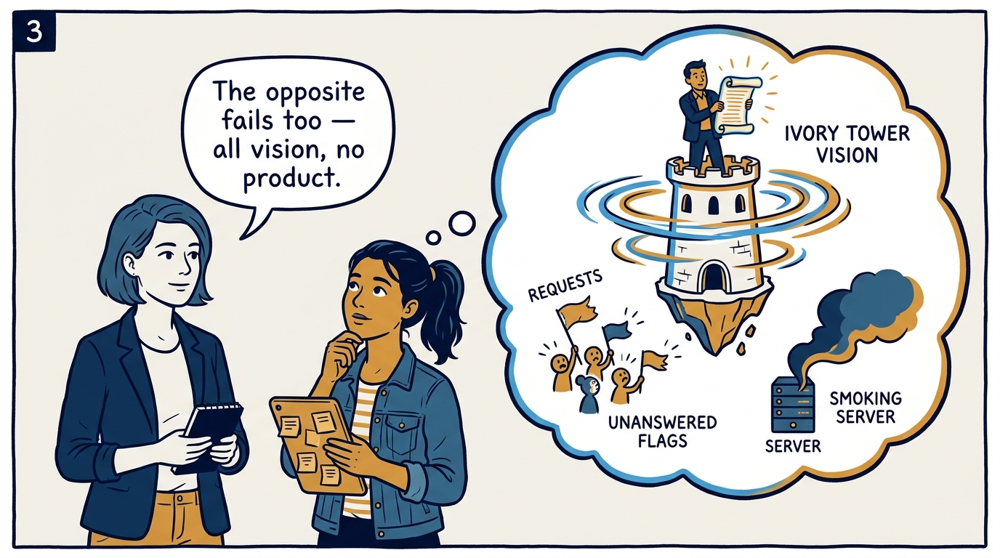
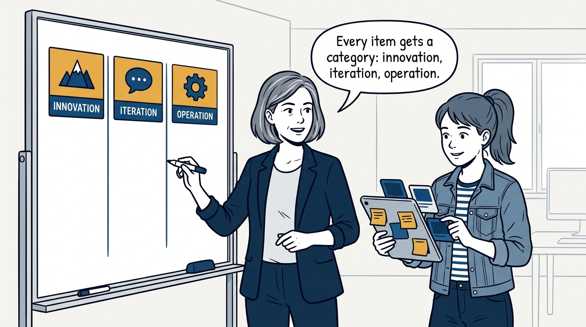
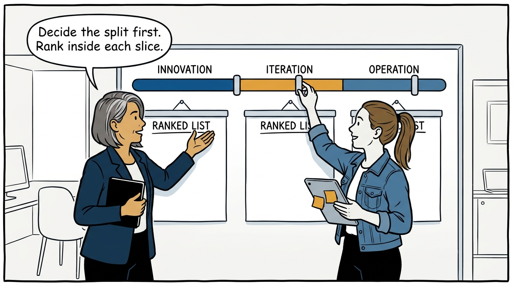
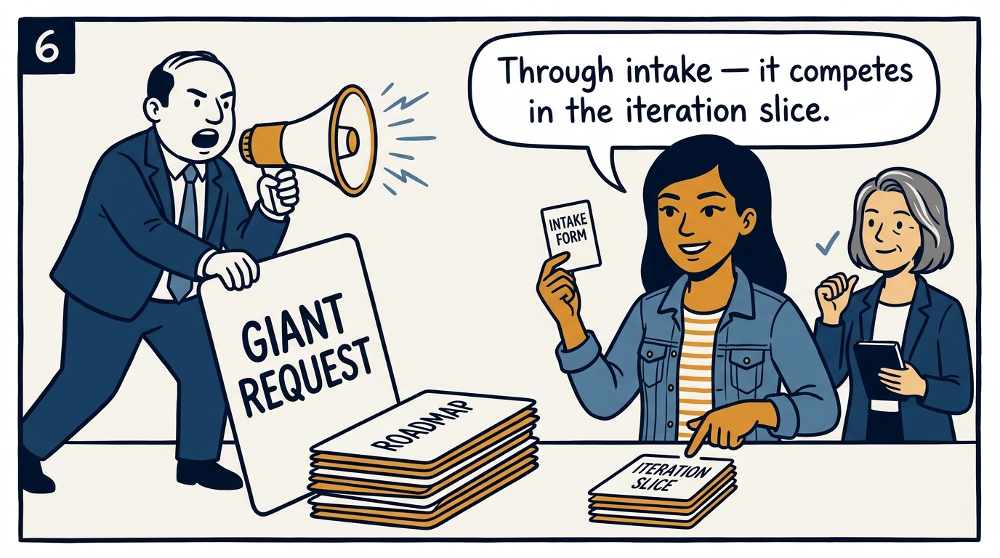
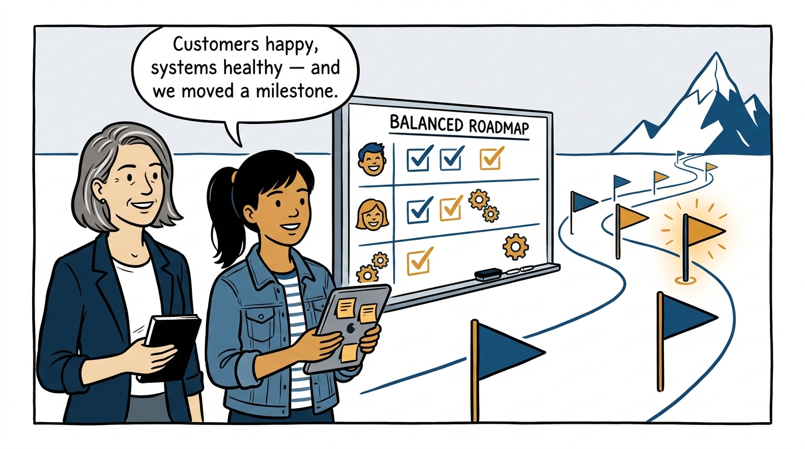
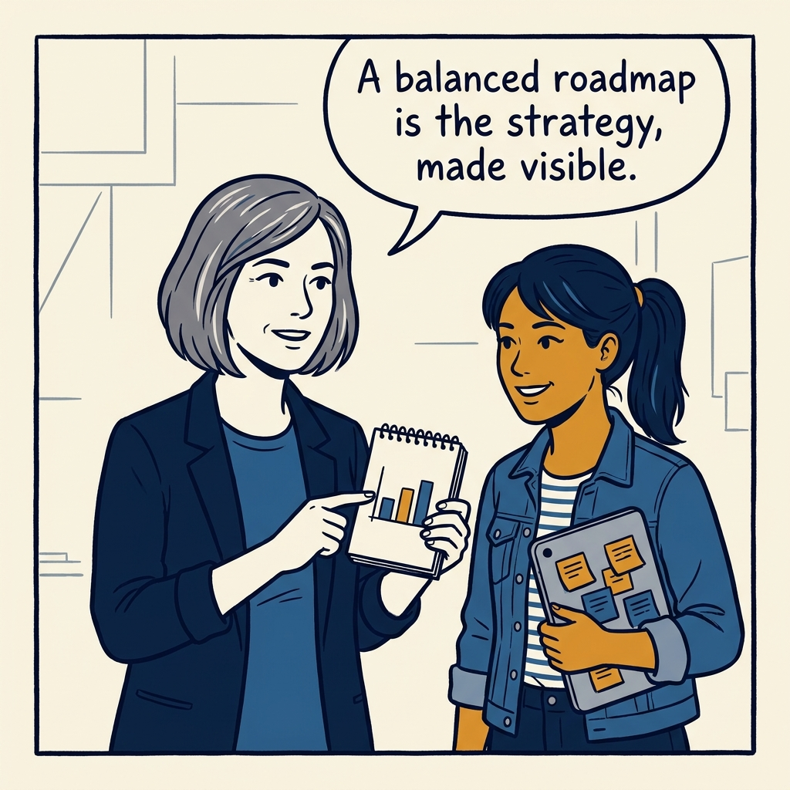

Allocate before you rank — how a roadmap stays balanced between vision, customers, and keeping the lights on, in eight panels.

<!-- comic-style
{
  "cast": "VERA: a calm, seasoned product-minded executive, short gray-streaked hair, dark blazer over a plain t-shirt, carries a small black notebook. MILA: an energetic young product manager, dark hair in a ponytail, denim jacket over a striped shirt, carries a tablet covered in sticky notes.",
  "style": "Clean two-tone explainer comic, thick ink outlines, flat colors with deep blue and amber accents on a light background, generous white space, hand-lettered speech bubbles with SHORT readable text, no photorealism."
}
-->

**Panel 1:** *The hook: a roadmap where everything is urgent — and everything is reactive.*

**Panel 2:** *The problem: the vision is always 'next quarter' — which means never.*

**Panel 3:** *The mirror failure: all vision and no iteration or operation is just as unbalanced.*

**Panel 4:** *The principle: classify everything — vision work, customer improvements, and keep-the-lights-on work each get their own column.*

**Panel 5:** *Allocate before you rank: the split is the real decision, and items compete only within their own slice.*

**Panel 6:** *Defending the split: the loud request gets a process and a fair fight inside its slice — not the whole roadmap.*

**Panel 7:** *The payoff: a roadmap that serves today's customers and systems while still planting the next milestone flag.*

**Panel 8:** *The closer: the allocation is the strategy, made visible.*
