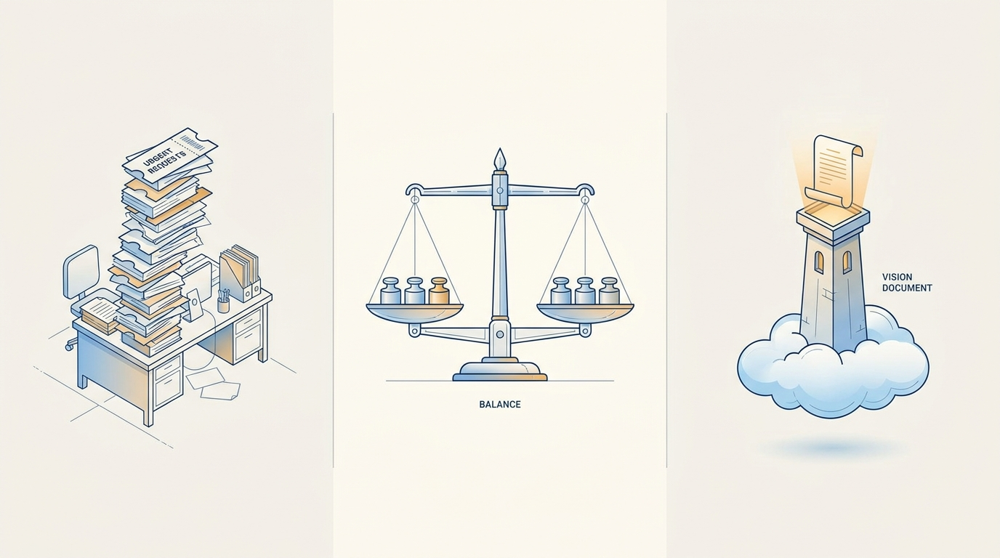
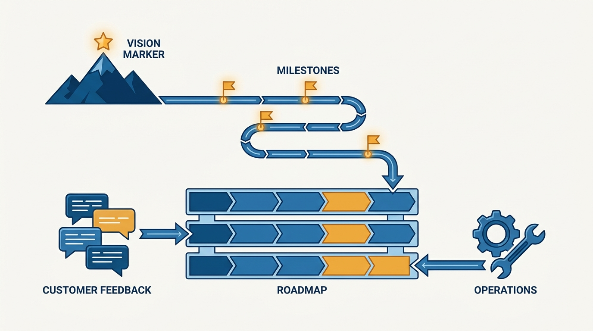

> **Status**: DRAFT
>
> **Principle**: I treat the roadmap as an allocation decision first and a ranking decision second. Every roadmap item is classified as innovation (work that advances the vision), iteration (improvements that add value to the existing product), or operation (work needed to run, secure, scale, and maintain it). I decide the percentage split between those three categories before ranking a single project, I tune the split to the product's lifecycle stage, and I compare items only within their own category. The allocation is what lets me say no to loud stakeholders without a fight — and what keeps the vision from starving quietly while everything on the roadmap looks individually urgent.

## Statement

My operating model for the roadmap has five parts:

- **Know why the roadmap exists.** It connects near-term product changes to mid-term milestones and the long-term vision, lets marketing, sales, and other teams plan around product direction, and creates alignment around sequencing and trade-offs.
- **Classify every item.** Innovation moves the product toward the vision. Iteration improves the existing product for customers or the business. Operation keeps it running, secure, scalable, and maintained. Nothing goes on the roadmap unclassified.
- **Allocate top-down, then rank.** I decide the percentage of investment going to each category before ranking individual projects, make the trade-offs explicit to executives, and compare items only within the same category.
- **Tune the allocation to the lifecycle.** A pre-alpha product is mostly innovation; a freshly launched product iterates further to address early feedback; a beta product hunting for product-market fit leans heavily on iteration; a scaling product needs more operation; a steady-state product balances operation with the next wave of innovation.
- **Prioritize each category on its own terms.** Innovation is ranked by progress toward the next strategic milestone. Iteration is scored with RICE or similar — with the output reviewed, not accepted blindly. Operation gets a reserved slice of capacity and a documented bug policy.

**Figure 1:** *The roadmap as an allocation bar: decide the split across innovation, iteration, and operation first, then rank items only within their own segment.*

## How to Read This

This journal is the product-management counterpart to my engineering-executive journal: the same first-person operating-principle format, applied to how I believe product management should work. This record is grounded in Ben Foster and Rajesh Nerlikar's *Build What Matters*, read through a practitioner-executive lens — the book addresses the PM building the roadmap; I read it as the executive deciding what the roadmap is allowed to contain. The working checklist — all nine sections — lives in the **Checklist** tab of this post. One boundary to keep clear: annual planning mechanics live in the engineering journal's [[planning]] record; this record is about what the product roadmap contains.

## Rationale

**A ranked list of unlike things is not a roadmap.** The naive roadmap is a single stack-ranked backlog where a visionary bet, a customer-requested tweak, and a security patch compete head-to-head. They cannot: the tweak wins on confidence, the patch wins on urgency, and the bet always loses — until the product has no future. Classifying every item and comparing only within its category makes prioritization an honest exercise instead of a rigged one.

**The allocation is the real decision; the ranking is bookkeeping.** Deciding that, say, this quarter is 40% innovation, 40% iteration, 20% operation is the trade-off that deserves executive attention. Made explicitly, it prevents loud stakeholders from dominating priorities — their request competes for the iteration slice, not the whole roadmap. Made implicitly, the allocation still happens; it is just decided by whoever escalated last.

**Both failure modes are allocation failures.** The all-reactive roadmap — pure escalations, commitments, and firefighting — never advances the vision by a single milestone; product management becomes a ticket-routing function. The ivory-tower roadmap — all vision, no iteration or operation — ships a beautiful future on top of a product losing today's customers and accruing today's outages. The balanced middle is not a compromise between these; it is the only version in which each category's work compounds.

**Figure 2:** *The two failure modes flank the principle: all-reactive on one side, all-vision on the other — both are allocation failures, not prioritization failures.*

**Each category needs its own prioritization method.** For innovation, I identify the strategic milestone needed to realize the vision and prioritize work that directly advances it — involving engineering early to reduce future technical debt, and starting the next innovation before the current product's growth flattens. For iteration, I use a RICE-style score — reach, impact, confidence, effort — with confidence validated by data, research, and competitive intelligence, and the output reviewed for bias, weak strategic fit, and missed themes rather than accepted blindly. For operation, I reserve a clear slice of capacity and name what it covers — SLAs, privacy, security, COGS, tooling, maintenance, technical debt, bug fixes. I also define the bug policy explicitly — zero-tolerance, SLA-based, severity-based, or quality-threshold-based — and document it, so stakeholders know what to expect.

**Stakeholder requests deserve a process, not a reflex.** One-off requests go through a clear intake process. Requesters must understand the cost of consuming roadmap capacity; low-value requests get a no; for sales and customer-facing commitments, a capacity or token system makes the trade-off tangible to the people spending it. The point is not to wall the roadmap off — it is to keep reactive work from consuming innovation and operational capacity one reasonable-sounding exception at a time.

**Figure 3:** *The roadmap is derived, not collected: vision drives milestones, milestones drive innovation, and customer and operational streams fill their own lanes.*

## What This Means in Practice

| What this principle says | What it does **not** say |
| --- | --- |
| Decide the category allocation before ranking projects. | The allocation is a constant — it shifts with lifecycle stage and business context. |
| Compare items only within their own category. | Categories are silos — the review still checks the whole roadmap against the vision. |
| Innovation capacity is protected from reactive work. | Customer requests don't matter — they compete fairly inside the iteration slice. |
| Operation gets a reserved slice and a documented bug policy. | Operational work fills whatever space is left over. |
| Loud stakeholders get a process and a cost. | Stakeholders are the enemy — the intake process is how their requests win legitimately. |
| The roadmap is derived from vision and strategy. | The roadmap is a delivery-date commitment device. |

Concretely: before a roadmap review reaches me, every item carries its category; the first slide shows the allocation, not the list; and the final review asks the closing questions — does the roadmap reflect the vision, are all three categories represented, are the trade-offs defensible, are executives aligned on the allocation, and are stakeholders clear on what will **not** be done.

## Anti-Patterns

- **The single stack-rank.** Ranking a vision bet against a bug fix and calling the outcome objective — unlike work compared head-to-head always resolves in favor of the urgent.
- **Allocation by escalation.** No explicit split, so the real allocation is decided by whoever shouted most recently.
- **The vanishing vision slot.** Innovation always scheduled "next quarter" — technically vision-led, practically 100% reactive.
- **The ivory tower.** All innovation, no iteration or operation — a future built on a product losing its present.
- **Score worship.** Accepting RICE output blindly instead of reviewing it for bias, weak strategic fit, and missed themes.
- **Operation as leftovers.** No reserved capacity and no bug policy, so maintenance happens only after an outage forces it.
- **Free customer commitments.** Sales promises landing on the roadmap with no intake process and no visible cost to the promiser.

## Related Records

- [[outcomes]] — the roadmap decides what we build; that record decides how we know it worked.
- [[product-strategy]] — where the milestones come from; this record allocates capacity against them.
- [[planning]] — the engineering journal's record on annual planning mechanics; this record governs what the product roadmap contains, not the planning calendar.

## Scope and Revisiting

This principle governs how my product roadmaps are composed, allocated, and defended. I revisit the allocation quarterly or when the business context changes, and I revisit the principle itself at every lifecycle transition — and whenever I catch a roadmap review ranking unlike work against each other.

## Authoritative References

- Ben Foster & Rajesh Nerlikar, *Build What Matters: Delivering Key Outcomes with Vision-Led Product Management* (Lioncrest Publishing, 2020) — the balanced-roadmap chapter this record's checklist distills.
