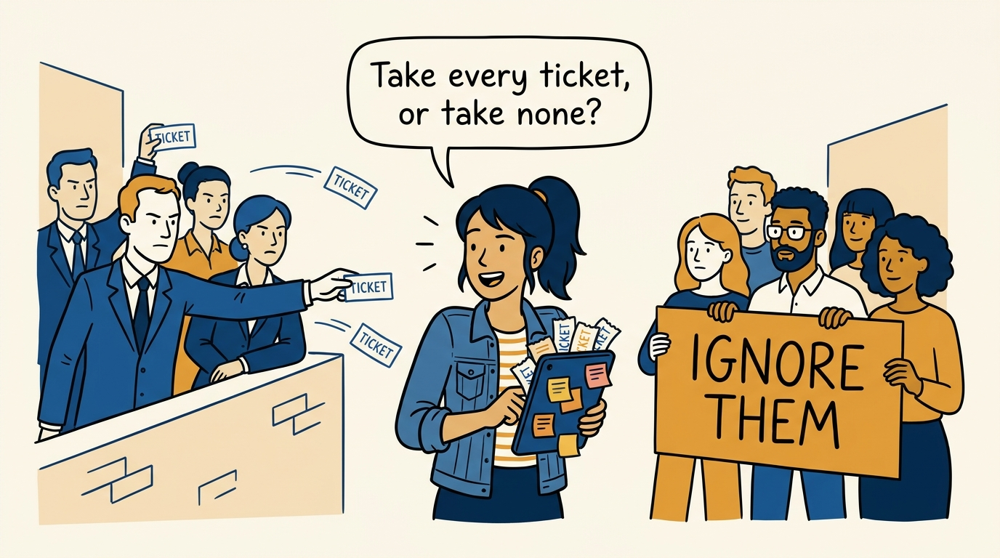
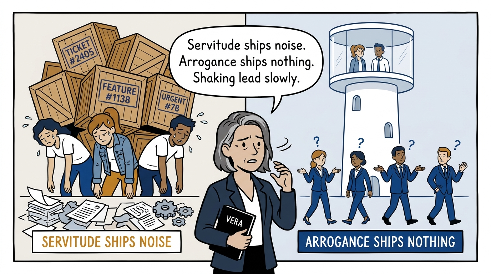
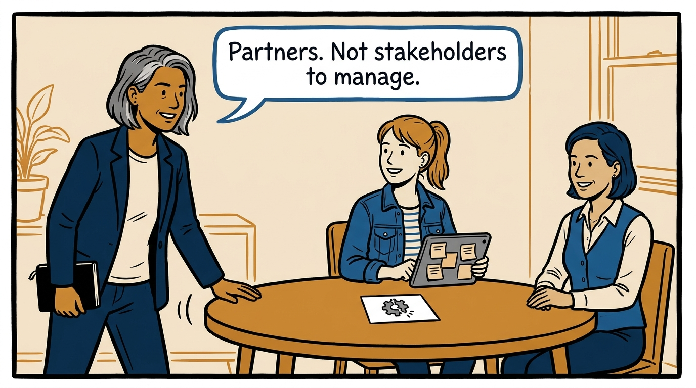
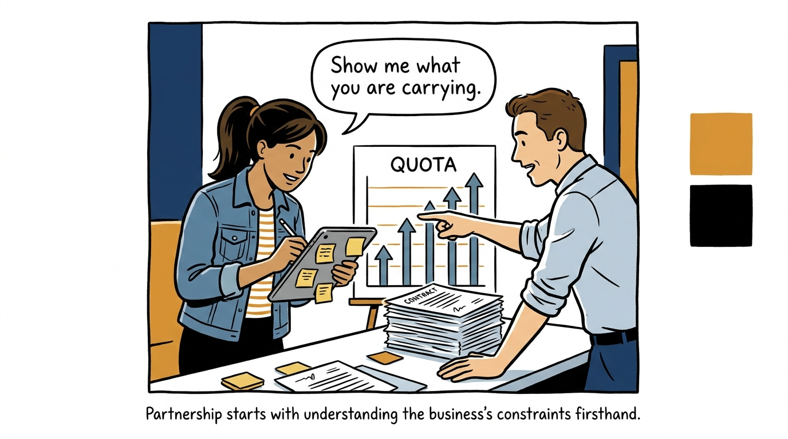
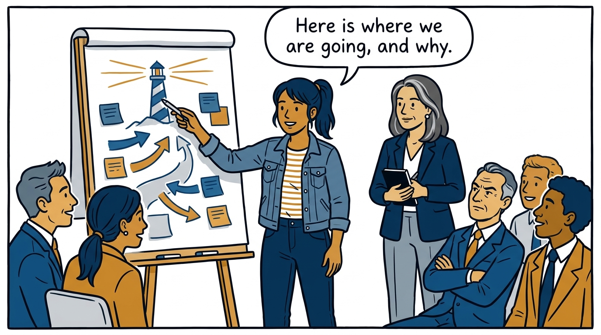
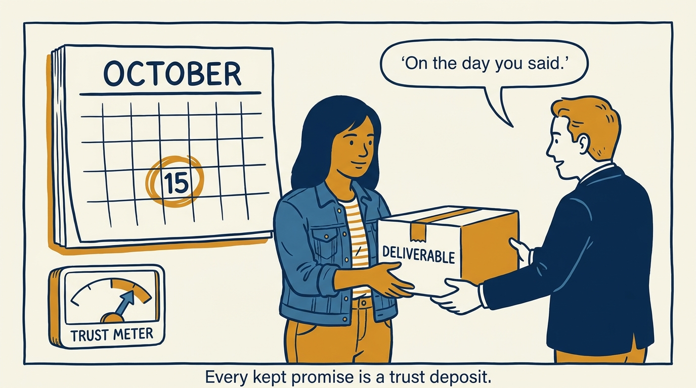
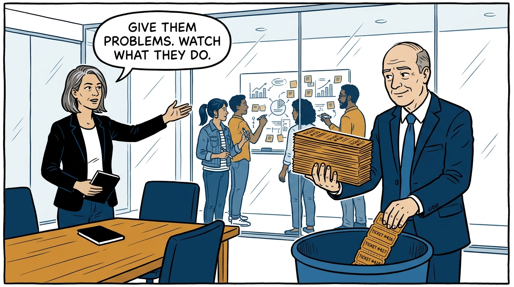
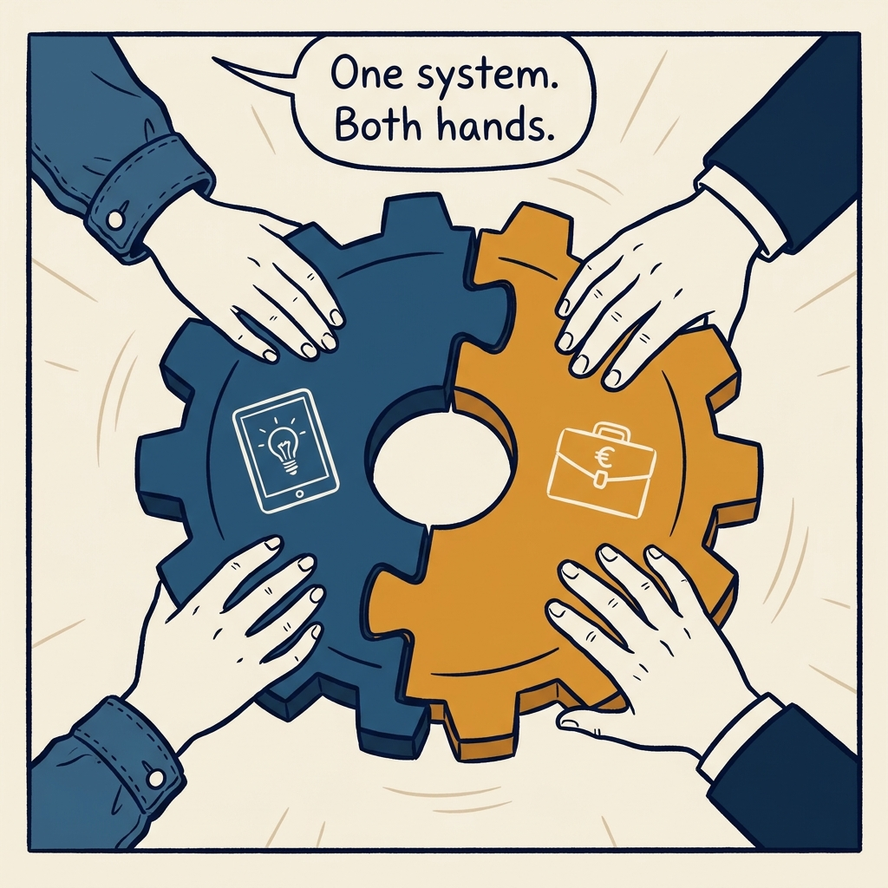

Partnership of equals — how product earns its seat beside the business, in eight panels.

<!-- comic-style
{
  "cast": "VERA: a calm, seasoned product-minded executive, short gray-streaked hair, dark blazer over a plain t-shirt, carries a small black notebook. MILA: an energetic young product manager, dark hair in a ponytail, denim jacket over a striped shirt, carries a tablet covered in sticky notes.",
  "style": "Clean two-tone explainer comic, thick ink outlines, flat colors with deep blue and amber accents on a light background, generous white space, hand-lettered speech bubbles with SHORT readable text, no photorealism."
}
-->

**Panel 1:** *The hook: caught between taking every ticket and taking none.*

**Panel 2:** *The problem: servitude and arrogance both lose — just differently.*

**Panel 3:** *The principle: a partnership of equals — the term 'stakeholder management' gets retired.*

**Panel 4:** *First deposit: understand what each function is actually carrying.*

**Panel 5:** *Second deposit: share the context, evangelize the destination.*

**Panel 6:** *Third deposit: rare commitments, always kept.*

**Panel 7:** *The hard part: executives trading the ticket queue for trust.*

**Panel 8:** *The closer: one system, kept turning by both sides.*
