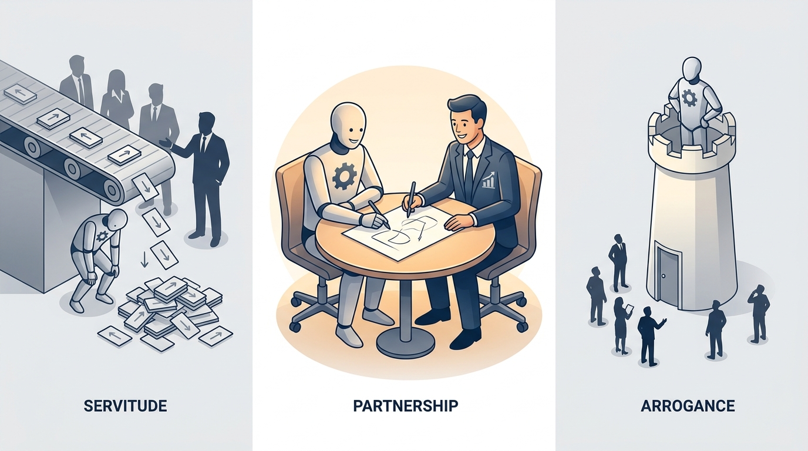
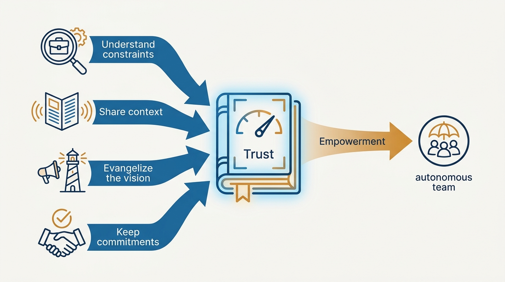
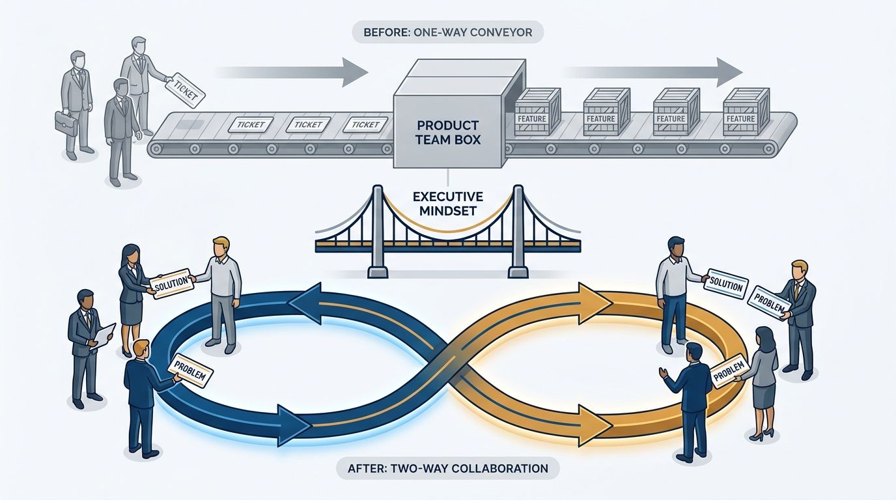

> **Status**: DRAFT
>
> **Principle**: I run product's relationship with the wider business as a partnership of equals: not a ticket-taking service to stakeholders, and not an ivory tower above them. Strong product leaders and empowered teams are necessary but not sufficient — product work happens inside a company context where the CEO, executives, and peers across sales, marketing, finance, and support genuinely matter. So product earns its empowerment: by understanding the business's constraints, sharing context openly, evangelizing the vision, and keeping the commitments it makes — and I lead the shift to this model as a company-wide transformation, not a team-level preference.

## Statement

Four commitments govern how my product organization works with the rest of the business:

- **Context before posture.** Empowered teams alone do not make product succeed. The company around them — its executives, its go-to-market machinery, its constraints — decides whether product work lands. I never let the product organization pretend otherwise.
- **Relationships, not "stakeholder management."** I retire that term deliberately. Peers across the business are worked *with*, not managed around product. The relationships are built before they are needed, with sensitivity for what each function carries.
- **Collaboration as the default.** The working model moves from subservient (tickets in, features out) to collaborative (shared problems, shared solutions). Feature-team dynamics are recognized and named as the thing we are moving away from.
- **Transformation, led and reinforced.** Executives have to change how they see product teams — from an internal agency to teams of ordinary people doing extraordinary work. That is a significant company-wide change, and I treat it as one: discussed openly, guided deliberately, reinforced over time.

**Figure 1:** *Three postures toward the business: servitude and arrogance both fail — partnership is the only durable one.*

## How to Read This

This journal is the product-management counterpart to my engineering-executive journal, and this record is grounded in the business-collaboration material of Cagan and Jones's *EMPOWERED*, read through a practitioner-executive lens. It is the product side of a table I also sit at from the other seat — the engineering journal's [[working-with-your-ceo-peers-and-engineering]] covers the executive's view of the same relationships. How objectives get negotiated inside this relationship is [[team-objectives]]'s territory; this record is about the relationship itself. The working checklist lives in the **Checklist** tab of this post.

## Rationale

**Necessary but not sufficient.** The empowered-team model concentrates on what happens inside product: real ownership, real discovery, real accountability. All of it can be in place and product can still fail — because the CEO does not trust the model, sales made commitments nobody scoped, or finance sees product as a cost center. Product work happens within the broader company context, and pretending the context away is how strong product organizations get quietly dismantled.

**"Stakeholder management" is the wrong frame, and the words matter.** The term casts peers as obstacles to be handled — people around product rather than people product works with. Vocabulary shapes posture: an organization that "manages stakeholders" drifts into either servitude (appease them) or arrogance (neutralize them). I use the language of partnership because I want the behavior of partnership: understanding what each function is carrying, and solving shared problems together.

**Figure 2:** *Partnership is earned: four kinds of deposits fill the trust that empowerment draws on.*

**The collaborative model has to be earned, not declared.** Moving from feature teams to empowered teams asks the business to give up a familiar control: the ticket queue. Nobody gives that up for a slide deck. They give it up when product demonstrably understands the business's constraints, shares its context instead of hoarding it, evangelizes where the product is going — and keeps the commitments it makes. Every kept commitment is a deposit; every surprise is a withdrawal. Empowerment is what the balance buys.

**Executives change last, and matter most.** The deepest shift is in how senior leaders see product teams: not as an internal agency executing their ideas, but as teams of ordinary people doing extraordinary work on problems that matter. That confidence has to be built — with results, with transparency, and with leaders prepared for what the shift means for their own roles. Until it is built, every stumble reopens the case for command-and-control.

**It is a transformation, and transformations are led.** A collaborative product model is a company-wide change in mindset and responsibilities — for product, for the functions around it, and for the executive team. I treat it accordingly: named as a change, discussed in terms of what it asks from the rest of the business, and reinforced long after the kickoff enthusiasm fades. A model reinforced only once is a model abandoned quietly.

**Figure 3:** *The model shift: from one-way ticket delivery to a two-way loop — crossed over the bridge of executive mindset.*

## What This Means in Practice

| What this principle says | What it does **not** say |
| --- | --- |
| Product works *with* peers across the business. | Product takes orders from them — the subservient model is explicitly retired. |
| Empowered teams are necessary but not sufficient. | The company context excuses weak product work — both are required. |
| Partnership includes sharing context and evangelizing. | Partnership means consensus — product still says no, with context. |
| Commitments product makes are kept. | Product commits to everything asked — commitments are few and deliberate. |
| The shift is led as a company-wide transformation. | The shift is a product-internal reorganization nobody else needs to notice. |

## Anti-Patterns

- **The ticket-taking service.** Product as an internal agency: requests in, features out, no discovery, no ownership — the servitude posture that feature teams normalize.
- **The ivory tower.** Product so protective of its empowerment that it stops listening — treating every business request as an intrusion. Arrogance loses the same trust servitude never earns.
- **"Stakeholder management" theater.** RACI grids and influence maps replacing actual relationships — managing around people instead of working with them.
- **Declared empowerment.** Announcing the empowered-team model without earning it — no kept commitments, no shared context — and being surprised when the business quietly rebuilds the ticket queue.
- **Kickoff-only transformation.** Launching the collaborative model once and never reinforcing it, so the organization reverts the first time a quarter goes badly.

## Related Records

- [[working-with-your-ceo-peers-and-engineering]] — the same table, seen from the executive's seat in the engineering journal.
- [[team-objectives]] — how objectives are negotiated inside this relationship.
- [[right-processes]] — the product processes the collaboration plugs into.
- [[internal-communication]] — the communication discipline that sharing context depends on.
- [[dysfunctions]] — the failure patterns that the subservient model breeds.

## Scope and Revisiting

This principle governs how my product organization engages sales, marketing, finance, legal, support, and the executive team. I revisit it when the trust balance visibly drops — commitments missed, context hoarded, the ticket queue reappearing — and whenever a leadership change resets the executive mindset the model depends on.

## Authoritative References

- Marty Cagan with Chris Jones, *EMPOWERED: Ordinary People, Extraordinary Products* (Wiley, 2020) — the business-collaboration material this record's checklist distills.
- The authors' companion essays at [svpg.com](https://www.svpg.com/).
