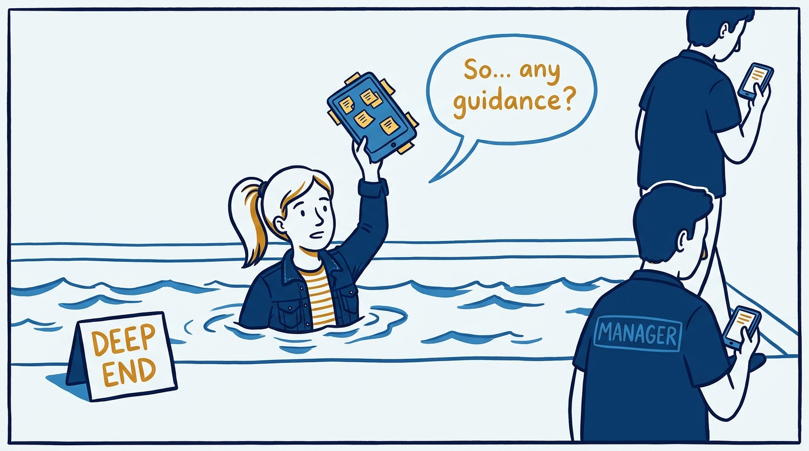
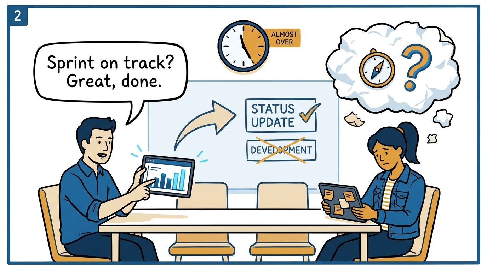
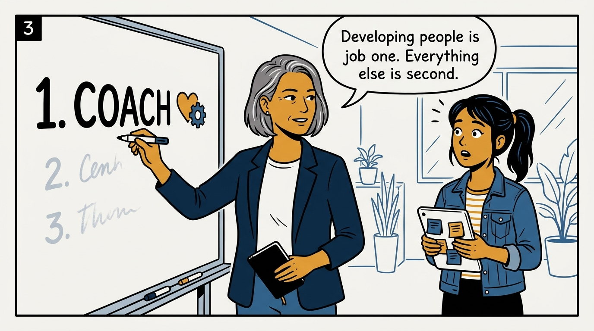
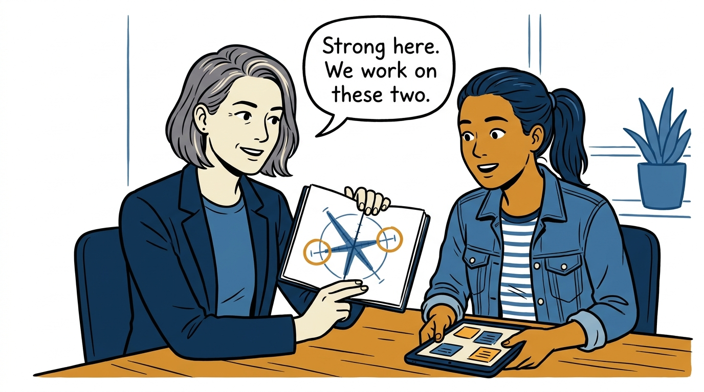
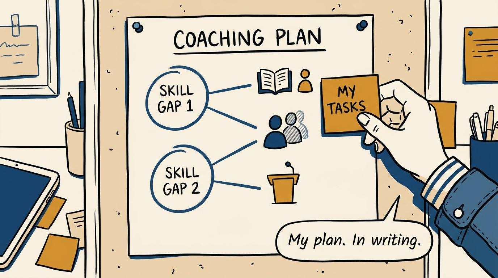
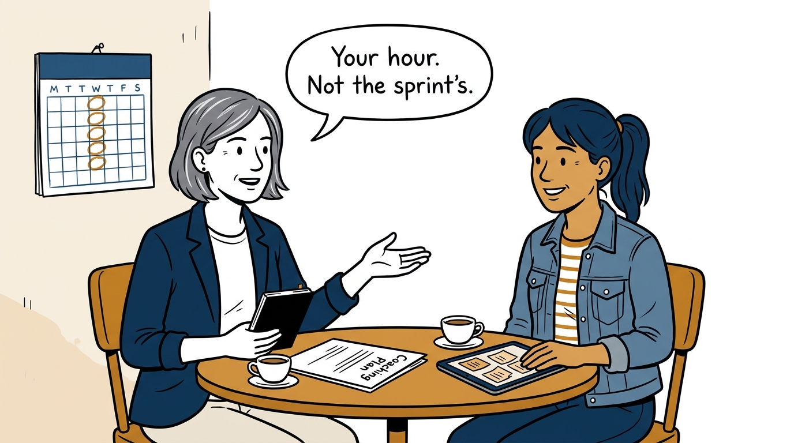
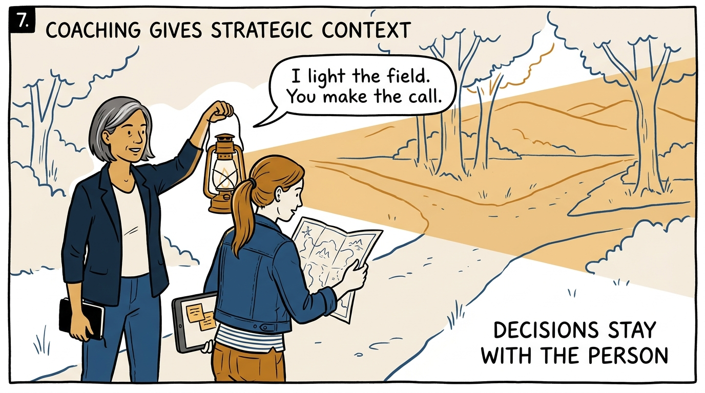
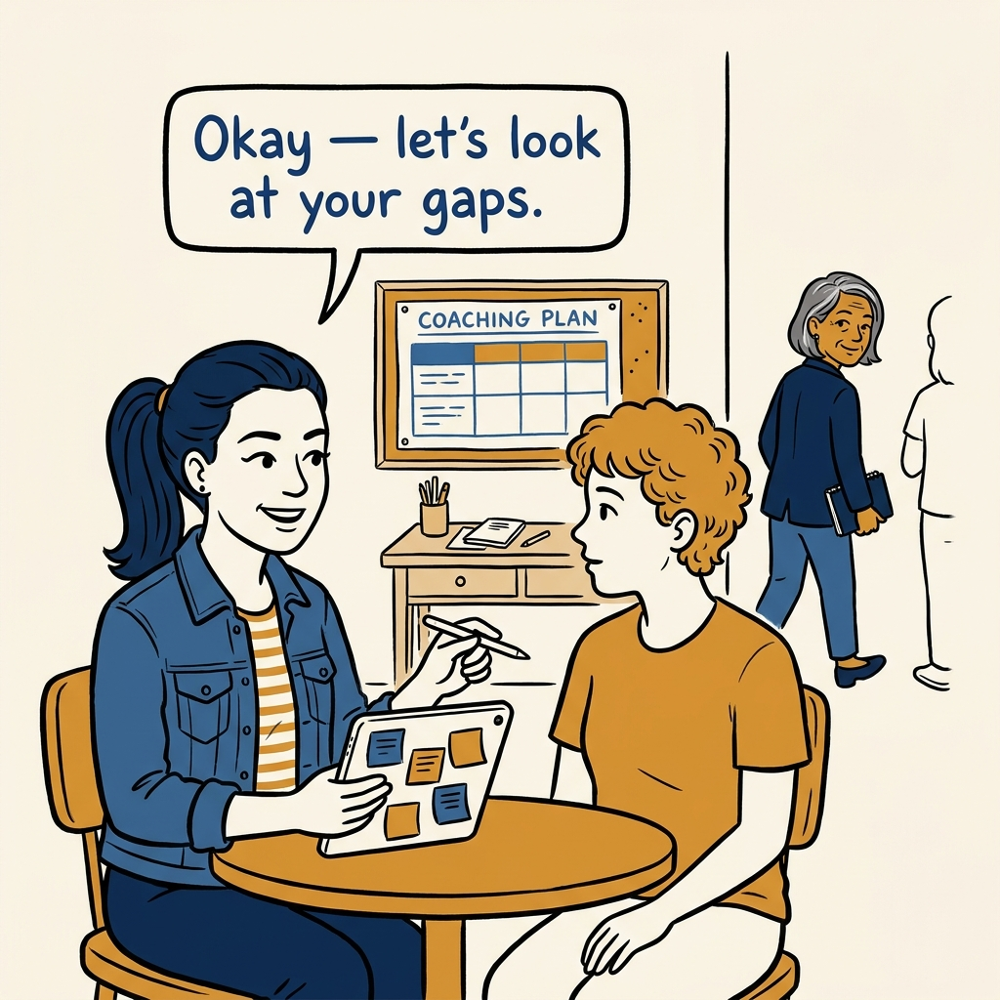

Coaching is the first job — how ordinary people become extraordinary teams, in eight panels.

<!-- comic-style
{
  "cast": "VERA: a calm, seasoned product-minded executive, short gray-streaked hair, dark blazer over a plain t-shirt, carries a small black notebook. MILA: an energetic young product manager, dark hair in a ponytail, denim jacket over a striped shirt, carries a tablet covered in sticky notes.",
  "style": "Clean two-tone explainer comic, thick ink outlines, flat colors with deep blue and amber accents on a light background, generous white space, hand-lettered speech bubbles with SHORT readable text, no photorealism."
}
-->

**Panel 1:** *The hook: sink-or-swim is not a development plan.*

**Panel 2:** *The problem: the 1:1 became a status meeting, and growth fell off the agenda.*

**Panel 3:** *The principle: coaching is the first job of product leadership.*

**Panel 4:** *Start honest: a real assessment, specific gaps, no judgment.*

**Panel 5:** *The plan: written down, action by action, co-owned.*

**Panel 6:** *The ritual: a weekly hour that belongs to the person, not the sprint.*

**Panel 7:** *Coach with context: light the field, keep the decision theirs.*

**Panel 8:** *The closer: the coached become coaches — and the team compounds.*
