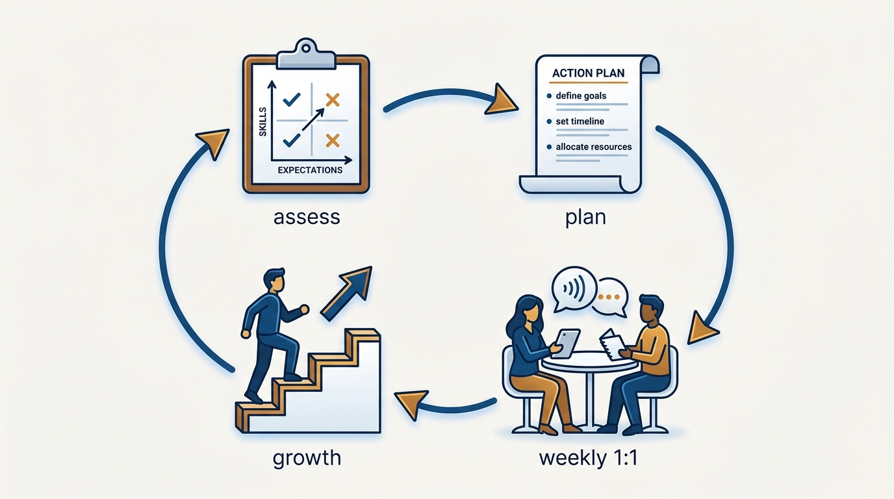
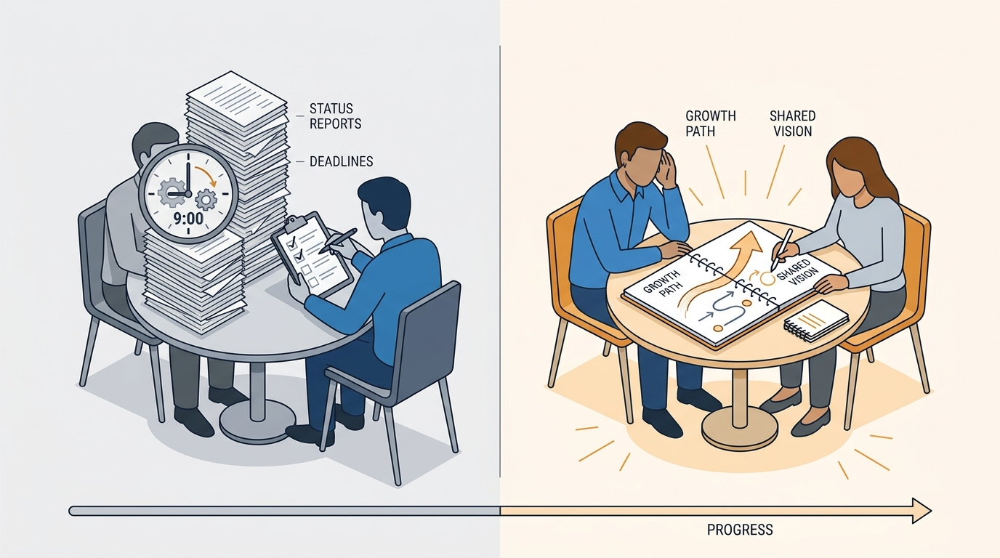
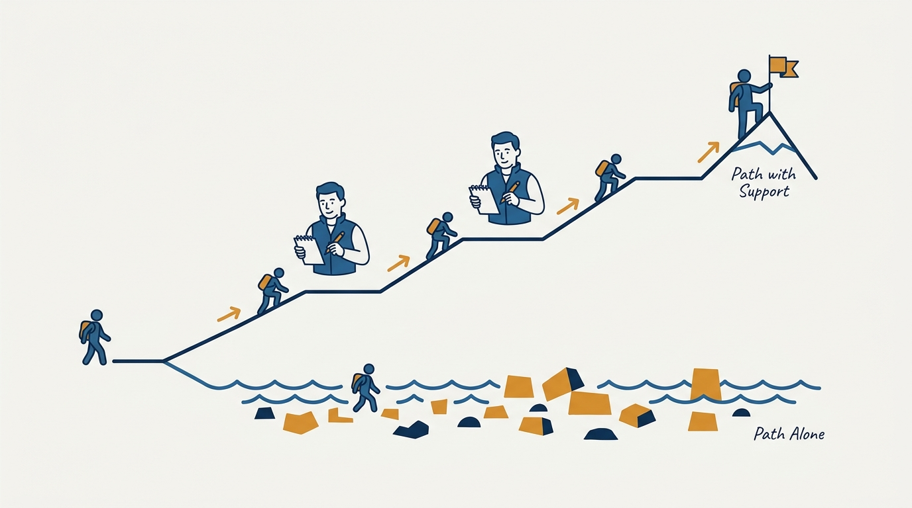

> **Status**: DRAFT
>
> **Principle**: I treat coaching as the first job of every product leader, including me: ordinary people become extraordinary teams when someone invests in them deliberately. That investment has a fixed shape — an honest assessment of each person's capability against the role, a written coaching plan for the top three gaps, and a weekly 1:1 that develops the person rather than collecting status. I coach for ownership of outcomes, not dependency on me, and I judge my own success by the growth of my people.

## Statement

My operating model for coaching has five parts:

- **Coaching is job #1.** Developing people is the first responsibility of a product leader, ahead of roadmaps, reviews, and my own deliverables. Every person in my product organization has an explicit coach, and I judge my success by the growth of my people.
- **Assess before you coach.** For each person I rate role expectations against current capability, skill area by skill area, identify the biggest gaps, and focus on the top 3 first. I reassess periodically — the assessment guides coaching; it never replaces it.
- **Write the coaching plan.** Priority gaps get a written plan: concrete learning actions, stretch opportunities matched to readiness, and development of strengths, not only repair of weaknesses. Progress is reviewed weekly.
- **The weekly 1:1 is development time.** I hold 1:1s at least weekly, protect them from casual cancellation, listen more than I talk, and use them primarily for development — sharing context, discussing growth, and giving specific, timely feedback — not for status.
- **Teach context, coach for ownership.** I make the strategic context explicit — mission, scorecard, objectives, product vision and principles, team topology, product strategy — and coach people to think like owners: outcomes over outputs, obstacles owned rather than reported.

**Figure 1:** *The coaching loop: assess honestly, write the plan, work it in the weekly 1:1, and reassess as the person grows.*

## How to Read This

This journal is the product-management counterpart to my engineering-executive journal — the same first-person record shape, applied to how product organizations should work. This record is grounded in Marty Cagan and Chris Jones's *EMPOWERED: Ordinary People, Extraordinary Products*, read through a practitioner-executive lens: the book speaks to the manager coaching product managers; I read it as the operating standard I hold every product leader in my organization to, starting with myself. If you report to me, this record explains why your 1:1 is about you and not about your Jira board. The working checklist — all sixty-one sections of it — lives in the **Checklist** tab of this post.

## Rationale

**Extraordinary teams are developed, not found.** The title of the book is the argument: ordinary people, extraordinary products. Strong product organizations are not assembled from rare pre-formed talent; they are grown from capable people whom someone took the time to develop. Throwing a new product manager into the deep end and calling it empowerment is not respect — it is abdication. Empowerment without coaching is just neglect with better branding.

**Assessment turns coaching from vibes into a plan.** Without an honest assessment, coaching degenerates into generic advice. So I rate each person's current capability against what the role expects — product knowledge, process and execution skill, people skills — and let the gaps set the agenda. The top 3 gaps get the attention first; the assessment is redone periodically so the plan tracks the person, not my first impression. The point of the exercise is to guide development, never to substitute for it.

**The 1:1 is the delivery mechanism.** A coaching plan that never meets a calendar is a wish. The weekly 1:1 is where the plan becomes real: protected from casual cancellation, used primarily for development rather than status, with me listening more than talking. It is where I share context and expectations, discuss progress on development, give specific and timely feedback, and help the person connect dots across teams and issues. When 1:1s decay into status meetings, coaching has stopped — whatever the calendar says.

**Figure 2:** *Same slot, opposite meetings: the 1:1 as status theater versus the 1:1 as development time.*

**Context is what makes empowerment possible.** I cannot delegate decisions to someone who lacks the context to make them. So I teach the strategic context explicitly and check it took: the company mission, the scorecard of business health metrics, the current objectives, the product vision and principles, the team topology, and the product strategy. A product manager who can explain how their team's objectives ladder up to company goals can be trusted with real decisions; one who cannot will be micromanaged by circumstance even if I never intervene. For the biggest decisions I reach for the strongest coaching tool I have: the written narrative, which exposes weak logic and missing evidence faster than any slide deck.

**Ownership is the endgame.** The purpose of all of this is not to make people better at following my direction — it is to make my direction unnecessary. I coach people to think like owners rather than employees: responsible for outcomes, not just activity; bringing context and proposals, not waiting to be told; taking responsibility when things go wrong and giving credit when they go well. Coaching that creates dependency on the coach has failed at its own job.

**Figure 3:** *Ordinary to extraordinary is a coached trajectory — the sink-or-swim path stays flat.*

## What This Means in Practice

| What this principle says | What it does **not** say |
| --- | --- |
| Developing people is job #1 for every product leader. | Product leaders stop doing product work — coaching is the multiplier on it, not the replacement. |
| Assess honestly and focus on the top 3 gaps first. | The assessment is a verdict — it is a development tool, redone as the person grows. |
| The weekly 1:1 is protected development time. | Status has no home — it moves to async channels, not into the 1:1. |
| Teach the strategic context until people can use it. | Context is a one-time onboarding lecture — it is revisited regularly. |
| Coach strengths as well as weaknesses. | Coaching is remedial — the best people deserve the most deliberate development. |
| Coach for ownership of outcomes. | Coaching means being needed — dependency on the coach is the failure mode. |

Concretely: every product person in my organization knows who their coach is. Every coach maintains a current assessment and a written plan for each report, and can show me both. My own weekly self-audit asks the same questions I ask of my leaders: did I spend real time coaching this week, do my people know I care about their development, and am I fostering ownership rather than dependence?

## Anti-Patterns

- **Coaching as leftover work.** Development happens only when the roadmap allows — which is never. Coaching treated as secondary work is coaching abandoned.
- **The status-meeting 1:1.** Weekly slots faithfully held, entirely consumed by project updates. The calendar shows coaching; the person gets none.
- **The monologue coach.** The manager talks more than listens, prescribes before diagnosing, and calls it mentorship.
- **Feedback saved for the review.** Problems noted in March, revealed in December. Delayed feedback is a decision to let someone fail slowly.
- **Empowerment as absence.** No assessment, no plan, no context — just "I trust you" and a quarterly check on the numbers. Sink-or-swim with better branding.
- **Micromanagement as coaching.** Task control dressed up as development; the opposite failure with the same result — no ownership.
- **Tolerating weak performance too long.** Avoiding the difficult conversation is not kindness; it steals the time the person needed to improve.

## Related Records

- [[staffing]] — how the people arrive; this record covers what I owe them once they are here.
- [[right-team]] — the empowered product team this coaching is meant to produce.
- [[calibrating-your-standards]] — the engineering-journal record on what "good" looks like; coaching is how people reach a bar, calibration is how I keep the bar honest.
- [[inspected-trust]] — the engineering-journal record on trust with verification; the coaching 1:1 is where inspection stays supportive rather than suspicious.

## Scope and Revisiting

This principle governs how I and every product leader reporting to me develop the people in our product organization: assessments, coaching plans, 1:1s, and the strategic context we are obliged to teach. I revisit it whenever a leader's span of responsibility changes, whenever an assessment cycle shows gaps not closing, and whenever my own weekly self-audit answers "no" two weeks running.

## Authoritative References

- Marty Cagan with Chris Jones, *EMPOWERED: Ordinary People, Extraordinary Products* (Wiley, 2020) — the coaching chapters this record's checklist distills.
- Many of the book's ideas began as freely available essays by the authors at [svpg.com](https://www.svpg.com), where the underlying material can still be read.
