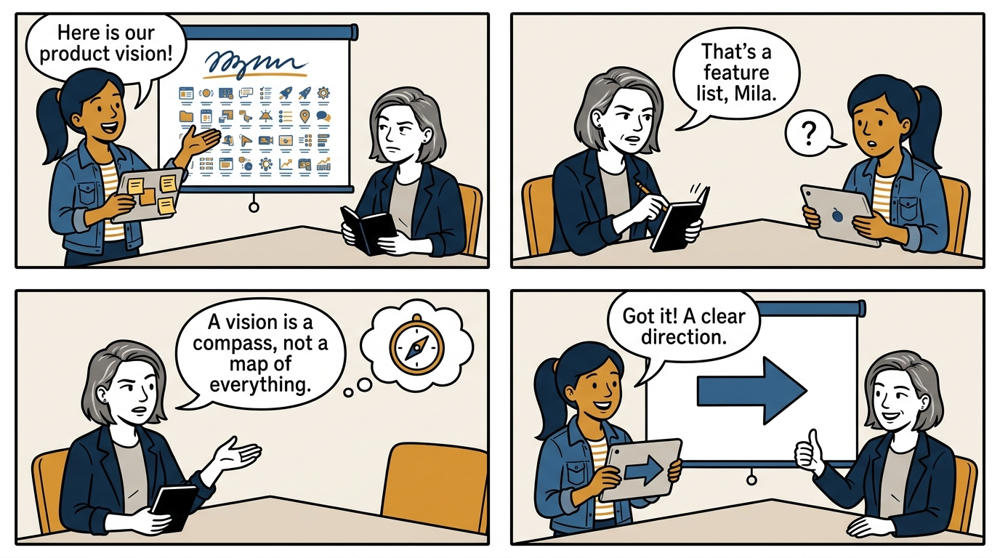
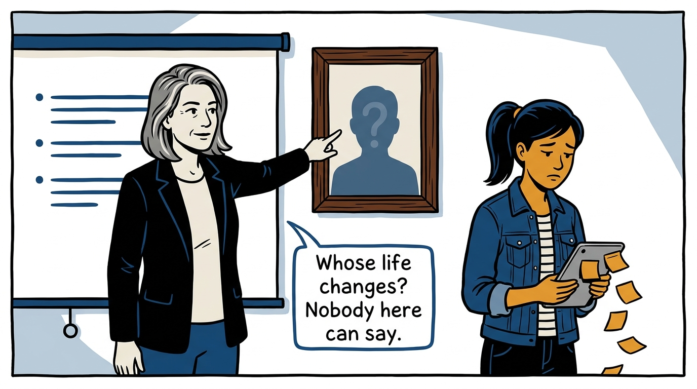
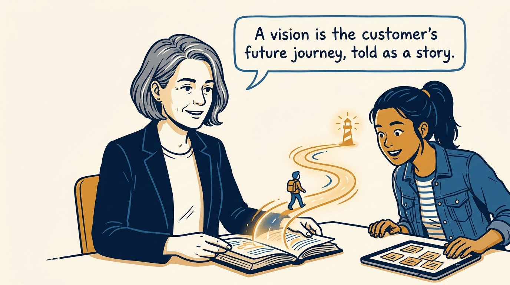
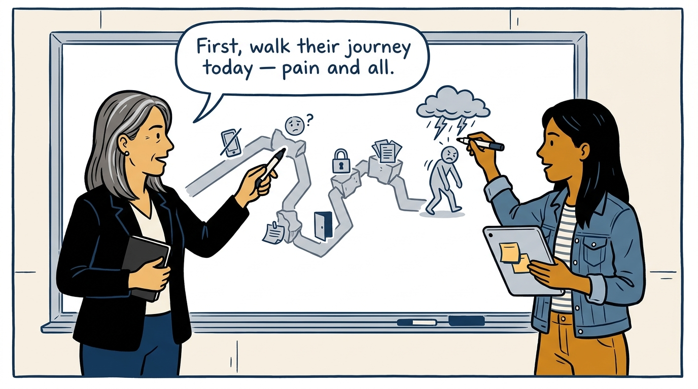
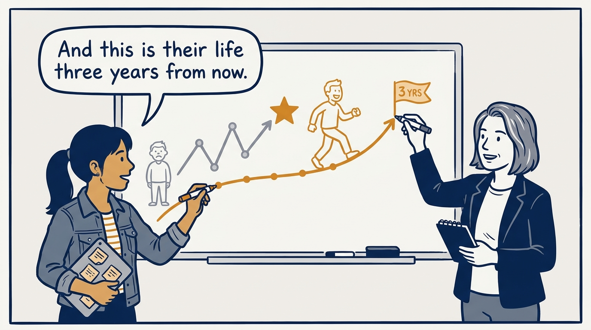
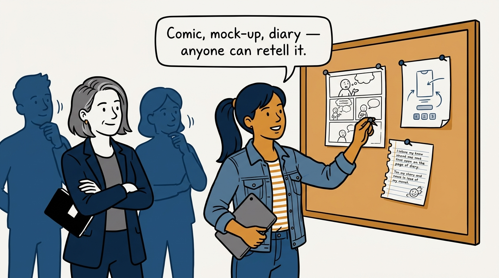
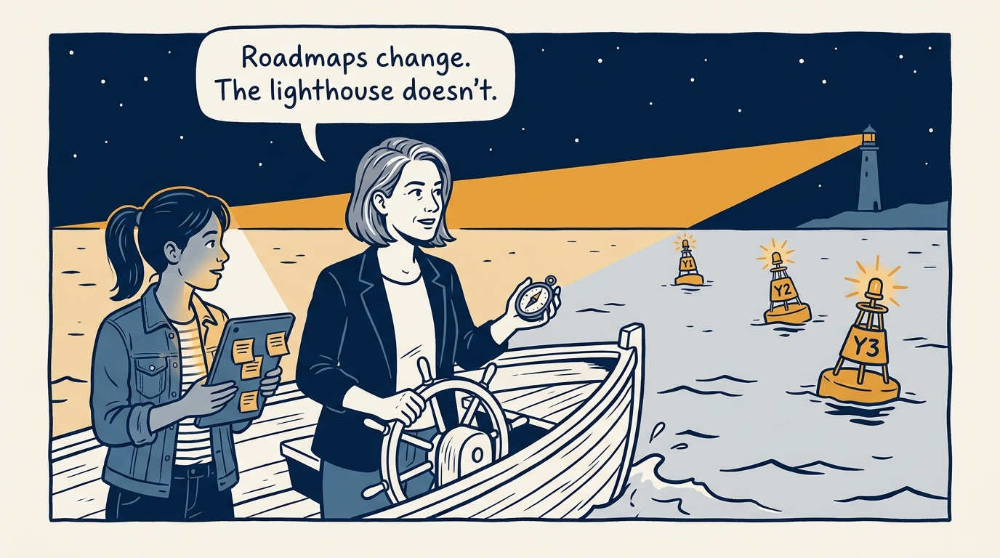
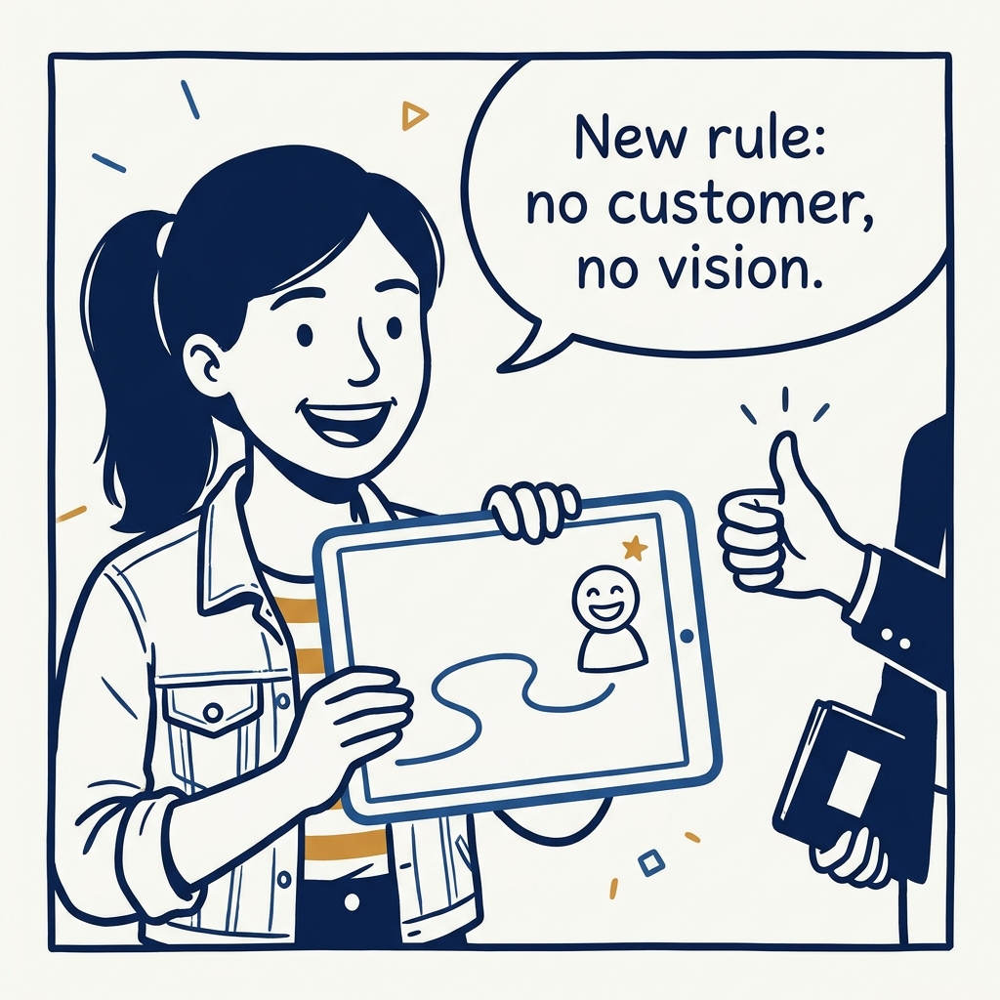

The vision is the customer's future journey, told as a story — how a journey beats a feature list in eight panels.

<!-- comic-style
{
  "cast": "VERA: a calm, seasoned product-minded executive, short gray-streaked hair, dark blazer over a plain t-shirt, carries a small black notebook. MILA: an energetic young product manager, dark hair in a ponytail, denim jacket over a striped shirt, carries a tablet covered in sticky notes.",
  "style": "Clean two-tone explainer comic, thick ink outlines, flat colors with deep blue and amber accents on a light background, generous white space, hand-lettered speech bubbles with SHORT readable text, no photorealism."
}
-->

**Panel 1:** *The hook: a feature list wearing a vision costume.*

**Panel 2:** *The problem: there is no customer anywhere in the vision.*

**Panel 3:** *The principle: the vision describes their journey, not our features.*

**Panel 4:** *Step one: map today's journey honestly, from the trigger onward.*

**Panel 5:** *Step two: write the future journey — bold, believable, about three years out.*

**Panel 6:** *Ship the vision as artifacts people can absorb — and retell.*

**Panel 7:** *Years of roadmaps steer by one fixed light: the customer's future journey.*

**Panel 8:** *The closer: no customer in the story, no vision on the wall.*
