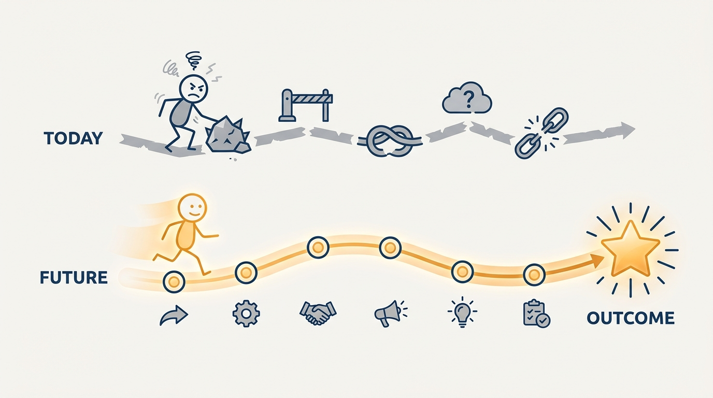
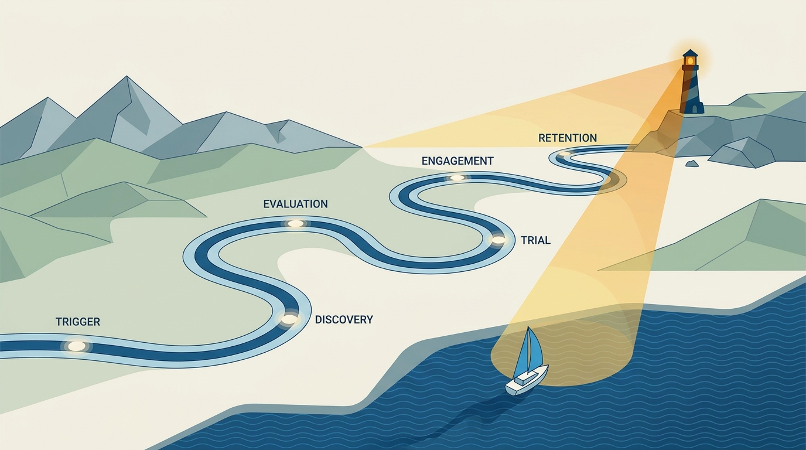
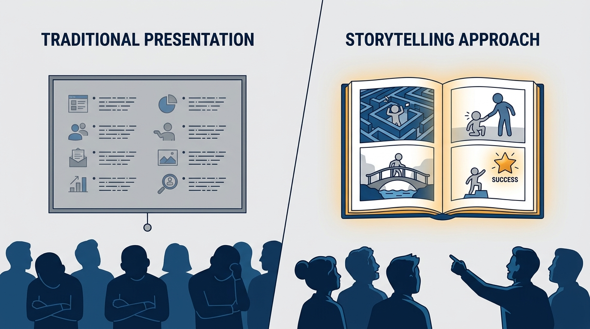

> **Status**: DRAFT
>
> **Principle**: I anchor product direction in a customer journey vision: a concrete story of how a specific customer's life works years from now, not a slogan about our product. The vision describes their journey — what triggers their search, how they discover and evaluate us, what makes trial convert into engagement, and why they stay — targeting a 10x customer outcome on a roughly three-year horizon. It is written down, bold enough to inspire, grounded enough to believe — and every roadmap conversation starts from it.

## Statement

My operating model for product vision has five parts:

- **Define the foundation first.** I identify the 10x customer outcome to enable, describe the customer journey that will generate it, and write the vision down as the single source of truth — teams align around the same vision, not just the same metric. The horizon is usually about three years, shorter or longer only when the market or business model demands it, and the vision must be ambitious yet achievable with our resources.
- **Tell the full journey, not the product slice.** The vision starts the moment the customer realizes they may need a better solution and covers every major stage, not just onboarding or usage — capturing thoughts, emotions, objections, and decision points, detailed enough to be plausible without locking teams into one solution too early.
- **Differentiate deliberately.** I study what competitors do poorly *and* what they are not doing at all, name our unfair advantage, and use the Kano model to separate must-haves, performance features, and delighters — knowing today's delighters become tomorrow's expectations.
- **Communicate through artifacts, not speeches.** The vision lives in formats people can read, reference, discuss, and update — comic strips, vision mock-ups, customer diary entries — short enough to absorb quickly and covering the whole journey, not just product screens.
- **Validate before the vision steers anything.** I run it through the final-validation questions — spelled out in the Rationale below — before it drives a single roadmap conversation.

**Figure 1:** *The vision is the distance between two journeys: the customer's frustrating path today and their transformed path years from now.*

## How to Read This

This journal is the **product-management counterpart** to my engineering-executive journal: the same first-person operating-principle format, applied to how I believe product management should work. This record is grounded in Ben Foster and Rajesh Nerlikar's *Build What Matters*, read through a practitioner-executive lens rather than as a book summary. If you build products with me, it explains why I reject vision slides that list features, and why roadmap conversations open with "which part of the customer's future journey does this move us toward?" The working checklist — all nine sections, foundation to final validation — lives in the **Checklist** tab of this post.

## Rationale

**A metric aligns spreadsheets; a journey aligns decisions.** Teams that share only a target number will happily pull in opposite directions, each move locally justified by the metric. A written journey — who the customer is, what triggers their search, what they experience at each stage — gives every team the same picture of the destination, so hundreds of small decisions cohere without me arbitrating each one.

**Feature lists describe us; journeys describe the customer.** A "vision" that enumerates capabilities answers what we will build while dodging the question that matters: how does the customer's life change? The 10x customer outcome forces the leap to be meaningful rather than incremental, and the journey keeps the outcome honest — an outcome with no plausible journey behind it is a wish.

**The journey is longer than the product.** Most product thinking starts at onboarding. But the customer's journey starts earlier — at the **trigger**, the moment their current solution stops being good enough — and runs through **discovery** (how they learn we exist), **evaluation** (what they must believe before trying), **trial** (the aha moment that earns commitment), **engagement** (the behaviors that deliver real value), and **retention** (the moments they decide whether to recommit, and whether they *notice* the value they receive). A vision that skips the early stages produces a product nobody finds; one that skips retention, a product nobody keeps.

**Figure 2:** *The full journey — trigger to retention — steering toward the vision like a lighthouse: distant, fixed, and what every roadmap navigates by.*

**Differentiation is designed into the journey, not bolted on.** Studying competitors' gaps, watching customer behavior around current solutions, and naming our unfair advantage tells me *where* in the journey we can be meaningfully different. The Kano model then disciplines the feature conversation: must-haves customers punish us for missing, performance features where more is better, delighters that create word-of-mouth — and we revisit the categories, because delighters decay into expectations.

**A vision nobody absorbs steers nothing.** Verbal communication evaporates; a document nobody reads is a filing exercise. So the vision ships as artifacts built for absorption: a comic strip showing the end-to-end journey in a human way, vision mock-ups conveying what the future experience could feel like, customer diary entries in the customer's own voice. Mock-ups are concept direction, not engineering requirements — they align product, design, engineering, sales, and leadership around the same future without specifying it.

**Validation is a test, not a ceremony.** Before the vision steers anything, I check it against the final-validation questions: can an outsider understand it quickly, does it explain start-continue-stay, does it capture the emotional as well as practical journey, does it help teams decide consistently, is it bold enough to inspire and grounded enough to believe, does it show how we deliver the 10x outcome? A vision that fails is rewritten, not defended.

## What This Means in Practice

| What this principle says | What it does **not** say |
| --- | --- |
| The vision is a story of the customer's future journey. | The vision is a list of features we plan to ship. |
| Target a 10x customer outcome on a ~three-year horizon. | Three years is a law — market and business model can shift it. |
| Map every stage, trigger through retention. | Specify every stage so precisely that teams lose solution freedom. |
| Communicate through artifacts — comics, mock-ups, diary entries. | Mock-ups are engineering requirements. |
| Delighters differentiate us today. | Delighters stay delighters — they decay into expectations. |
| Validate the vision with outsiders before it steers work. | The vision is finished once leadership approves the slide. |

Concretely: roadmap conversations open with the journey stage they advance, not the feature they add. Personas and product principles serve as supporting components — buyer personas separated from user personas where they differ, principles used to prevent feature creep. And when someone presents a "vision," my first test is whether it names a customer and tells their story — or just names us.

**Figure 3:** *The test of a vision: does it tell the customer's story, or just enumerate our features?*

## Anti-Patterns

- **The feature-list vision.** A slide of capabilities with no customer in it — our output, nobody's changed life.
- **Metric-only alignment.** Teams sharing a number but not a picture, each optimizing their slice of the funnel against the others.
- **The onboarding-only journey.** A vision that starts at signup — skipping the trigger, discovery, and evaluation stages where most customers are actually lost.
- **The over-specified future.** Journey detail so deep it hard-codes one solution three years early, converting a vision into a premature spec.
- **The verbal vision.** A direction living in the founder's talk track, mutating with each retelling because nothing was written down.
- **The eternal delighter.** Treating a differentiator from two years ago as still special, while the market has quietly made it a must-have.
- **The unvalidated vision.** A document leadership loves and no outsider can retell — inspiring in the room, useless as a decision tool.

## Related Records

- [[dysfunctions]] — the failure modes vision-led product management exists to escape; most trace back to missing or feature-shaped visions.
- [[product-strategy]] — the sequenced path toward this vision; strategy without a journey vision is motion without a destination.
- [[product-vision-and-principles]] — the companion record on vision hygiene and the principles that guard the journey against feature creep.
- [[engineering-strategy]] — the engineering-side counterpart; the customer journey vision is the demand signal it supplies against.

## Scope and Revisiting

This principle governs how I set and communicate product direction, and what I accept as a "vision" in any planning conversation. I revisit the vision on its own horizon — roughly every three years, or when the market shifts underneath it — and the Kano categories more often, because delighters decay. I revisit this record whenever I catch a roadmap conversation starting from features instead of the journey.

## Authoritative References

- Ben Foster & Rajesh Nerlikar, *Build What Matters: Delivering Key Outcomes with Vision-Led Product Management* (Lioncrest Publishing, 2020) — the customer-journey-vision chapter this record's checklist distills.
