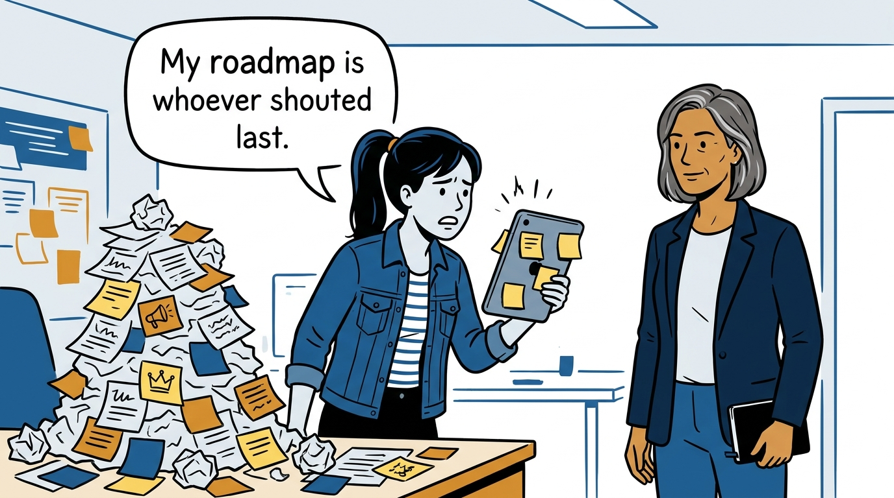
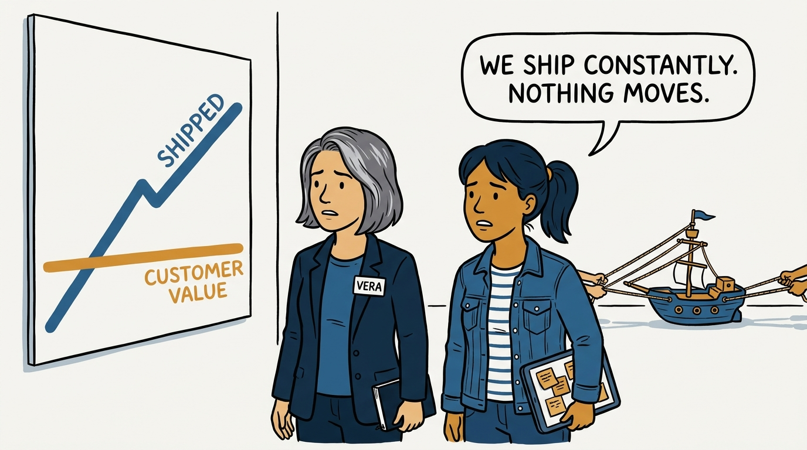
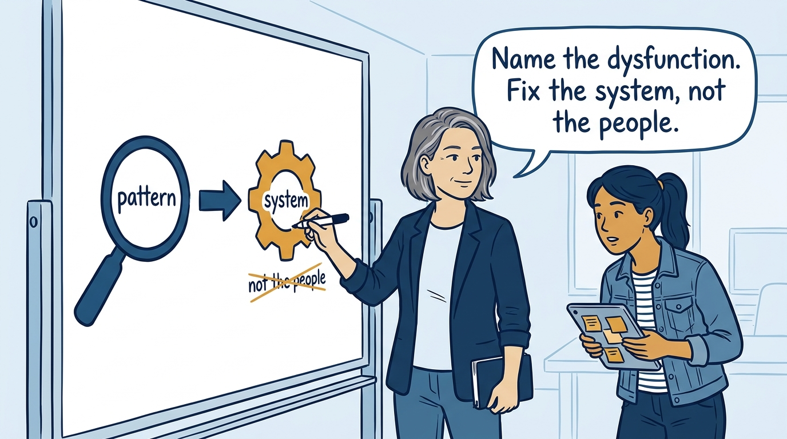
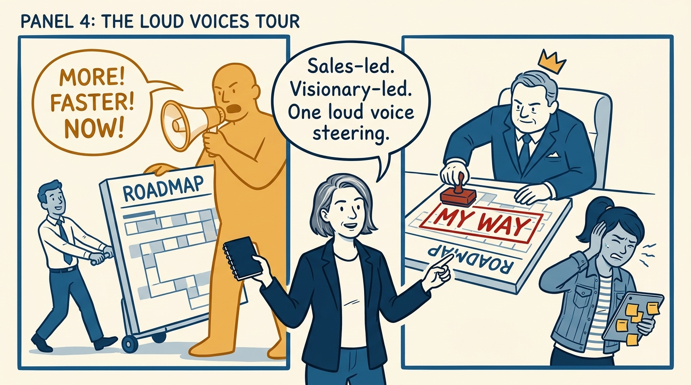
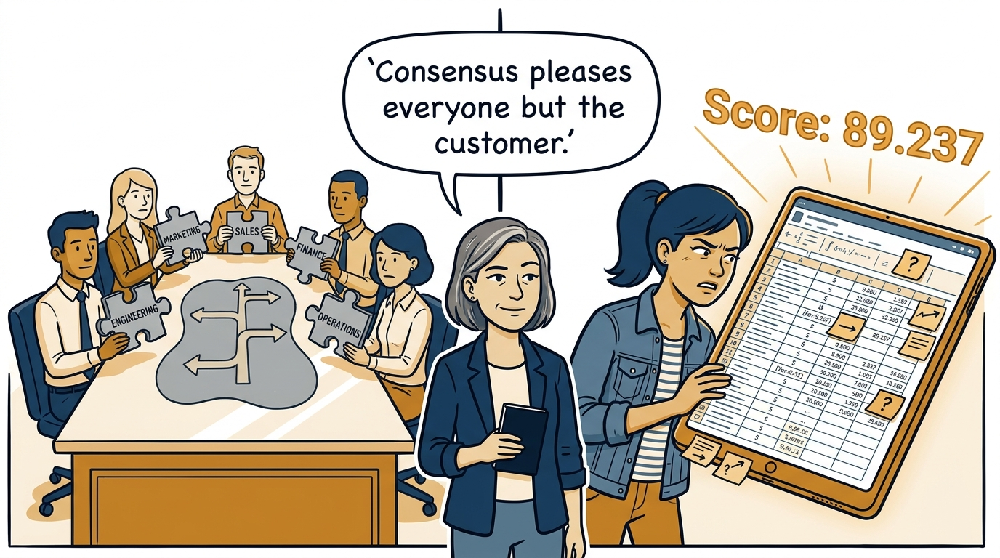
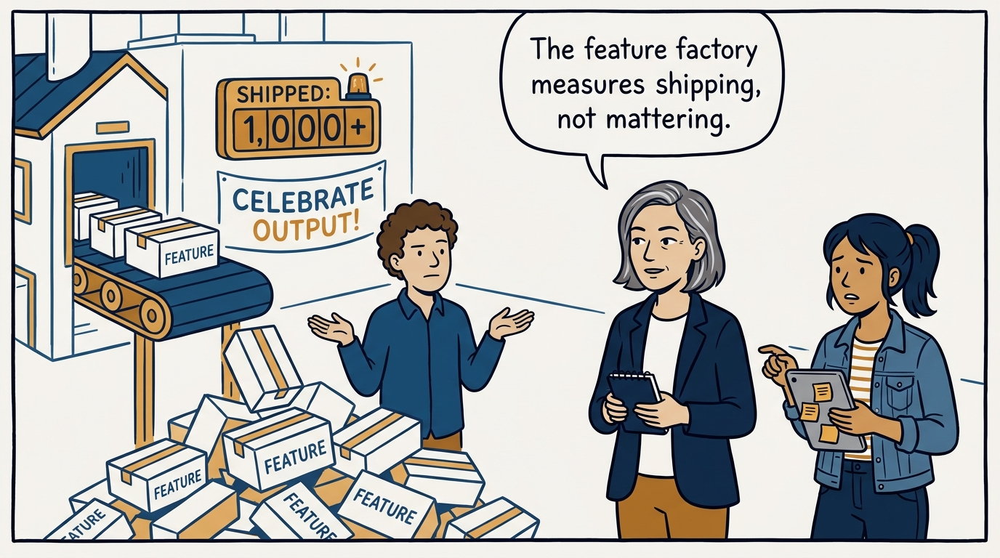
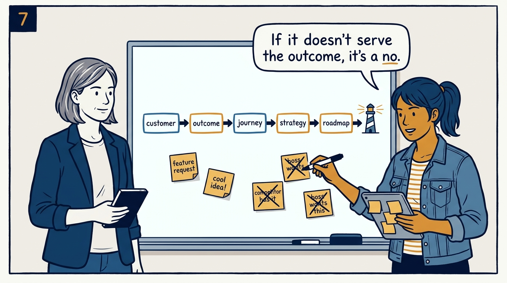
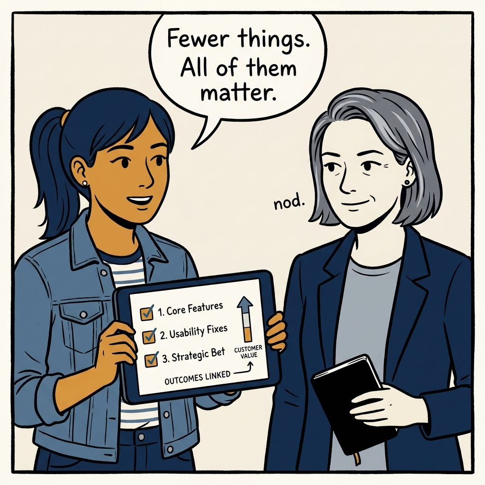

Shipping more while mattering less — how to name the dysfunction steering your roadmap and fix the system, in eight panels.

<!-- comic-style
{
  "cast": "VERA: a calm, seasoned product-minded executive, short gray-streaked hair, dark blazer over a plain t-shirt, carries a small black notebook. MILA: an energetic young product manager, dark hair in a ponytail, denim jacket over a striped shirt, carries a tablet covered in sticky notes.",
  "style": "Clean two-tone explainer comic, thick ink outlines, flat colors with deep blue and amber accents on a light background, generous white space, hand-lettered speech bubbles with SHORT readable text, no photorealism."
}
-->

**Panel 1:** *The hook: a roadmap made of whoever shouted last.*

**Panel 2:** *The problem: shipping lots, moving nowhere — every force pulls a different way.*

**Panel 3:** *The principle: diagnose the pattern, then repair the operating system.*

**Panel 4:** *The tour, part one: the sales-led product and the visionary-led override.*

**Panel 5:** *The tour, part two: consensus-driven roadmaps and spreadsheet-led rigor theater.*

**Panel 6:** *The tour, part three: the feature factory — busy, proud, and pointless.*

**Panel 7:** *The alternative: the vision-led chain, where every roadmap item earns its place.*

**Panel 8:** *The closer: fewer things, all of them mattering.*
