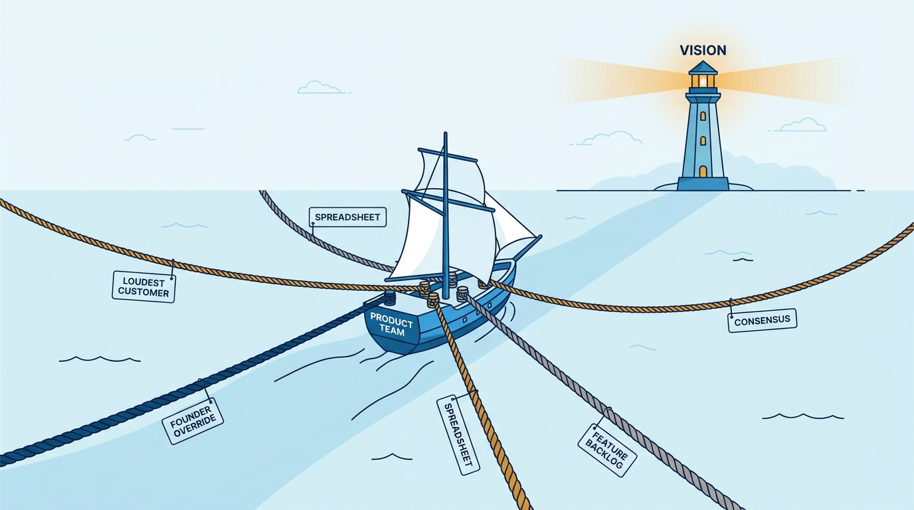
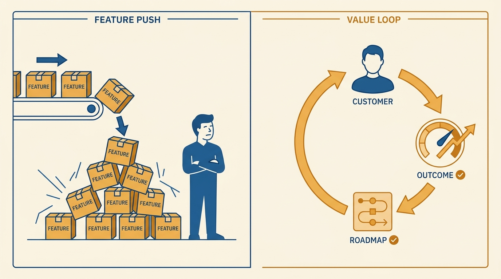
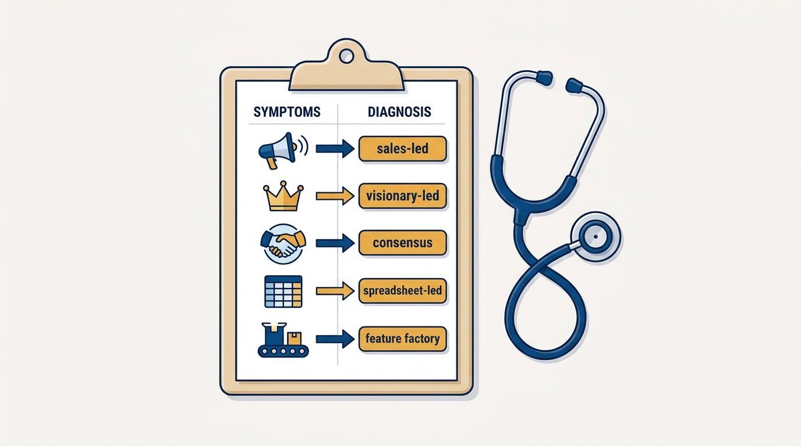

> **Status**: DRAFT
>
> **Principle**: I treat recurring product dysfunctions as diagnosable patterns, not personality problems. When product work is driven by the loudest customer, the boldest opinion, the fullest spreadsheet, or the busiest backlog instead of a vision and outcomes, I name the dysfunction first and fix the operating system, not the people. I score the organization honestly against the known patterns, pick the one or two doing the most harm, and replace them with the vision-led chain — target customer, key outcome, journey vision, strategy, roadmap.

## Statement

My operating model for product dysfunctions has four parts:

- **Diagnose before treating.** I run an honest self-assessment against the known dysfunction symptoms — features over outcomes, internal metrics over customer value, backlog-as-roadmap, spreadsheet prioritization, priority whiplash, leadership overrides. Three or four checked is meaningful dysfunction; five or more is an urgent leadership problem.
- **Name the pattern, not the person.** The same few dysfunctions recur everywhere: the *sales-led* product built one loud customer at a time, the *visionary-led* product steered by founder override, the *consensus-driven* product negotiated into mediocrity, the *spreadsheet-led* product prioritized by theoretical ROI, and the *feature factory* that measures shipping instead of mattering.
- **Fix the system with the vision-led chain.** Define the target customer and key outcome, map the customer journey, write a future-state vision, build a strategy with measurable milestones, and rework the roadmap so every item links to an outcome.
- **Hold the line.** Filter feedback through the target market, say no to misaligned requests, keep leadership aligned on the trade-offs, and review progress against outcomes, not output.

**Figure 1:** *Five dysfunctions, one ship: each pulls the roadmap in a different direction, and only the vision provides a heading.*

## How to Read This

This journal is the product-management counterpart to my engineering-executive journal: the same first-person operating principles, applied to how product decisions get made. This record is grounded in Ben Foster and Rajesh Nerlikar's *Build What Matters*, read through a practitioner-executive lens — I keep their diagnosis vocabulary and their vision-led cure, and state how I apply both. If you work with me, this record explains why my first question about a struggling product is never "who is underperforming?" but "which dysfunction is this?". The working checklist lives in the **Checklist** tab of this post.

## Rationale

**Dysfunctions are systems, so blaming people changes nothing.** Every dysfunction on the list is locally rational. The salesperson escalating a demand is doing their job; the founder overriding the roadmap genuinely sees something. Swapping the people while keeping the system reproduces the dysfunction with a new cast. So I name the pattern out loud — *this is a sales-led roadmap*, *this is a HiPPO decision* — and then change what the decision is checked against, not who makes it.

**A backlog is not a strategy, and shipping is not progress.** The feature factory is the most seductive dysfunction because it looks like health: velocity is up, releases are frequent, everyone is busy. But when success is judged by internal metrics and feature counts rather than customer value, the team can ship for a year and move the customer nowhere. The defense is to make outcomes the unit of progress: every roadmap item links to a customer outcome, and shipped work gets reviewed for whether it created customer value — not whether it went out on time.

**Figure 2:** *The feature factory measures shipped boxes; the vision-led loop measures whether the customer's outcome actually improved.*

**Serving everyone is the fastest way to serve no one.** The sales-led product grows one custom deal at a time until the roadmap is a pile of one-off promises; the consensus-driven product trades away its point of view to keep stakeholders comfortable. Both fail for the same reason: they never chose a target market. A product-driven company knows which customer segment it serves, which needs it should meet — and, just as deliberately, which requests it should intentionally ignore. Saying no is not a communication problem; it is the strategy working.

**Feedback is data, not direction.** I do not ignore customers, executives, or spreadsheets — I filter them. For each major feedback item I ask: is it from the target market, used as designed, valuable to many customers, aligned with the long-term vision, and worth the opportunity cost? Then the decision is mechanical: **act** if it improves value for the target market, **investigate** if it reveals a broader unmet need, **defer** if it is useful but misaligned with current priorities, **decline** if it serves a one-off. The same filter disciplines the visionary: a founder's insight enters through the framework like everyone else's, making the override unnecessary.

**Stability is a prerequisite for outcomes.** Priority whiplash is a dysfunction in its own right: initiatives need enough time to succeed before being declared failures, and teams need a strategy stable enough to execute. When leadership agrees on the target customer, the outcome, and the trade-offs — and product has real authority over prioritization — the roadmap stops being renegotiated every time someone senior has a strong week.

## What This Means in Practice

| What this principle says | What it does **not** say |
| --- | --- |
| Name the dysfunction before proposing a fix. | Naming is blaming — the pattern is at fault, not the people enacting it. |
| The roadmap serves a chosen target market. | Customers outside the segment are treated badly — they are just not steering. |
| Say no to misaligned requests, including executive ones. | Product ignores sales, leadership, or data — everything enters through the filter. |
| Progress is reviewed against outcomes. | Shipping cadence doesn't matter — output is necessary, just not sufficient. |
| The vision-led chain replaces the dysfunction. | One workshop fixes it — the chain must survive contact with the next loud request. |
| Pick the top one or two dysfunctions to fix first. | Fix everything at once — sequencing is the treatment plan. |

Concretely: I run the dysfunction self-assessment with leadership at least yearly and treat a score of three or more as a mandate to act. Roadmap reviews start from outcomes, not the request queue. Custom work for one customer must benefit many or advance the strategy. And when a decision is overridden from above, I ask for the framework behind it — not to win the argument, but to make the framework explicit and reusable.

**Figure 3:** *Symptom to diagnosis: mapping what you observe to a named dysfunction is what turns frustration into a treatment plan.*

## Anti-Patterns

- **The sales-led product.** A roadmap of custom promises to individual customers; the target market never shouts, so it never gets a vote.
- **The visionary-led product.** The founder or a senior leader frequently overrides product direction without a clear framework — brilliance as a bus factor.
- **The HiPPO meeting.** Prioritization by the highest-paid person's opinion, with research and outcome data as decoration.
- **The consensus-driven roadmap.** Product meetings become negotiations to keep every stakeholder happy; the output is the intersection of everyone's comfort.
- **The spreadsheet-led product.** Theoretical ROI models and scoring formulas with invented precision — rigor theater replacing customer research.
- **The feature factory.** Success judged by shipping, roadmap-as-backlog, no review of whether anything created customer value.
- **Whiplash management.** Priorities change too quickly for anything to succeed, then the initiatives get blamed for failing.
- **Blaming the cast.** Replacing the PM while leaving the decision system untouched — the dysfunction survives the reshuffle.

## Related Records

- [[customer-journey-vision]] — this record is the diagnosis; the journey vision is the treatment.
- [[outcomes]] — the key-customer-outcome discipline; the feature factory's antidote.
- [[right-processes]] — the operating processes that keep the vision-led chain running after the fix.
- [[measuring-engineering-organizations]] — the engineering-side counterpart: measuring by outcomes rather than activity.

## Scope and Revisiting

This principle governs how I diagnose and repair product decision-making in organizations I lead, join, or advise. I revisit it whenever the self-assessment score crosses three, whenever a roadmap review turns into a negotiation, and whenever I catch myself explaining a product problem as a person rather than a pattern. The self-assessment repeats at least yearly.

## Authoritative References

- Ben Foster and Rajesh Nerlikar, *Build What Matters: Delivering Key Outcomes with Vision-Led Product Management* (Lioncrest Publishing, 2020) — the dysfunction taxonomy and the vision-led cure this record's checklist distills.
