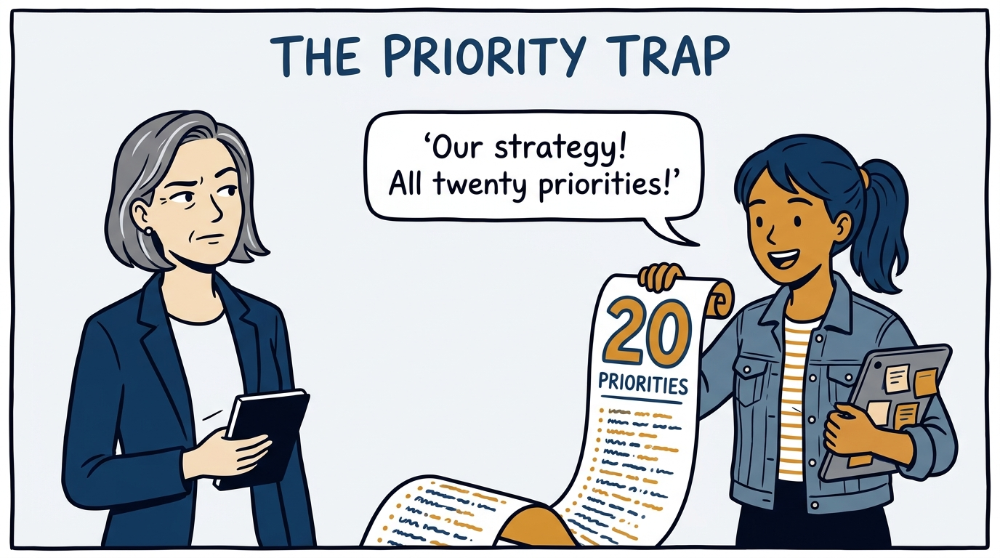
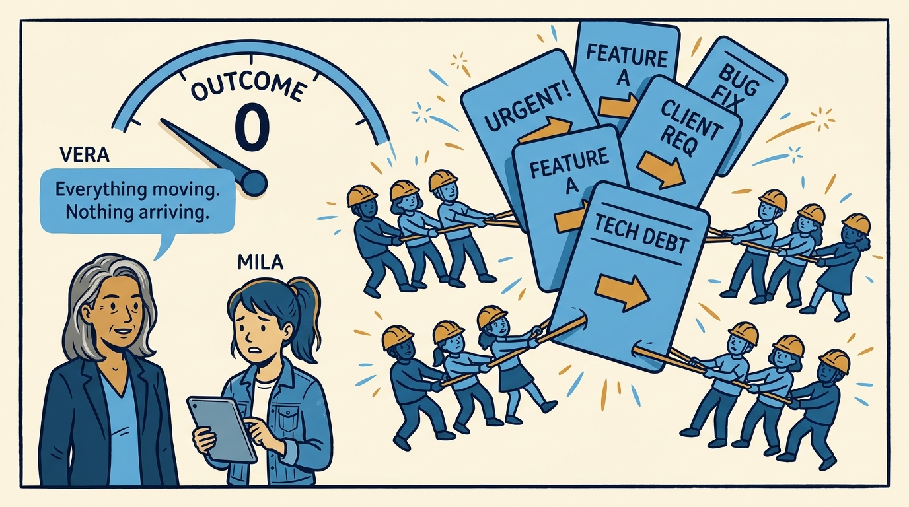
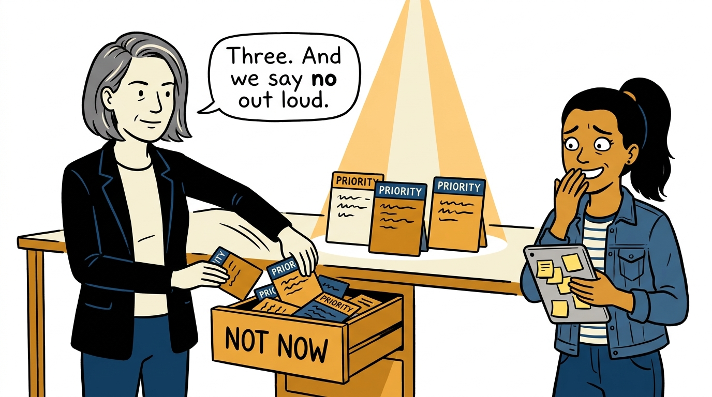
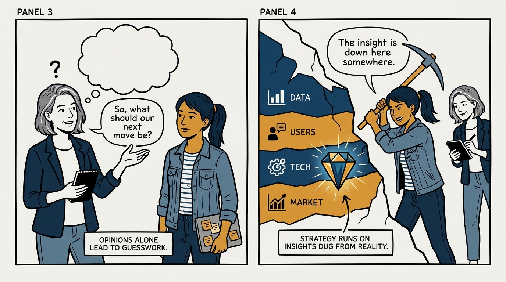
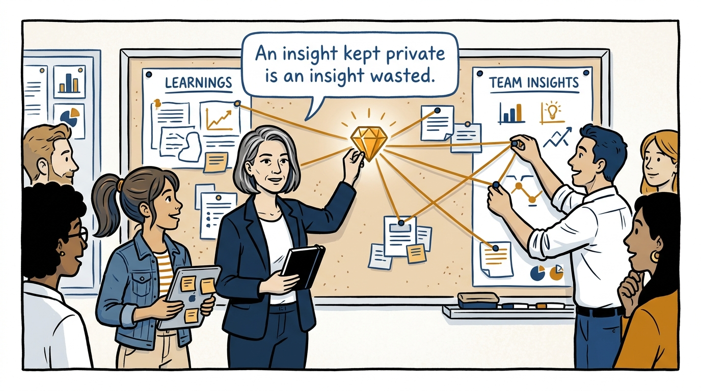
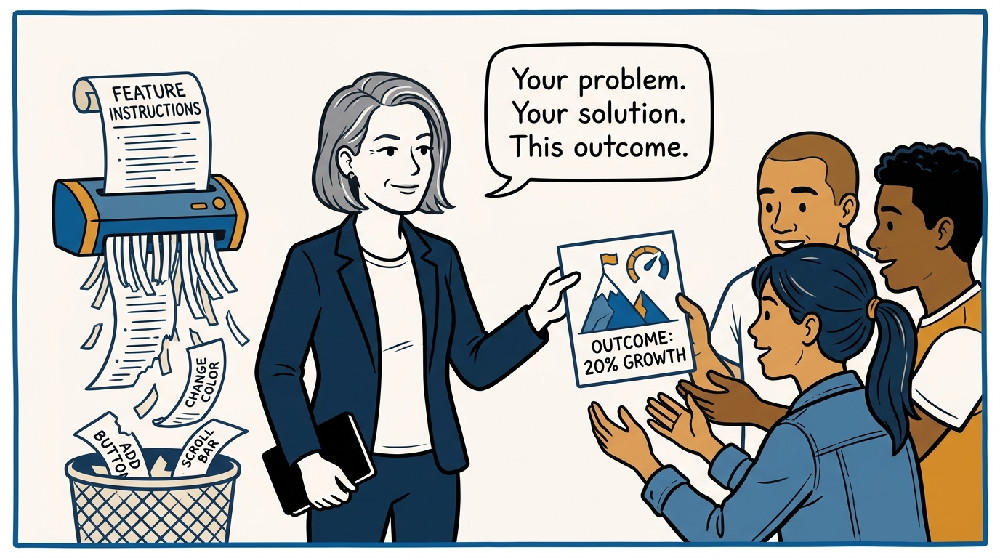
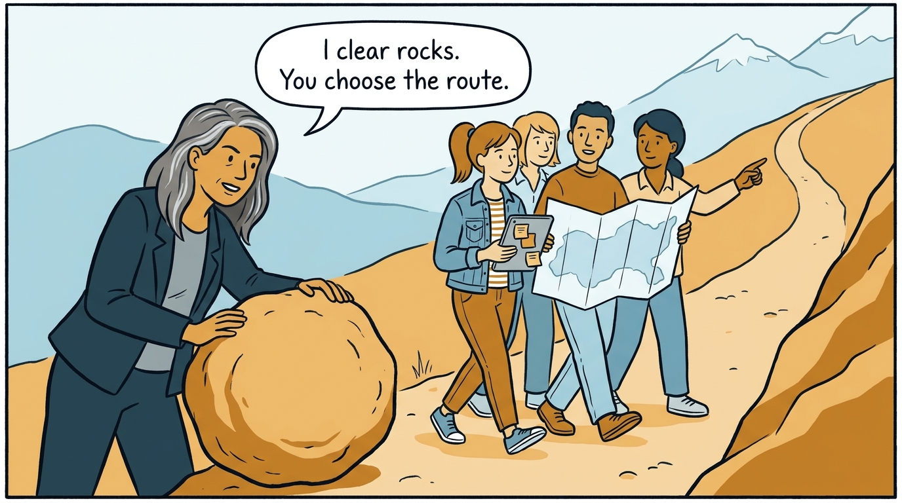
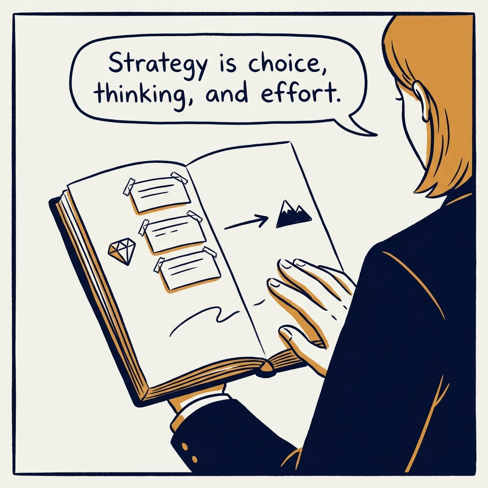

Focus, insight, action — product strategy the EMPOWERED way, in eight panels.

<!-- comic-style
{
  "cast": "VERA: a calm, seasoned product-minded executive, short gray-streaked hair, dark blazer over a plain t-shirt, carries a small black notebook. MILA: an energetic young product manager, dark hair in a ponytail, denim jacket over a striped shirt, carries a tablet covered in sticky notes.",
  "style": "Clean two-tone explainer comic, thick ink outlines, flat colors with deep blue and amber accents on a light background, generous white space, hand-lettered speech bubbles with SHORT readable text, no photorealism."
}
-->

**Panel 1:** *The hook: twenty priorities, zero strategy.*

**Panel 2:** *The problem: twenty priorities means teams spread too thin for any outcome.*

**Panel 3:** *The principle: the vital few — and an explicit, spoken no to the rest.*

**Panel 4:** *Insights before solutions: dug from data, users, technology, and the market.*

**Panel 5:** *Share the insight, connect the learnings — strategy is a team sport.*

**Panel 6:** *Insight into action: problems to solve, not features to ship.*

**Panel 7:** *Active management: clear the obstacles, never grab the map.*

**Panel 8:** *The closer: choice, thinking, and effort — that is the strategy.*
