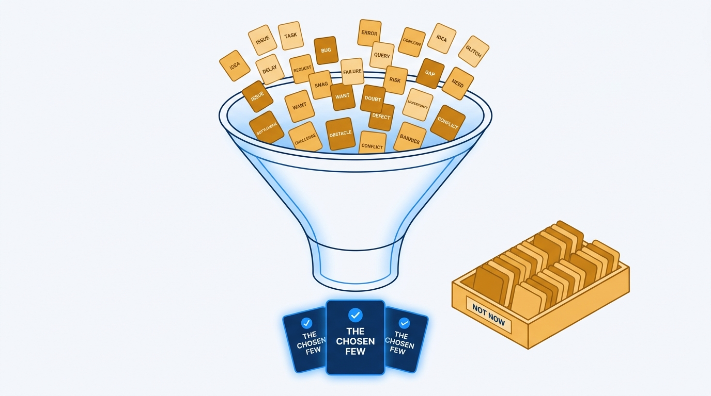
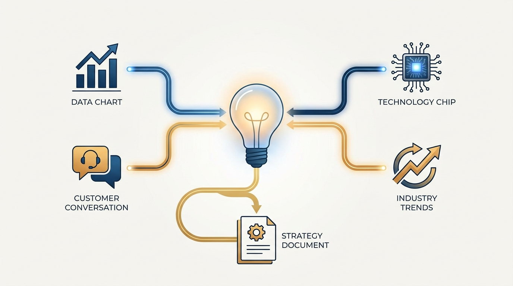
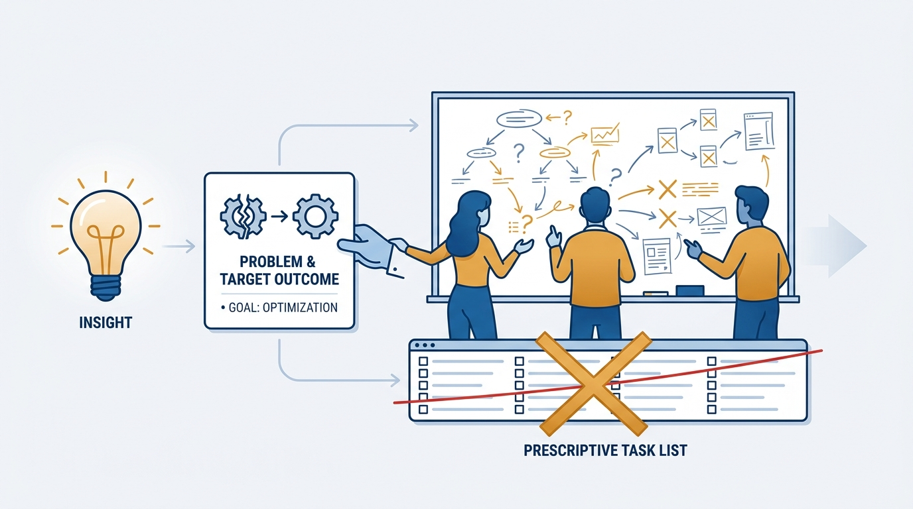

> **Status**: DRAFT
>
> **Principle**: I run product strategy as focus, insight, and action: I choose the few problems that truly matter to the business — and make explicit what will not be prioritized — I do the hard work of generating real insights from data, customers, enabling technologies, and the industry, and I convert those insights into team objectives: problems to solve with expected outcomes, not features to ship. Then I get out of the way — managing progress actively, removing obstacles quickly, and never slipping into command-and-control.

## Statement

My operating model for product strategy has four parts:

- **Establish the context first.** Before any strategy work, the company's mission, objectives, and scorecard are clear; the product vision and principles are confirmed; team topology and ownership are settled. Strategy without context is guessing.
- **Focus on the vital few.** A real strategy is a set of explicit choices: the few critical problems the business most needs to solve, and — just as explicitly — what will *not* be prioritized. It is the approach for achieving the goal, not a roadmap, a feature list, or a pile of tactics.
- **Generate insights before choosing solutions.** I study product and business data — acquisition, retention, funnel, sales patterns — run regular user research for both evaluative and generative insights, explore enabling technologies, and track industry and competitive trends. Then I make sure those insights travel: aggregated regularly, shared with leaders and peers, connected across teams, and never left isolated where they were found.
- **Turn insights into action — and manage actively.** Key insights become team objectives: problems to solve with expected business or customer outcomes, constraints, and context — not prescribed solutions. I review progress weekly or biweekly, surface blockers early, remove obstacles quickly, and stay adaptive when strategy meets reality.

**Figure 1:** *Strategy as narrowing: many candidate problems in, the vital few out — and an explicit 'not now' for everything else.*

## How to Read This

This journal is the **product-management counterpart** to my engineering-executive journal: the same first-person operating principles, applied to how product management should work. This record belongs to the journal's EMPOWERED section and is grounded in Marty Cagan and Chris Jones's *EMPOWERED* — read here through a practitioner-executive lens: what I actually do, not a book summary.

It has a deliberate boundary with [[product-strategy]], its Build-What-Matters sibling. Foster and Nerlikar treat strategy as the **bridge from vision to roadmap** — how a validated vision becomes a sequenced plan. Cagan treats it as a **focus–insight–action loop** that ends in team objectives, not a plan. The two lenses are complementary, which is why there are two records rather than one. The working checklist — all ten sections — lives in the **Checklist** tab of this post.

## Rationale

**A list of priorities is not a strategy.** The most common failure I see is a "strategy" document with fifteen or twenty top priorities. Twenty top priorities means none: teams spread thin, attention diffused, and every quarter producing activity instead of outcomes. A real strategy reflects choice, thinking, and effort — it names the few critical problems, and it names what will be left undone. If nothing was hard to leave out, no strategy was made.

**Strategy is not the roadmap.** Roadmaps, features, and tactics are outputs that may eventually follow from a strategy; they are not the strategy itself. The strategy is the approach for achieving the goal. When I confuse the two, I end up defending a list of features instead of an argument about where the business is won or lost.

**Insights are earned, not found.** Real insights rarely arrive from a dashboard alone. I have to study the data — acquisition, retention, funnel, and sales patterns — but also sit with customers regularly, looking for both evaluative insights (is this working?) and generative ones (what problem did we not know they had?). I explore enabling technologies that could unlock solutions that were impossible last year, and I track industry, competitive, and adjacent-market trends. And because insight favors the prepared mind, I invest in enough context that an important insight is recognizable when it appears.

**Figure 2:** *Insight sources converging: data, customers, enabling technology, and industry trends — not a dashboard alone.*

**Insights that stay local die local.** A team that learns something important and keeps it has wasted most of its value. I aggregate learnings from teams regularly, share the most important insights with leaders and peers, connect related learnings across teams, and make sure insights reach the people actually making strategic decisions. The organization's insight advantage is a function of how fast learning travels, not just how much learning happens.

**Action means objectives, not orders.** Converting insight into action is where empowerment is won or lost. Teams get problems to solve — with expected business or customer outcomes, constraints, and context — not features to ship. OKRs or any similar method earn their keep only if they support empowered teams; the mechanism is secondary. The test I apply: are teams acting like owners, or like order-takers? If a team cannot explain why its objective matters, I have handed out an order with an objective's formatting.

**Figure 3:** *Insight to action: objectives arrive as problems with expected outcomes — the solution path belongs to the team.*

**Active management is not micromanagement — and neither is absence.** Empowering teams does not mean disappearing. I hold regular 1:1s and coaching sessions with product leaders, review progress weekly or biweekly, surface blockers, dependencies, and risks early, remove obstacles quickly, and help teams make stakeholder decisions when needed. What I do not do is prescribe solutions. The line is clear: I manage the *progress* and the *context* intensively; I never manage the *how*.

**Strategy meets reality — plan for it.** Every strategy collides with missed dependencies, missing capabilities, and urgent issues. I expect that, reassess priorities when reality changes, and stay open to a vision pivot when a genuinely larger opportunity appears. But I do not abandon the vision merely because execution got hard — most "strategy failures" I have seen were actually stamina failures.

## What This Means in Practice

| What this principle says | What it does **not** say |
| --- | --- |
| Choose the few critical problems; name what will not be done. | Everything else is unimportant — its turn is deferred, not denied. |
| Strategy is the approach for achieving the goal. | Strategy is a roadmap, feature list, or backlog. |
| Insights come from data, customers, technology, and the industry. | Opinions and dashboards alone are enough to bet on. |
| Teams get problems to solve with expected outcomes. | Teams get feature lists with deadlines and a solution attached. |
| I review progress weekly and remove obstacles fast. | Empowerment means leaders step away until the demo. |
| Reassess when reality changes; pivot for larger opportunities. | Abandon the vision the first time execution gets hard. |

Concretely: strategy conversations in my organization start with "which few problems, and what are we explicitly not doing?" — not with a roadmap review. Objectives are written as problems with expected outcomes, and I ask teams to explain why their objective matters before they start. My weekly rhythm covers progress, blockers, and dependencies — never solution design.

## Anti-Patterns

- **The twenty-priority strategy.** A priority list long enough to offend no one, focusing no one.
- **The roadmap in a strategy costume.** A sequenced feature list presented as strategy — output without choice.
- **Opinion-driven bets.** Choosing problems by seniority of the loudest voice instead of earned insight.
- **Dashboard-only insight.** Mistaking metrics monitoring for user research, technology exploration, and market awareness.
- **Insights trapped in one team.** Learning that never reaches the people making strategic decisions.
- **Objectives as task lists.** Problems-to-solve rewritten into features-to-ship the moment planning pressure arrives.
- **Stakeholder-driven feature overload.** Serving the business by accepting every request, instead of serving customers in ways that work for the business.
- **Management by absence.** Calling it empowerment when it is actually neglect — no progress reviews, no obstacle removal, no help with stakeholder decisions.
- **The premature pivot.** Abandoning the vision because execution met its first real obstacle.

## Related Records

- [[product-strategy]] — the Build-What-Matters sibling: vision-to-roadmap bridge; this record is the focus–insight–action loop.
- [[team-objectives]] — where the converted insights land; that record covers how objectives are assigned and pursued.
- [[product-vision-and-principles]] — the strategic context this record assumes before any strategy work starts.
- [[engineering-strategy]] — the engineering-executive counterpart; the two strategies must name the same few problems.

## Scope and Revisiting

This principle governs how I set product strategy and how I manage the teams executing it. I revisit it at every planning cycle, whenever the count of "top priorities" starts creeping upward, and whenever I catch an objective that is really a feature order in disguise. The final health check in the Checklist tab is the standing test: few real priorities, insights over opinions, problems over backlog items, active management, measurable outcomes — a strategy that reflects choice, thinking, and effort.

## Authoritative References

- Marty Cagan with Chris Jones, *EMPOWERED: Ordinary People, Extraordinary Products* (Wiley, 2020) — the product-strategy chapters this record's checklist distills.
- Much of the book's thinking began as freely available essays by the authors at [svpg.com](https://www.svpg.com/), where the underlying material can still be read.
