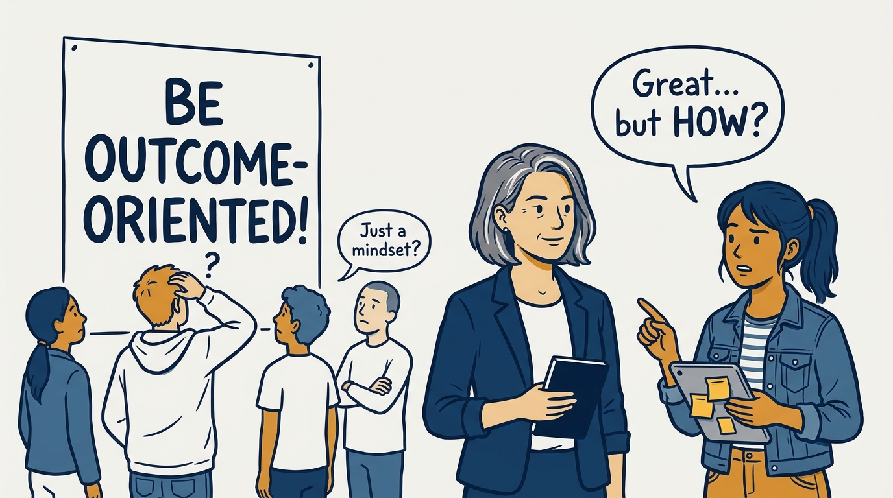
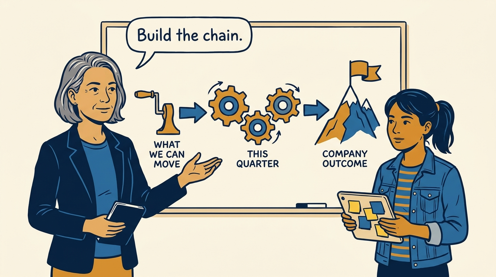
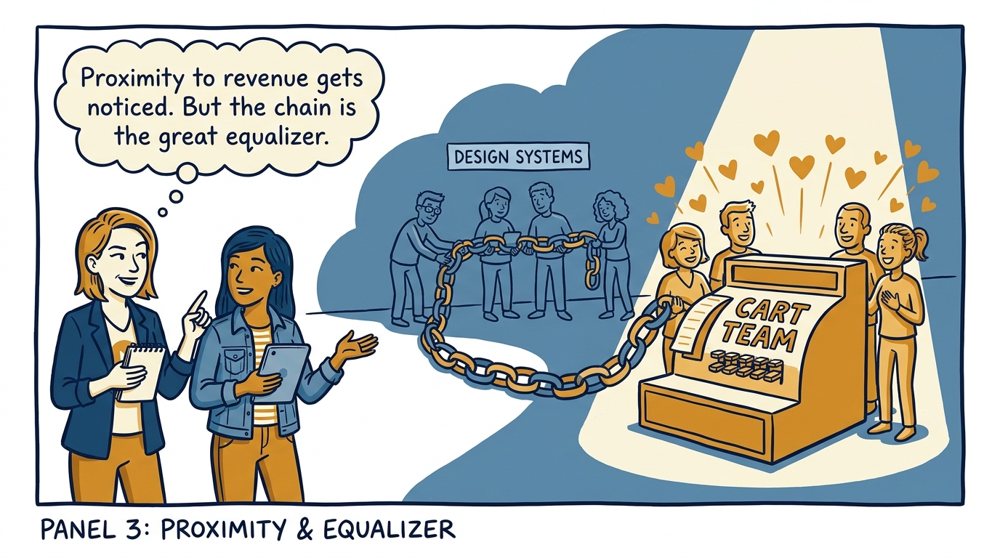
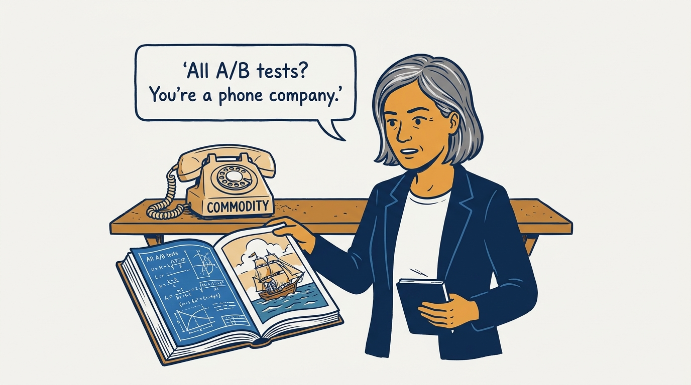
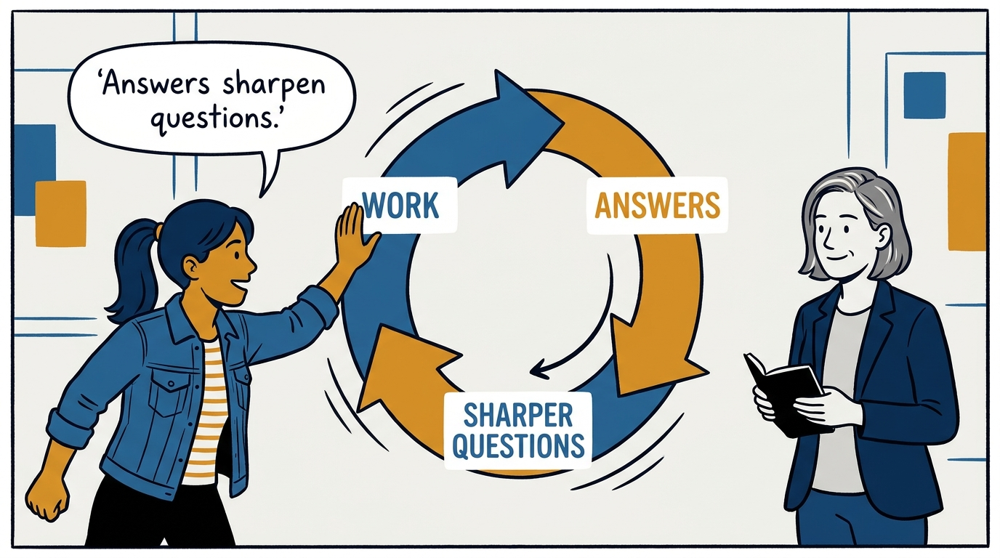
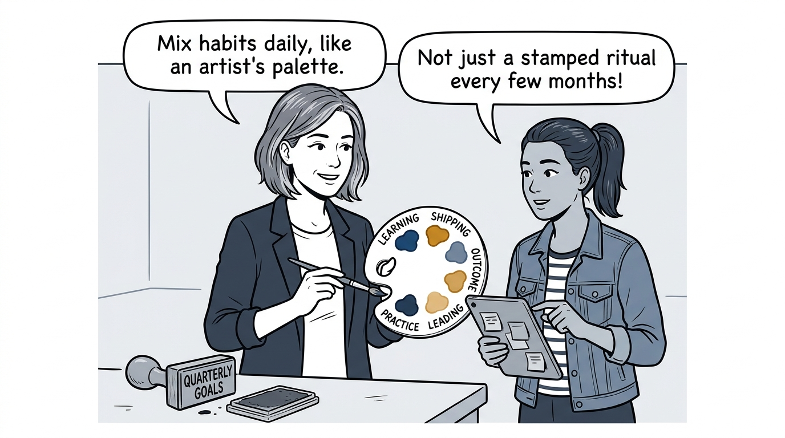
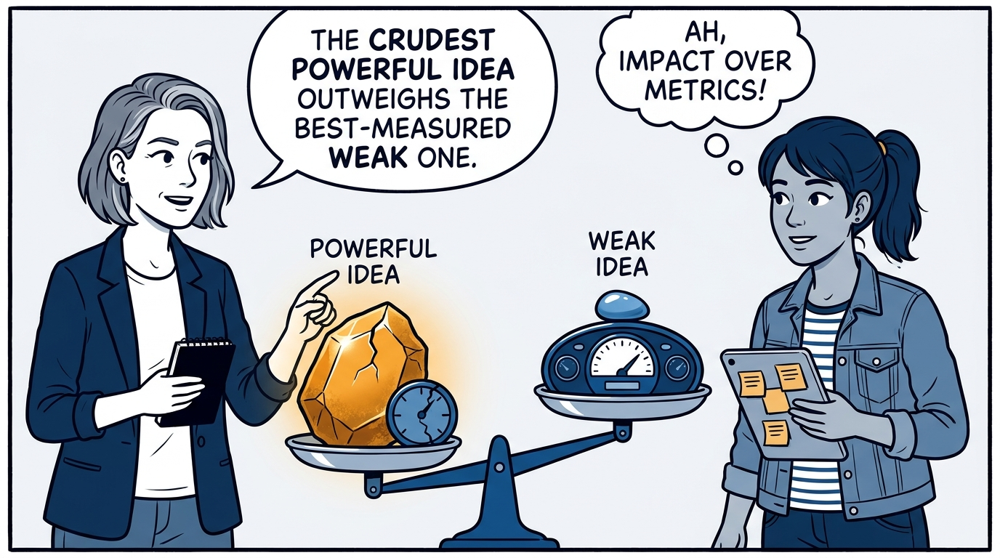
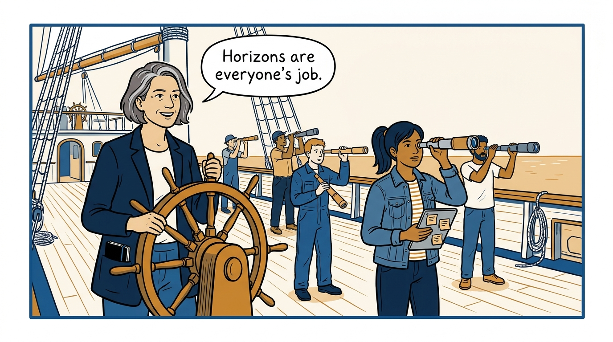

Goals and questions — what outcome-centricity actually costs, in eight panels.

<!-- comic-style
{
  "cast": "VERA: a calm, seasoned product-minded executive, short gray-streaked hair, dark blazer over a plain t-shirt, carries a small black notebook. MILA: an energetic young product manager, dark hair in a ponytail, denim jacket over a striped shirt, carries a tablet covered in sticky notes.",
  "style": "Clean two-tone explainer comic, thick ink outlines, flat colors with deep blue and amber accents on a light background, generous white space, hand-lettered speech bubbles with SHORT readable text, no photorealism."
}
-->

**Panel 1:** *The hook: everyone says be outcome-oriented — nobody says how.*

**Panel 2:** *The principle: outcome-centricity is a built causal model, not a mindset.*

**Panel 3:** *The physics: closer to money gets love for free — everyone else builds the chain.*

**Panel 4:** *The mix: math plus conviction plus storytelling — certainty is a commodity business.*

**Panel 5:** *The loop: work the lanes, get answers, ask better questions — at tempo.*

**Panel 6:** *The palette: mix your goals — the habit matters, the performance doesn't.*

**Panel 7:** *The bar: powerful ideas imperfectly measured beat perfect measures of weak ideas.*

**Panel 8:** *The closer: anyone at any level can think in horizons — ideally right on the front line.*
