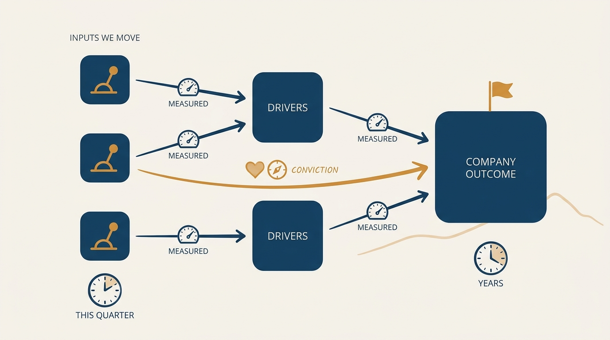
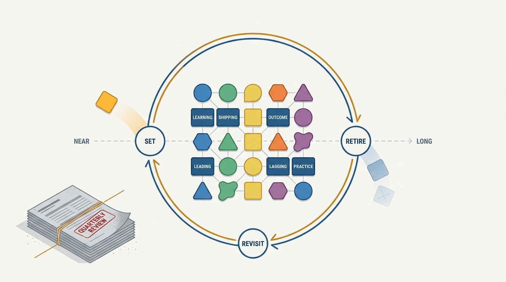
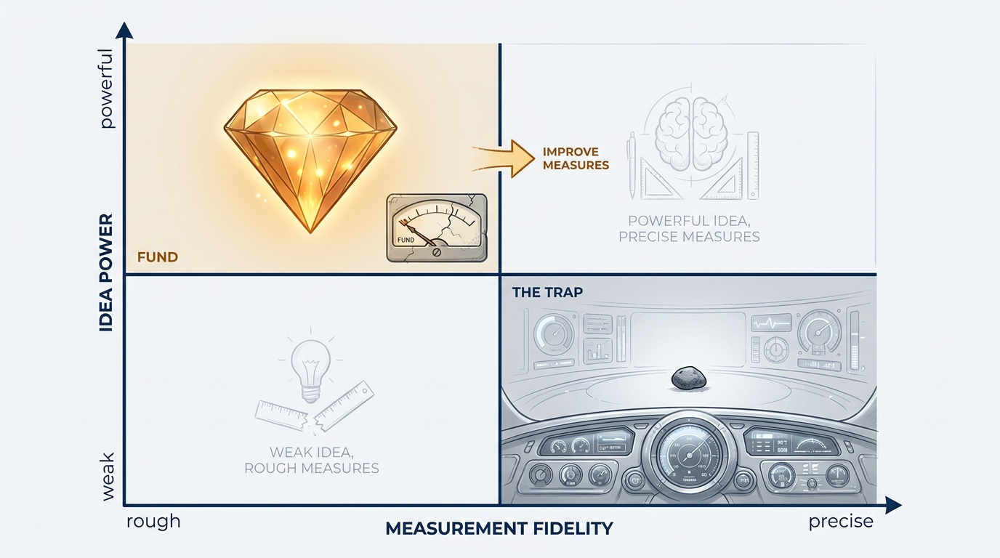

> **Status**: DRAFT
>
> **Principle**: I expect every team to carry a causal model — the near-term things it can influence, linked to the long-term results that propel the company — and to hold goal-setting as a habit, not a ritual. Outcome-centricity is not a mindset; it is that model plus the conviction, storytelling, and leaps of faith the math cannot supply. What compounds is asking better questions at tempo, not having all the answers — and a powerful idea imperfectly measured beats a perfect measure of a weak idea every time.

## Statement

My operating model for goals and questions has five parts:

- **Build the causal model.** Every team can name the near-term things it influences, the long-term outcomes they link to, and why the links hold. Closer-to-money teams get attention for free; everyone else earns it by making the chain explicit.
- **Accept that it is not all math.** Shaping the future is part measurement, part conviction, part storytelling. If everything were an A/B test and every pattern had already happened many times, we would be a phone company — a commodity.
- **Ask better questions, at tempo.** The compounding loop is: work the lanes, ask good questions, get decent answers, sharpen the next question, re-check core assumptions. Answers exist to make the next question better.
- **Mix goals; keep the habit.** Learning goals, shipping goals, outcome goals, goals on leading and lagging metrics, goals on practices — prescriptive and descriptive, near and long. The habit of goal-setting matters; the performance of it does not.
- **Prefer powerful ideas imperfectly measured.** Over perfect measures of not-so-powerful ideas — and expect multi-horizon thinking at every level, not just from leaders.

## How to Read This

This record is grounded in John Cutler's "20 Unfiltered Operating Takes" (TBM 435), read through the same practitioner-executive lens as the rest of this journal. It is the practice-side companion to [[outcomes]]: that record defines what counts as an outcome and how metrics are chosen; this one is about what living by outcomes actually costs — a model, conviction, and habits — and why so much "outputs to outcomes" talk leaves teams feeling inadequate instead of equipped. The working checklist, derived from the essay, lives in the **Checklist** tab.

## Rationale

**Outcome-centricity has a price list, and "mindset" is not on it.** The transformation language — projects to products, outputs to outcomes — is too theoretical. It skips how uncertain the work is and what actually makes it function: building a causal model that starts with near-term things you can influence and links them to the long-term things that propel the company. Teams told to "be outcome-oriented" without that machinery end up feeling they are never doing enough, while the unglamorous practices that make it real — staring at input metrics, revising, discussing assumptions, monitoring, switching things up — get dismissed as not strategic enough. Those routines *are* outcome-centricity.

**Figure 1:** *The causal model: near-term inputs linked to long-term outcomes, with honesty about which links are measured and which are conviction.*

**Proximity to money is real; the causal chain is the equalizer.** The cart-optimization team at an e-commerce company gets more love than the design-systems team for one reason: it is closer to money. There is no free lunch here, and complaining about it changes nothing. The team far from money closes the gap by building the explicit chain — what we influence, what that improves, what that is worth — and by telling that story with conviction. That is not spin; it is the same model the cart team gets for free by standing next to the till.

**Certainty is a commodity business.** If every decision could be A/B-tested, every customer's lifetime value were known, and every current pattern had happened many times before, product management would be arithmetic — and the company would be a phone company. The upside of uncertainty is that judgment, conviction, and narrative are exactly where differentiated value comes from. I fund leaps of faith knowingly, as leaps, with the model saying why the landing zone is plausible.

**Questions compound; answers feed them.** What really matters is that a team is always asking better questions, not that it has all the answers. But the loop must close: answers are what sharpen the next question, and answers come from tempo — knocking out work on the lanes, checking assumptions, moving the needle, meeting again next week. Teams that make "powerful questions" a standalone activity produce one great workshop and then return to business as usual — often because someone branded them "the type that only asks good questions." The fix is not fewer questions; it is attaching the questions to the weekly motion that generates answers.

**Goals work when they are habitual and mixed.** Set goals — and refuse to be ruled by them. The failure modes are twin: going through the goal motions, where the numbers mean nothing; and goals as afterthought, where teams dream up everything they want to do and bolt on a "success metric" at the end. The countermeasure is variety with cadence: learning goals next to shipping goals next to outcome goals; goals on near-term input metrics and on lagging results; goals on practices and continuous improvement. Prescriptive where we know, descriptive where we are exploring. The habit of setting, revisiting, and retiring goals is the asset; any single goal is expendable.

**Figure 2:** *Mix the goals and keep the loop: set, revisit, retire — the habit is the asset, any single goal is expendable.*

**Imperfect measurement of the right thing beats precise measurement of the wrong thing.** Powerful ideas imperfectly measured are more important than perfect measures for not-so-powerful ideas. A measurement bar that only cheap, small, already-instrumented ideas can clear is a filter that selects for weakness. I hold the ambition fixed and let measurement fidelity be what improves over time — not the reverse.

**Figure 3:** *Hold ambition fixed and improve the measures — never let the dashboard decide which quadrant you live in.*

**Horizons belong to everyone.** I am tired of "leaders do the long-horizon thinking" as an org-design axiom. Anyone at any level can reason across horizons; experience mostly improves the judgment of *when* long-horizon reasoning makes sense at all. Ideally the most experienced people are on the front line, where the work is — and if none are, that is a question about the organization, not about the ICs. There should be power ICs who love showing people how to do the thing — they are how horizon-thinking reaches the front line instead of staying upstairs.

## What This Means in Practice

| What this principle says | What it does **not** say |
| --- | --- |
| Every team can walk me through its causal model. | The model must be proven — it is a model we refine, not a theorem. |
| Conviction and narrative are legitimate parts of the case. | Storytelling replaces measurement — the input metrics still get stared at. |
| Goals are mixed across types and horizons, on a cadence. | Every goal fits one framework — the mix is deliberately looser than any OKR scheme. |
| Ambitious ideas proceed with imperfect measures. | Measurement is optional — imperfect is a starting point, not a destination. |
| Multi-horizon thinking is expected at every level. | Leaders stop doing long-horizon work — it is shared, not relocated. |

## Anti-Patterns

- **Outcome theater.** "Be outcome-oriented" proclaimed as a mindset shift, with no causal model, no input metrics, and no routine for revisiting either.
- **The mindset tax.** Teams left feeling perpetually inadequate because the theory they were given has no machinery attached.
- **The question workshop.** A brilliant afternoon of powerful questions, followed by ho-hum business as usual — the hat taken off before any answers arrive.
- **Goal motions.** Numbers filled into the goal template each quarter that predict nothing, change nothing, and are mourned by no one.
- **The afterthought metric.** A wishlist of things to build, with "success metrics" appended at the end to satisfy the format.
- **The measurement veto.** A powerful idea killed because its metric would be imperfect, while a weak idea proceeds on the strength of its dashboard.
- **Horizon gatekeeping.** Long-term thinking treated as a leadership perk, while the front line — where the work happens — is staffed to be purely tactical.

## Related Records

- [[outcomes]] — the definitional half: key customer and business outcomes, metrics discipline, outcome pyramids. This record is what practicing that costs.
- [[team-objectives]] — how goals get assigned to teams and committed to; the goal-mixing here is the palette that process draws from.
- [[empowered-product-strategy]] — where the insight behind the causal model comes from.
- [[lanes]] — the durable lanes whose weekly motion generates the answers that sharpen the questions.
- [[routines]] — the heartbeat that keeps question-asking and goal-revisiting habitual rather than performative.

## Scope and Revisiting

This principle governs how teams justify their work, set goals, and hold ambition against measurement. I revisit it if the conviction half gets abused — leaps of faith invoked to dodge measurement that was cheaply available — at which point the record needs a sharper test for when narrative is doing legitimate work, and whenever goal-setting drifts back into quarterly theater despite the mixed palette.

## Authoritative References

- John Cutler, "TBM 435: 20 Unfiltered Operating Takes", *The Beautiful Mess*, August 2026 — the source essay; this record distills its Outcome-centricity (Misunderstood), Better Questions, and Good Goals sections and the imperfect-measurement and multi-horizon takes.
