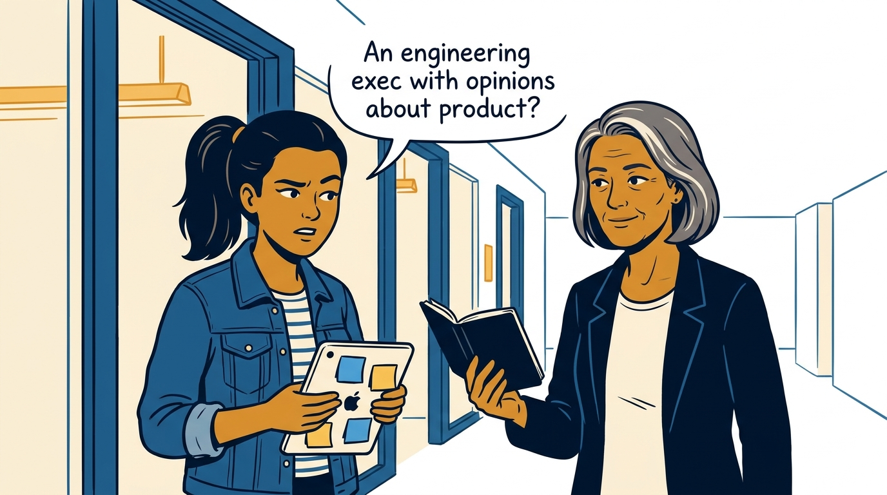
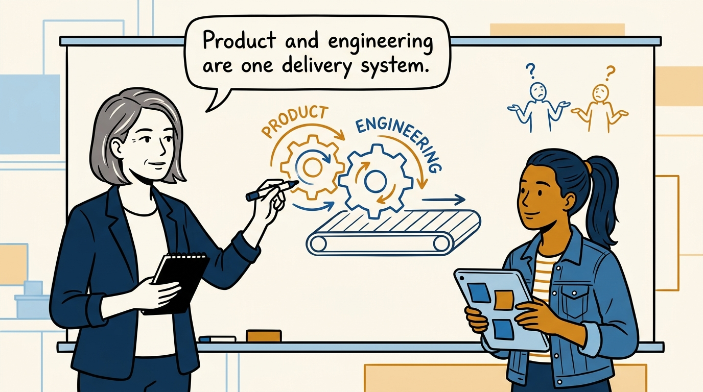
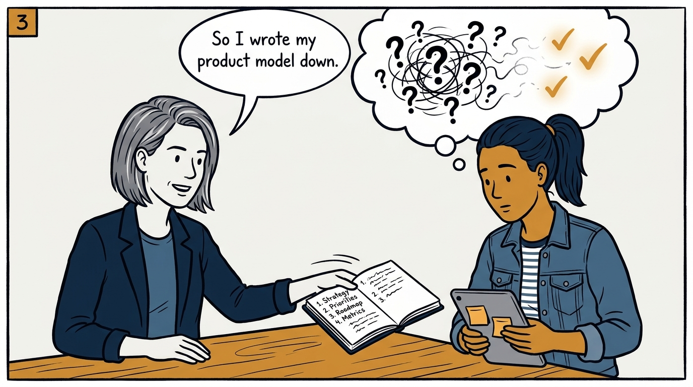
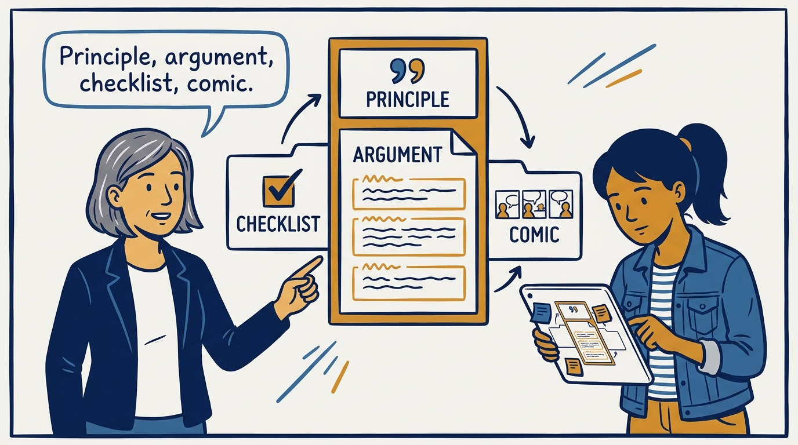
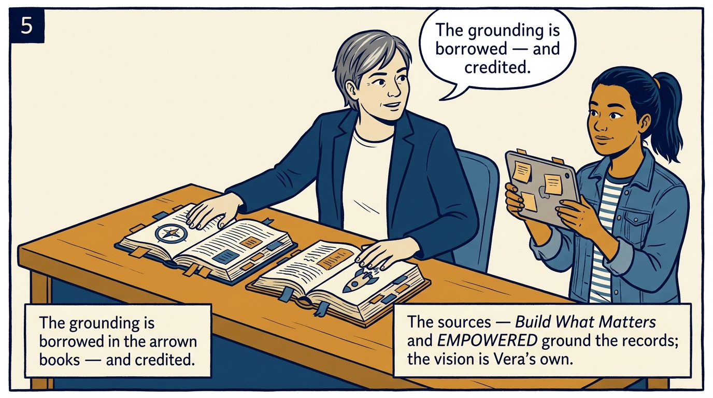
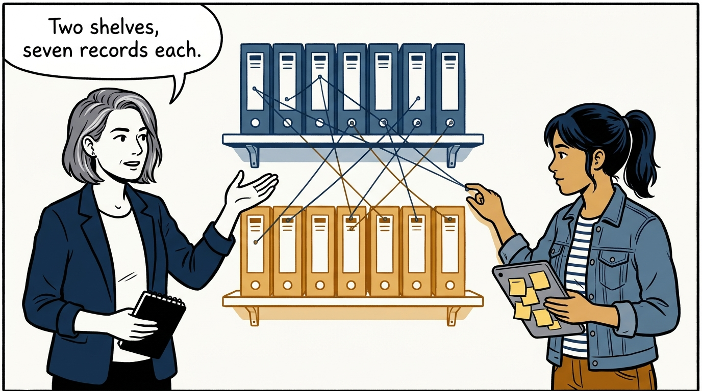
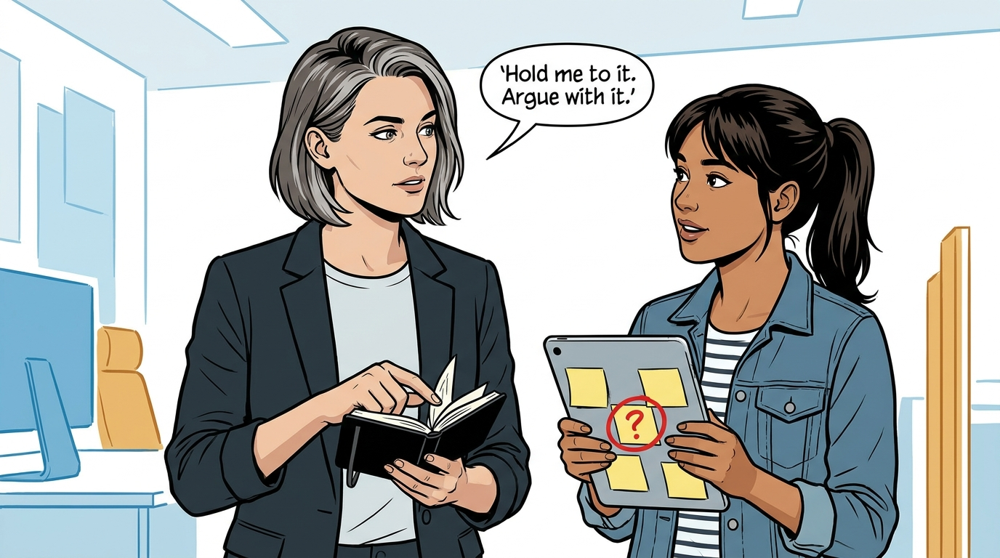
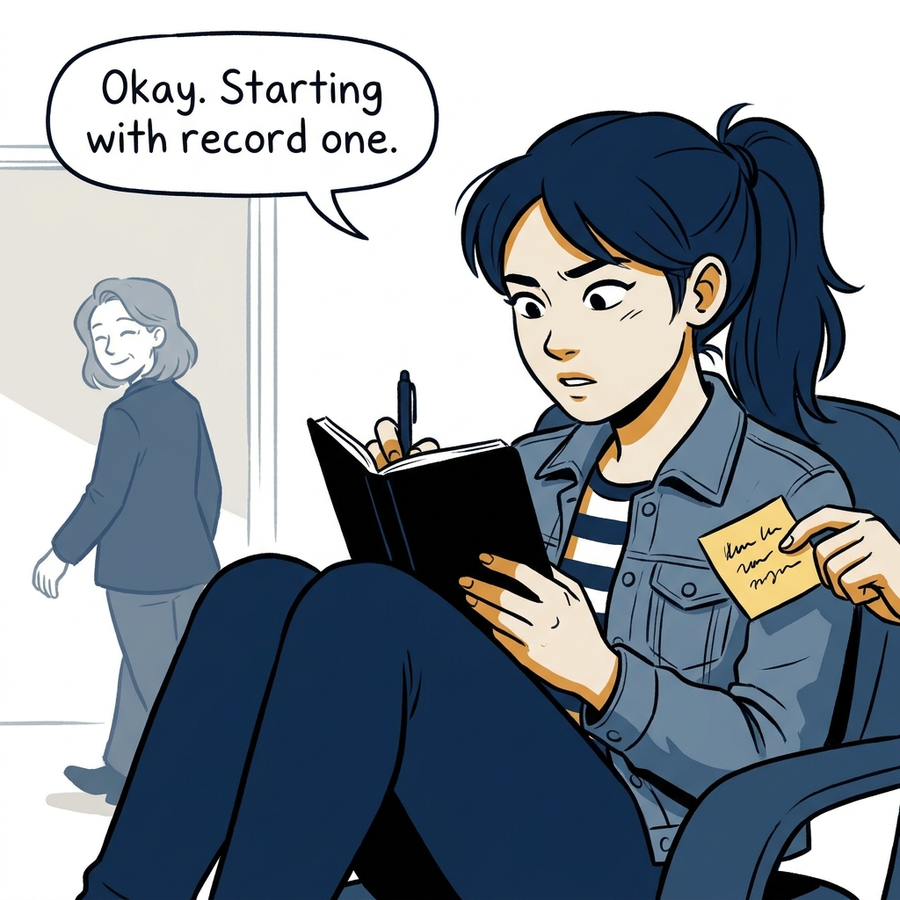

An engineering executive writes down what she believes about product — the front door to the journal, in eight panels.

<!-- comic-style
{
  "cast": "VERA: a calm, seasoned product-minded executive, short gray-streaked hair, dark blazer over a plain t-shirt, carries a small black notebook. MILA: an energetic young product manager, dark hair in a ponytail, denim jacket over a striped shirt, carries a tablet covered in sticky notes.",
  "style": "Clean two-tone explainer comic, thick ink outlines, flat colors with deep blue and amber accents on a light background, generous white space, hand-lettered speech bubbles with SHORT readable text, no photorealism."
}
-->

**Panel 1:** *Panel 1: The hook: an engineering executive with written opinions about product.*

**Panel 2:** *Panel 2: The why: one delivery system — and two halves that too often guess at each other.*

**Panel 3:** *Panel 3: The move: the product operating model, written down instead of guessed at.*

**Panel 4:** *Panel 4: The anatomy tour: every record ships a principle, an argument, a Checklist tab, and a Comic tab.*

**Panel 5:** *Panel 5: The sources: two books on the desk — borrowed grounding, openly credited, the commitment her own.*

**Panel 6:** *Panel 6: The map: two shelves of seven — one system described from two altitudes.*

**Panel 7:** *Panel 7: The contract: hold me to it — and arguing with it is a legitimate use.*

**Panel 8:** *Panel 8: The closer: the skeptic starts reading.*
