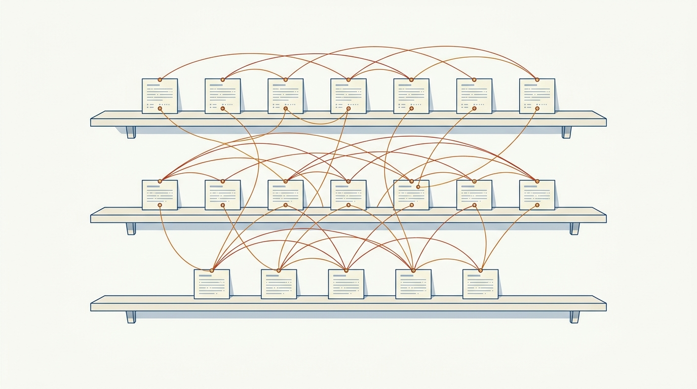

> **KEY POINTS:**
>
> * **This journal is my product operating model, written down** — 19 records describing how I believe product management should work: vision-led and outcome-driven in its direction, empowered and team-shaped in its execution, run day to day on lanes, routines, and tempo — grounded in *Build What Matters*, *EMPOWERED*, and John Cutler's operating takes.
> * **Every record has the same anatomy** — a quotable principle up front, an argued body behind it, a working checklist in the **Checklist** tab, and an explainer comic in the **Comic** tab for the two-minute version.
> * **Read it as a contract, not a book report** — the principle tells you what to expect from me at the product–engineering boundary; every record is a draft that gets revisited against practice, and discrepancies are legitimate things to raise with me.

 

If you work with me — as my CEO, as a product leader, or on a product team — you should not have to guess what I believe about product management. This journal writes it down: how a product vision gets built, how strategy connects vision to roadmap, how outcomes replace output, how product teams get staffed, coached, shaped, and pointed at problems rather than features — and how the whole model runs day to day, in lanes, routines, and tempo. Nineteen records, each one an operating principle I am prepared to be held to, each grounded in a chapter of one of two books I keep returning to or in a practitioner essay that says the quiet part out loud.

## Why an Engineering Executive Writes a Product Journal

Because product and engineering are not two functions that hand work to each other — they are one delivery system with two specializations. Every consequential engineering decision I make leans on a product assumption: what we staff, what we platform, what we make fast, what we let stay slow. An engineering executive who cannot articulate how product decisions *should* be made cannot do three parts of the job well: partner with a head of product as a peer rather than a supplier, staff the product–engineering boundary deliberately, or arbitrate a roadmap conflict on anything better than volume.

**Figure 1:** *One delivery system, two specializations — and the journal as the written contract both halves can inspect.*

There is a second reason, inherited from this journal's sibling. My [engineering-executive journal](../grounded-engineering-executive/introduction.html) is built on the idea that a written operating model is inspectable — [[inspected-trust]] commits me to verifying my organization's work and making my own work inspectable in return. This journal extends that commitment across the boundary. What I expect from product management is no longer something to reverse-engineer from my questions in roadmap reviews; it is public, argued, and concrete enough to check me against. When my behavior and these pages disagree, one of them is wrong, and finding out which is a conversation I want.

## What a Record Looks Like

Every record follows the same shape, so you always know where to look:

| Part | What it gives you |
| --- | --- |
| **Status / Principle** blockquote | The whole principle in one quotable paragraph — read only this and you have the direction. |
| **Statement → Rationale → Anti-Patterns** | The ADR-shaped body: what I commit to, why, what it does *not* say, and the failure modes it guards against. |
| **Checklist** tab | The operational working checklist — grouped, checkable actions. The article is the argument; this is the part that gets run. |
| **Comic** tab | An eight-panel explainer with a recurring cast — the two-minute version, built to be shared. |
| **View spec** link | The authoring contract behind the post — intent, success criteria, and a decision log, versioned like everything else. |

Every record carries `status: draft`, deliberately. These principles are written from conviction and reading ahead of being fully tested against my own practice at this scope, and each record names the conditions under which I will revisit it.

## Where the Material Comes From

The vision is mine; the grounding is borrowed openly, and credited per record. Seven records start from chapter checklists of Ben Foster and Rajesh Nerlikar's *Build What Matters* (Lioncrest Publishing, 2020) — the vision-led operating loop: name the dysfunctions, envision the customer journey, derive strategy, define outcomes, balance the roadmap, and build the team and processes to run it. The other seven start from Marty Cagan and Chris Jones's *EMPOWERED* (Wiley, 2020) — what product leadership owes empowered teams: coaching, staffing, vision and principles, strategy as focus and insight, topology, objectives, and collaboration with the business. The remaining five records start from a different kind of source: John Cutler's "20 Unfiltered Operating Takes" (*The Beautiful Mess*, TBM 435) — a practitioner essay rather than a book, distilled into the operating layer the books mostly leave implicit: lanes, tempo, routines, shapes of work, and the habits behind goals and questions. The sources describe what strong product organizations do; these records state what *I* will do, in first person, with the trade-offs I accept. Where my practice disagrees with a source, the record says so.

**Figure 2:** *Three sources, one operating model — Foster & Nerlikar for the vision-led loop, Cagan & Jones for empowered teams, Cutler for the day-to-day operating layer, the signature mine.*

## The Map

The three sections mirror the three sources:

- **Build What Matters** — from diagnosis to machinery: [[dysfunctions]], [[customer-journey-vision]], [[product-strategy]], [[outcomes]], [[balanced-roadmap]], [[right-team]], [[right-processes]].
- **EMPOWERED** — leadership's side of the bargain: [[coaching]], [[staffing]], [[product-vision-and-principles]], [[empowered-product-strategy]], [[team-topology]], [[team-objectives]], [[business-collaboration]].
- **Operating Takes** — how the model runs day to day: [[lanes]], [[working-small]], [[routines]], [[shapes-of-work]], [[goals-and-questions]].

The sections cross-link constantly, because the sources describe the same system from different altitudes: the vision that [[customer-journey-vision]] builds is the one [[product-vision-and-principles]] asks leaders to evangelize; the outcomes in [[outcomes]] are what [[team-objectives]] hands to teams and what the causal models in [[goals-and-questions]] make workable; the lanes in [[lanes]] are where the strategy of both books meets the week. Follow the links rather than the section order if a thread pulls you.

**Figure 3:** *The map — three sections cross-linked into one model rather than three reading lists.*

## How to Read This Journal

- **If you are my CEO or a peer executive** — read the Status/Principle blockquotes across all three sections; that is the whole model in twenty minutes, and it tells you what to expect from me whenever product direction is on the table. [[outcomes]] and [[business-collaboration]] are the two that most shape how I show up in your meetings.
- **If you are a product manager working with me** — start with [[team-objectives]] and [[balanced-roadmap]]; they describe the operating rhythm you will actually experience, and the *How to Read This* section of each record is addressed to you.
- **If you are an engineering leader building your own model** — take the checklists; they are the transferable part. The principles are deliberately personal, and disagreeing with them is a fine way to find your own.
- **If you have two minutes** — open any record's Comic tab.

## Status and Revisiting

This journal is a living document. Records move from `draft` to `accepted` as practice tests them, each on the revisiting conditions it declares for itself — and this introduction gets updated whenever the journal's shape changes.

## Authoritative References

- Ben Foster and Rajesh Nerlikar, *Build What Matters: Delivering Key Outcomes with Vision-Led Product Management* (Lioncrest Publishing, 2020) — grounds the seven Build What Matters records.
- Marty Cagan with Chris Jones, *EMPOWERED: Ordinary People, Extraordinary Products* (Wiley, 2020) — grounds the seven EMPOWERED records.
- John Cutler, "TBM 435: 20 Unfiltered Operating Takes", *The Beautiful Mess*, August 2026 — grounds the five Operating Takes records.
