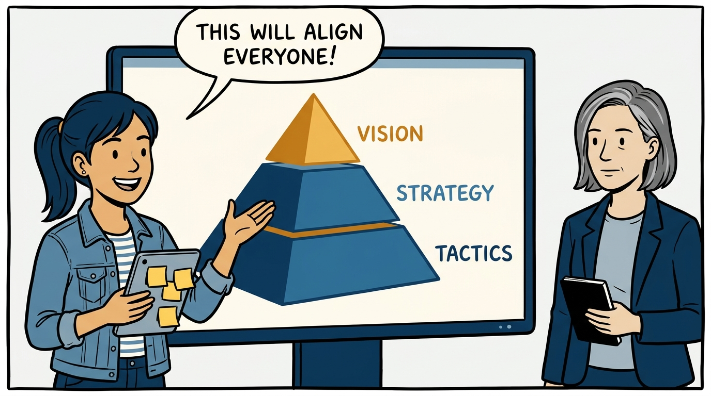
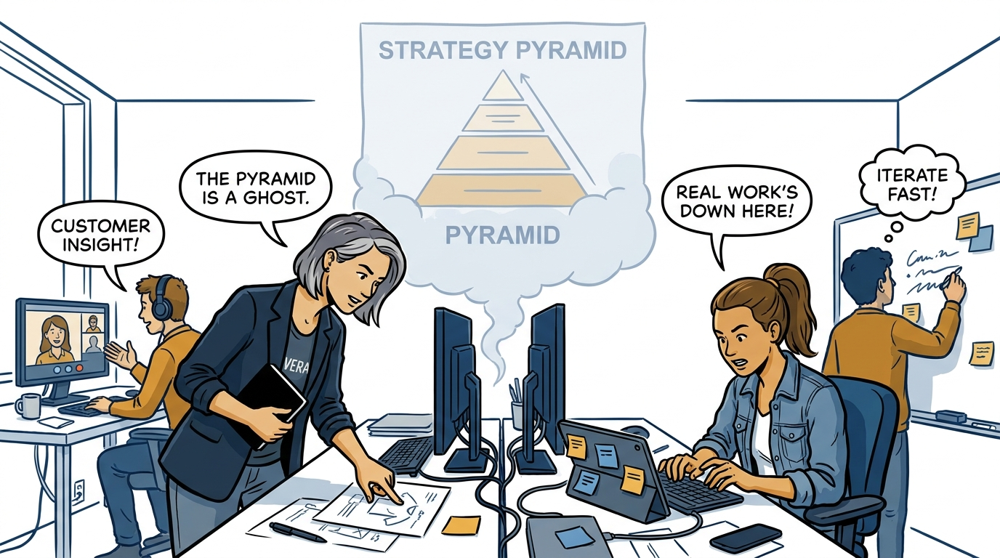
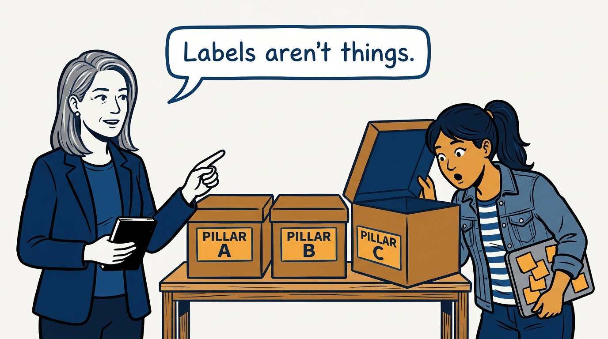
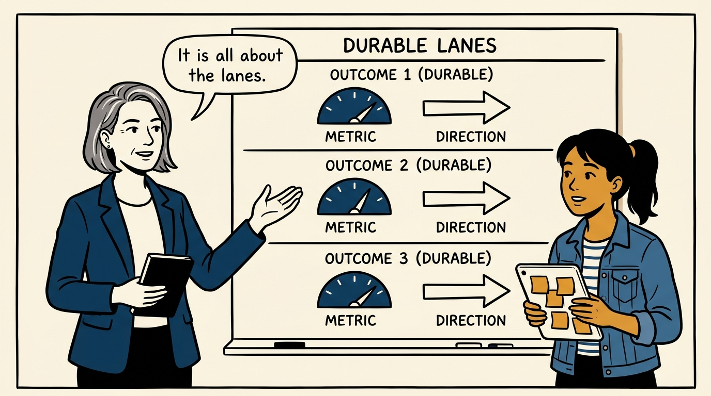
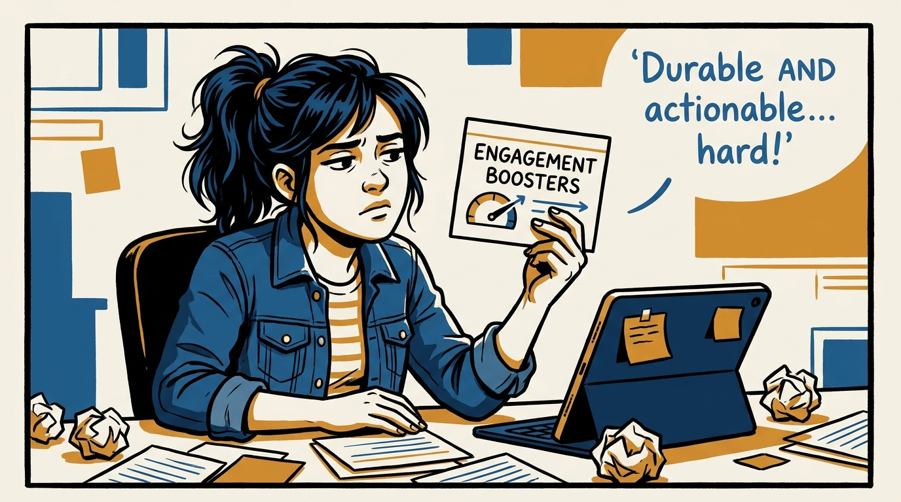
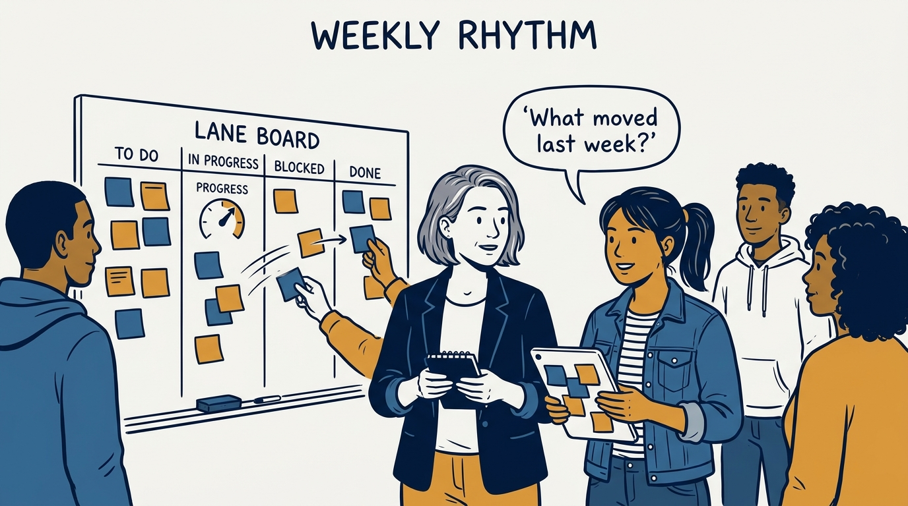
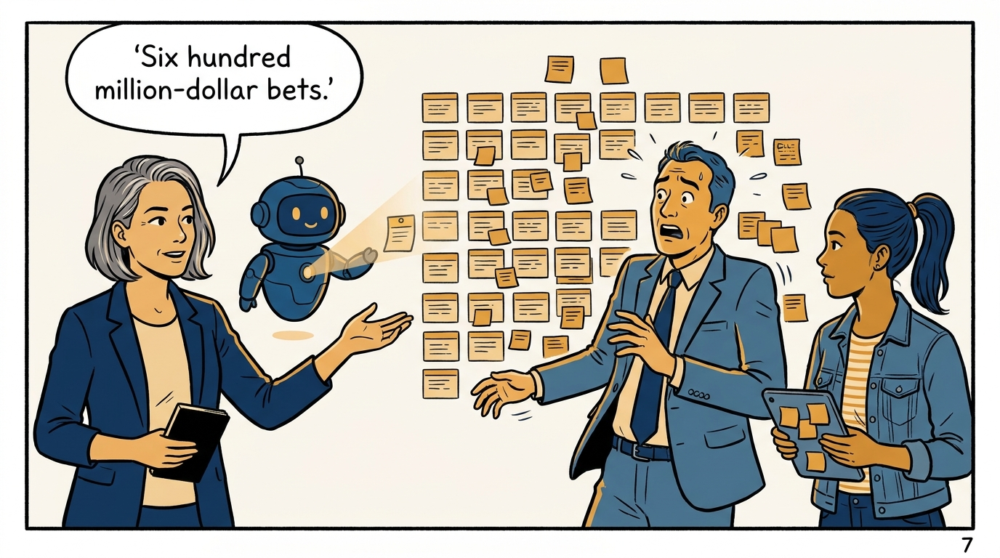
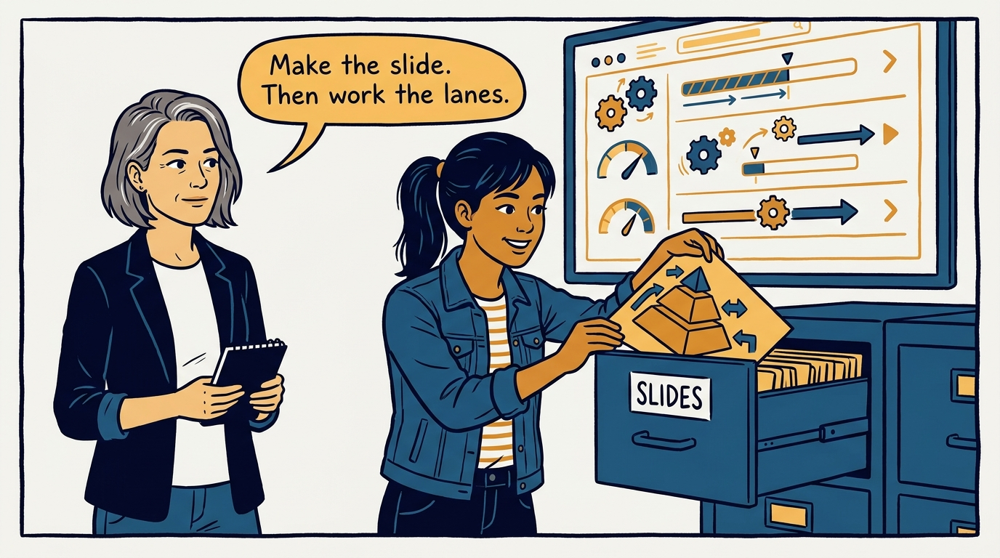

Lanes over pyramids — where the work actually happens, in eight panels.

<!-- comic-style
{
  "cast": "VERA: a calm, seasoned product-minded executive, short gray-streaked hair, dark blazer over a plain t-shirt, carries a small black notebook. MILA: an energetic young product manager, dark hair in a ponytail, denim jacket over a striped shirt, carries a tablet covered in sticky notes.",
  "style": "Clean two-tone explainer comic, thick ink outlines, flat colors with deep blue and amber accents on a light background, generous white space, hand-lettered speech bubbles with SHORT readable text, no photorealism."
}
-->

**Panel 1:** *The hook: one pyramid to align them all.*

**Panel 2:** *The problem: the work happens in exactly one place — and it isn't the slide.*

**Panel 3:** *The trap: people start imagining the labels are real.*

**Panel 4:** *The principle: a few durable, outcome-oriented lanes per team.*

**Panel 5:** *The craft: durable but revisitable, outcome-oriented but actionable — that balance is the work.*

**Panel 6:** *The rhythm: what happened, what's next, what's working — every week.*

**Panel 7:** *The scale test: your lanes are costing you millions — so read them, with help.*

**Panel 8:** *The closer: the pyramid gets a drawer; the lanes get the week.*
