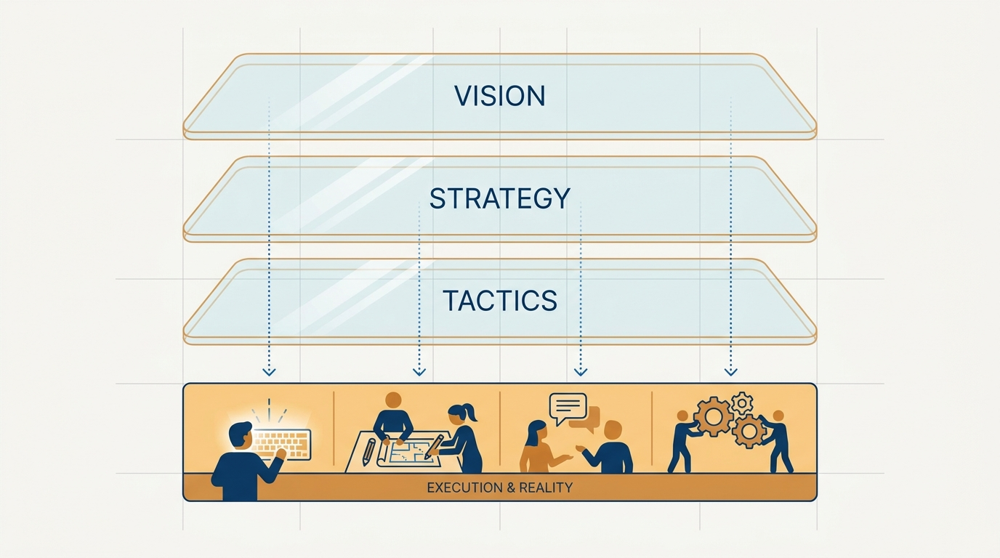
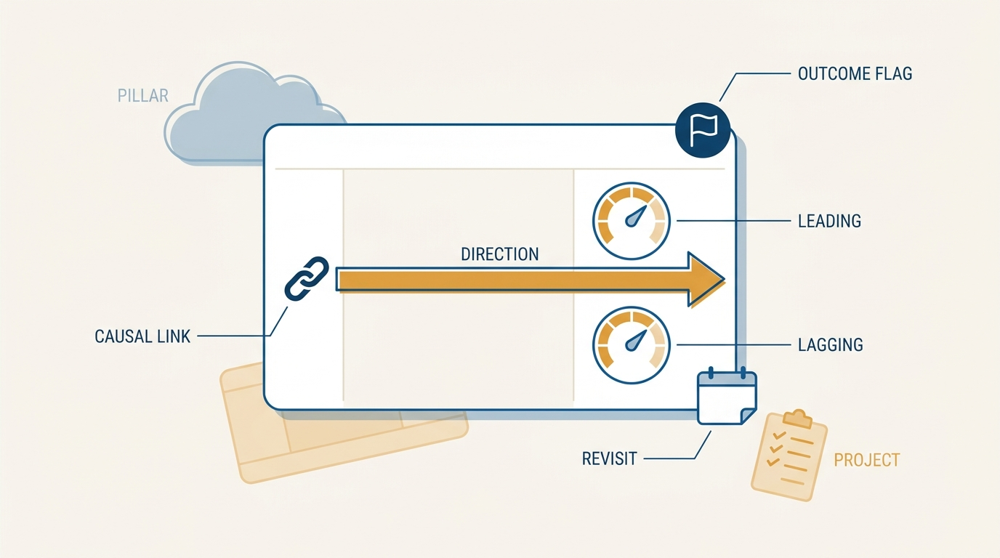
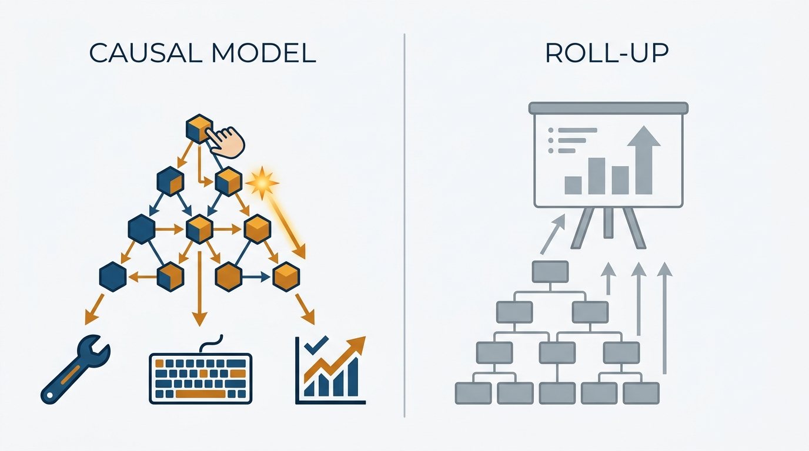

> **Status**: DRAFT
>
> **Principle**: I operate strategy at the lane level. Each team carries a handful of durable, outcome-oriented lanes — a couple of metrics and a directional sense of the opportunity — and cranks on them week after week, revisiting them on a rhythm and pivoting when they stop making sense. Vision-to-tactics pyramids and label taxonomies are reporting views: fine as a slide to leave leaders feeling aligned, then set aside. The work happens in exactly one place — the front-line team — and the lanes are where I go to pressure-test it.

## Statement

My operating model for lanes has five parts:

- **The lane is the unit of strategy.** A lane is a durable, outcome-oriented swimlane of work — not a kanban column, not a value stream, not a project. "For the next couple of months or quarters we keep these few things stable, measure them, let them guide the way — and when they stop making sense, we change them."
- **A few per team, with metrics.** Each team carries a small number of lanes, each with a couple of metrics and a directional sense of the opportunity. That, plus a weekly rhythm of *what happened, what's next, what's working*, is what a humming team actually looks like.
- **Pyramids are reporting views.** Vision-to-strategy-to-tactics trees, strategic pillars, and label taxonomies are roll-up mechanisms. I will make the slide when leaders need it — and then put it aside, because nobody does work inside a pyramid.
- **Writing a good lane is the hard part.** Durable but revisitable, outcome-oriented but actionable, specific enough to guide work, not so bucket-ish it guides nothing. Getting that balance right *is* strategy work.
- **At scale, admit the count.** A 150-team company has 450–600 lanes. I refuse the reflex to "simplify" that away; instead I use routines, rituals, and AI-assisted review to stay accountable to the lanes themselves.

## How to Read This

This record opens the first section of this journal grounded not in a book but in a practitioner essay: John Cutler's "20 Unfiltered Operating Takes" (TBM 435), read through the same practitioner-executive lens as the rest of the journal. It answers the question I get whenever a new planning season starts: *"Should we build the vision-to-tactics pyramid first?"* My answer — no, write the lanes — is this record. The working checklist, derived from the essay rather than reproduced from a source PDF, lives in the **Checklist** tab.

## Rationale

**There is only one place the work happens.** Problem solving, creativity, hands on keyboards, contact with customers — all of it happens at the front-line team level. It may have arrived there through layers of the organization, but it does not happen *in* those layers. Real strategy is messy, non-hierarchical, spans days or years, and does not fit neat boxes. Any artifact that suggests otherwise is describing the org chart, not the work.

**Figure 1:** *The layers are reporting views; the work happens in exactly one place — the front line.*

**Labels become imagined things.** There is nothing wrong with a label taxonomy — until people start believing the labels are real. Most roll-up buckets exist for two purposes: deckware, and a false sense of organizational symmetry. The moment a "pillar" starts absorbing prioritization decisions that should be made against a lane's metrics, the taxonomy has gone from reporting view to counterfeit strategy. The honest version of visibility is simpler: if someone owns something and people are working toward it, make that clear — ownership on an artifact should mean hands on the work, not a name on a slide.

**The North Star Framework taught me this — by not surviving contact.** I treat NSF as a teaching tool, not an installable practice. What it teaches is durable: leading versus lagging metrics, actionable inputs, building and testing causal models, avoiding vanity metrics, crystallizing a strategy that is *yours* rather than a standard game. The follow-up evidence is consistent: teams that adapted the ideas ("we have multiple KPIs, leading and lagging, some things aren't worked out") got value; teams that installed it as a framework hit the edge cases and stalled. The lasting artifact of NSF is the discipline of tweaking actionable inputs until they hold together and still guide action — which is exactly the craft of writing a lane.

**Good lanes are hard, and the difficulty is the point.** It is far easier to write hand-wavy strategic pillars, generic buckets that all work "falls into," or a list of discrete little projects. A real lane has to balance durability, outcome-orientation, actionability, customer impact, and a causal model — all at once, in language a team can actually work with. When a team struggles to write its lanes, that struggle is the strategy conversation, and I want it happening at the team, not abstracted into a planning deck.

**Figure 2:** *The anatomy of a lane — outcome-oriented, measured, directional, causally argued, and dated for revisiting.*

**At scale, the honest number wins.** A 150-team company carries 450–600 lanes once you count honestly — a few per team, plus lanes of their own for the big bets that cross teams rather than smearing those across everyone's. The leader's objection writes itself: "There is no way I can discuss 600 things." But each stable lane represents high-six-figure to seven-figure annual investment. Refusing to engage with them at lane resolution means refusing to pressure-test million-dollar bets — and no roll-up review I have seen pressure-tests anything; it admires aggregates. So I admit the count, keep the taxonomy only for rolling things up, and build the accountability machinery — recurring lane reviews, rituals, and AI tooling that can hold 600 lanes even when no single human can.

**This does not contradict my outcome pyramids — it disciplines them.** [[outcomes]] commits me to outcome pyramids: a key outcome broken into drivers and leading/lagging indicators. That pyramid is a *causal model* — it tells a team what to improve next, and every layer is checkable against reality. The pyramids this record rejects are *roll-up* pyramids: org-chart-shaped trees of labels whose only function is aggregation. The test is simple: if removing a node changes what some team does next week, it is a causal model; if it only changes a slide, it is deckware.

**Figure 3:** *The removal test: touch a node in a causal model and next week's work changes; touch a roll-up and only the slide changes.*

## What This Means in Practice

| What this principle says | What it does **not** say |
| --- | --- |
| Strategy is operated and reviewed at the lane level. | Leaders read 600 lanes every week unaided — routines and AI carry the volume. |
| Pyramids and pillar slides are made when useful, then set aside. | Alignment artifacts are forbidden. |
| Lanes stay stable for months or quarters. | Lanes are eternal — when one stops making sense, we pivot it. |
| NSF ideas — actionable inputs, causal models — shape every lane. | We install the North Star Framework as our operating system. |
| Big cross-team efforts get lanes of their own. | Every lane maps one-to-one onto one team. |

## Anti-Patterns

- **The deckware pyramid.** A vision-to-tactics tree built to "align everyone," admired in one meeting, wrong within a quarter, never consulted by anyone doing work.
- **Pillars as strategy.** Hand-wavy strategic pillars that every conceivable initiative fits under — which is precisely why they guide nothing.
- **The roll-up review.** "We'll pressure-test the work when we roll it up." No one ever has. Aggregates are admired, not tested.
- **Kanban-lane confusion.** Treating workflow columns or a long project as "the lanes." Lanes are outcome-oriented directions, not process stages.
- **Lane churn.** Rewriting the lanes every sprint. A lane that changes weekly is a task list with ambitions.
- **The eternal lane.** A lane kept alive because it is on the slide, long after its metrics went quiet and its opportunity closed.

## Related Records

- [[outcomes]] — the outcome pair and metrics discipline each lane's metrics inherit; the causal-model pyramid this record defends while rejecting roll-up pyramids.
- [[product-strategy]] and [[empowered-product-strategy]] — where the direction that lanes operationalize comes from; lanes are strategy deployed, not strategy invented.
- [[team-objectives]] — how teams commit to outcomes within their lanes.
- [[balanced-roadmap]] — the roadmap view that coexists with lanes without replacing them.
- [[working-small]] — the tempo at which a team cranks on its lanes.
- [[routines]] — the weekly heartbeat that lane reviews live inside.

## Scope and Revisiting

This principle governs how ongoing product work is structured and reviewed between the vision (above) and the sprint (below). I revisit it if lane reviews at scale prove impossible even with AI assistance and honest rituals — the fallback would be fewer, larger lanes, not a return to pyramid governance — and whenever I catch myself asking for a roll-up before I have read a single lane.

## Authoritative References

- John Cutler, "TBM 435: 20 Unfiltered Operating Takes", *The Beautiful Mess*, August 2026 — the source essay; this record distills its North Star Framework, Trees/Pyramids, and both Lanes sections.
- John Cutler and Jason Scherschligt, *The North Star Playbook* (Amplitude) — the framework this record repositions as a teaching tool.
