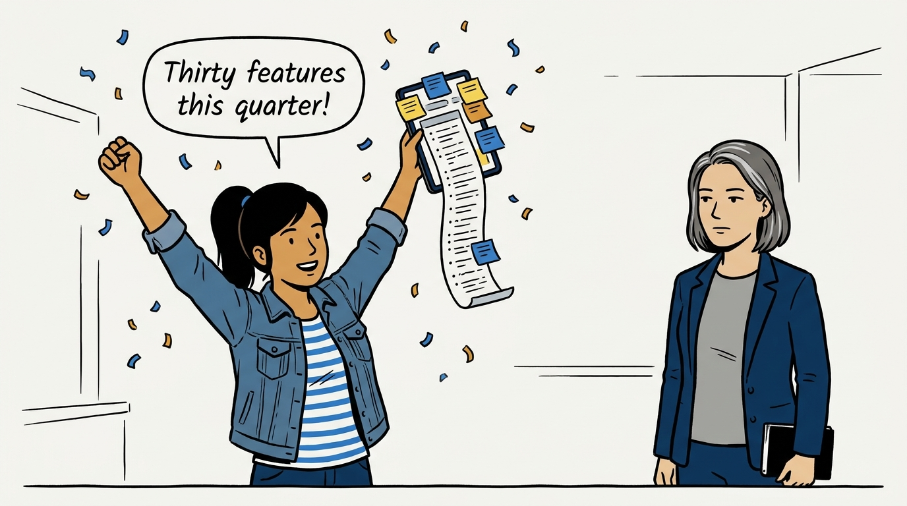
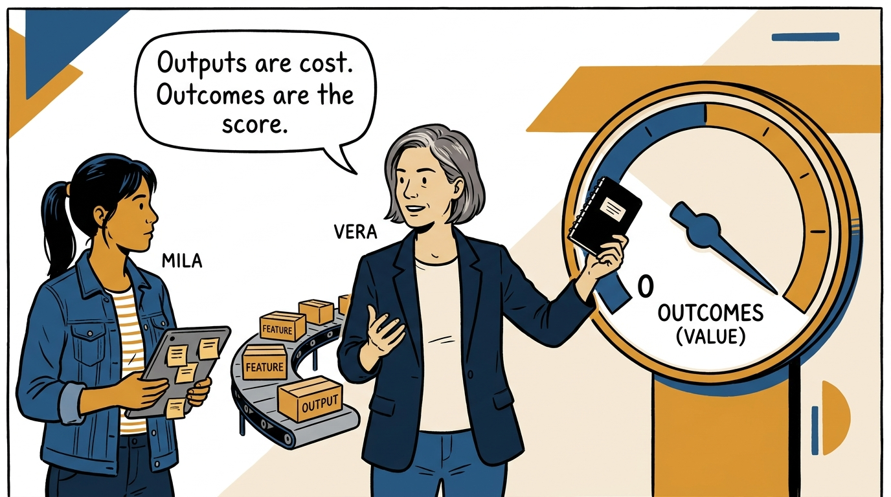
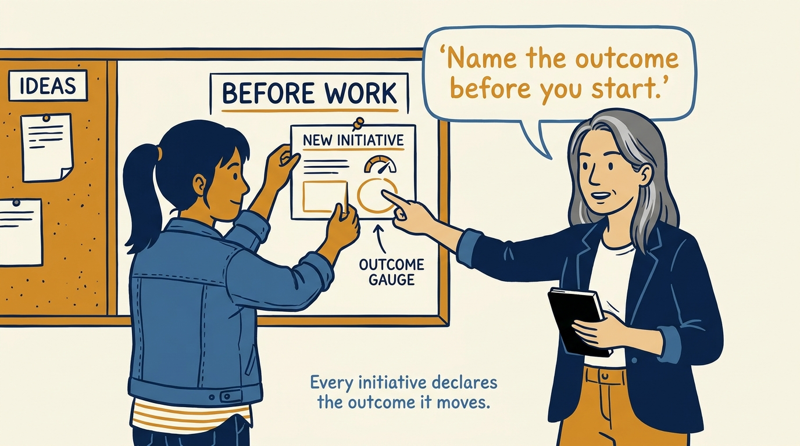
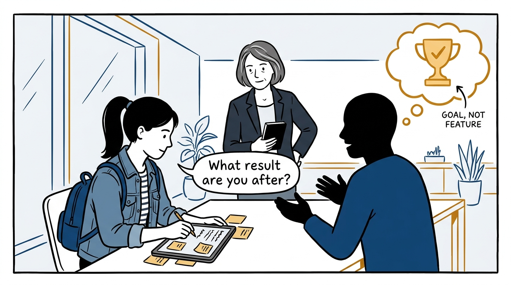
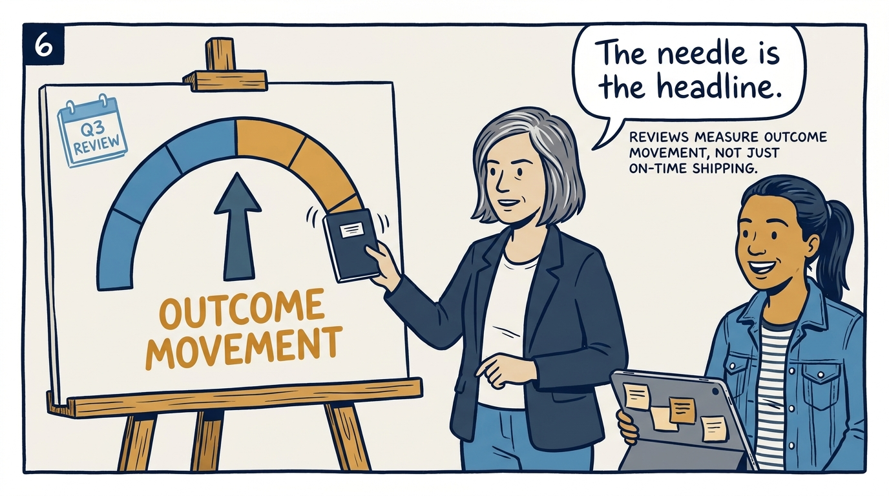
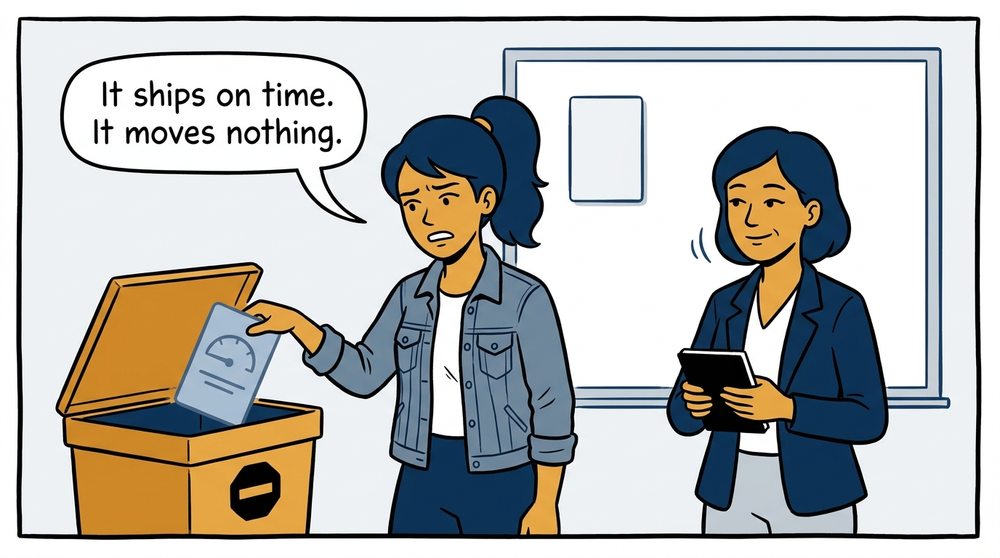
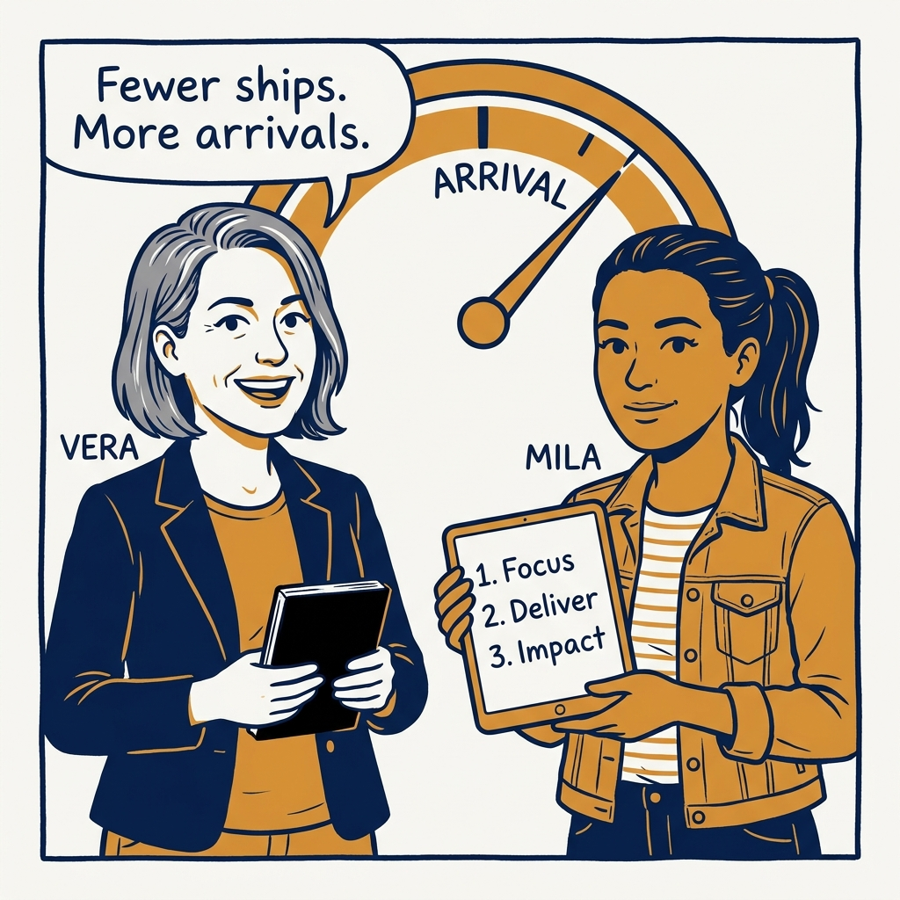

Outcomes over outputs — why the dial matters more than the conveyor, in eight panels.

<!-- comic-style
{
  "cast": "VERA: a calm, seasoned product-minded executive, short gray-streaked hair, dark blazer over a plain t-shirt, carries a small black notebook. MILA: an energetic young product manager, dark hair in a ponytail, denim jacket over a striped shirt, carries a tablet covered in sticky notes.",
  "style": "Clean two-tone explainer comic, thick ink outlines, flat colors with deep blue and amber accents on a light background, generous white space, hand-lettered speech bubbles with SHORT readable text, no photorealism."
}
-->

**Panel 1:** *The hook: a record quarter — measured in features shipped.*

**Panel 2:** *The problem: the customer dashboard hasn't moved an inch.*

**Panel 3:** *The principle: outcomes over outputs.*

**Panel 4:** *The rule: no initiative starts without naming its outcome.*

**Panel 5:** *Validation: the outcome is written in the customer's language.*

**Panel 6:** *The review: measure the needle, not the ship date.*

**Panel 7:** *The hard part: killing the zombie initiative that moves nothing.*

**Panel 8:** *The closer: fewer ships, more arrivals.*
