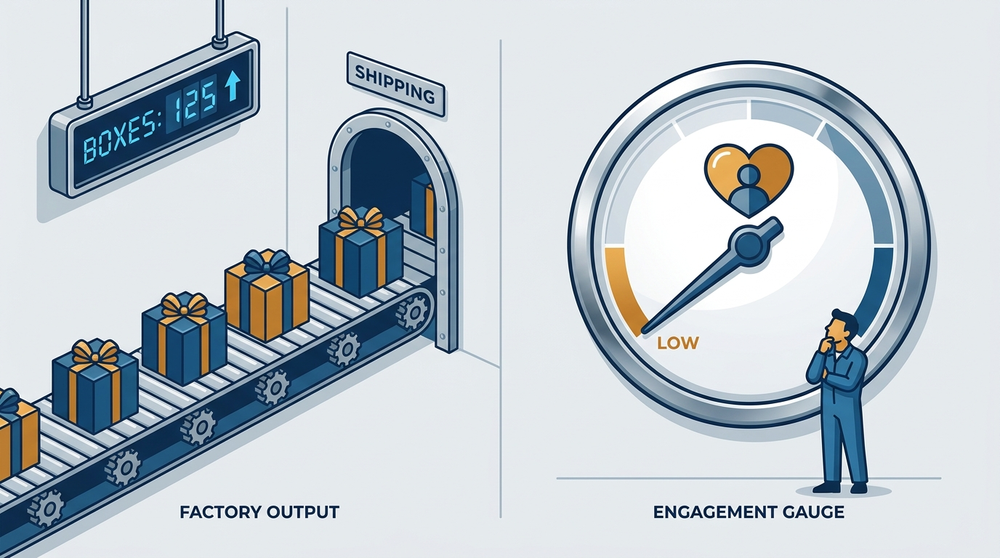
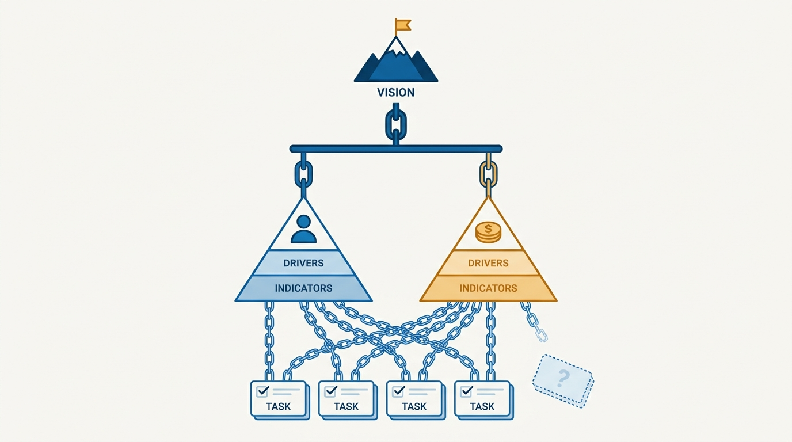
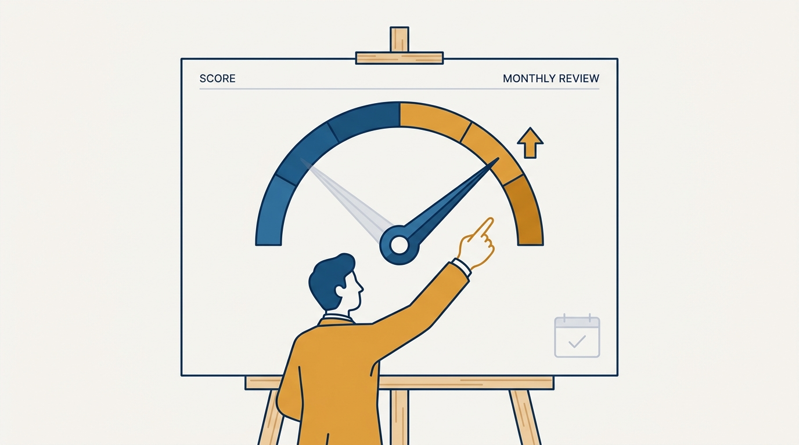

> **Status**: DRAFT
>
> **Principle**: I judge product work by key outcomes — measurable changes in customer and business reality — never by shipped output. Every initiative names, before it starts, the customer outcome and the business outcome it moves, in the customer's own language, with a metric that would still matter if the product changed completely. An initiative that moves no outcome is a cost, however impressive the demo, and I kill it without apology.

## Statement

My operating model for outcomes has five parts:

- **Define the key customer outcome first.** Not the feature customers use, but the result they want — in their language, validated with real customers, durable enough to guide decisions for 2–3 years, specific enough to prioritize with.
- **Pair it with a key business outcome.** Leadership agrees on the one business result we optimize for — revenue growth, retention, margin, expansion — and on where that growth comes from.
- **Choose strong metrics, not vanity metrics.** An outcome metric measures customer value, not company activity. Clicks, views, and raw usage do not count unless they clearly connect to value.
- **Build two outcome pyramids.** Each key outcome sits on top of a pyramid of drivers, leading indicators, and lagging indicators — simple enough that teams use it to decide what to improve next.
- **Judge initiatives by the needle, not the ship date.** Every roadmap item ties to an outcome driver; initiatives that move nothing get stopped.

**Figure 1:** *Outputs are the conveyor; outcomes are the dial. A busy conveyor with an unmoved dial is a cost, not progress.*

## How to Read This

This journal is the **product-management counterpart** to my engineering-executive journal: the same first-person operating-principle format, applied to product management. This record is grounded in Ben Foster and Rajesh Nerlikar's *Build What Matters*, read through a practitioner-executive lens rather than summarized as a book report. If you run a product area in my organization, it explains why the first question I ask about any initiative is "which outcome does this move, and how will we know?" The working checklist — all twelve sections — lives in the **Checklist** tab of this post.

## Rationale

**Features are the how; outcomes are the why.** Customers do not want the feature — they want the result it produces in their life or work. When I can describe that result in the customer's own language, and customers confirm they would switch, pay, renew, or expand to get it, I have something worth building toward. When I can only describe the feature, I have an activity, not a strategy.

**Vanity metrics are the most expensive lie in product management.** Clicks, views, and raw usage rise for reasons unrelated to customer success — and teams optimizing them will happily harm customers to keep the graph rising. A strong outcome metric measures whether customers are actually more successful, and would still matter even if the product changed completely. If a redesign would invalidate the metric, it was measuring the product, not the customer.

**Customer value and business value are a sequence, not a trade-off.** Customer value creates the *opportunity* for business value; capturing more than we deliver is over-monetization, and it announces itself as churn, complaints, and declining trust. So I invest in customer value before capturing revenue, tie pricing to customer ROI, and insist that leadership agree on one primary business outcome — because when every function carries its own definition of success, the roadmap becomes a treaty negotiation instead of a strategy.

**Figure 2:** *Vision → outcome pyramids → initiatives. An initiative that hangs off no outcome is the dotted card: visible, busy, and connected to nothing.*

**Pyramids turn outcomes from posters into decisions.** A key outcome on a slide changes nothing. Broken into major drivers, leading indicators that influence it, and lagging indicators that confirm it, the same outcome tells a team what to improve next — and lets me trace every roadmap item to the metric it claims to move. I build one pyramid per outcome — customer and business — connect them where they reinforce each other, and mark honestly which business metrics product influences directly and which belong to sales, marketing, or customer success. A pyramid nobody can recite is an org chart of numbers.

**Time horizons are where outcome thinking gets tested.** Sales closes this quarter's pipeline; customer success defends this year's renewals; product creates value that shows up in business outcomes over quarters or years. Judging product by short-term revenue movement buys feature trading and no compounding value. Aligning teams around their natural horizons is not letting product off the hook — the outcomes are still measured — it is refusing to grade a long instrument on a short scale.

**Ambition is part of the definition.** I aim for a 10x outcome — a result dramatically better for customers, not a small usability improvement dressed up as strategy — and the team can say in practical terms what "10x better" means and why it creates business value too.

**Figure 3:** *The initiative review: the needle is the headline, the ship date is a footnote.*

## What This Means in Practice

| What this principle says | What it does **not** say |
| --- | --- |
| Every initiative names its outcome before it starts. | No initiative starts until the metrics are perfect. |
| Outcomes are validated with customers, not assumed. | Customers dictate the roadmap item by item. |
| Vanity metrics don't count as outcomes. | Usage data is useless — it can be a driver when it connects to value. |
| Product is judged over quarters and years. | Product is never accountable — the lagging indicators still arrive. |
| Initiatives that move no outcome get stopped. | Every experiment must succeed — a test that disproves a driver moved the pyramid too. |
| Customer value comes before value capture. | Revenue doesn't matter — the business outcome tops its own pyramid. |

Concretely: initiative proposals open with the outcome and the pyramid driver they target, not the feature description. Reviews ask what the needle did, not what the team shipped. Pricing starts from customer ROI. And when the metric shows we are optimizing the wrong thing, changing the priority is the system working, not the plan failing.

## Anti-Patterns

- **The feature factory.** Velocity is high, the release notes are long, and nobody can name the outcome any of it moved.
- **Vanity dashboards.** Clicks, views, and raw usage presented as success while churn quietly climbs — engagement confused with customer value.
- **The internal-assumption outcome.** Chosen in a conference room, never validated with customers, defended because we already built toward it.
- **Metric-product coupling.** A metric that would die with a redesign — proof it measured the product's mechanics, not the customer's success.
- **Over-monetization.** Extracting more value than we deliver, then treating the resulting churn as a marketing problem.
- **Grading product on the sales clock.** Judging product work by this quarter's revenue movement, guaranteeing feature trades and no compounding value.
- **Zombie initiatives.** Work that moves no outcome but survives review after review because it ships on time and demos well.

## Related Records

- [[balanced-roadmap]] — how outcomes, vision, and customer requests share one roadmap; this record supplies the outcomes it balances against.
- [[team-objectives]] — how teams commit to outcome movement; the pyramid drivers become their key results.
- [[dysfunctions]] — the failure modes of product organizations; most trace back to judging work by output.
- [[measuring-engineering-organizations]] — the engineering-side counterpart: measuring the organization by what it changes, not what it produces.

## Scope and Revisiting

This principle governs how I define, validate, and use outcomes to judge product work — roadmap, pricing, and prioritization all trace back to it. I revisit it whenever the key outcomes are re-validated (the 2–3 year durability window is the natural cadence), whenever leadership's definition of success shifts, and whenever I catch an initiative defended by its ship date. The final readiness check in the Checklist tab is the standing test: if any line fails, the framework — not the roadmap — is the first thing to fix.

## Authoritative References

- Ben Foster & Rajesh Nerlikar, *Build What Matters: Delivering Key Outcomes with Vision-Led Product Management* (Lioncrest Publishing, 2020) — the key-outcomes chapters this record's checklist distills.
