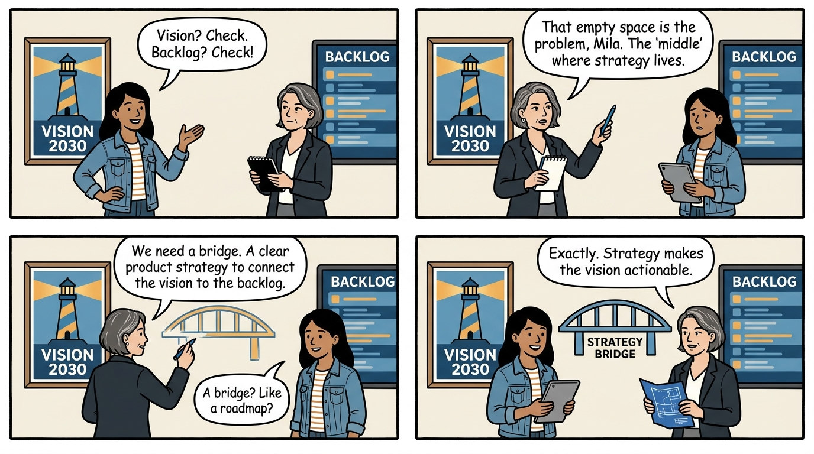
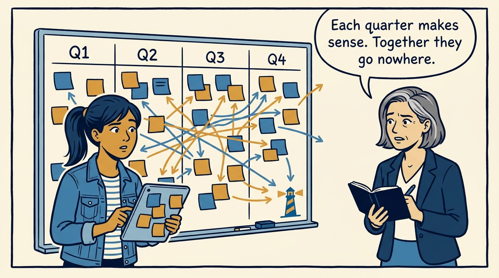
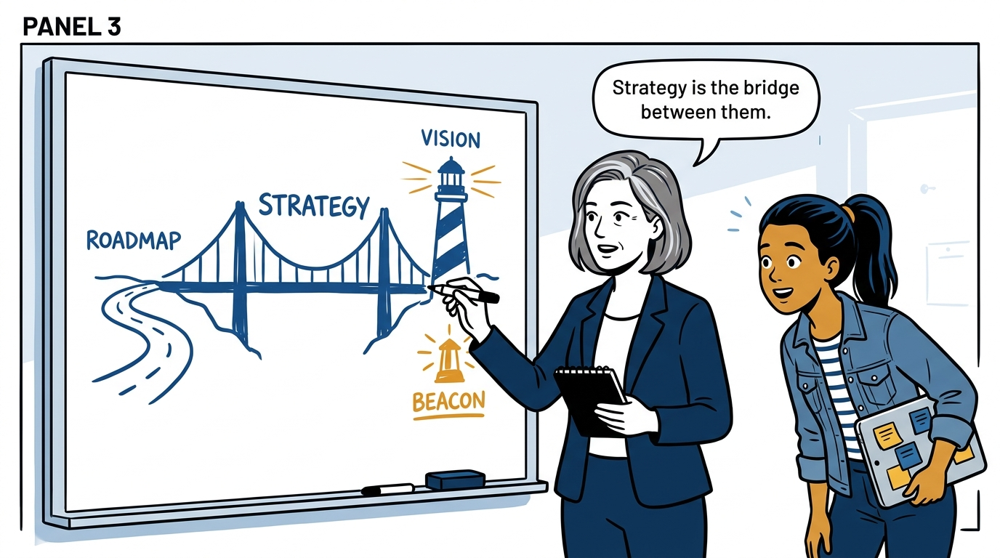
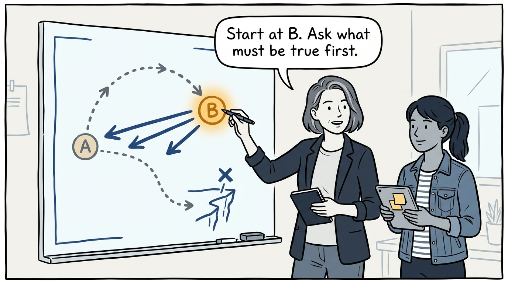
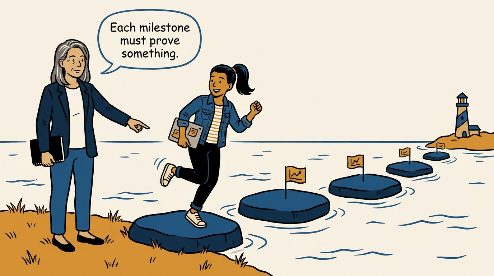
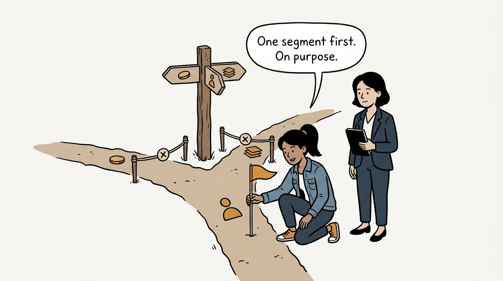
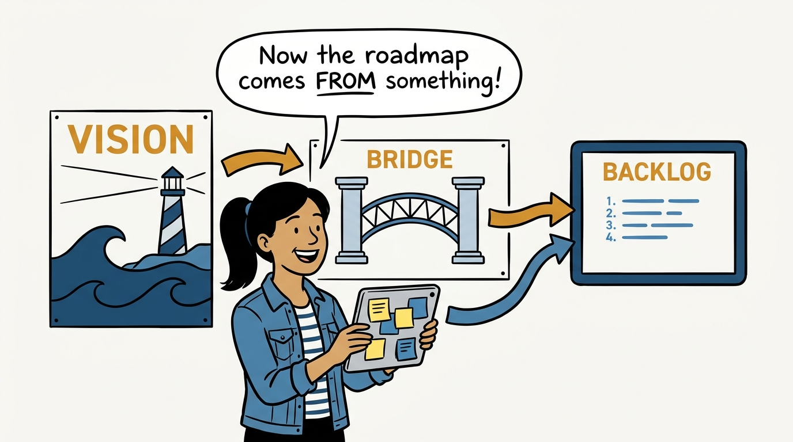
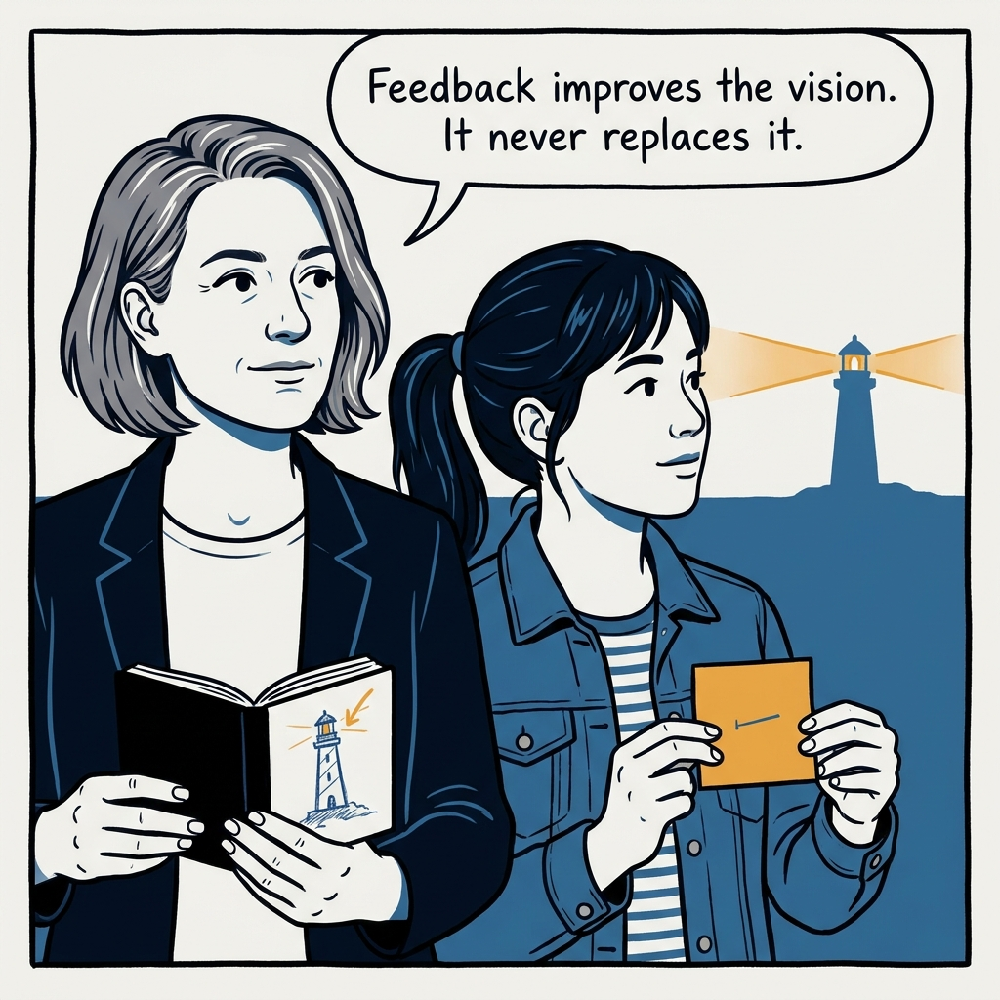

The vision says where, the roadmap says what's next, and strategy is the bridge between them — vision-led product strategy in eight panels.

<!-- comic-style
{
  "cast": "VERA: a calm, seasoned product-minded executive, short gray-streaked hair, dark blazer over a plain t-shirt, carries a small black notebook. MILA: an energetic young product manager, dark hair in a ponytail, denim jacket over a striped shirt, carries a tablet covered in sticky notes.",
  "style": "Clean two-tone explainer comic, thick ink outlines, flat colors with deep blue and amber accents on a light background, generous white space, hand-lettered speech bubbles with SHORT readable text, no photorealism."
}
-->

**Panel 1:** *The hook: a vision on the wall, a backlog in the tool — and nothing in between.*

**Panel 2:** *The problem: every roadmap is defensible, and none of them add up.*

**Panel 3:** *The principle: strategy bridges the vision to the work.*

**Panel 4:** *Phasing the vision: work backward from Point B, name the gaps between today's journey and the ideal one — and find the dead ends before paying for them.*

**Panel 5:** *Milestones are claims, not dates: each phase proves something, with business and customer KPIs.*

**Panel 6:** *Trade-offs are forks: one path deliberately taken, the others consciously declined.*

**Panel 7:** *The payoff: the roadmap derives from the strategy, and the strategy derives from the vision.*

**Panel 8:** *The closer: change the strategy on evidence — feedback improves the vision, it does not replace it.*
