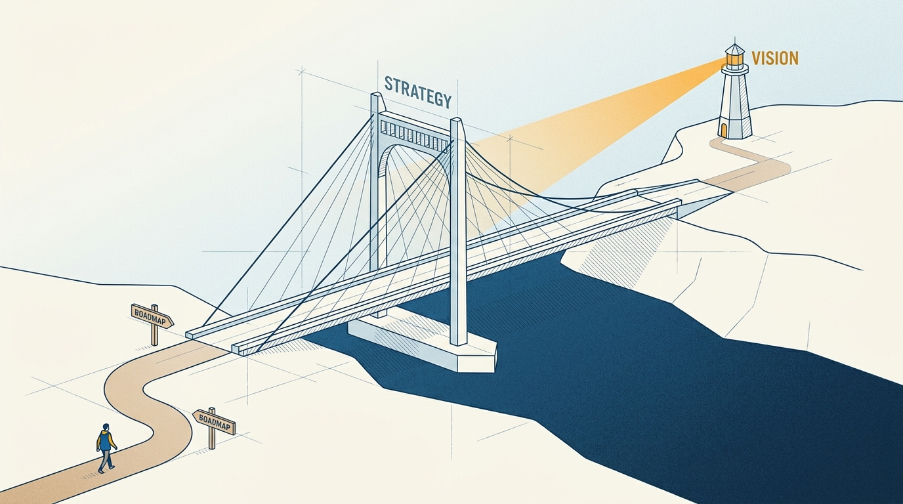
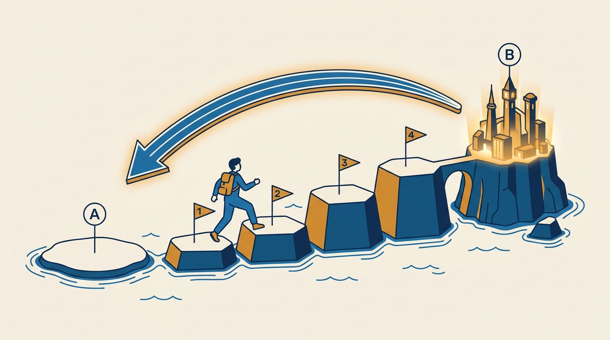
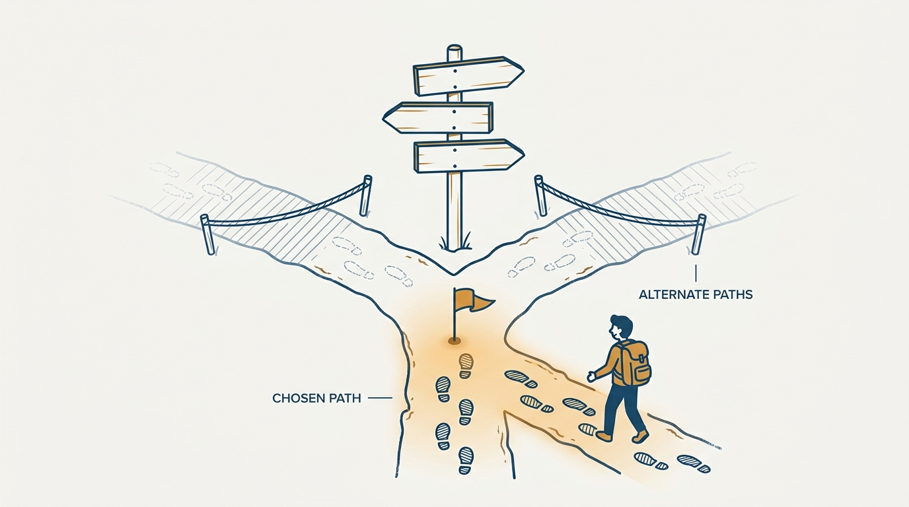

> **Status**: DRAFT
>
> **Principle**: I treat product strategy as the bridge between the vision and the work. The vision says where we are going; the roadmap says what we do next; the strategy is the load-bearing span that connects them. I build it by working backward from Point B — the end-state customer journey — to Point A, today's product: gap analysis between the two, deliberate sequencing under real financial, competitive, and technical constraints, and milestones that each prove something. Feedback improves the vision; it does not replace it.

## Statement

My operating model for product strategy has six parts:

- **Define the destination.** Point A is today's product and customer experience; Point B is the end-state customer journey vision, with the desired customer outcome stated clearly. The strategy serves the journey, not the current product.
- **Work backward from the vision.** From Point B back to today: the major steps, what must be true before each one, and where the dead ends are — before resources are committed. Nothing moves forward just because it is easy to build.
- **Run a gap analysis.** Compare the ideal journey with the current one, name the gaps — capabilities, data, infrastructure, distribution, partnerships, operations, funding — and prioritize the ones that most block the customer from the outcome.
- **Sequence deliberately.** First, second, third, later — accounting for runway, for the proof stakeholders need, and for technical, competitive, financial, and operational dependencies. Favor work that advances the vision *and* supports the business.
- **Mark the path with milestones.** Each milestone proves something specific and carries both business and customer KPIs; each is a natural point to reassess.
- **Adapt on evidence, not on noise.** The strategy changes when the evidence demands it — not on every piece of feedback. Customer input refines the destination; it does not get to choose a new one.

**Figure 1:** *Strategy is the load-bearing span: the vision says where, the roadmap says what's next, and the strategy is what connects them.*

## How to Read This

This journal is the product-management counterpart to my engineering-executive journal: the same first-person operating-principle format, applied to how I believe product management should work. This record is grounded in Ben Foster & Rajesh Nerlikar's *Build What Matters*, read through a practitioner-executive lens — as an executive making phasing and investment decisions legible, not just a PM building a plan. It has a deliberate boundary with [[empowered-product-strategy]]: that sibling covers Marty Cagan's insight-driven strategy — the focus–insight–action frame that ends in team objectives; this one covers the vision-to-roadmap bridge — how the vision gets phased into work. Read them together, not as substitutes. The working checklist — all eight sections — lives in the **Checklist** tab of this post.

## Rationale

**Without a strategy, every roadmap is defensible and none of them add up.** A team with only a vision and a backlog can justify almost any quarter: everything in the backlog plausibly helps. What is missing is the connective reasoning — *why this, before that, for whom, now*. Working backward from Point B supplies it: asking "what must be true before this step can happen?" turns the sequence from a matter of taste into a chain of dependencies, and surfaces the dead ends before resources are spent on them. "Easy to build" is not a strategic argument; it is the absence of one.

**The gap analysis turns the vision from inspiration into a work list.** Comparing the ideal journey with the current one produces a concrete inventory of what is missing — and not all of it is product. Some gaps are capabilities; others are data, infrastructure, distribution, brand, partnerships, operations, or funding. A strategy that only lists features has quietly assumed the rest away. I prioritize the gaps that most block the customer from the outcome — the ordering the vision itself implies.

**Figure 2:** *Phasing the vision: work backward from Point B to find the steps, then cross them forward — one proving milestone at a time.*

**Sequencing is where the strategy meets reality.** The right order is not only a dependency question; it is a survival question. I sequence with the runway in view, with an eye on what proof investors and executives will need next, and with a preference for work that advances the vision and supports the business at once. A strategically pure sequence that runs out of money in phase two was never a strategy.

**Trade-offs are choices, and I make them out loud.** Foster & Nerlikar's strategy factors are the forks in the road, and each deserves a deliberate answer:

- *Financials* — can we fund the next milestone, or do we need traction first?
- *Competitive advantage* — does the MVP combine the must-haves that earn the right to play, the performance features that earn the right to win, and the delighters that drive loyalty?
- *Market segments* — do we start with one segment — a geography, a vertical, a use case — and let its learnings fund the next?
- *Outcome delivery* — phases, single product before platform, each phase building trust with the same customer?
- *Technology and data* — which foundational assets must exist before future features can?
- *Strategic leverage* — which non-product assets — partnerships, patents, brand, data — should shape the strategy?

Unexamined, these questions still get answered — implicitly, by whoever ships first.

**Figure 3:** *Strategy factors are forks: one path deliberately taken, the others consciously declined — never answered by default.*

**Milestones make the strategy falsifiable.** A milestone is not a date; it is a claim — *by this point, we will have proven this*. Each carries business and customer KPIs, defines what must complete before the next phase, and doubles as a scheduled reassessment. That keeps adaptation honest: at each milestone I track accomplishments, summarize learnings, document adjustments — and change the strategy when the evidence says so, not when the loudest feedback does. A strategy that bends to every loud signal has stopped being a strategy at all.

## What This Means in Practice

| What this principle says | What it does **not** say |
| --- | --- |
| The strategy derives from the vision; the roadmap derives from the strategy. | The roadmap is frozen — it adjusts as new information appears, without losing direction. |
| Work backward from Point B to find the sequence. | Never ship anything until the whole path is mapped. |
| Prioritize the gaps that most block the customer outcome. | Every gap is a product gap — data, distribution, and funding gaps count too. |
| Trade-offs (segments, phasing, MVP mix) are explicit choices. | Trade-offs are permanent — milestones exist to revisit them. |
| Milestones prove something and carry business *and* customer KPIs. | Milestones are dates on a timeline. |
| Change the strategy when evidence demands it. | React to every piece of customer feedback literally. |

Concretely: no roadmap review without the strategy on the table, no strategy review without the vision. Sequencing proposals state their dependency reasoning, not just their ordering; milestone proposals name what they prove and which KPIs will show it. And at each milestone I run the final strategy check: does the plan still connect today's product to the vision, does the sequence still explain itself, are the biggest risks visible, and are the teams aligned around the same plan?

## Anti-Patterns

- **The poster and the job queue.** A vision on the wall, a backlog in the tool, nothing connecting them — every quarter plausible, no quarter cumulative.
- **Forward-only planning.** Sequencing by what is adjacent or easy instead of working backward from Point B — and finding the dead end after the resources are spent.
- **The feature-only gap list.** Naming missing capabilities but not the missing data, distribution, partnerships, or funding that actually block the outcome.
- **Trade-offs by default.** Segment, phasing, and MVP-mix questions answered implicitly by whoever ships first, rather than deliberately by the strategy.
- **Milestones as dates.** Phases that end on the calendar instead of on proof, with no business or customer KPI attached.
- **The suggestion-box pivot.** Rewriting the strategy after every loud piece of feedback — feedback replacing the vision instead of improving it.
- **The immovable plan.** The opposite failure: refusing to change the strategy when the evidence at a milestone says it is necessary.

## Related Records

- [[customer-journey-vision]] — the Point B this strategy works backward from.
- [[balanced-roadmap]] — the artifact this strategy feeds; the strategy tells the roadmap what comes next, not the reverse.
- [[empowered-product-strategy]] — the EMPOWERED-grounded sibling: Cagan's insight-driven strategy (focus–insight–action), complementary to this record's vision-to-roadmap bridge.
- [[engineering-strategy]] — the engineering-executive counterpart; this record's technology and data dependencies are where the two strategies meet.

## Scope and Revisiting

This principle governs how I connect a product vision to the work that teams actually do — phasing, sequencing, trade-off choices, and milestone design. I revisit it at every milestone (that is what milestones are for), whenever the vision itself is revised, and whenever I catch a roadmap being defended without a strategy underneath it.

## Authoritative References

- Ben Foster & Rajesh Nerlikar, *Build What Matters: Delivering Key Outcomes with Vision-Led Product Management* (Lioncrest Publishing, 2020) — the product-strategy chapter this record's checklist distills.
