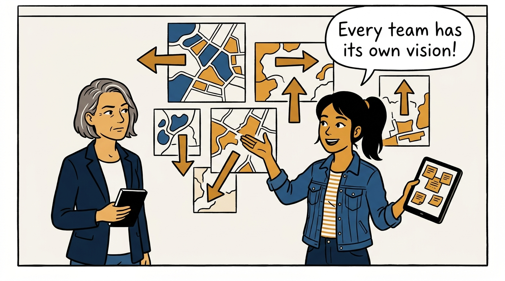
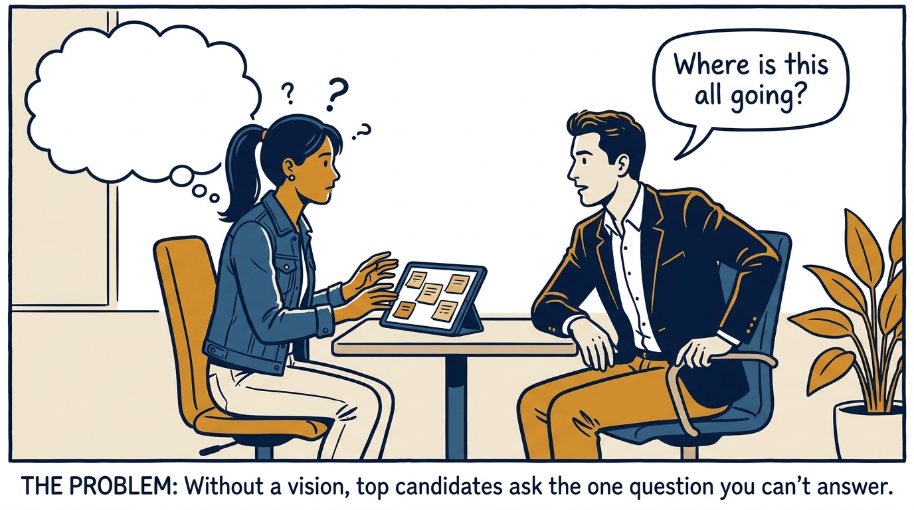
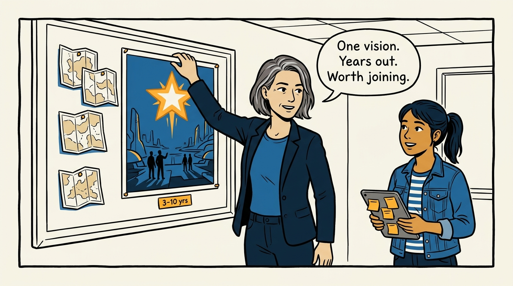
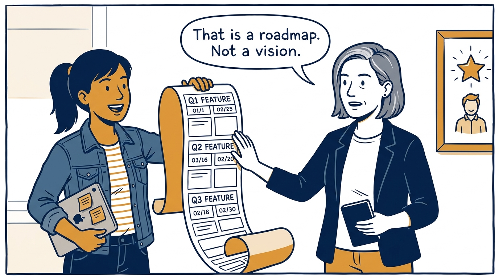
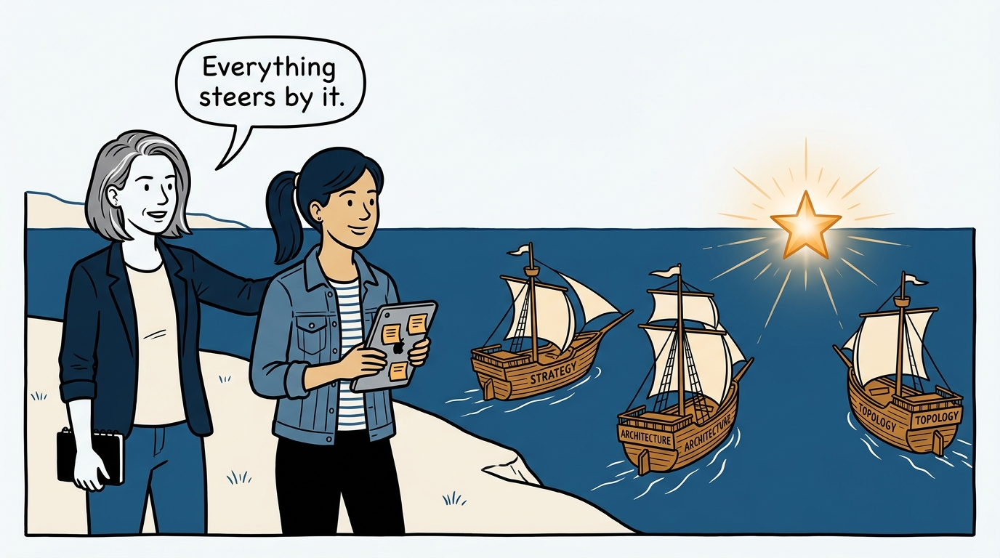
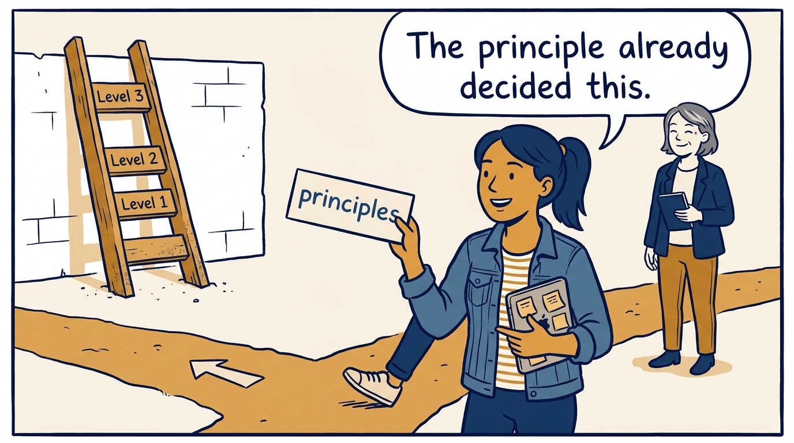
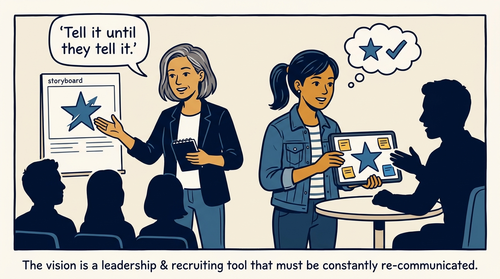
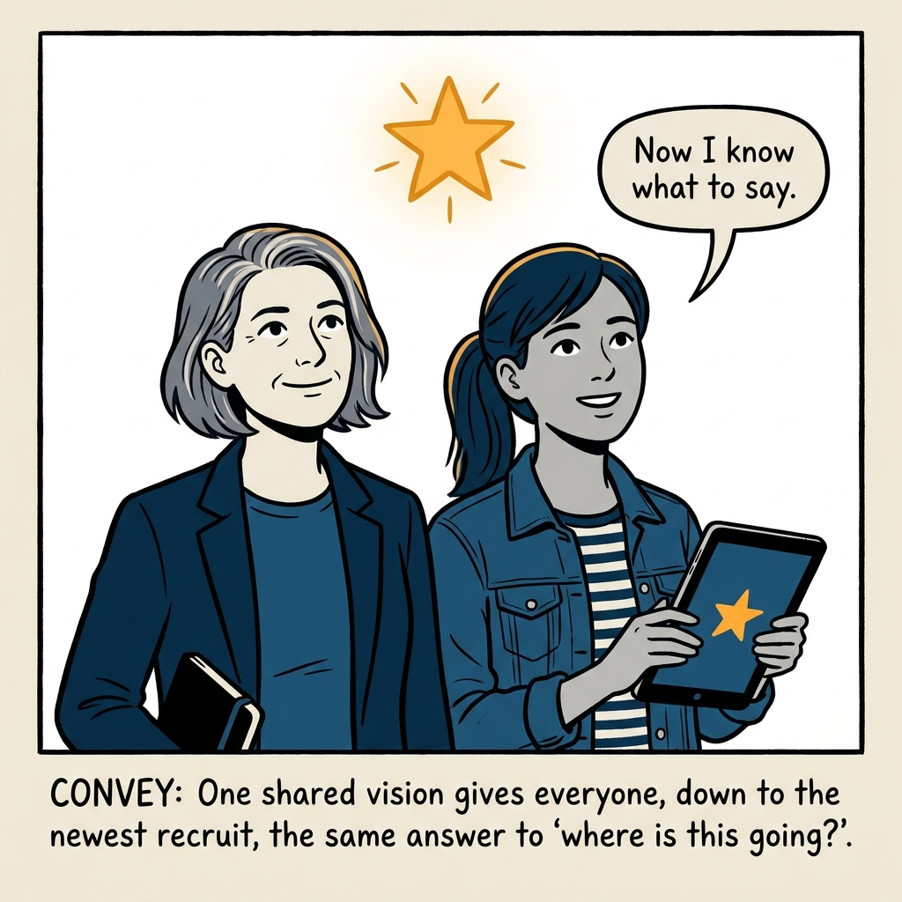

One shared north star, 3–10 years out — why a vision and its principles beat a fleet of separate maps, in eight panels.

<!-- comic-style
{
  "cast": "VERA: a calm, seasoned product-minded executive, short gray-streaked hair, dark blazer over a plain t-shirt, carries a small black notebook. MILA: an energetic young product manager, dark hair in a ponytail, denim jacket over a striped shirt, carries a tablet covered in sticky notes.",
  "style": "Clean two-tone explainer comic, thick ink outlines, flat colors with deep blue and amber accents on a light background, generous white space, hand-lettered speech bubbles with SHORT readable text, no photorealism."
}
-->

**Panel 1:** *The hook: five teams, five visions, five directions.*

**Panel 2:** *The problem: the best candidates ask 'where is this going?' — and get silence.*

**Panel 3:** *The principle: one shared vision, 3–10 years out, inspiring enough to recruit with.*

**Panel 4:** *The boundary: a vision is the future you want to create — not a feature roadmap with longer arrows.*

**Panel 5:** *The north star: strategy, architecture, and topology all steer by the same vision.*

**Panel 6:** *The guardrails: principles decide hundreds of small trade-offs — including the ethical ones — so nothing needs to escalate.*

**Panel 7:** *The retelling: a vision nobody sells is a document — tell it until the whole organization can.*

**Panel 8:** *The closer: one star, one story — and everyone can finally answer 'where is this going?'*
