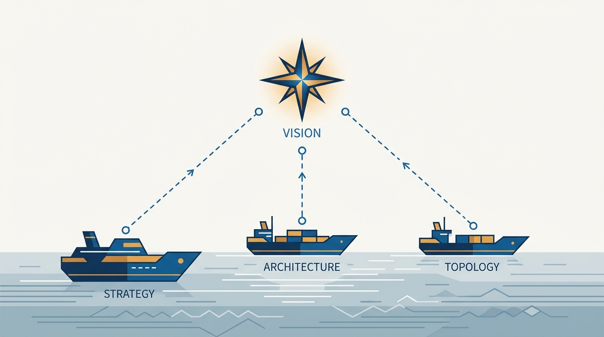
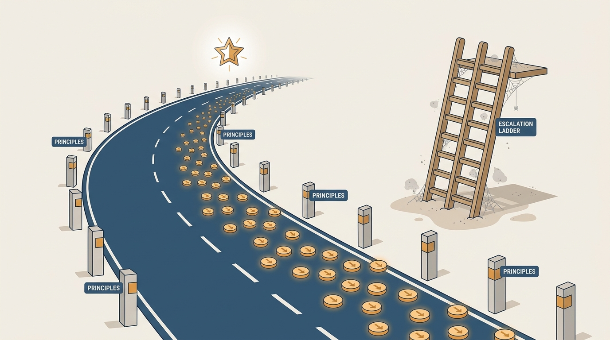

> **Status**: DRAFT
>
> **Principle**: I maintain exactly one product vision — a shared, customer-centric picture of the future we want to create, 3–10 years out, inspiring enough to recruit with. It is the north star that product strategy, architecture, and team topology all steer by, and it is emphatically not a feature roadmap. I pair it with explicit product principles that encode what our products stand for: the principles decide the small stuff so the vision can decide the big stuff — hundreds of trade-offs, including the ethical ones, settled consistently at team level without escalation. I validate the demand behind the vision while accepting that pursuing it remains a reasoned leap of faith. And I communicate it relentlessly, because one telling is never enough.

## Statement

My operating model for product vision and principles has five parts:

- **One vision, anchored in strategic context.** The vision supports the company's mission and objectives, connects explicitly to product strategy, and shapes team topology. No product team gets its own separate vision.
- **A compelling picture of the future, not a plan.** Customer-centric, end state rather than implementation, a 3–10 year horizon, built on relevant industry trends rather than fads — customer value, not technology for its own sake.
- **Actionable across the organization.** Strategy, architecture, and team structure are downstream of the vision, and engineering gets enough clarity about what is coming to make sound technical bets. Every team sees the bigger picture and its own contribution to it.
- **Principles as decision-making machinery.** A clear set of product principles complements the vision: explicit enough to help with trade-offs, reasoning attached, priorities defined for when values conflict — with ethics discussed explicitly, not implicitly.
- **A leadership tool, told and retold.** The head of product owns the vision's development, design and technology leadership shape it, the CEO genuinely owns it — and I use it to recruit, to create meaning, and to evangelize, retelling it far past the point where I am tired of hearing myself.

**Figure 1:** *One shared vision as the north star: product strategy, architecture, and team topology all steer by the same point.*

## How to Read This

This journal is the product-management counterpart to my engineering-executive journal: the same first-person, record-shaped format, applied to how I believe product management should work. This record belongs to the journal's EMPOWERED section and is grounded in Marty Cagan and Chris Jones's *EMPOWERED* — read here through a practitioner-executive lens rather than as a book summary. It has a deliberate boundary with its Build-What-Matters sibling [[customer-journey-vision]]: that record covers the journey-story *format* for expressing a vision; this one covers Cagan's vision-and-principles *pairing* — the shared north star plus the guardrails. They are complementary lenses on the same artifact. The working checklist — all eleven sections, with the numbers — lives in the **Checklist** tab of this post.

## Rationale

**Without a shared vision, every team steers by its own map.** Empowered teams are given problems, not features — but autonomy without a common destination produces a fleet of well-run ships sailing in different directions. The vision is what makes team-level autonomy safe at the organizational level: every team can see the bigger picture and how its own work contributes to the larger whole. That is also why I refuse per-team visions. Ten small visions are not decentralization; they are fragmentation.

**The 3–10 year horizon is what separates a vision from a roadmap.** A roadmap answers "what are we shipping next quarter"; a vision answers "what future are we creating for customers." The moment the vision degrades into a feature list with dates, it loses both of its powers: it stops inspiring, and it stops absorbing change. So I keep the vision focused on the end state, not the implementation plan — stubborn on the vision, flexible on the details. In roadmap conversations I prefer sharing the vision over sharing detailed roadmaps and avoid locking into promises too early; when a forward-looking commitment to a customer is genuinely necessary, it is a high-integrity commitment or it is not made.

**Figure 2:** *A roadmap answers next quarter; a vision answers the next 3–10 years. The horizon is what lets it inspire and absorb change.*

**The vision needs real owners, all the way to the top.** The head of product owns developing the vision, with design and technology leadership shaping it closely — but the CEO must feel genuine ownership, because a vision the top of the company merely tolerates will not survive its first hard trade-off.

**A vision nobody sells is a document, not a tool.** Communication is a craft in its own right: I tell the story from the user's perspective, make it inspiring rather than merely informative, and invest in artifacts that make the future tangible — a visiontype or conceptual prototype, storyboards, sometimes a scripted video — showing how different user types experience the future product, with product designers heavily involved. And I re-communicate it constantly. The vision is also my best recruiting tool: strong product people join missions, not backlogs. When a candidate asks "where is this going?", the answer should be the most compelling thing they hear all week.

**Validation is honest or it is theater.** I test whether the underlying customer problems are real, whether customers care enough about them, and whether they are open to new solutions. What I do not pretend is that the final solution can be validated upfront — it cannot. Pursuing a vision is a reasoned leap of faith: reasoned because demand is tested, a leap because the destination is years out. Saying this out loud protects the vision from both cynics ("it's unproven") and zealots ("it's guaranteed").

**Principles decide the small stuff so the vision can decide the big stuff.** A vision alone answers "where are we going" but not "how do we behave on the way." Product principles encode what the products stand for: explicit enough to actually help with trade-offs — ease of use versus security, growth versus trust — each with its reasoning attached, and with clear priority when values conflict. This includes ethics, discussed explicitly rather than implicitly: I want teams to have considered how the product could be misused, and to have principles that prevent harmful outcomes, before the incident forces the conversation. Good principles are a delegation mechanism — hundreds of decisions a year get made consistently at the team level, without escalation, because the trade-off was settled once, in writing, with reasons.

**Figure 3:** *Principles as guardrails: hundreds of small trade-offs decided consistently at team level, with the escalation ladder left unused.*

## What This Means in Practice

| What this principle says | What it does **not** say |
| --- | --- |
| One shared vision for the whole organization. | Every team writes its own inspiring mini-vision. |
| The vision is a 3–10 year picture of the customer's future. | The vision is a feature roadmap with longer arrows. |
| Strategy, architecture, and topology steer by the vision. | The vision dictates this quarter's backlog. |
| Validate the demand; admit the leap of faith. | Refuse to move until the solution is proven upfront. |
| Principles decide recurring trade-offs at team level. | Every hard call escalates to whoever shouts loudest. |
| Ethics is discussed explicitly, in advance. | Ethics is handled implicitly, after the incident. |
| Retell the vision until everyone can retell it too. | One good all-hands presentation is enough. |

Concretely: strategy discussions open by re-anchoring on the vision, not on the backlog. Architecture and topology proposals are argued from where we are going, not just from where we are. Recruiting conversations lead with the vision. And when a team escalates a trade-off the principles should have decided, I treat that as a gap in the principles, not a failure of the team — and we fix the principle.

## Anti-Patterns

- **The roadmap in a gown.** A "vision" that is really a three-year feature list with dates — it neither inspires nor survives contact with change.
- **Vision sprawl.** Each product team writing its own separate vision; the organization decomposes into fragments that no longer add up to anything.
- **The framed poster.** A vision written once, presented once, and never mentioned again — assumed absorbed because it was announced.
- **The orphaned vision.** A head of product developing the vision alone, without design and technology leadership shaping it and without genuine CEO ownership; it dies at the first executive conflict.
- **Premature promises.** Locking into detailed roadmap commitments with customers years out, then serving the promise instead of the customer.
- **Principles that decide nothing.** Value statements so generic ("we care about users") that no real trade-off is ever settled by them.
- **Implicit ethics.** Discovering how the product can be misused from the press coverage rather than from the principles.

## Related Records

- [[customer-journey-vision]] — the Build-What-Matters sibling: the journey-story format for expressing a vision; complementary lens on the same artifact.
- [[empowered-product-strategy]] — strategy chooses which problems to work on now; this record defines the destination that strategy serves.
- [[team-topology]] — topology is downstream of the vision; this record supplies the north star that topology aligns to.
- [[organizational-values]] — the engineering-executive counterpart on values; product principles are the same mechanism aimed at the product.

## Scope and Revisiting

This principle governs how I create, validate, communicate, and use the product vision, and how I define the product principles that accompany it. I revisit it when company objectives materially shift, when the industry trend the vision leverages turns out to be a fad, when teams start escalating trade-offs the principles should decide, and whenever I notice the vision quietly degrading into a roadmap. The final quality check in the Checklist tab is the recurring test: compelling, customer-centered, shared, informing strategy and architecture and team design — and explainable, simply and consistently, by the organization without me in the room.

## Authoritative References

- Marty Cagan with Chris Jones, *EMPOWERED: Ordinary People, Extraordinary Products* (Wiley, 2020) — the product-vision and product-principles chapters this record's checklist distills.
- Much of the book's material began as freely available essays at [svpg.com](https://www.svpg.com/), where the authors' ongoing writing can be read.
