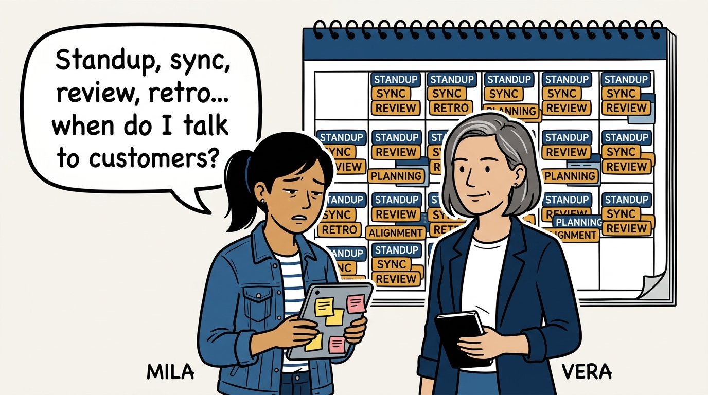
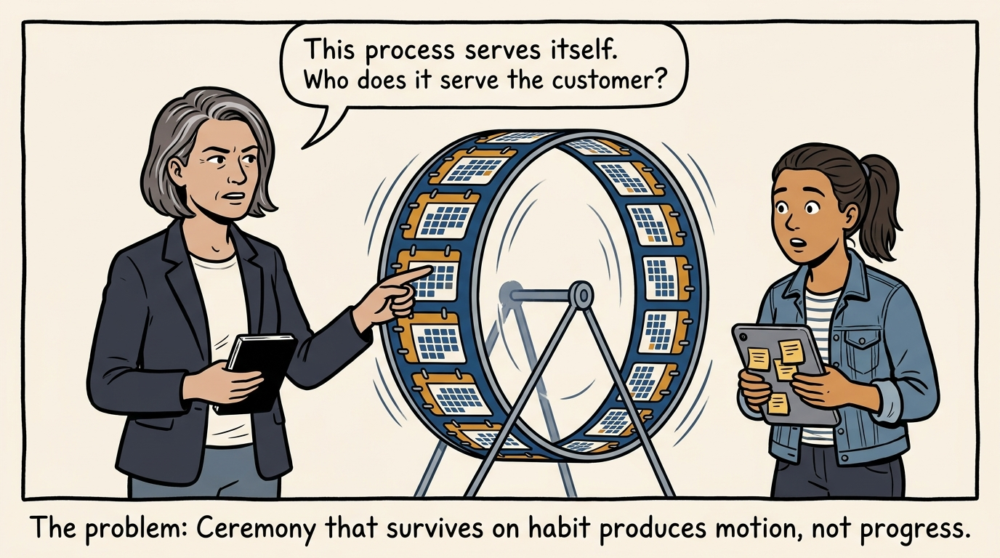
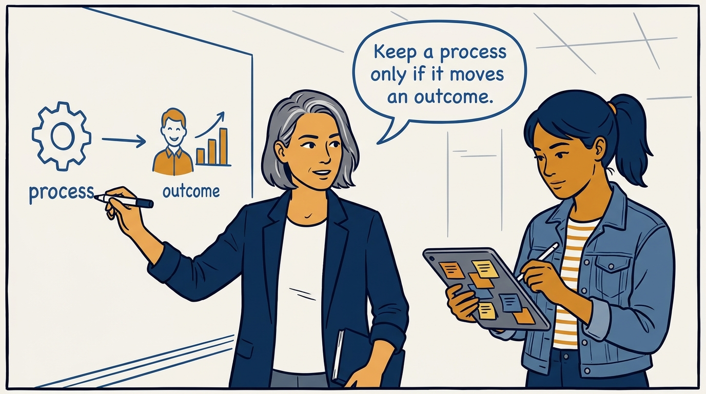
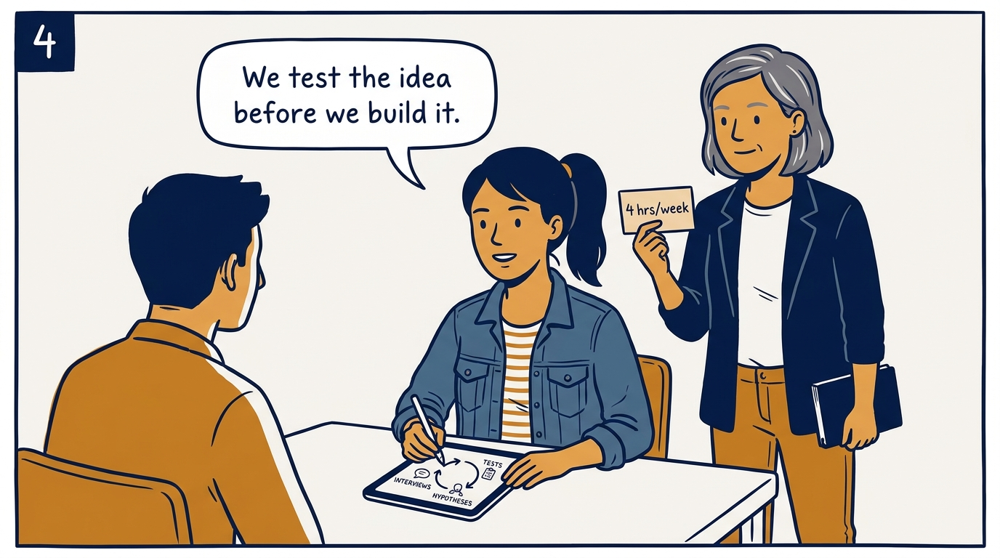
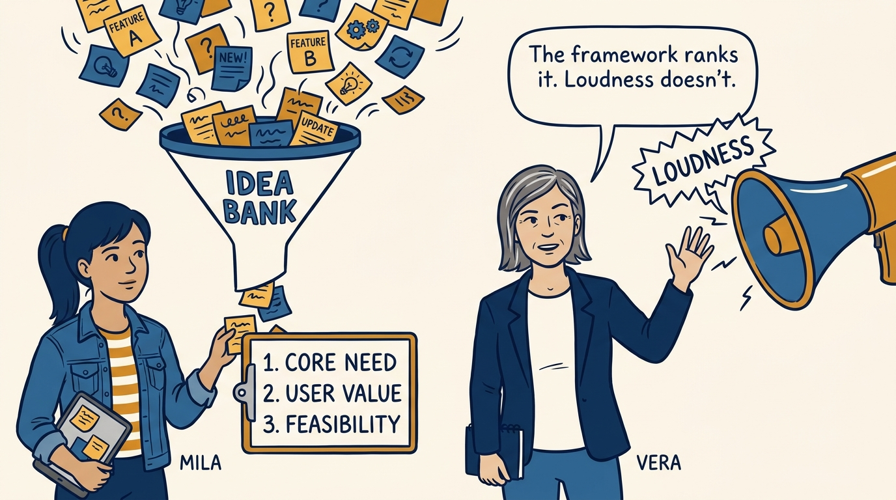
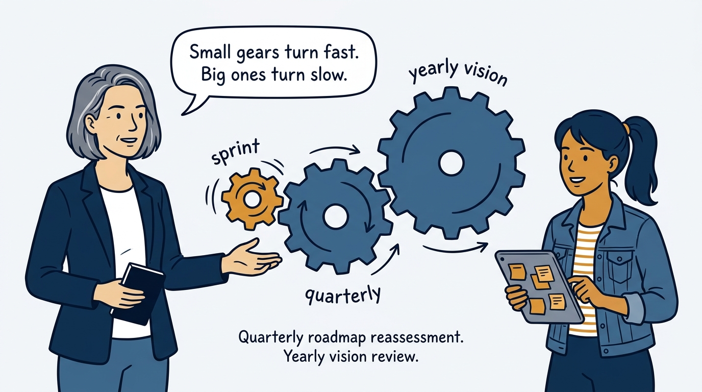
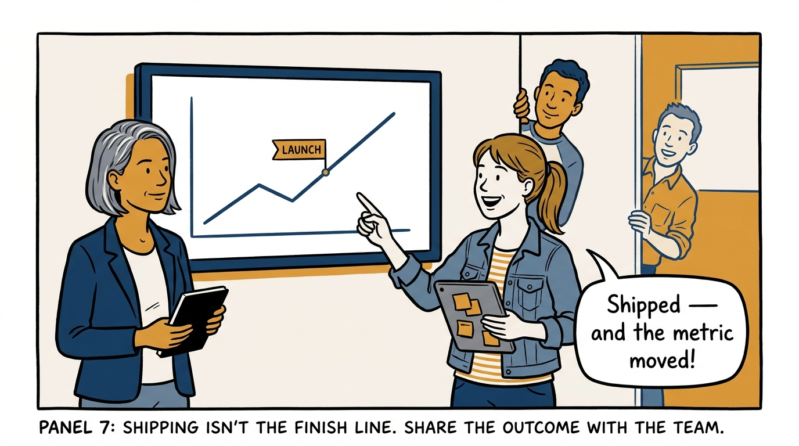
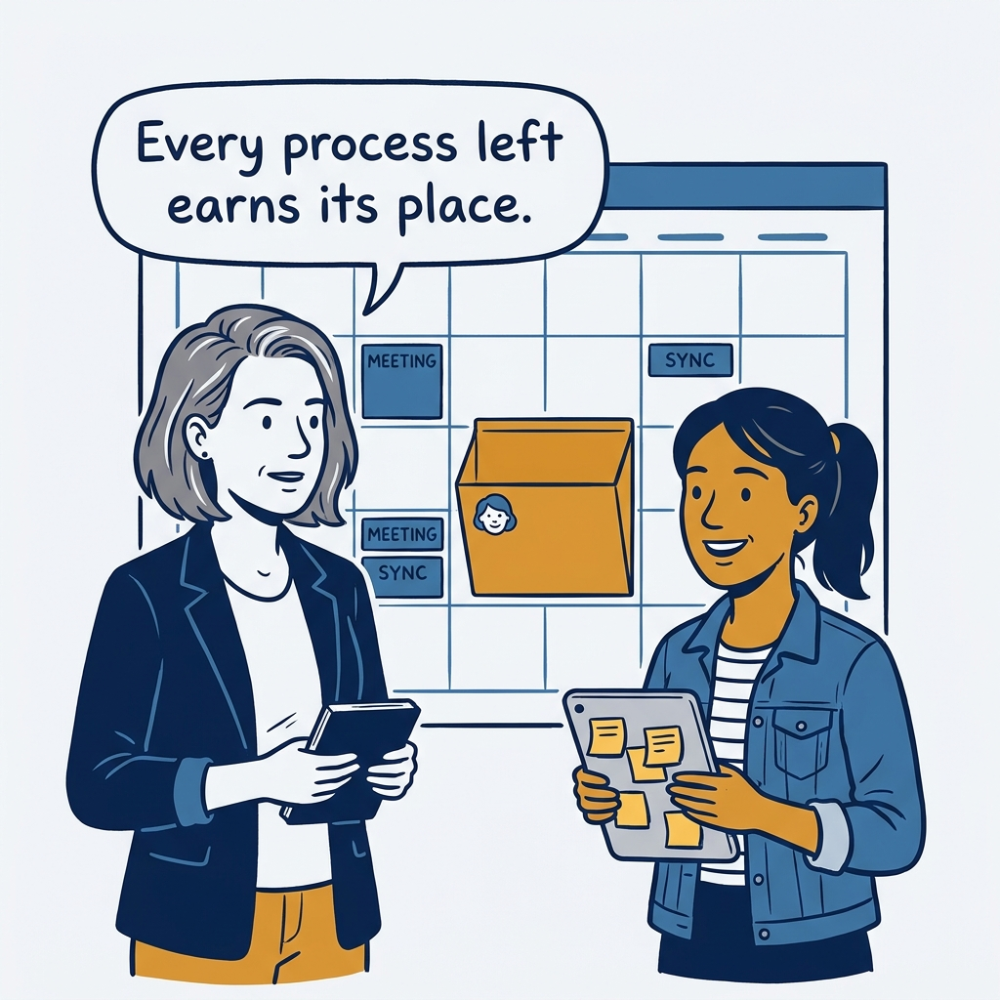

Processes exist to serve outcomes, not themselves — vision-led product process in eight panels.

<!-- comic-style
{
  "cast": "VERA: a calm, seasoned product-minded executive, short gray-streaked hair, dark blazer over a plain t-shirt, carries a small black notebook. MILA: an energetic young product manager, dark hair in a ponytail, denim jacket over a striped shirt, carries a tablet covered in sticky notes.",
  "style": "Clean two-tone explainer comic, thick ink outlines, flat colors with deep blue and amber accents on a light background, generous white space, hand-lettered speech bubbles with SHORT readable text, no photorealism."
}
-->

**Panel 1:** *The hook: a calendar full of process, and no discovery anywhere in it.*

**Panel 2:** *The problem: process running for its own sake — motion without progress.*

**Panel 3:** *The principle: processes exist to serve outcomes — anything else comes off the calendar.*

**Panel 4:** *The loop: continuous discovery and validation — research before commitment, every single week.*

**Panel 5:** *Prioritization: an idea bank and one consistent framework — the roadmap is not a volume contest.*

**Panel 6:** *Cadence: reassessment sized to the horizon — sprints spin fast, the vision turns once a year.*

**Panel 7:** *The learning loop closes: not 'we shipped it' but 'it moved the outcome' — with evidence.*

**Panel 8:** *The closer: fewer ceremonies, every one earning its place — and room for the customer again.*
