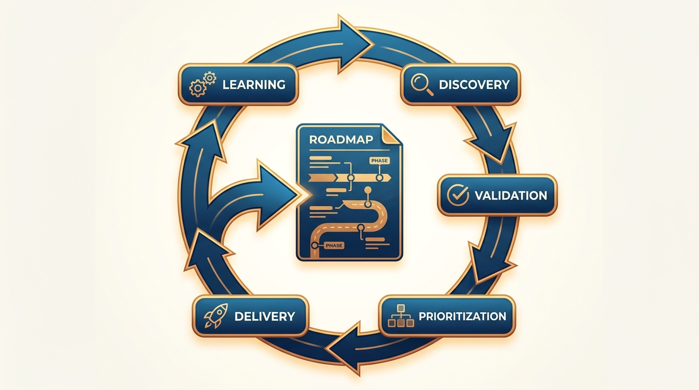
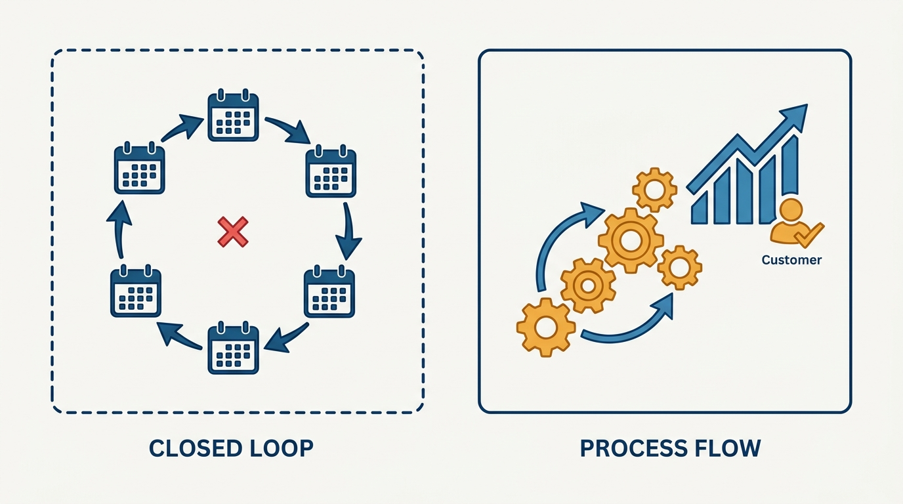
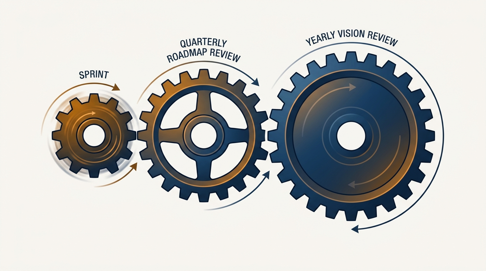

> **Status**: DRAFT
>
> **Principle**: I treat product processes as machinery in service of outcomes, never as ceremony. I ground the roadmap in a validated key customer outcome, keep discovery and validation running continuously — research before deciding what to build, not after — and derive prioritization from strategy through a transparent framework rather than from the loudest stakeholder. I size every cadence to the horizon it governs, match the development process to the type of work, and measure success by whether shipped work moved the outcome, not by how much we shipped. A process that stops serving the outcome gets cut.

## Statement

My operating model for product processes has seven parts:

- **Start from the outcome.** Executives answer one question together — *"How do customers know this product is delivering value?"* — and every answer stays a hypothesis until customer research and the 5 Whys confirm it. The result is a pair of outcome pyramids — customer and company — with usage metrics as leading indicators.
- **Validate the vision outside the building.** The customer journey vision — trigger through retention — is tested with forward-thinking customers before I trust internal consensus, with input from every customer-facing team and from engineering.
- **Keep discovery running.** Customer research informs what gets built, not just how it landed — at least four hours a week, multiple methods, even when there is no immediate project.
- **Derive prioritization from strategy.** Inbound requests land in an idea bank and get scored with a consistent framework such as RICE; stakeholders name their top 1–2 priorities — with reasons — not a wish list. The roadmap balances innovation, iteration, and operation against explicit allocation targets.
- **Size cadences to horizons.** The roadmap and vision are reassessed at the one-third or one-quarter mark of their horizon: quarterly for a one-year roadmap, at least yearly for a three-year vision. Outcome reviews happen at least quarterly.
- **Match process to work.** Innovation sprints for bold, future-facing work; Scrum for build-measure-learn iteration; Kanban for bugs and urgent operational work. One method is never forced on everything.
- **Measure outcomes, not output.** A simple dashboard tracks a few durable metrics tied to the outcome pyramid, and product managers show evidence after every release that the intended metric moved.

**Figure 1:** *The product engine is a loop, not a pipeline: discovery, validation, prioritization, delivery, and learning continuously feed the roadmap.*

## How to Read This

This journal is the **product-management counterpart** to my engineering-executive journal: the same record shape, applied to how product management should work. This record is grounded in Ben Foster and Rajesh Nerlikar's *Build What Matters*, read through a practitioner-executive lens. One boundary matters: the engineering-side process machinery lives in the engineering journal's [[run-engineering-processes]]; this record covers the product side — discovery, validation, prioritization, roadmap cadences, and the communication around them. The working checklist — all seventeen sections, with the numbers — lives in the **Checklist** tab of this post. Two of those sections — crafting the product strategy and communicating the outcome, vision, and strategy — overlap territory owned by the sibling records [[product-strategy]] and [[outcomes]]; they are reproduced in the checklist for completeness rather than restated here.

## Rationale

**Process is a means; the outcome is the point.** Product organizations accumulate ceremonies the way codebases accumulate dependencies: each arrived for a reason, and nobody remembers to remove it. So I apply one test to every recurring meeting, review, and ritual: does it move a customer or company outcome? A standup that surfaces no decisions or a roadmap review that changes no allocation is not process — it is ceremony wearing its costume.

**Research before commitment beats validation after launch.** The cheapest moment to learn you are wrong is before the work is prioritized. So discovery is a standing habit — the weekly hours are protected, the methods varied, the conversations ongoing whether or not a project demands them — and every element of the vision stays a hypothesis until customers outside the building confirm it. Internal-only validation produces weak consensus and groupthink; forward-thinking customers are the antidote.

**Prioritization without a framework is a volume contest.** Without a transparent process, the roadmap goes to whoever escalates loudest. The idea bank plus consistent scoring turns requests into comparable objects; asking stakeholders for their top 1–2 priorities — and *why* — turns lobbying into signal. The refusal matters just as much: I am transparent about what is *not* on the roadmap and why, because a silent no breeds shadow roadmaps.

**Figure 2:** *Ceremony circles back into itself; a right-sized process connects directly to an outcome it moves.*

**Cadence follows horizon.** A roadmap reassessed too rarely calcifies into fiction; reassessed too often, it never accumulates evidence. The one-third/one-quarter rule sizes the cadence to the commitment: quarterly for a one-year roadmap, yearly for a three-year vision, and a strategy revisit after major milestones or visible market shifts. Changing direction on evidence is the cadence working, not the plan failing.

**One method does not fit all work.** Innovation needs room to think; iteration needs tight build-measure-learn loops; operational work needs flow, not sprints. Forcing one method onto all three either suffocates the bold work or ritualizes the urgent work. The same logic balances the roadmap: innovation, iteration, and operation each get an explicit allocation and their own feeder, because a backlog does not appear automatically from strategy.

**Shipping is not the finish line.** Story points measure motion, not progress. After a release, the question is whether the intended metric moved — and product managers bring the evidence. Sharing it with engineering makes delivery teams care about outcomes instead of throughput.

**Communication is a process too.** The roadmap goes to executives first, then to each major group with a tailored message. Externally I share themes, not dates — buffers protect discovery, and overpromising is debt collected with interest.

**Figure 3:** *Cadence follows horizon: sprints turn fast, the roadmap is reassessed quarterly, the vision at least yearly — one geared system, not competing clocks.*

## What This Means in Practice

| What this principle says | What it does **not** say |
| --- | --- |
| Every process must serve a customer or company outcome. | Process is bad — the absence of process just means prioritization by loudness. |
| Research comes before deciding what to build. | Every decision waits for a study — the cadence keeps moving. |
| Prioritization runs through a transparent framework. | The framework decides — it informs; an empowered leader decides. |
| Reassess the roadmap at one-third to one-quarter of its horizon. | Rewrite the roadmap whenever anyone is nervous. |
| Match the method — sprints, Scrum, Kanban — to the work. | Pick one methodology and enforce it everywhere. |
| Product managers show post-release evidence of impact. | Shipping on time is the measure of success. |
| Share themes externally, with buffers. | Hide the roadmap — internal transparency stays radical. |

Concretely: recurring meetings carry a named outcome or come off the calendar. Discovery hours are scheduled like delivery work. Every inbound request gets an answer — including a reasoned no. And roadmap reviews start with evidence from the last cycle, not with new wishes.

## Anti-Patterns

- **The ceremony calendar.** A week so full of standups, reviews, and syncs that no discovery happens.
- **Validation theater.** Customer research run *after* prioritization, to confirm a decision already made.
- **The loudest-voice roadmap.** No idea bank, no framework — priorities go to whoever escalates hardest.
- **The frozen roadmap.** A twelve-month plan never reassessed, defended after the evidence turned against it.
- **Methodology monoculture.** Scrum forced onto firefighting and exploration alike, because "we are a Scrum shop."
- **Ship-and-forget.** Celebrating the launch and starting the next feature without checking whether the metric moved.
- **The external date promise.** Sharing the internal roadmap with prospects, then paying for it in lost flexibility.

## Related Records

- [[right-team]] — the people and roles that run these processes; process cannot compensate for the wrong team.
- [[balanced-roadmap]] — what the innovation/iteration/operation balance looks like on the roadmap itself; this record supplies the processes that produce and maintain it.
- [[run-engineering-processes]] — the engineering-side counterpart in my engineering-executive journal; the two records meet at the sprint boundary.
- [[meetings]] — the engineering journal's discipline for meetings generally; the ceremony test here is the product-side application.

## Scope and Revisiting

This principle governs the recurring processes of product management: outcome definition, discovery, prioritization, roadmap cadences, development-process selection, and roadmap communication. I revisit it when the company changes stage — the process weight that suits fifty people suffocates ten and underpowers five hundred — and whenever I catch a process surviving on habit rather than on the outcome it moves. The cadence rules self-enforce: the reassessment schedule is part of the record.

## Authoritative References

- Ben Foster and Rajesh Nerlikar, *Build What Matters: Delivering Key Outcomes with Vision-Led Product Management* (Lioncrest Publishing, 2020) — the process chapters this record's checklist distills.
