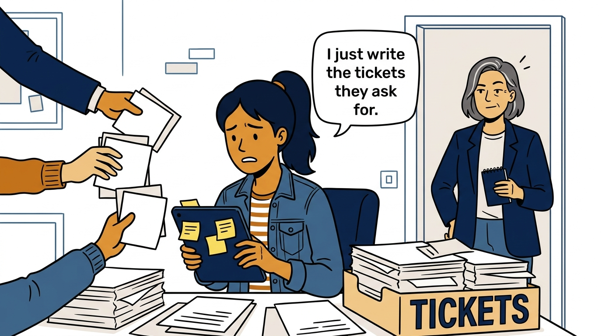
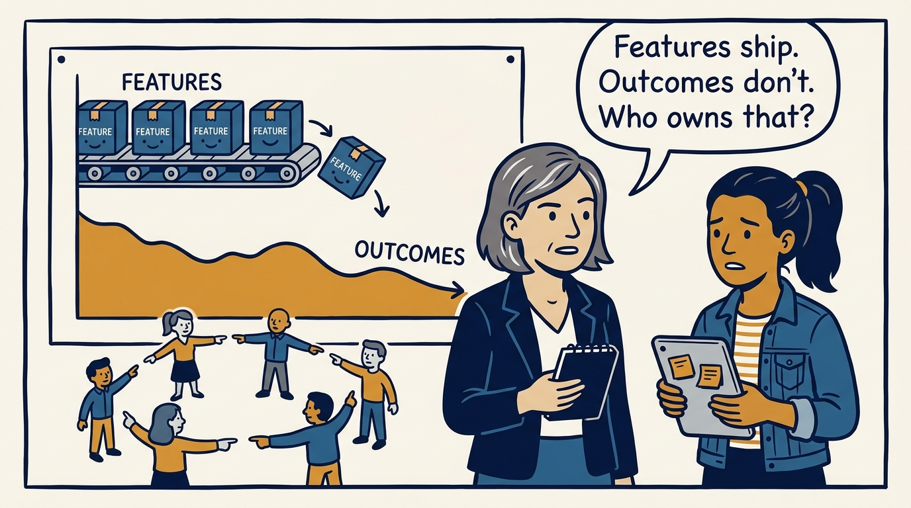
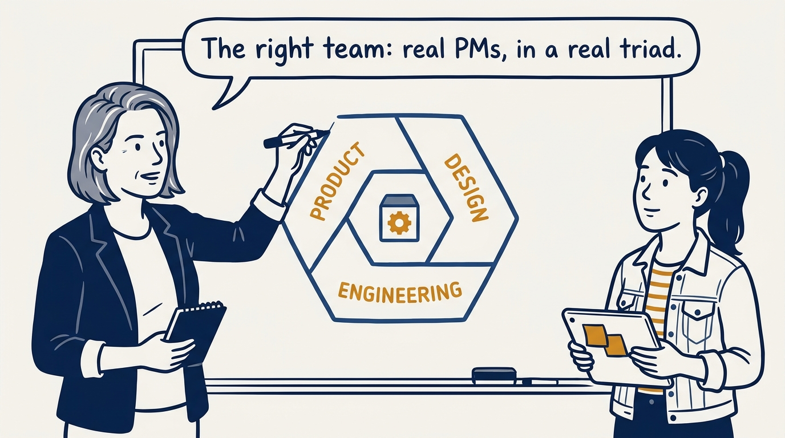
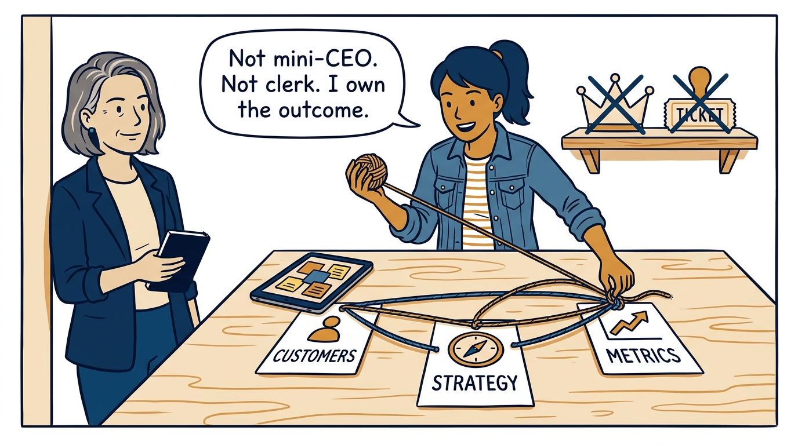
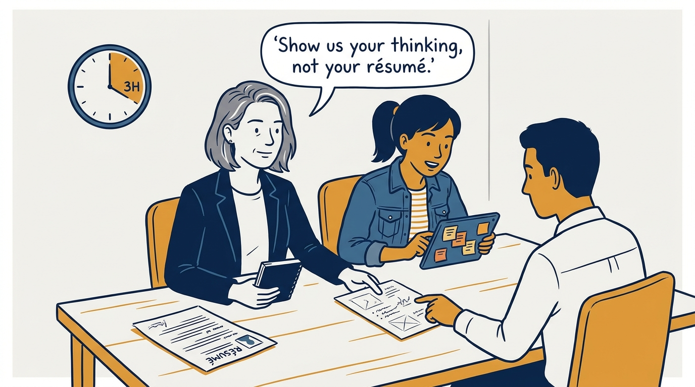
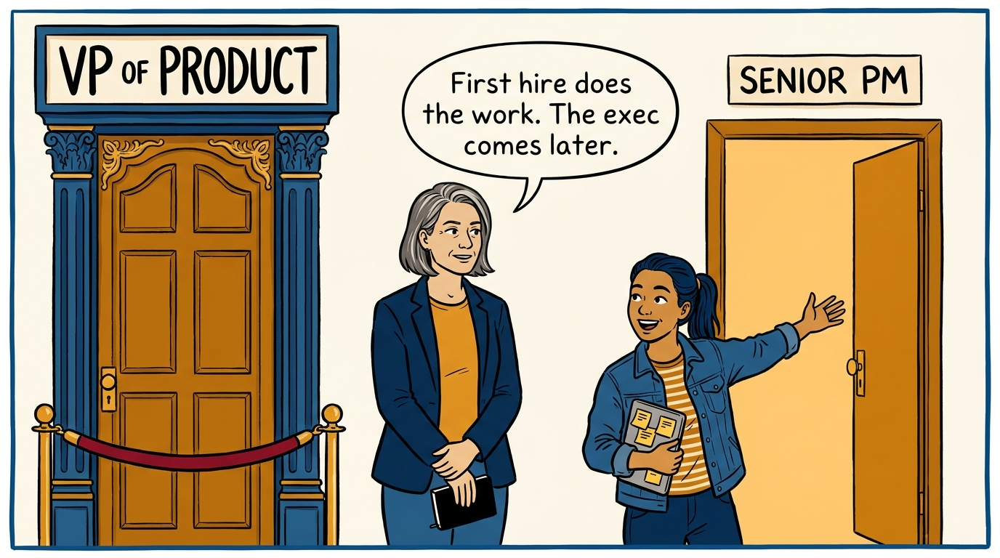
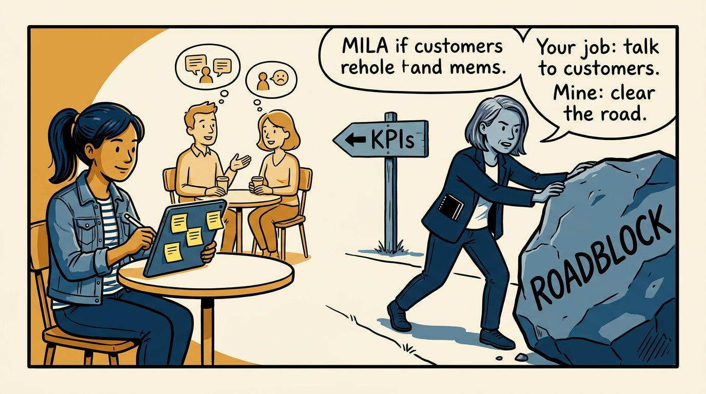
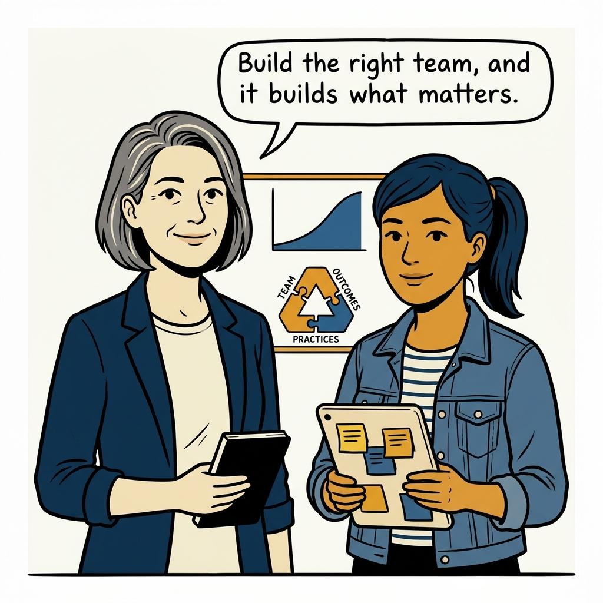

Real PMs, in a real triad, with real conditions to succeed — building the right product team in eight panels.

<!-- comic-style
{
  "cast": "VERA: a calm, seasoned product-minded executive, short gray-streaked hair, dark blazer over a plain t-shirt, carries a small black notebook. MILA: an energetic young product manager, dark hair in a ponytail, denim jacket over a striped shirt, carries a tablet covered in sticky notes.",
  "style": "Clean two-tone explainer comic, thick ink outlines, flat colors with deep blue and amber accents on a light background, generous white space, hand-lettered speech bubbles with SHORT readable text, no photorealism."
}
-->

**Panel 1:** *The hook: product management as a ticket-writing service.*

**Panel 2:** *The problem: everything ships, nothing improves, and everyone points elsewhere.*

**Panel 3:** *The principle: real PMs in a real triad — three peers around one product.*

**Panel 4:** *What the PM actually does: customer needs, strategy, metrics — and accountability for the outcome.*

**Panel 5:** *Hiring for the real skills: a real homework assignment, discussed in depth.*

**Panel 6:** *Timing the first hire: a senior PM who does the work — the executive comes later.*

**Panel 7:** *The conditions PMs need: customer contact, clear KPIs, delegated decisions — and a cleared road.*

**Panel 8:** *The closer: build the right team, and it builds what matters.*
