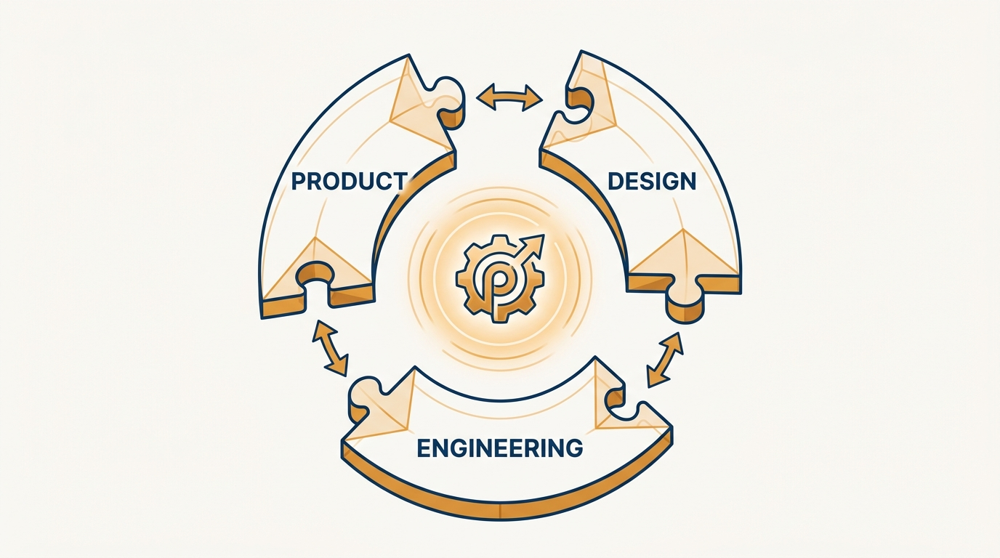
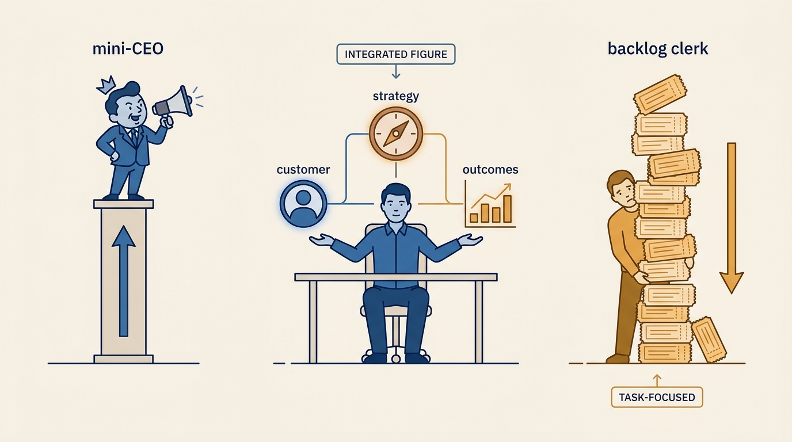
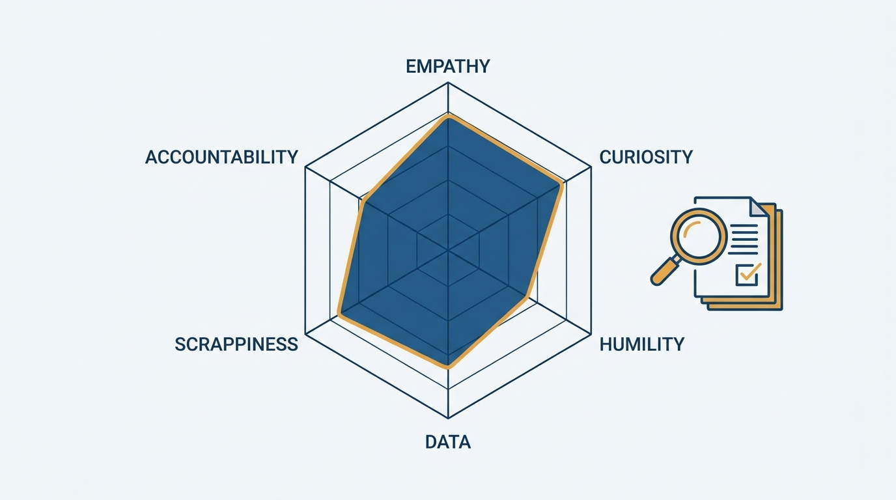

> **Status**: DRAFT
>
> **Principle**: I build the product team deliberately, not by accretion. The first product hire comes when the founder runs out of time and engineering runs out of clarity — and it is a senior product manager, not a premature VP. I evaluate candidates on product mindset, tested with a real homework assignment. I keep design a peer function, plan staffing around explicit ratios, and insist that one person holds real accountability for product outcomes — no telephone games. And I give PMs the conditions to succeed: direct customer contact, delegated decisions, and a genuinely diverse team.

## Statement

My operating model for building the product team has five parts:

- **Time the first hire, and size it right.** The signals are concrete: the founder no longer has time for product work, engineering works on wrong or unclear priorities, the team has around five or more engineers, or a second product is coming. The first hire is a **senior product manager** with clearly defined scope and decision rights — not a VP or CPO before there is anything to be a VP of.
- **Hire for product mindset, tested on real work.** Customer empathy, curiosity, humility, adaptability, data-driven decision-making, scrappiness, accountability for outcomes, persistence — tested with a homework assignment built from a real business challenge, sized at roughly 2–3 hours, and discussed in depth in the interview.
- **Build a real triad.** Design separates from product management as soon as the company can afford it, with clear UX and UI responsibilities, and works with product as a peer — designers do not report into individual PMs once the design team grows.
- **Scale by ratios, ahead of demand.** Per product team: roughly 5–7 developers, 1 product manager, 0.5 UX designer, 0.3 UI/visual designer, 1–2 QA engineers — and PMs hired ahead of expected engineering growth, with ownership lines over-communicated.
- **Give PMs the conditions to succeed.** Direct customer contact, simple 360 feedback, decisions pushed down with clear KPIs and context, and deliberate diversity. A great PM in a bad system produces bad product.

**Figure 1:** *The triad: product, design, and engineering as interlocking peers around one product — not a reporting chain.*

## How to Read This

This journal is the product-management counterpart to my engineering-executive journal: the same first-person operating principles, applied to product work. This record is grounded in Ben Foster and Rajesh Nerlikar's *Build What Matters*, read through a practitioner-executive lens: the book advises founders building a product function from zero; I read it as the executive accountable for that function at any scale. The working checklist — all fourteen sections, with the numbers — lives in the **Checklist** tab of this post.

## Rationale

**The first product hire is a timing decision, not a status decision.** The temptation is to hire a VP of Product as a signal of seriousness. But before there is an MVP, paying customers, and multiple PMs to lead, a product executive has nothing to run and everything to invent — usually badly. When the operational signals fire, what is needed is a senior PM who does the work. The executive comes later, when the founder is genuinely ready to delegate product strategy.

**Mindset predicts PM success; résumés predict interviews.** Product management has no license and no canonical career path, so I hire for the traits that do the work — and the only reliable way to observe them is to watch the candidate do product work. A homework assignment drawn from a real challenge of ours, bounded at 2–3 hours, then interrogated in the interview: why these decisions, what data would you collect, what would you cut from the MVP under pressure? The discussion also answers the question titles never do: does this person *want* the actual work our company needs done?

**Figure 2:** *Neither mini-CEO nor backlog clerk: the real PM owns customer needs, strategy, and outcomes.*

**Split accountability is a telephone game.** Some organizations pair a "strategic" product manager with a "tactical" product owner. I accept the pairing only with a careful boundary: the PM owns market opportunity, customer needs, competitive landscape, success metrics, strategy, and prioritization; a product owner, if used at all, helps engineering with requirements, acceptance criteria, backlog, and standups. What I refuse is any split that relays customer truth through intermediaries or leaves the PM far from customers — then nobody holds real accountability for outcomes.

**Design is a peer, not a PM's pencil.** Early on, PMs do everything; that is scrappiness, not design strategy. As soon as the company can afford it, design becomes its own function — UX owning usability, research, workflows, and mental models; UI owning look, feel, brand, and interaction patterns — collaborating with product as a peer. Designers reporting into individual PMs produces design that serves the roadmap instead of the user.

**Ratios make staffing an argument instead of a fight.** The defaults shift the burden of proof, and they force the move most companies skip: hiring PMs *ahead* of engineering growth, so new teams start with clarity rather than inherit confusion. When the organization matures, product operations earns its place by centralizing repeatable processes, tooling, dashboards, and PM onboarding — so PMs spend their time on strategy and customers, not logistics.

**Conditions beat talent.** A strong PM without customer contact, decision authority, or honest feedback fails in ways that look like personal failure but are system failure. So I make customer discovery structural — usability studies, sales calls, QBRs, site visits, lost-deal interviews, an advisory board — and never let sales or customer success stand in as a proxy for customers. I run simple 360 feedback for PMs, push decisions down with clear KPIs and context, and build the team deliberately diverse, asking of every candidate: what does this person add that the team does not already have?

**Figure 3:** *Hiring for the real skills: a rounded product-mindset profile, observed through a real homework assignment.*

## What This Means in Practice

| What this principle says | What it does **not** say |
| --- | --- |
| The first product hire is a senior PM, timed by operational signals. | Every startup needs a PM on day one — or a VP as a credibility badge. |
| Every serious PM candidate does a real, 2–3 hour homework assignment. | Hiring is an unbounded free-consulting exercise. |
| Design is a peer function with its own reporting line. | PMs stop caring about design, or designers stop talking to PMs. |
| The scaling ratios (5–7 dev, 1 PM, 0.5 UX, 0.3 UI, 1–2 QA) are the default. | The ratios are laws — they shift the burden of proof, nothing more. |
| One person holds real accountability for product outcomes. | The PM decides alone — the triad still builds the product together. |
| PMs get direct customer contact, delegated decisions, and honest feedback. | PMs are unmanaged — 360 feedback and clear KPIs are part of the deal. |

Concretely: no product-executive requisition before there is an MVP, paying customers, multiple PMs, and a founder ready to delegate strategy. Every PM loop includes the homework discussion. New product teams start with a PM already in place. And when the design team grows, its reporting line moves out of product — deliberately, with the peer relationship stated out loud.

## Anti-Patterns

- **The premature VP.** Hiring a product executive as a status symbol before there is a product organization to lead.
- **The mini-CEO myth.** Selling the PM role as "CEO of the product" and hiring for command presence instead of empathy, curiosity, and scrappiness.
- **The backlog clerk.** Treating the PM as a ticket-writing service for engineering — the opposite failure, and the more common one.
- **The telephone game.** Splitting PM and product owner so customer truth passes through relays and outcome accountability belongs to no one.
- **Designers as PM subordinates.** Keeping designers reporting into individual PMs long after design should have become a peer function.
- **Proxy-only discovery.** Letting sales and customer success stand between PMs and customers until the roadmap is a list of secondhand feature requests.
- **Cloning for "culture fit."** Hiring people who resemble the existing team instead of asking what each candidate adds that the team lacks.

## Related Records

- [[right-processes]] — the processes this team runs; the team comes first, the process second.
- [[staffing]] — the EMPOWERED-grounded sibling on staffing product teams; this record covers the founder-to-scale arc of building the function itself.
- [[coaching]] — developing PMs once hired; this record covers whom to hire and what conditions to give them.
- [[hiring]] — the cross-journal engineering-executive record on how I hire; the homework-assignment stance rhymes with it deliberately.

## Scope and Revisiting

This principle governs when I create product roles, how I evaluate and hire into them, how product relates to design and engineering, and what conditions I owe every PM. I revisit it whenever the company approaches a product-hiring inflection — the first PM, the second, the first product executive, the separation of design — and whenever I catch a PM operating far from customers or an outcome that no single person is accountable for.

## Authoritative References

- Ben Foster & Rajesh Nerlikar, *Build What Matters: Delivering Key Outcomes with Vision-Led Product Management* (Lioncrest Publishing, 2020) — the "Right Team" chapter this record's checklist distills.
