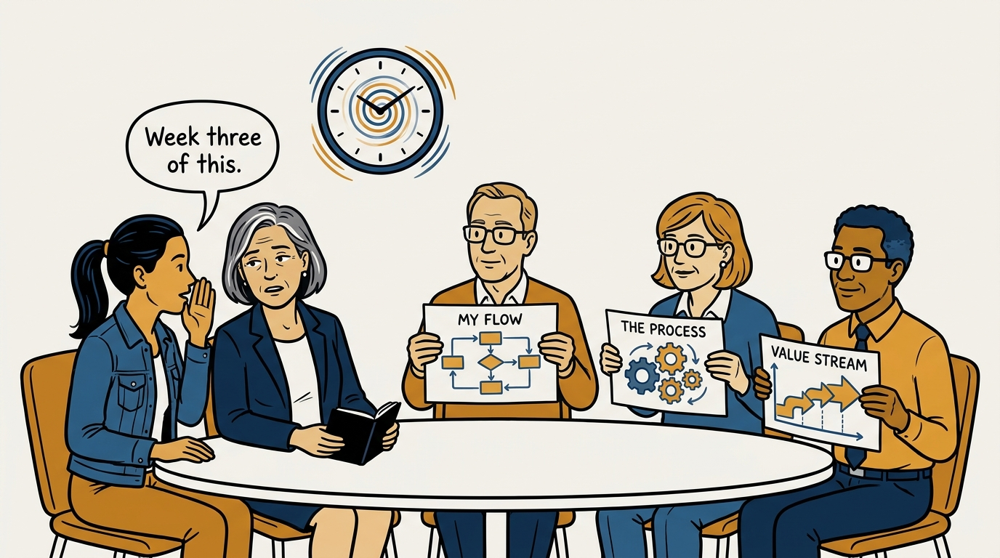
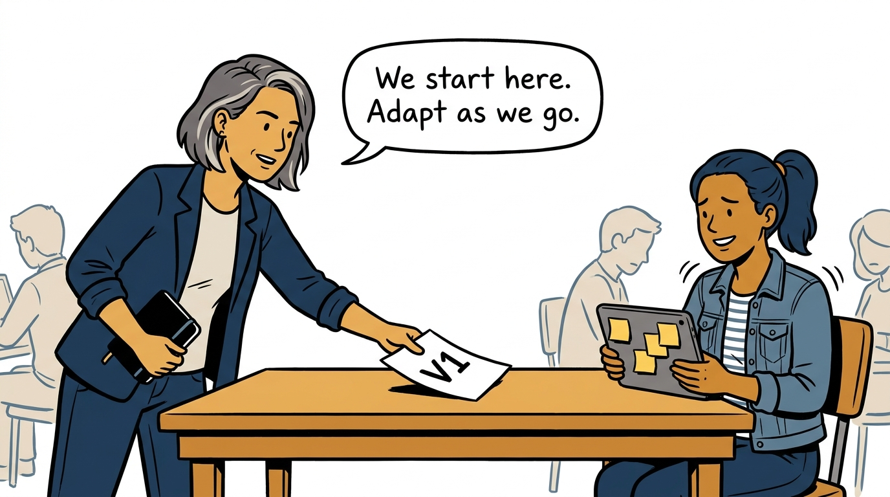
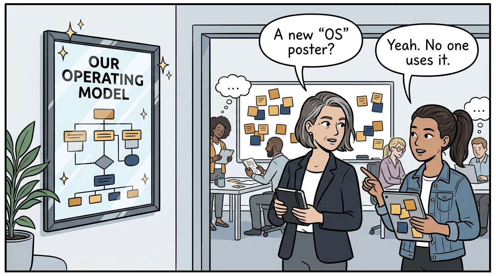
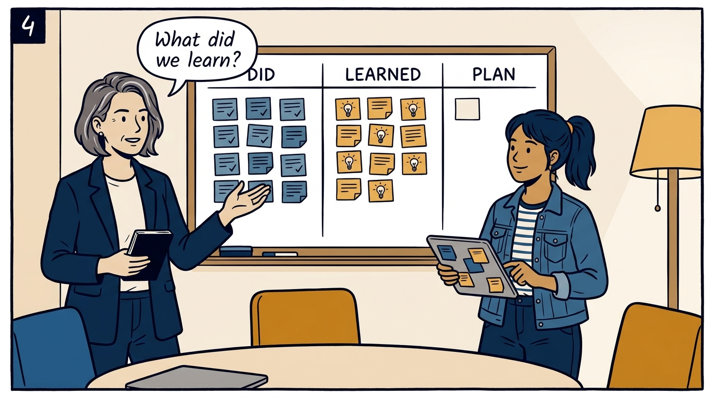
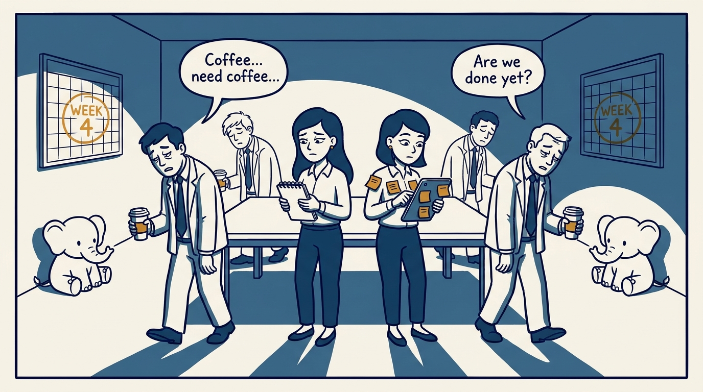
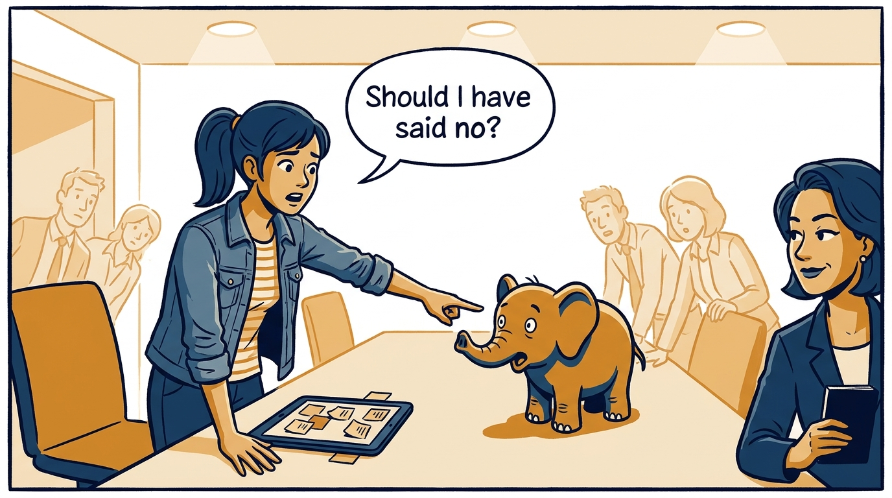
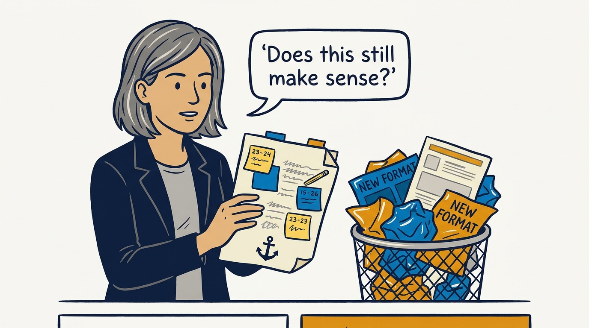
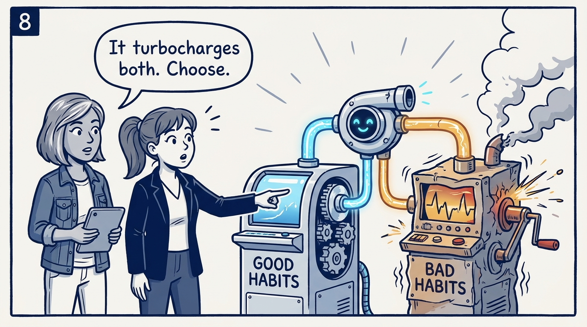

Routines — the heartbeat that survives week four, in eight panels.

<!-- comic-style
{
  "cast": "VERA: a calm, seasoned product-minded executive, short gray-streaked hair, dark blazer over a plain t-shirt, carries a small black notebook. MILA: an energetic young product manager, dark hair in a ponytail, denim jacket over a striped shirt, carries a tablet covered in sticky notes.",
  "style": "Clean two-tone explainer comic, thick ink outlines, flat colors with deep blue and amber accents on a light background, generous white space, hand-lettered speech bubbles with SHORT readable text, no photorealism."
}
-->

**Panel 1:** *The hook: smart people, no game — half the time goes to reconciling quirks.*

**Panel 2:** *The move: bootstrap a V1 way of working and get moving — theorize later.*

**Panel 3:** *The trap: a starter OS written for observers is a showpiece, not a way of working.*

**Panel 4:** *The heartbeat: talk about what you did and learned — 80% on the here and now.*

**Panel 5:** *The danger: week four — the meeting goes zombie or quietly stops.*

**Panel 6:** *The discipline: push through — name the elephant, have the uncomfortable conversation.*

**Panel 7:** *The anchor: artifacts you write and revisit beat formats you reinvent.*

**Panel 8:** *The closer: AI turbocharges good and bad habits alike — boring, steady doing is what's worth accelerating.*
