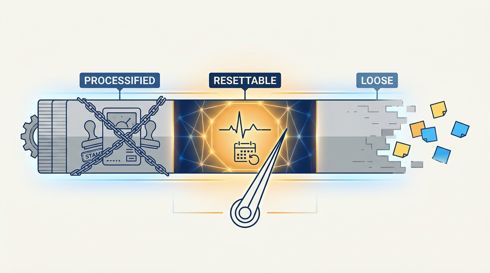
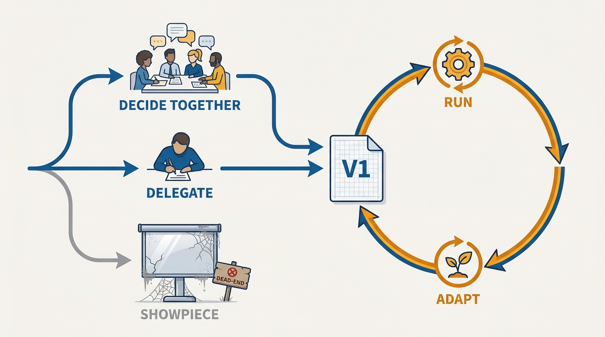
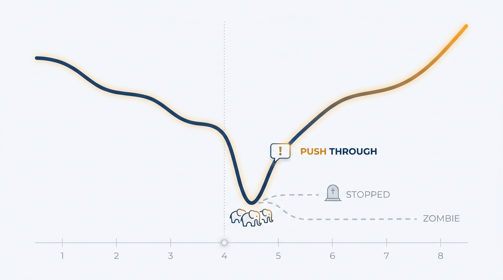

> **Status**: DRAFT
>
> **Principle**: Great products are built on routines — the collective habits, explicit or implicit, that make good work happen week after week. I bootstrap every new team with a V1 way of working and get moving rather than letting smart people theorize; I hold the weekly ritual through the week-four moment where it would otherwise go zombie or die; I anchor the work in artifacts we write and revisit rather than reinvent; and I treat AI as a turbocharger of whatever habits — good or bad — we already have. Good product work is boring: it is in the doing, every day, every week.

## Statement

My operating model for routines has five parts:

- **Have routines — explicit or implicit, but real.** They can be fluid or strict; what matters is that they exist and that the team can reset them quickly when something changes.
- **Bootstrap with V1, then adapt.** A new team gets a starting way of working — written collectively in one meeting, or delegated to one person to hammer out — that people generally agree with. Theorizing is left for later; the team adapts as it goes.
- **Push through week four.** Every good weekly ritual meets the moment where it becomes a zombie meeting or quietly stops. Holding it through that moment — elephants named, priorities re-gathered — is the discipline that separates teams that keep the motion from teams that lose it.
- **Lean on anchor artifacts.** Documents we write, revisit, and ask "does this still make sense?" — instead of perpetually reinventing the latest doc format for each initiative.
- **Point AI at the good habits.** AI turbocharges whatever we already do. I use it to do the things we always knew we should — organize the research library, instrument the analytics — and I rely on expertise, not novelty, to judge what it should do next.

## How to Read This

This record is grounded in John Cutler's "20 Unfiltered Operating Takes" (TBM 435), read through the same practitioner-executive lens as the rest of this journal. It answers the question behind most "how much process do we need?" debates: process is the wrong noun — the right one is *habits*. If you join a new team I have chartered, this record explains why a V1 working agreement exists before your first sprint does. The working checklist, derived from the essay, lives in the **Checklist** tab.

## Rationale

**Routines are the heartbeat, and both failure modes kill it.** Processified to the nth degree, a routine loses any chance of being effective; left implicit and loose, the team cannot reset when something changes. Experienced people can go far on "meeting when it makes sense" — but experience does not immunize anyone against the real traps: not raising risks because it is uncomfortable, avoiding the hard conversation, riding status-quo bias past the point where the direction deserved a challenge, and postponing the tough call "one more week." The routine is where a coworker gets the standing chance to set you straight. We are creatures of habit; the agenda can vary, but getting people in a room, regularly, is what compounds.

**Figure 1:** *Both ends kill the heartbeat: routines must exist, and must be resettable when something changes.*

**Experienced teams waste their best energy on an undecided game.** Put smart senior people together and half their time goes to reconciling work-style variations and quirks — politely, with gap-filling and back-channel influence. They do not lack the ability to figure it out; they lack someone willing to just *decide*. So I make the V1 move: define the game and the playbook well enough to start, by whatever legitimate route — a working-agreements session, or "I hate to do this, but can you hammer out V1?" This is not dictatorship; it is unblocking. Experienced people rarely need the t's crossed — they need the waffling ended.

**The V1 trap is the showpiece OS.** The risk in bootstrapping is that whoever writes V1 oversimplifies it, deck-ifies it, or tunes it for the people who are not doing the work. Then the team has a starter operating system that reflects a slide, not reality — worse than no agreement, because it must now be worked around *and* maintained. V1 is written for the people in the work, in their terms, and it earns changes weekly.

**Figure 2:** *Either route to V1 is fine — decided together or delegated — as long as it enters the run-adapt loop instead of the pedestal.*

**Week four is where teams are lost.** Everyone has seen it: the team starts with best intentions and a great weekly meeting, stays on the gas — then elephants accumulate, priorities fracture, leaders drift into other rooms to plan far-off things, and 1:1s become planning sessions for what comes after the collapse everyone privately expects. The meeting goes zombie or goes away.

This is not laziness; it is fear — of forward momentum under uncertainty, of picking wrong, of saying out loud "a million things came up last week; should I have said no to them?" Teams will invent whole workstreams — weeks of "going back to the drawing board to build alignment" — to avoid the raw act of doing and being accountable. Pushing through that moment is precisely the job, and no one is exempt from it: converging back onto the working vibe, over and over, is the work of ICs and leaders alike.

**Figure 3:** *Every good ritual meets week four: the elephants gather, and the only good path out is through the uncomfortable conversation.*

**Anchor artifacts beat format novelty.** Every reinvented brief format resets the team's memory to zero. A small set of artifacts that we write, revisit, and re-ask "does this still make sense?" accumulates judgment instead of formatting effort — and gives the weekly routine something durable to run against.

**AI multiplies the habits it finds.** My hunch matches the essay's: most principles survive; what changes is leverage. A team with good habits and no slack — the research team that never had time to organize its library, the team that always meant to instrument analytics — gets dramatically better, because AI does what they already knew was worth doing. A feature factory gets a *better* feature factory. And capabilities that were merely laborious become effortlessly seductive — synthetic personas were always possible, but now they are terribly persuasive, and only skill answers whether, where, and within what boundaries they are a good idea. The danger is people who have never seen truly high-leverage work letting AI set their bar. Practices will churn — one week it is one kind of engineering, next week another — but expertise still decides what is worth turbocharging.

**You can hear when it is working.** Boring product is the goal state: moving things forward every day and week, thinking across horizons without dwelling in past or future, a collection of habits quietly compounding. Listen to a team for a week: do you hear motion, learning, the small being connected to the big? Or does it sound like a movie that never finds its footing? I trust that signal — it is the audible form of this entire record.

## What This Means in Practice

| What this principle says | What it does **not** say |
| --- | --- |
| Every team has real routines, explicit or implicit. | Every routine is documented process — implicit habits that reset well are fine. |
| New teams start from a decided V1 and adapt weekly. | The first version is permanent, or beyond the team's power to change. |
| The weekly ritual survives week four, with elephants named. | Meetings are sacred regardless of value — a routine that stops earning its slot gets changed, deliberately. |
| Artifacts are revisited: "does this still make sense?" | Formats are frozen forever — anchors evolve; they just don't get reinvented per initiative. |
| AI accelerates the habits we already trust. | AI adoption waits for perfect practices — we innovate on practice, with expertise setting the bar. |

## Anti-Patterns

- **The reconciliation swamp.** Months of senior people politely negotiating work-style preferences while no game gets defined and no work starts.
- **The showpiece OS.** A way-of-working deck tuned for people who do not do the work — palatable, symmetrical, and unused.
- **The zombie meeting.** The weekly ritual everyone sleepwalks through because the real conversations moved to back channels weeks ago.
- **The silent cancellation.** The ritual that "didn't make sense this week" four weeks running, while 1:1s plan for the collapse.
- **Alignment as avoidance.** Returning to the drawing board — again — because the raw act of doing, and being accountable for last week, is scarier than another framing exercise.
- **Format churn.** A new brief template per initiative; institutional memory reset to zero each time.
- **The turbocharged factory.** AI adopted enthusiastically by a team that never learned what good looks like — producing mediocrity faster than ever.

## Related Records

- [[right-processes]] — the product-management processes themselves; this record is the habit layer that keeps any chosen process alive.
- [[right-team]] and [[staffing]] — who is in the room; routines start where staffing ends.
- [[working-small]] — the tempo the weekly heartbeat sustains; the two records describe one motion at two resolutions.
- [[lanes]] — what the weekly routine reviews: the lanes and their metrics.
- [[meetings]] — the engineering journal's meeting discipline; the week-four commitment here is its product-side counterpart.

## Scope and Revisiting

This principle governs how teams I charter start working and how their rituals are kept alive. I revisit it if V1 bootstrapping repeatedly produces agreements teams feel unable to change — the adapt-as-you-go half is load-bearing — and I revisit the AI stance as practices churn: the habits claim should hold even as the specific leverage points change every quarter.

## Authoritative References

- John Cutler, "TBM 435: 20 Unfiltered Operating Takes", *The Beautiful Mess*, August 2026 — the source essay; this record distills its Deciding On How You Work, Routines, and AI sections, the anchor-artifacts take, and Boring Product.
