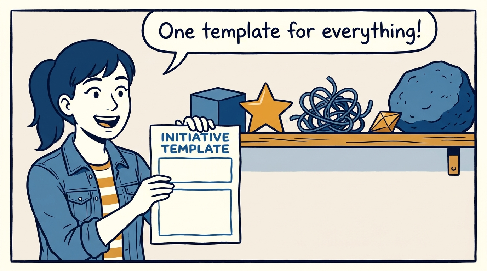
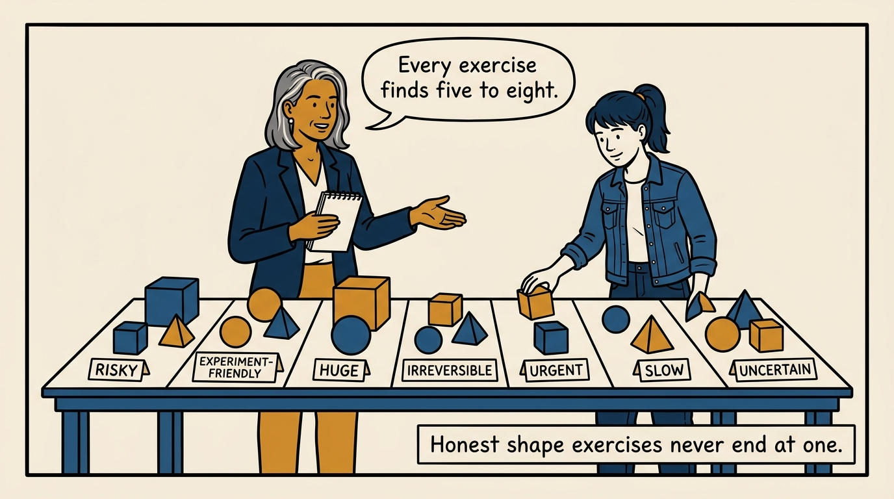
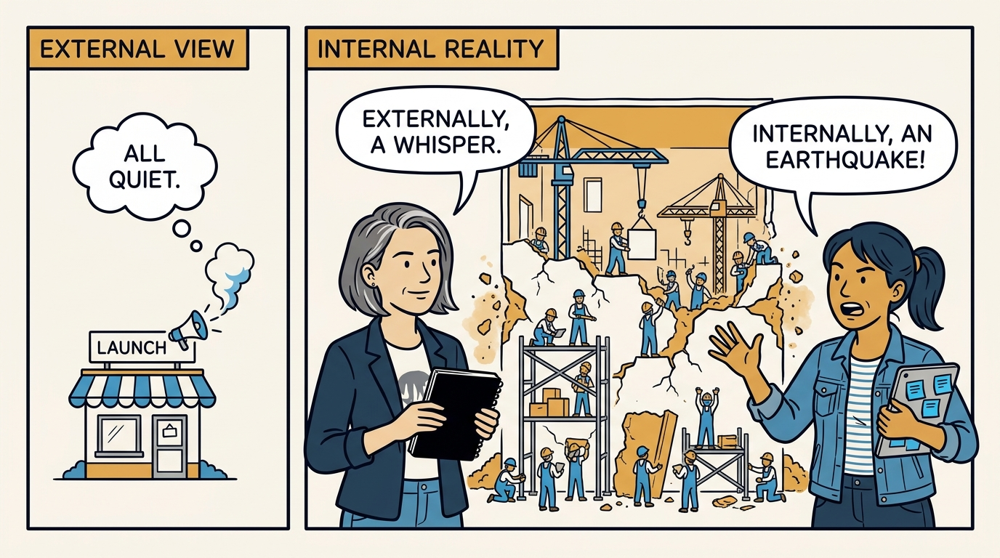
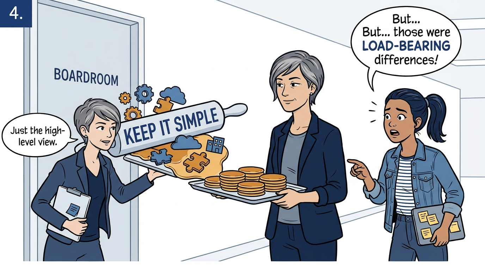
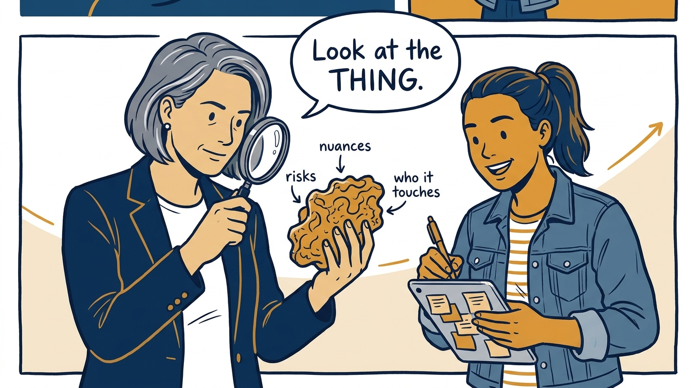
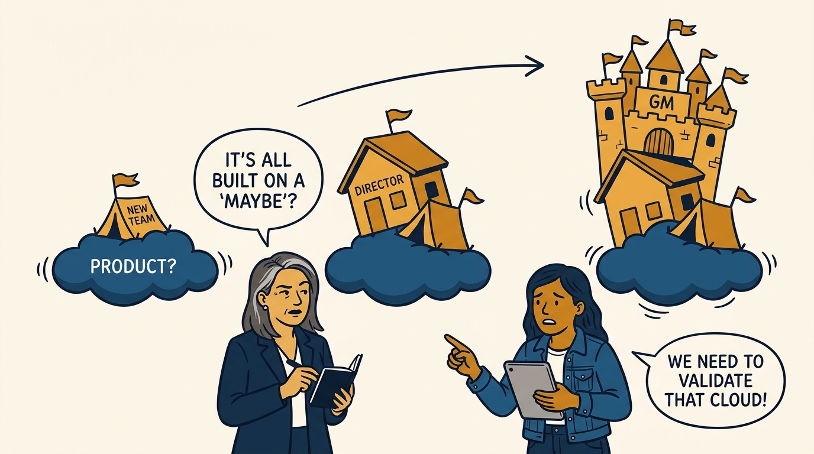
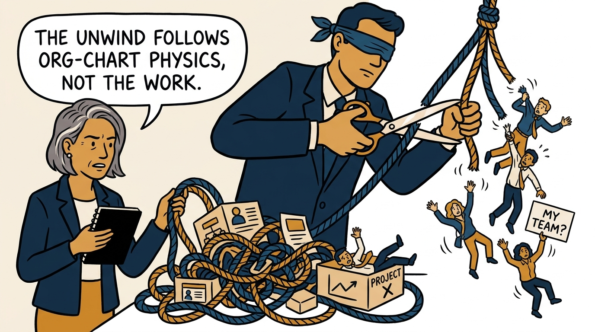
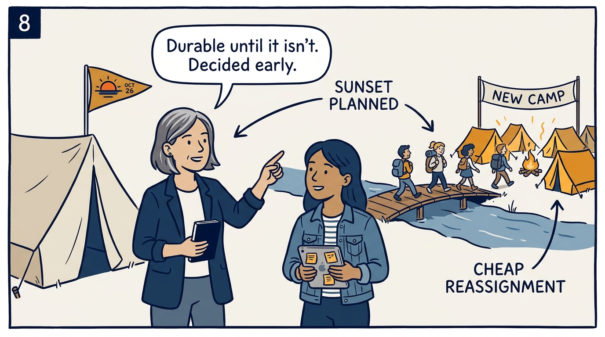

Shapes of work — why one template flattens what matters, in eight panels.

<!-- comic-style
{
  "cast": "VERA: a calm, seasoned product-minded executive, short gray-streaked hair, dark blazer over a plain t-shirt, carries a small black notebook. MILA: an energetic young product manager, dark hair in a ponytail, denim jacket over a striped shirt, carries a tablet covered in sticky notes.",
  "style": "Clean two-tone explainer comic, thick ink outlines, flat colors with deep blue and amber accents on a light background, generous white space, hand-lettered speech bubbles with SHORT readable text, no photorealism."
}
-->

**Panel 1:** *The hook: one template, many shapes — what could go wrong?*

**Panel 2:** *The reality: work comes in 5–8 shapes — never apples to apples.*

**Panel 3:** *The confusion: marketing's launch tier says 'quiet' — the internal blast radius says 'earthquake'.*

**Panel 4:** *The damage: 'keep it simple' flattens the distinction — then the flat version becomes the executive lens.*

**Panel 5:** *The remedy: read the thing, write about it, let the differences surface.*

**Panel 6:** *The dark side: money was plentiful, everyone was busy — and a kingdom grew on a question mark.*

**Panel 7:** *The bill: once the chart hardens, the only unwind is blind — and it lands on people.*

**Panel 8:** *The closer: durability re-earned on schedule — and people move while moving is cheap.*
