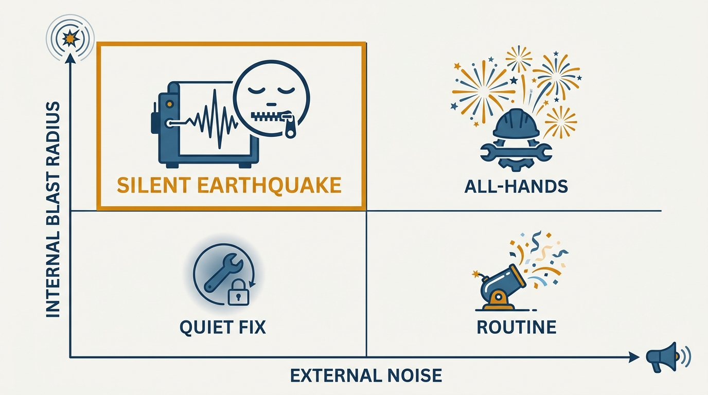
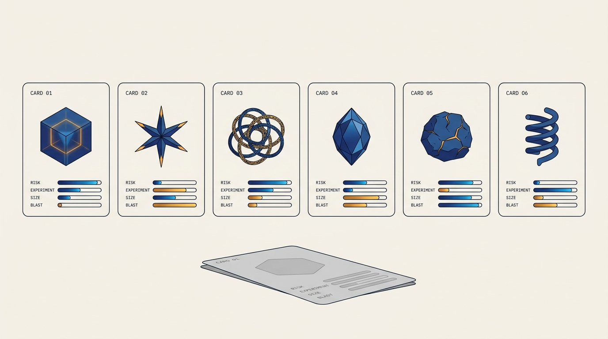
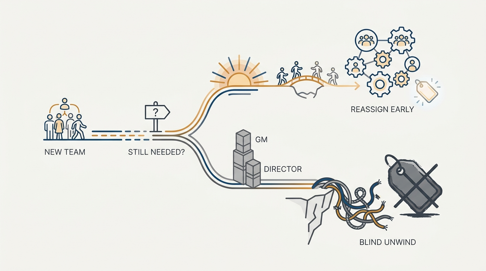

> **Status**: DRAFT
>
> **Principle**: Work has shapes — different risk profiles, experiment-friendliness, sizes, and blast radii — and any honest shape exercise surfaces five to eight of them, never one. I refuse to flatten initiatives into a single template or categorization scheme; I look at the thing itself, write about it explicitly, and let the differences that matter surface. I apply the same discipline to org design: a "stable" team's durability is a claim to be re-earned, not a default — because once hierarchy hardens around it, the only unwind is layoffs.

## Statement

My operating model for shapes has four parts:

- **Expect 5–8 shapes, never one.** Every shape exercise I have seen lands there. This is not pedantic categorization — it is the refusal to treat initiatives, epics, and bets as apples to apples.
- **Separate blast radius from launch tier.** How disruptive work is internally and how loudly marketing announces it are independent axes. Some of the most internally demanding work must make no external sound at all.
- **Read the thing, don't template it.** Look at the actual piece of work. Write about it. Be explicit. Let people raise the nuances and surface the differences that matter. The slide deck may come later; it is never the reality.
- **Re-earn team durability.** Durable teams are my default for ownership and flow — but "we'll always need that" is a claim, not a fact. I sunset teams and reassign people while that is still cheap, before directors and GMs stack up on products that never really existed.

## How to Read This

This record is grounded in John Cutler's "20 Unfiltered Operating Takes" (TBM 435), read through the same practitioner-executive lens as the rest of this journal. It is addressed to whoever owns a template, a launch-tier scheme, or a new-team request — the three places where the flattening instinct does its quiet damage. The working checklist, derived from the essay, lives in the **Checklist** tab.

## Rationale

**One scheme cannot carry two meanings.** The canonical example: most companies have launch tiers, defined by product marketing to describe the *marketing* nature of a launch. Then the tier gets reused as the *coordination* tier — and it breaks, because some work is incredibly disruptive internally, demands enormous coordination, and must produce zero external noise; sometimes it is critical that customers hear nothing. I call this shape the *silent earthquake*: internally seismic, externally mute, and invisible to any scheme with one axis.

That one small distinction — internal blast radius versus external launch demands — has confused company after company. And the failure mode has a voice: "yeah, but we need to keep it simple," after which the too-simple scheme propagates upward to executives and becomes the lens everything is judged through.

**Figure 1:** *Two axes, not one tier: the silent earthquake — internally seismic, externally mute — is exactly what a single scheme loses.*

**Simplicity for the reader is complexity for the doer.** Categorization schemes are mostly built to make work legible to people who are not doing it. That is a legitimate need — I make the slide when it is needed — but every flattening deletes exactly the nuances that determine whether the work succeeds: this bet tolerates experiments, that one does not; this one is reversible, that one is not; this one disrupts three teams' roadmaps, that one none. The remedy is not heavier taxonomy; it is reading. Look at the thing. Write about it explicitly. Nothing needs analyzing to death — but the differences that really matter must be allowed to surface before anyone files the work under a label.

**Figure 2:** *Read each piece of work and its profile emerges — five to eight shapes, no two with the same meters.*

**Stable teams are the same flattening, applied to people.** The kingdom-building sequence is always rational at every step: money is plentiful, everyone is busy, a short-term project needs doing — so a "new team" is spun up. The capability gets rationalized as durable ("we'll always need that" — logic that is irrefutable precisely because it is untestable). Then a director. Then a GM. Three layers of hierarchy now stand on "products" that never really existed. When the correction comes, it arrives as layoffs that damage real lives — not because the people could not be reassigned (they could), but because the physics of org charts and how layoffs work force a blind unravel of yesterday's structure. Leaders will not say this outright; they gesture at "bureaucracy" and "the work around the work." The reality is over-scaling that nobody re-examined while re-examining was still cheap.

**Durability is useful exactly until it is not — so test it while testing is cheap.** None of this argues against durable teams; [[team-topology]] keeps them as my default, because ownership and flow compound. The argument is against durability by *default*. A team formed for a project should carry its sunset assumption openly. A hierarchy layer should follow proven product reality, not anticipate it. And knowing when a durable idea has stopped being useful is hard — which is a reason to schedule the question, not to skip it.

**Figure 3:** *Schedule the durability question: the early fork costs a bridge; the late one costs the cliff.*

## What This Means in Practice

| What this principle says | What it does **not** say |
| --- | --- |
| Every substantial piece of work gets read and written about explicitly. | Everything is analyzed to death — light-touch for genuinely routine work. |
| Launch tier and internal coordination tier are assessed separately. | Launch tiers are useless — marketing's scheme is fine for marketing. |
| Expect 5–8 shapes; resist the single template. | Templates are banned — a template for one well-understood shape is fine. |
| New teams carry explicit durability assumptions and sunset checks. | Teams are disposable — durable ownership remains the default where the product is real. |
| Hierarchy follows proven products. | No structure ever grows — it grows behind the evidence, not ahead of it. |

## Anti-Patterns

- **The single template.** One brief format, one intake form, one process for work of every shape — differences that decide outcomes erased at intake.
- **The borrowed tier.** Marketing's launch tier reused as the coordination tier, so the internally seismic, externally silent project gets tier-3 attention.
- **"We need to keep it simple."** The line that flattens a load-bearing distinction — and then hands the flattened scheme to executives as reality.
- **The irrefutable capability.** "We'll always need that" — durability asserted in a form no evidence could ever falsify.
- **Title stacking.** Director, then GM, layered onto a product that has not yet proven it exists.
- **The blind unravel.** Restructuring by layoff logic rather than by re-reading which work and which capabilities are actually still needed.

## Related Records

- [[team-topology]] — the durable-team default this record disciplines with a sunset test; the two records are one position, not a contradiction.
- [[staffing]] — growing people and teams deliberately; the antidote to spinning up teams because money is plentiful and everyone is busy.
- [[working-small]] — the size ladder; shape here is about *kind*, not magnitude, and the two assessments happen together.
- [[balanced-roadmap]] — where differently shaped work coexists without being forced into one scheme.
- [[dysfunctions]] — the failure catalog this record extends with the flattening and kingdom-building patterns.

## Scope and Revisiting

This principle governs how work gets classified for coordination and how team durability gets asserted and reviewed. I revisit it if explicit shape-reading proves too heavy below a certain work size — the fix would be a floor, not a template — and whenever I hear "we'll always need that" in a headcount conversation, which is this record's cue, not its refutation.

## Authoritative References

- John Cutler, "TBM 435: 20 Unfiltered Operating Takes", *The Beautiful Mess*, August 2026 — the source essay; this record distills its Shapes Of Work and Stable Teams? sections.
