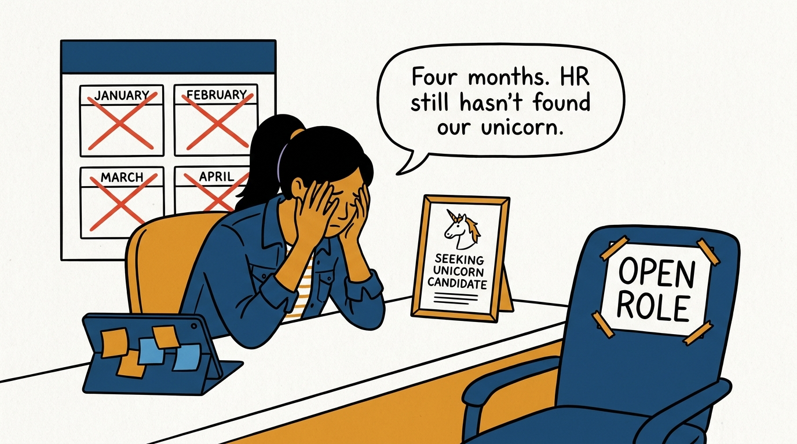
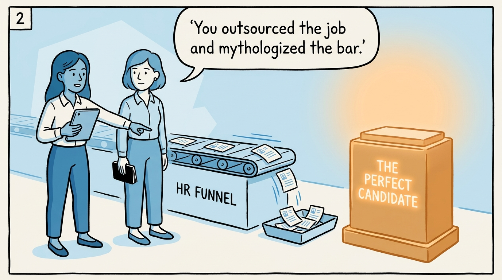
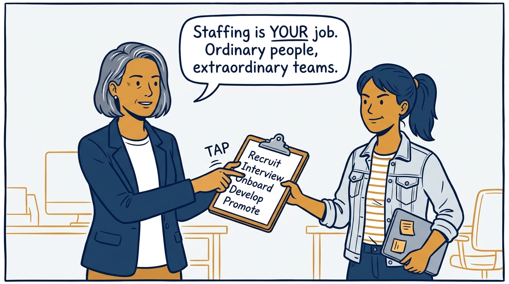
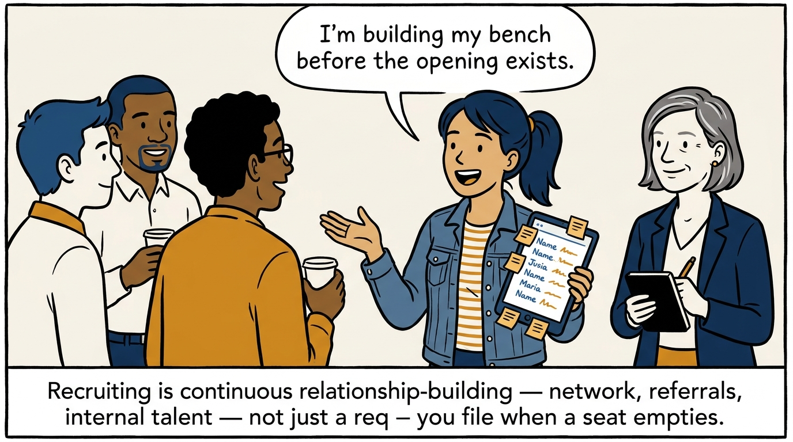
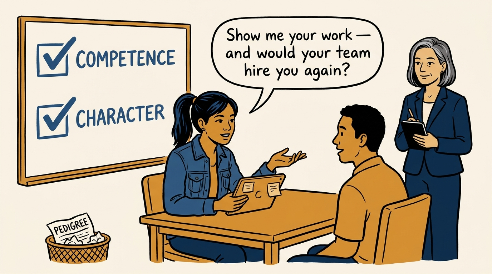
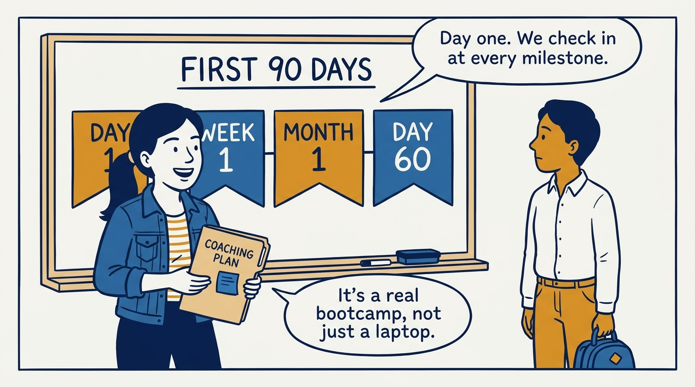
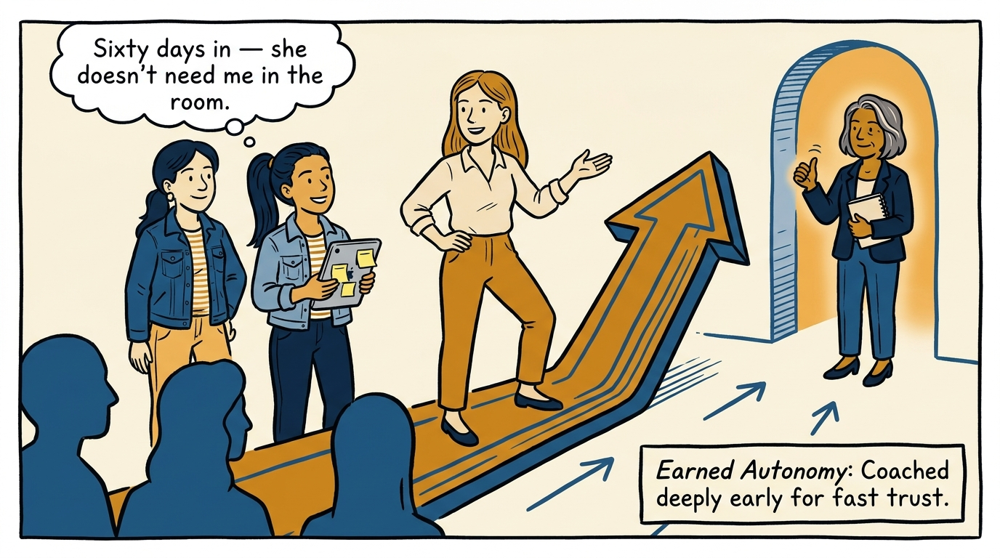
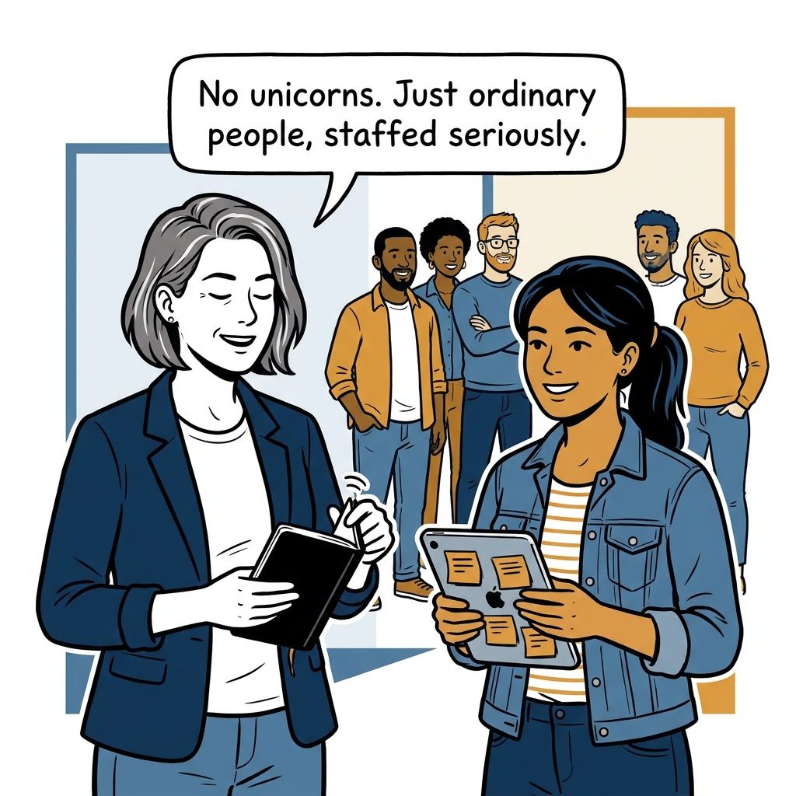

Extraordinary teams from ordinary people — why the hiring manager owns staffing, in eight panels.

<!-- comic-style
{
  "cast": "VERA: a calm, seasoned product-minded executive, short gray-streaked hair, dark blazer over a plain t-shirt, carries a small black notebook. MILA: an energetic young product manager, dark hair in a ponytail, denim jacket over a striped shirt, carries a tablet covered in sticky notes.",
  "style": "Clean two-tone explainer comic, thick ink outlines, flat colors with deep blue and amber accents on a light background, generous white space, hand-lettered speech bubbles with SHORT readable text, no photorealism."
}
-->

**Panel 1:** *The hook: four months of waiting for HR to deliver a unicorn.*

**Panel 2:** *The problem: staffing outsourced to a funnel, the bar turned into a myth.*

**Panel 3:** *The principle: the hiring manager owns staffing — ordinary people, extraordinary teams.*

**Panel 4:** *Recruiting as ongoing work: build the network before the opening exists.*

**Panel 5:** *The bar: competence and character — pedigree goes in the bin.*

**Panel 6:** *Deliberate onboarding: the first 90 days are planned, not improvised.*

**Panel 7:** *The ramp to autonomy: coach deeply early, then step back.*

**Panel 8:** *The closer: no unicorns — ordinary people, staffed seriously.*
