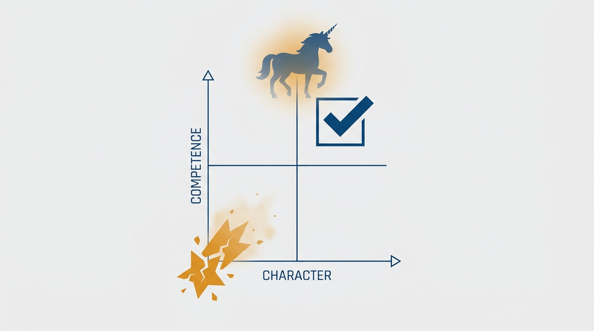

> **Status**: DRAFT
>
> **Principle**: I treat staffing as one of my most important jobs as a hiring manager, and I never outsource its ownership to HR. I hire for competence and character — not pedigree, not vague "cultural fit," not brilliant-but-toxic star power — because extraordinary teams are built from ordinary, competent people of character. I recruit continuously before openings exist, close strong candidates within 24–48 hours with references I check personally, onboard deliberately through the first 90 days, give feedback weekly rather than annually, and act quickly when performance or behavior threatens the team.

## Statement

My operating model for staffing product teams has five parts:

- **Own it personally.** Recruiting, interviewing, hiring, onboarding, development, and promotion are the hiring manager's job — mine. HR supports with process and compliance; ownership never transfers.
- **Hire for competence and character.** I look for demonstrated competence, integrity, coachability, and people who think differently from the current team. I reject brilliant-but-toxic candidates, and I refuse to over-index on pedigree, domain experience, or vague "cultural fit."
- **Recruit continuously.** I build a network of candidates before openings exist — referrals, events, internal talent, long-term relationships — and I move fast when I find someone strong: an offer within 24–48 hours, references checked by me.
- **Onboard intentionally.** The first 90 days are critical. I check in at deliberate milestones — first day, first week, first paycheck, first month, 60 days — run a real bootcamp beyond generic orientation, and build a coaching plan toward earned autonomy.
- **Keep the team strong.** Weekly 1:1s are the feedback mechanism, not the annual review. I distinguish competence problems (coach, clarify, give time) from toxic behavior (act decisively), promote deliberately, and treat regrettable attrition as a signal about management, starting with me.

**Figure 1:** *Staffing is the hiring manager's chain to hold end to end — HR supports, but ownership never transfers.*

## How to Read This

This journal is the product-management counterpart to my engineering-executive journal: the same first-person operating records, applied to how product management should work. This record is grounded in Marty Cagan and Chris Jones's *EMPOWERED: Ordinary People, Extraordinary Products*, read through a practitioner-executive lens — I keep what survives contact with real organizations. Two boundaries matter: the cross-journal [[hiring]] record covers my hiring role as an engineering executive — funnels, offers, executive recruiting — while this record covers staffing product teams as the product hiring manager; and the sibling [[right-team]] record covers the *shape* of the product team, while this one covers how I fill and grow it. The working checklist — all sixteen sections plus the manager operating rhythm — lives in the **Checklist** tab of this post.

## Rationale

**Outsourced staffing produces the teams you deserve, not the teams you need.** When staffing means filing a req and waiting for HR to source candidates, the manager has delegated the single decision with the highest leverage on the team's future. HR is an essential partner for process, compliance, and coordination — but the judgment about who joins, how they ramp, and whether they grow is leadership work. A manager who treats staffing as a continuous responsibility recruits before openings exist, knows the pipeline personally, and never discovers a vacancy and a cold start at the same time.

**The unicorn myth is an excuse for not building.** Waiting for the perfect candidate — the brand-name employer, the exact domain background, the visible star — is how positions stay open for months while the team drowns. The *EMPOWERED* answer is the one I hold: extraordinary teams are built from ordinary people — competent, of good character, coachable — developed by managers who take coaching seriously. Pedigree predicts little; demonstrated competence and integrity predict a lot. And a candidate who thinks differently from the current team is a feature, not a fit problem.

**Figure 2:** *The bar is competence and character — the unicorn is a myth and the brilliant-but-toxic star fails the test.*

**Speed is respect, and slowness is a competitor's offer.** Once I identify a strong candidate, I aim to make an offer within 24–48 hours. I conduct reference checks personally and ask the question that cuts through polish: *would you hire this person again?* I listen for signs of disrespect or toxicity, and I personally communicate my commitment to coaching and developing the person I am asking to join. Strong candidates read hesitation accurately — a slow process signals a slow organization.

**Onboarding is where hiring succeeds or quietly fails.** The first 90 days determine whether a good hire becomes a strong contributor. So I check in at deliberate milestones — end of first day, end of first week, after the first paycheck, after the first month, after 60 days — establish trust early, assess strengths and gaps, and build a coaching plan. A real bootcamp goes beyond generic orientation: how decisions are made here, what matters most now, how trust is built, customer understanding, the financial model, discovery, prioritization. The goal is not to tell smart people what to do; it is to equip them to solve problems well. Autonomy is the endpoint of the ramp, not the starting assumption.

**Feedback is weekly; the annual review is administration.** If a performance issue first surfaces in an annual review, the manager has failed twice — once by not seeing it, once by not saying it. Weekly 1:1s carry honest, timely feedback; expectations stay unmistakably clear. When problems persist, I distinguish a hiring mistake — clear coaching, escalating clarity, a reasonable period to improve, help finding a better-fitting role — from toxic behavior, where I protect the team's trust and psychological safety and act decisively, no matter how strong the individual's skills. Retention closes the loop: people leave managers, not companies, and regrettable attrition is data about me.

**Figure 3:** *The first 90 days as a deliberate ramp: milestone check-ins, a coaching plan, and earned autonomy at the top.*

## What This Means in Practice

| What this principle says | What it does **not** say |
| --- | --- |
| The hiring manager owns recruiting, interviewing, onboarding, and promotion. | HR is irrelevant — it owns process and compliance, and I rely on it. |
| Hire competent people of character; coach them into an extraordinary team. | Lower the bar — competence and character *is* the bar, held high. |
| Recruit continuously, before openings exist. | Every coffee chat is a covert interview; relationships are long-term and honest. |
| Close strong candidates within 24–48 hours. | Skip the reference checks — I do them personally, and fast. |
| Deliberate onboarding with milestone check-ins and a bootcamp. | New hires are fragile — the ramp exists to *earn* autonomy quickly. |
| Act decisively on toxic behavior, whatever the person's skills. | Every performance problem is toxicity — hiring mistakes get coaching and time. |

Concretely: no product role is opened without me knowing who might fill it; interview teams are curated, each interviewer knowing exactly what they evaluate; offers move in days, not weeks; every new product person gets milestone check-ins and a coaching plan; and my operating rhythm — weekly recruiting time and 1:1s, monthly pipeline and retention reviews, quarterly team-strength audits — keeps staffing continuous instead of episodic.

## Anti-Patterns

- **Staffing as req-filling.** Filing the opening, waiting passively for HR sourcing, and calling the result a team.
- **The unicorn vigil.** Holding a role open for months waiting for the perfect résumé while the team absorbs the gap.
- **Pedigree worship.** Optimizing for brand-name employers and domain trivia over demonstrated product competence and character.
- **The brilliant jerk exemption.** Letting strong skills excuse behavior that corrodes the team's trust and psychological safety.
- **"Cultural fit" as a veto.** Using vague fit language to reject people who merely think differently from the current team.
- **Orientation-as-onboarding.** A laptop, a login, a generic HR deck — then surprise at a slow ramp and a struggling hire.
- **The annual ambush.** Saving hard feedback for the review cycle instead of the weekly 1:1, then acting shocked by the reaction.
- **Slow-motion closing.** Taking two weeks to decide on a strong candidate and losing them to an organization that took two days.

## Related Records

- [[coaching]] — staffing hands every new hire into the coaching practice; the hiring commitment I make is a coaching commitment.
- [[right-team]] — the shape and composition of the product team this record staffs.
- [[hiring]] — the engineering executive's hiring role; the same seriousness, a different chair.
- [[engineering-onboarding]] — the engineering counterpart of the deliberate ramp; the milestone logic is shared.

## Scope and Revisiting

This principle governs how I staff product teams: the hiring standard, recruiting, interviewing, closing, onboarding, feedback, performance action, promotion, and retention. I revisit it whenever a role stays open past a quarter, whenever a new hire is struggling at the 90-day mark, and whenever regrettable attrition clusters under one manager — including me. The operating rhythm self-enforces: weekly, monthly, and quarterly reviews are part of the checklist.

## Authoritative References

- Marty Cagan with Chris Jones, *EMPOWERED: Ordinary People, Extraordinary Products* (Wiley, 2020) — the staffing chapters this record's checklist distills.
- Much of the book's material began as essays by the authors and their SVPG partners, freely available at [svpg.com](https://www.svpg.com/).
