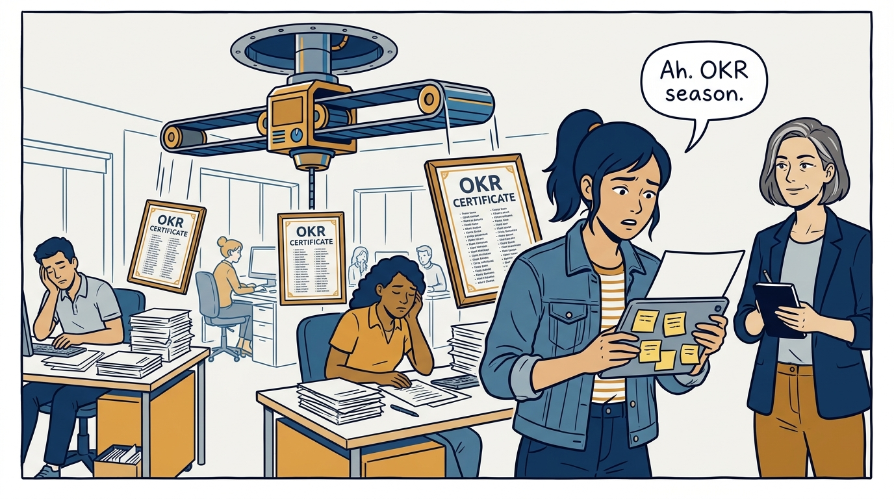
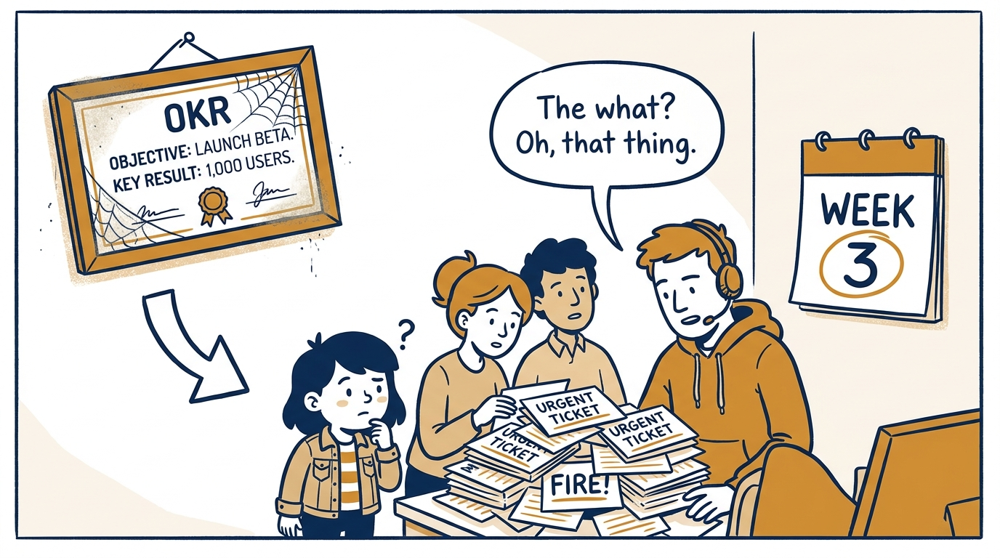
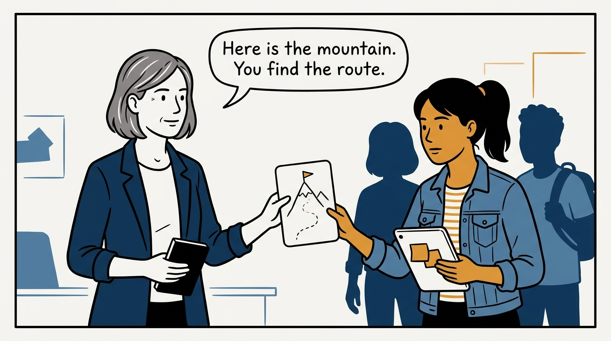
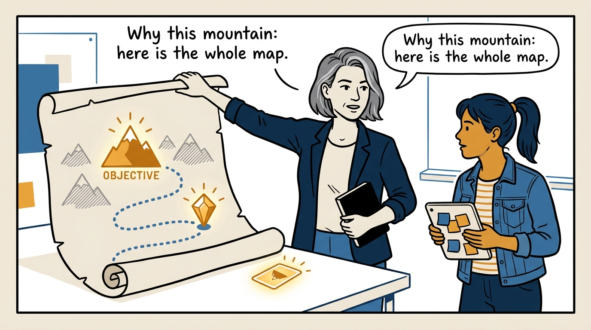
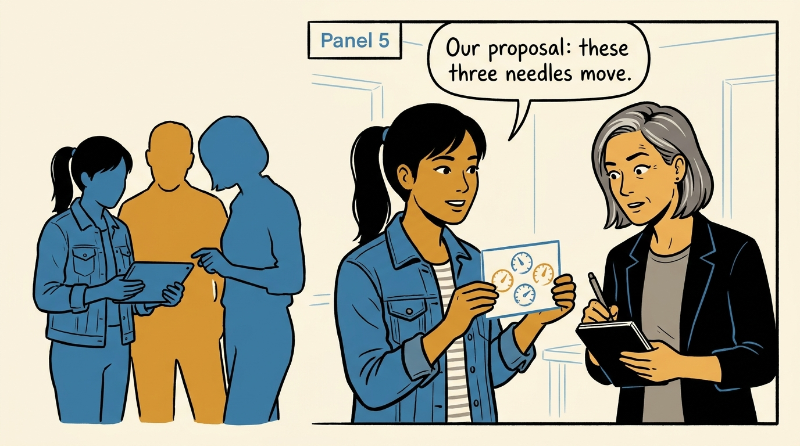
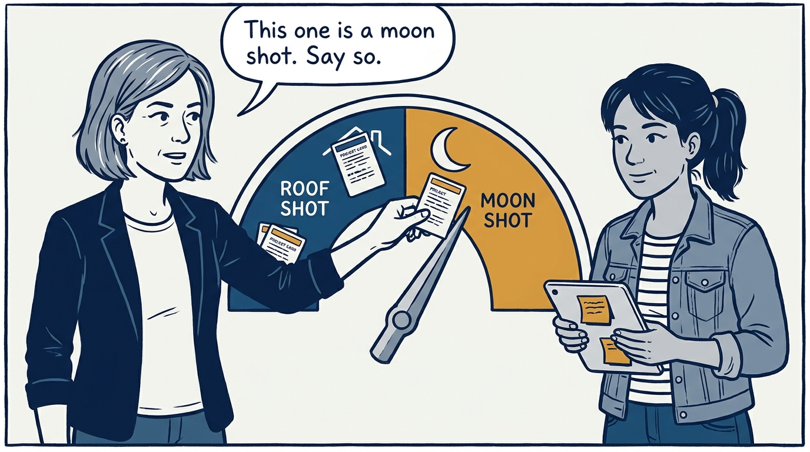
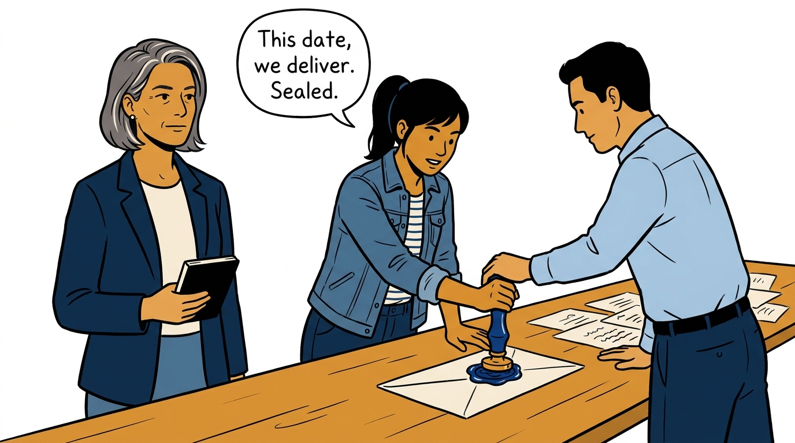
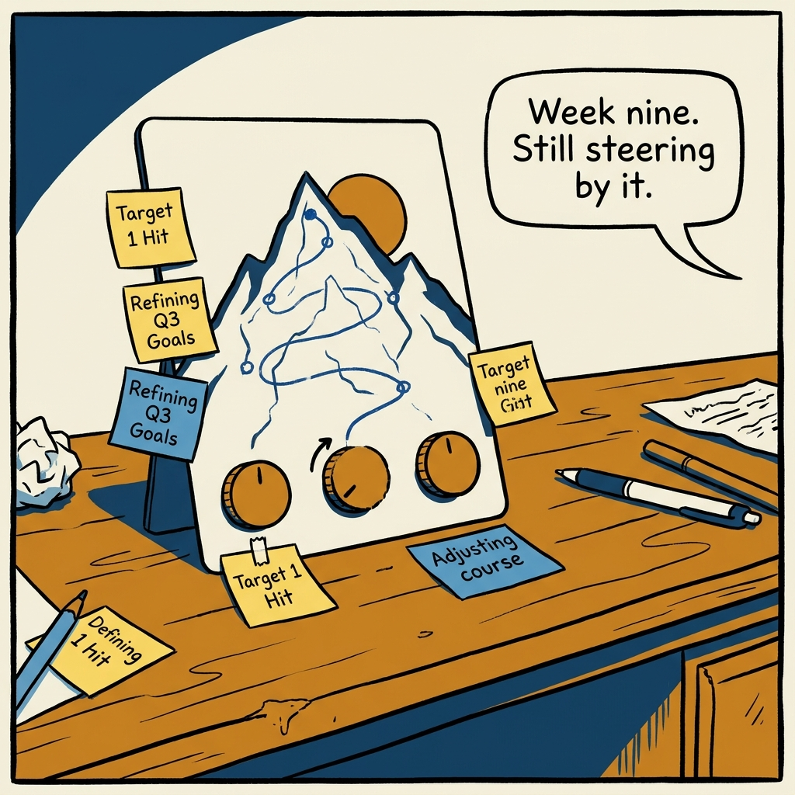

Problems to solve, not features to ship — team objectives without the theater, in eight panels.

<!-- comic-style
{
  "cast": "VERA: a calm, seasoned product-minded executive, short gray-streaked hair, dark blazer over a plain t-shirt, carries a small black notebook. MILA: an energetic young product manager, dark hair in a ponytail, denim jacket over a striped shirt, carries a tablet covered in sticky notes.",
  "style": "Clean two-tone explainer comic, thick ink outlines, flat colors with deep blue and amber accents on a light background, generous white space, hand-lettered speech bubbles with SHORT readable text, no photorealism."
}
-->

**Panel 1:** *The hook: objectives handed down like framed feature lists.*

**Panel 2:** *The problem: by week three the objectives are wall decoration.*

**Panel 3:** *The principle: assign the mountain, not the route.*

**Panel 4:** *Context flows down: the objective arrives with its why.*

**Panel 5:** *Key results flow up: the team proposes what the needles should do.*

**Panel 6:** *Ambition is explicit: roof shot or moon shot, named before the quarter starts.*

**Panel 7:** *The exception: a high-integrity commitment — rare, sealed, and kept.*

**Panel 8:** *The closer: an objective the team owns is one the quarter actually follows.*
