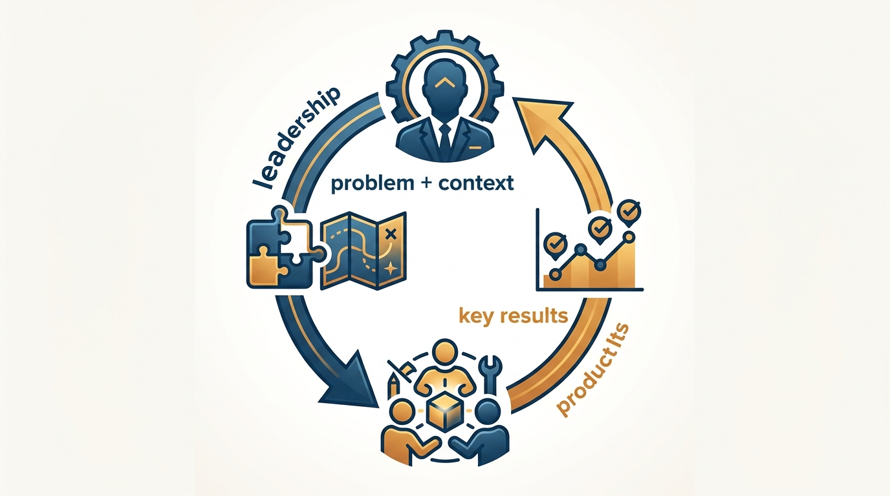
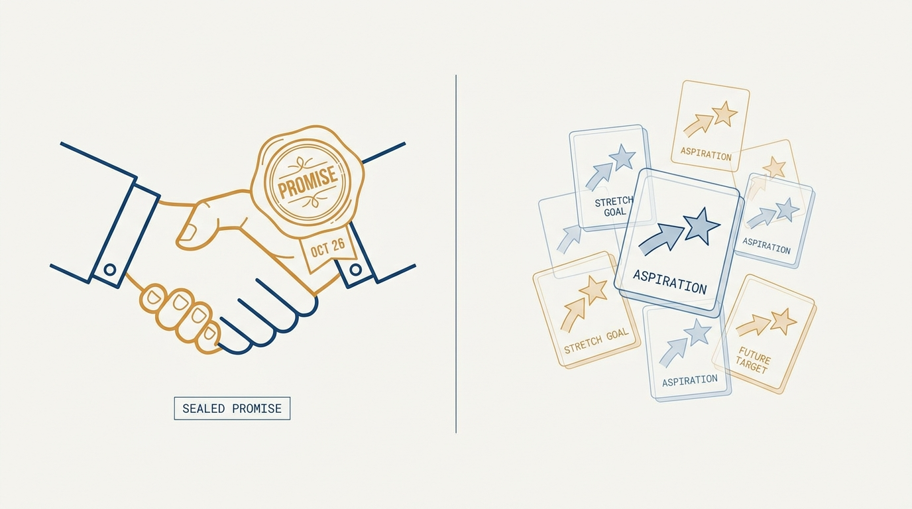

> **Status**: DRAFT
>
> **Principle**: I assign teams problems to solve, not features to ship. Objectives flow from strategy — with the mission, vision, and context a team needs to act on them — and key results flow back up, proposed by the team that has to deliver them. Ambition is explicit: I say whether an objective is a roof shot or a moon shot, and I hold teams accountable in proportion to the ambition I set. The few high-integrity commitments we make are investigated before they are promised, tracked separately, and kept — because OKRs without empowerment are theater.

## Statement

My operating model for team objectives has five parts:

- **Assign problems, not features.** Objectives are customer or business problems to solve — qualitative, outcome-oriented, few in number, and important enough to matter strategically. Never a deliverable dressed up as a goal.
- **Context flows down, key results flow up.** Leadership provides strategic context — mission, product vision, principles, strategy — and explicitly decides which teams work on which problems, based on strategy and team topology. The team studies the problem and proposes 2 to 4 key results per objective: one primary success measure, plus guardrails so progress in one area does not damage another.
- **Set the ambition dial explicitly.** Every objective is declared a roof shot or a moon shot. Ambition is portfolio risk management, not a mood — and it is not the same thing as effort or urgency.
- **Keep commitments rare and high-integrity.** When a date or deliverable truly matters, we investigate feasibility, usability, value, and viability before promising, track the commitment separately from normal key results, raise risks early, and keep our word. Commitments are the exception, not the rule.
- **Manage actively, hold to account proportionally.** Weekly check-ins, coaching, early escalation, dependencies watched all quarter. When an ambitious bet misses, we run a constructive postmortem — what the team could have surfaced earlier, what leadership missed — and improve the system, not just the team.

**Figure 1:** *The two-way flow: leaders assign the problem and the context down; the team proposes the key results up.*

## How to Read This

This journal is the product-management counterpart to my engineering-executive journal: the same first-person operating-principle format, applied to how product work is directed rather than how engineering organizations are run. This record is grounded in Marty Cagan and Chris Jones's *EMPOWERED* — its team-objectives chapters — read through a practitioner-executive lens: I keep what I have seen work and state it as my own commitments.

The boundary with [[outcomes]] matters: that record establishes *what* outcomes are and why they beat output as a measure of success. This one starts where that argument ends — *how* teams are handed problems, propose results, set ambition, and make the rare commitment that must hold. The working checklist — all thirteen sections plus the final quality check — lives in the **Checklist** tab of this post.

## Rationale

**Features assigned top-down produce output; problems assigned with context produce outcomes.** When I hand a team a feature list with target dates, I have already made the most important decisions myself — with the least information about the problem. When I hand the same team a customer or business problem, plus the strategic context to make good decisions independently, the people closest to the technology and the users get to find the best solution — and to think through several before locking into one. This is the whole difference between empowered product teams and feature teams; objectives are simply where that difference becomes operational.

**Key results proposed by the team are the price of real accountability.** If I dictate the targets, a miss is my miss — the team was just following orders. When the team studies the problem and proposes its own key results — outcomes, not activities; meaningful, not merely easy to measure — the numbers carry their judgment and their name. I still negotiate: if the proposed scope or results do not match the business need, the assignment gets revisited. But the proposal direction is up, not down. That back-and-forth is not overhead; it is the mechanism.

**An unspoken ambition level makes every result unreadable.** If the team thought it was a moon shot and I thought it was a roof shot, we will disagree about whether 70% attainment is a success or a failure — after the fact, when it is too late. So I say it in advance, treat the mix of roof shots and moon shots as portfolio risk management, and am explicit when multiple teams should attack the same problem at different risk levels. And because the level was explicit, accountability can be proportional: ambitious bets that miss owe us learning; a constructive postmortem asks what the team could have surfaced earlier *and* what leadership missed, then improves the system.

**Figure 2:** *The ambition dial: every objective is declared a roof shot or a moon shot — and the mix across teams is portfolio risk management.*

**A commitment that was never investigated is a guess with a deadline.** Some dates genuinely matter — a partner launch, a regulatory deadline, a contract. For those, and only those, we make a high-integrity commitment: the team investigates feasibility, usability, value, and viability first, the commitment is tracked separately from aspirational key results, and risks are raised the moment they appear. Keeping commitments rare is what keeps them credible — a quarter full of "commitments" is just a roadmap with extra ceremony, and it destroys the stretch that makes normal objectives useful.

**Figure 3:** *The high-integrity commitment: sealed, dated, tracked separately — and rare enough to stay credible.*

**Objectives die of neglect, not of bad wording.** The failure mode I have seen most is not badly phrased OKRs; it is OKRs written in January and rediscovered in March. So objectives get active management: weekly check-ins on where the team is, what is next, and where help is needed; coaching for less experienced teams; dependencies monitored continuously; cross-team and platform alignment confirmed early. And the plan respects reality: keep-the-lights-on work — support, bugs, technical debt — is estimated up front, and objective progress is protected from being silently consumed by it.

## What This Means in Practice

| What this principle says | What it does **not** say |
| --- | --- |
| Objectives are problems to solve, assigned with strategic context. | Teams pick their own objectives with no direction — leadership explicitly assigns problems across the portfolio. |
| Key results are proposed by the team. | Every proposal is accepted — assignments are revisited when results do not match the business need. |
| Ambition is declared: roof shot or moon shot. | Moon shots excuse missing everything — accountability is proportional, not absent. |
| High-integrity commitments are investigated, tracked separately, and kept. | Every objective is a commitment — commitments stay the exception. |
| Weekly check-ins and coaching all quarter. | Leaders "set and forget" and audit in the last week. |
| Keep-the-lights-on work is priced into capacity. | Operational load is an excuse to attempt nothing. |

Concretely: objective-setting each quarter starts from product strategy and team topology, mixes top-down and bottom-up input, and lets teams volunteer for problems they are motivated to pursue — while I optimize across the whole portfolio and make sure the full set of company priorities is covered. Shared objectives (teams pursuing one objective together) and common objectives (teams attacking one problem in different ways) are allowed and made explicit. Mid-quarter changes happen only when necessary.

## Anti-Patterns

- **The feature list in OKR costume.** "Objectives" that are deliverables with dates — output renamed, empowerment untouched.
- **Dictated key results.** Targets handed down with the objective, so the team executes someone else's guess and owns none of it.
- **Ambition by vibes.** No declared roof-shot/moon-shot level, so success and failure are litigated after the results are in.
- **Commitment inflation.** Everything labeled a commitment, so nothing is — and stretch disappears from the whole portfolio.
- **Set-and-forget OKRs.** Objectives written in week one, ignored by week three, rediscovered at review time.
- **Capacity denial.** Plans that assume zero support, bugs, or debt — then quietly fail on operational load that was always predictable.
- **Blame theater.** Treating a missed moon shot as a performance problem instead of running the postmortem on the system — including what leadership missed.

## Related Records

- [[empowered-product-strategy]] — where the problems come from; this record starts where strategy hands a problem to a team.
- [[outcomes]] — the Build-What-Matters sibling on what outcomes are and why they beat output; this record covers how teams commit to them.
- [[measuring-engineering-organizations]] — the engineering-executive counterpart on measurement; guardrail key results echo its "pair every metric" instinct.
- [[planning]] — the engineering-executive view of planning cadences; team objectives are the product-side contract inside that rhythm.

## Scope and Revisiting

This principle governs how objectives are assigned, how key results are proposed and negotiated, how ambition and commitments are set, and how progress is managed within the quarter. I revisit it every quarterly refresh, whenever I catch an objective that is secretly a feature list, and whenever the count of high-integrity commitments in a quarter starts to climb — that number drifting up is the earliest signal that empowerment is eroding.

## Authoritative References

- Marty Cagan with Chris Jones, *EMPOWERED: Ordinary People, Extraordinary Products* (Wiley, 2020) — the team-objectives chapters this record's checklist distills.
- Much of the book's thinking began as essays by the authors at [svpg.com](https://www.svpg.com/), where the underlying material can still be read.
