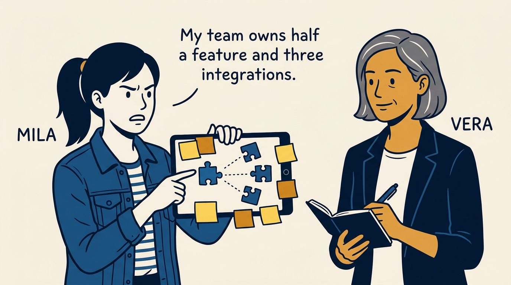
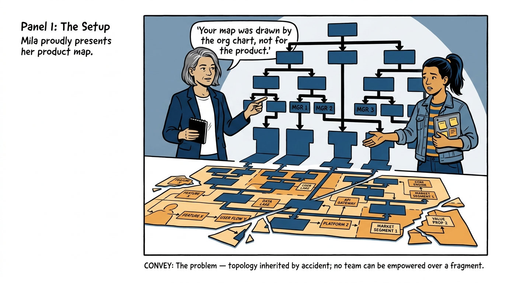
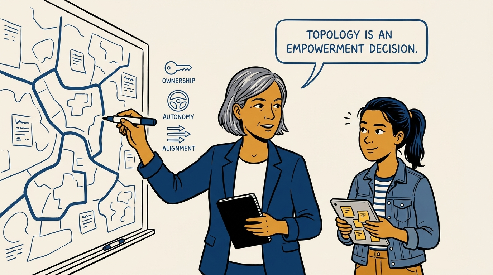
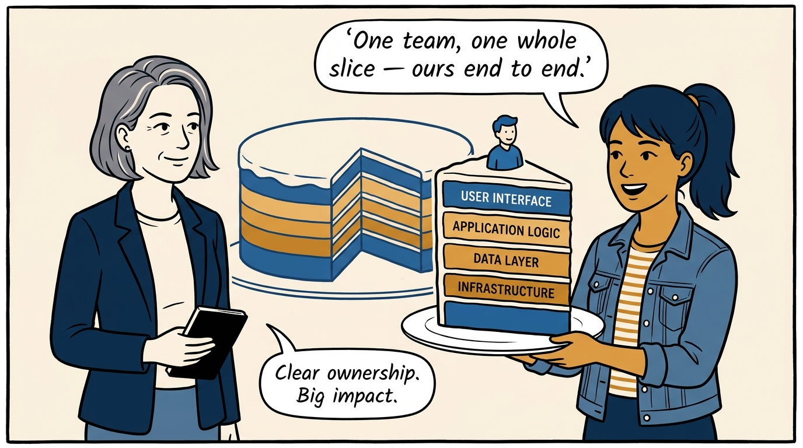
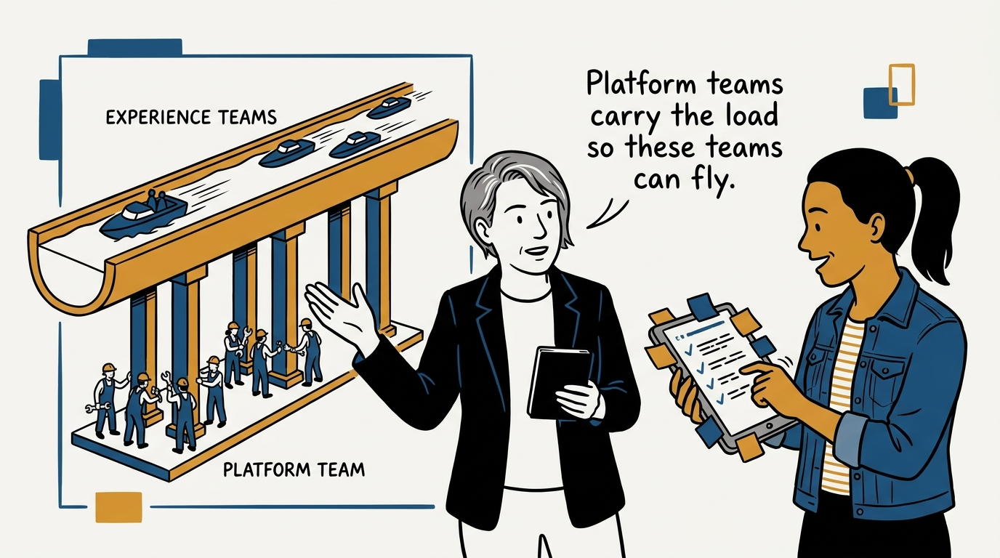
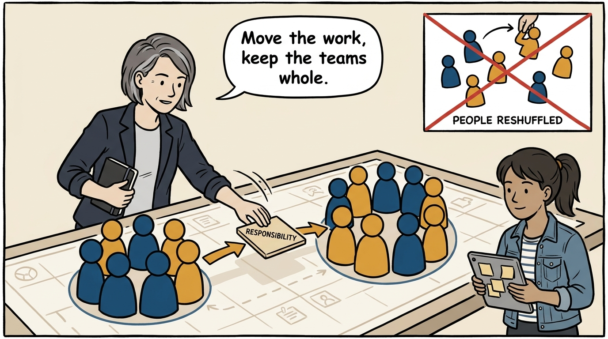
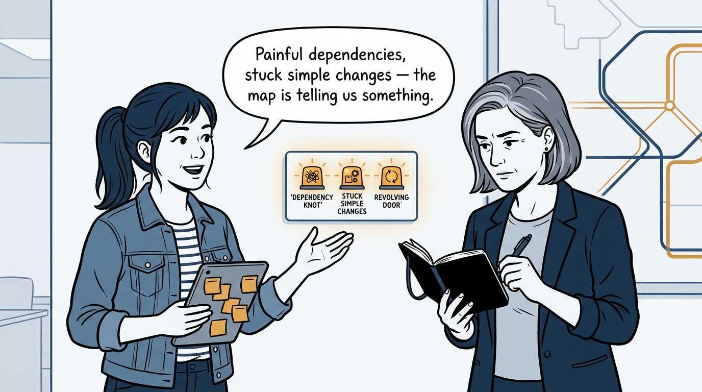
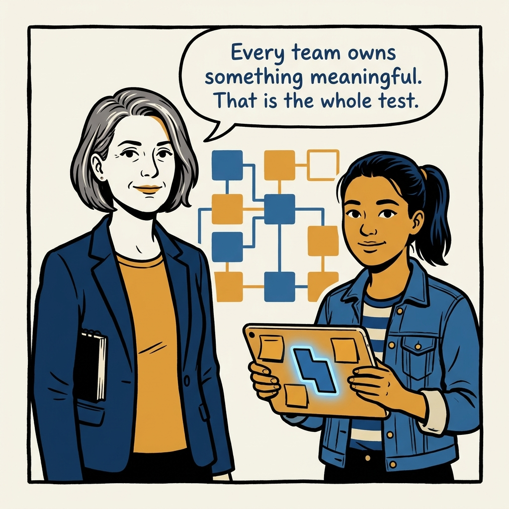

Draw the map for empowerment, not the org chart — team topology in eight panels.

<!-- comic-style
{
  "cast": "VERA: a calm, seasoned product-minded executive, short gray-streaked hair, dark blazer over a plain t-shirt, carries a small black notebook. MILA: an energetic young product manager, dark hair in a ponytail, denim jacket over a striped shirt, carries a tablet covered in sticky notes.",
  "style": "Clean two-tone explainer comic, thick ink outlines, flat colors with deep blue and amber accents on a light background, generous white space, hand-lettered speech bubbles with SHORT readable text, no photorealism."
}
-->

**Panel 1:** *The hook: half a feature and three integrations is not ownership.*

**Panel 2:** *The problem: topology by org-chart accident — no one can be empowered over a fragment.*

**Panel 3:** *The principle: the map is designed for empowerment, never inherited.*

**Panel 4:** *Ownership that works: a meaningful slice, end to end.*

**Panel 5:** *Two team types, one system: platforms provide leverage, experience teams own outcomes.*

**Panel 6:** *Evolution without churn: responsibilities move, intact teams stay together.*

**Panel 7:** *Read the warning signs: when simple things get hard, blame the map, not the people.*

**Panel 8:** *The closer: every team owns something meaningful — that is the test.*
