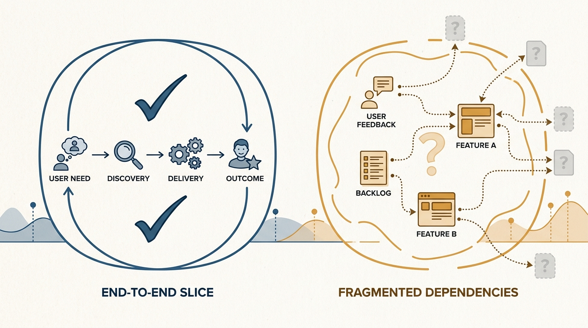
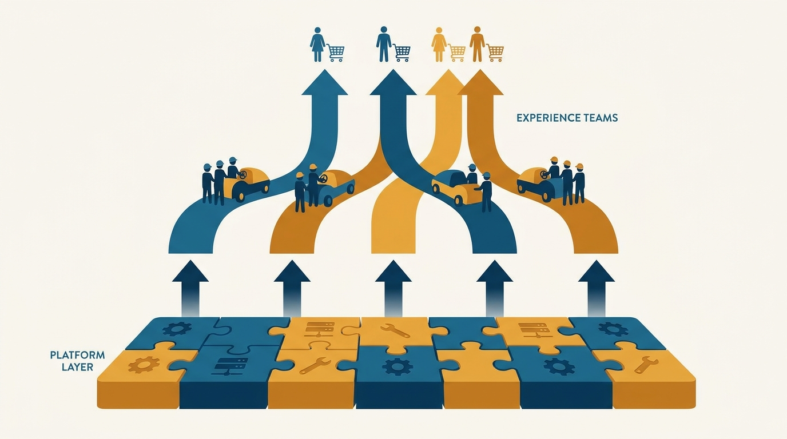
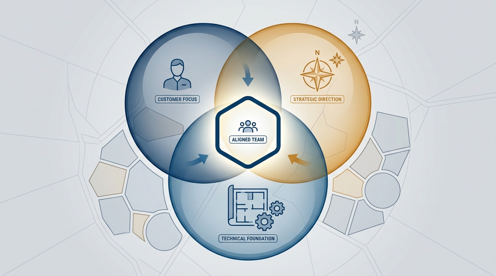

> **Status**: DRAFT
>
> **Principle**: I treat team topology as an empowerment decision. The way I split product work across teams determines whether any team *can* be empowered at all, so I design the topology intentionally — anchored to strategy, optimized for ownership, autonomy, and alignment — rather than inheriting it from reporting lines. Every team owns something meaningful end to end: platform teams provide leverage and reduce cognitive load; experience teams own customer outcomes. Boundaries align with customers, business, and architecture. And I keep the topology stable, evolving it deliberately by moving responsibilities between intact teams, not by shuffling people.

## Statement

My operating model for team topology has five parts:

- **Start from strategic context.** Team design is anchored to the company's mission, objectives, and scorecard, and reflects the product vision and strategy — not org-chart convenience.
- **Optimize for empowerment.** The topology is intentionally designed to maximize **ownership**, **autonomy**, and **alignment**, so teams can do great work with minimal unnecessary coordination.
- **Give every team meaningful ownership.** Each team owns something meaningful end to end — functionality, experience, quality, performance, and technical health where appropriate. Broad enough to motivate, not so broad it overwhelms, and clear enough that teams know what is theirs.
- **Use the right team types.** Platform teams provide leverage through shared services, tooling, and abstraction, and reduce cognitive load for the rest; experience teams own user- and customer-facing outcomes, aligned by the most natural customer dimension.
- **Keep the topology stable, but evolving.** I review the topology as strategy, architecture, and scale change; when it must change, I move responsibilities between intact teams rather than moving people between teams.

**Figure 1:** *The empowerment test: a boundary that encloses something meaningful end to end versus a boundary around fragments that dependencies immediately leak out of.*

## How to Read This

This journal is the product-management counterpart to my engineering-executive journal: the same first-person, spec-driven record style, applied to how I believe product management should work. This record is grounded in Marty Cagan and Chris Jones's *EMPOWERED: Ordinary People, Extraordinary Products*, read through a practitioner-executive lens — I keep what survives contact with real organizations and state it as my own operating principle.

The engineering journal carries its own team-topology records, grounded in Skelton and Pais's *Team Topologies* — most directly [[four-fundamental-team-topologies]]. The two models answer different questions about the same org chart: Skelton and Pais optimize for **flow** (team types, interaction modes, cognitive load); Cagan optimizes for **empowerment** (ownership, autonomy, alignment). I hold both, and they agree far more than they differ — this record is the empowerment-oriented cut, cross-linked rather than merged.

The working checklist — all thirteen sections plus the quick scorecard — lives in the **Checklist** tab of this post.

## Rationale

**Topology decides whether empowerment is even possible.** I can give a team a problem to solve, control over the solution, and room for discovery — and none of it matters if the team's boundary encloses half a feature and three integrations. A team cannot be empowered over a fragment. So before I talk about coaching, strategy, or objectives, I look at the map: does each team own something meaningful, end to end? If not, no downstream fix will hold. That is why topology is the first structural decision, and why it is anchored to mission, vision, and strategy rather than to whoever happens to report to whom.

**Ownership must be meaningful, bounded, and clear.** The three failure modes are symmetric: ownership too narrow to motivate anyone, ownership so broad it drowns the team in complexity, and ownership so vague that two teams both think the same thing is theirs — or worse, neither does. I draw boundaries that reduce ambiguity and overlap, and I make dependencies between teams explicit and deliberately acceptable, not accidental. Autonomy follows from this: teams that own a real slice can perform discovery as well as delivery, choose their own solutions, and ship small changes without convening a coordination meeting.

**Platform teams and experience teams do different jobs, and both need real ownership.** Experience teams own user- and customer-facing outcomes, organized around the most natural customer dimension — persona, market segment, journey stage, sales channel, business KPI, or geography — with as much end-to-end ownership as possible, never fragmented into tiny feature areas. Platform teams exist to enable them: shared services, tooling, and abstraction that provide leverage and absorb cognitive load. Platform teams are not a dumping ground — they have clear objectives, collaborate with experience teams through shared objectives when needed, and where appropriate their internal platform is managed like a product, with the experience teams as its customers.

**Figure 2:** *Platform teams provide leverage and absorb cognitive load; experience teams ride on them and own customer outcomes end to end.*

**Alignment is a three-lens exercise.** I check every proposed boundary against three overlapping lenses: does it align with customers and business outcomes, with the product vision, and — where useful — with the architecture? When the lenses agree, handoffs drop and decisions speed up. When they disagree, I want to know which one I am sacrificing and why. Architecture is a lens, not a cage: teams trapped by legacy architecture or excessive technical debt are a topology smell, and sometimes the answer is to fix the architecture rather than contort the teams around it.

**Figure 3:** *Three lenses on every boundary: customers and business outcomes, product vision, and architecture — the best boundaries sit where they overlap.*

**The structural traps are all versions of the same mistake: letting something other than empowerment draw the map.** Reporting lines draw the map, and you ship the org chart. Engineering skill silos draw it, and every customer outcome needs four teams. Design gets treated as an internal service instead of being embedded in teams, and discovery starves. The countermeasure is procedural: product, design, and engineering leaders shape the topology *together*, and we optimize for the product team first — including where people sit, so product managers, designers, and engineers are co-located or closely connected, with explicit communication support when the team is distributed.

**Stability is a feature; evolution is a duty.** Teams take time to gel, and constant re-drawing destroys the ownership the topology exists to create. So the topology is stable by default — but reviewed as strategy, architecture, and scale change, and revisited when dependencies become painful, when teams cannot make decisions or ship simple things, or when ownership is too narrow or complexity too high. When change comes, I keep intact teams together and move *responsibilities* between them. The warning signs are concrete: developers frequently moved between teams, leaders constantly resolving dependency conflicts, teams struggling to ship simple changes, or major topology changes happening too often — each one tells me the map, not the people, is the problem.

## What This Means in Practice

| What this principle says | What it does **not** say |
| --- | --- |
| Topology is designed intentionally for empowerment. | Topology falls out of the reporting structure. |
| Every team owns something meaningful end to end. | Every team owns everything it touches — boundaries still exist. |
| Platform teams provide leverage with clear objectives. | Platform teams are a catch-all for work nobody wants. |
| Boundaries align with customers, business, and architecture. | Architecture dictates the topology — it is one lens of three. |
| The topology is stable by default. | The topology is permanent — it evolves with strategy and scale. |
| When topology changes, responsibilities move between intact teams. | People are reshuffled individually to wherever the map needs them. |

Concretely: topology proposals start from the product strategy, not from a spreadsheet of names. Every proposed team must pass the empowerment test — name the meaningful thing it owns end to end. Platform teams get objectives and, where appropriate, a product manager. Boundary disputes are settled by the three lenses, jointly by product, design, and engineering leaders. And topology reviews are scheduled, not triggered by crisis — with the explicit rule that responsibilities move, teams stay intact.

## Anti-Patterns

- **Shipping the org chart.** The product's seams mirror the reporting lines, and every customer journey crosses four teams because four managers exist.
- **Fragment ownership.** Teams sliced into tiny feature areas — nobody owns an outcome, so nobody can be empowered over one.
- **The skill-silo topology.** Frontend team, backend team, API team: every meaningful change needs all of them, and coordination replaces ownership.
- **The platform dumping ground.** A "platform team" defined by what nobody else wanted, with no objectives and no notion of its internal customers.
- **Design as a service desk.** Designers pooled outside the teams, ticketed in per request — discovery cannot happen on a ticket.
- **The permanent topology.** A map drawn three strategies ago, defended because change is disruptive — while dependencies quietly strangle every team.
- **The perpetual reorg.** Major topology changes every quarter, people moved individually, no team ever gels — motion mistaken for adaptation.

## Related Records

- [[empowered-product-strategy]] — the strategy this topology exists to execute; topology decides who can own which problems.
- [[product-vision-and-principles]] — the vision that team boundaries must reflect; one of the three alignment lenses.
- [[organizational-design]] — the engineering-executive counterpart on sizing and staffing the teams this record draws boundaries around.
- [[four-fundamental-team-topologies]] — Skelton & Pais's flow-oriented model; this record is the empowerment-oriented cut of the same decision.
- [[team-first-boundaries]] — the engineering journal's team-first cognitive-load lens; the same instinct approached from the flow side.

## Scope and Revisiting

This principle governs how I split product work across teams: how many teams, what each owns, which are platform and which are experience teams, and how the map changes over time. I revisit it at every strategy shift, at every significant scale or architecture change, and whenever the warning signs accumulate — painful dependencies, teams unable to ship simple things, ownership too narrow to matter. The record itself I revisit if my reading of the empowerment model diverges from what I practice.

## Authoritative References

- Marty Cagan with Chris Jones, *EMPOWERED: Ordinary People, Extraordinary Products* (Wiley, 2020) — the team-topology chapters this record's checklist distills.
- Much of the book's material began as freely available essays by the authors at [svpg.com](https://www.svpg.com/), where the underlying thinking can still be read.
