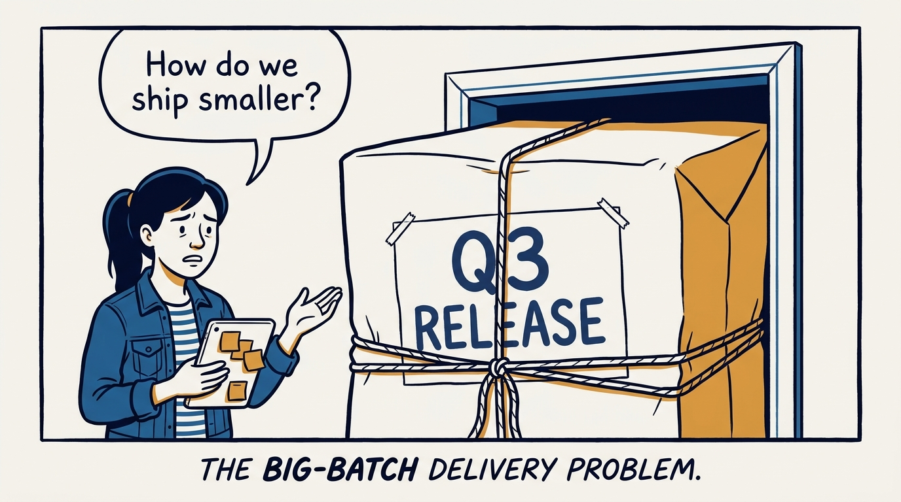
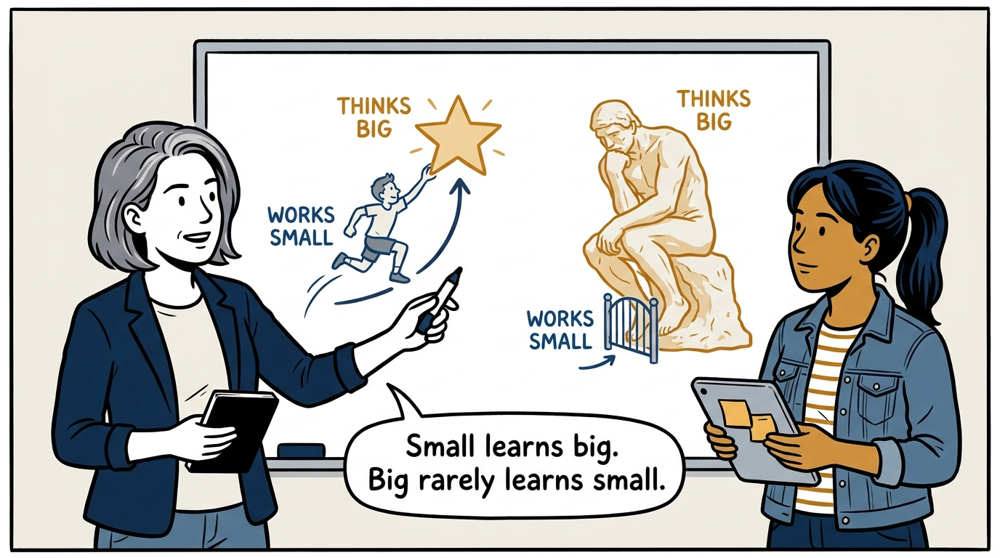
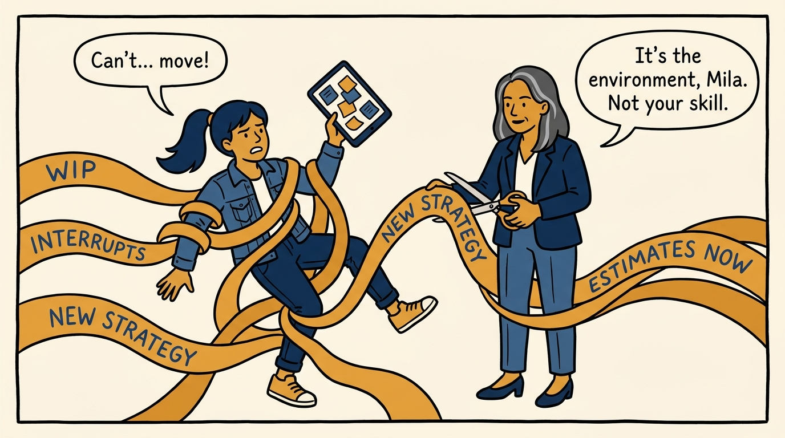
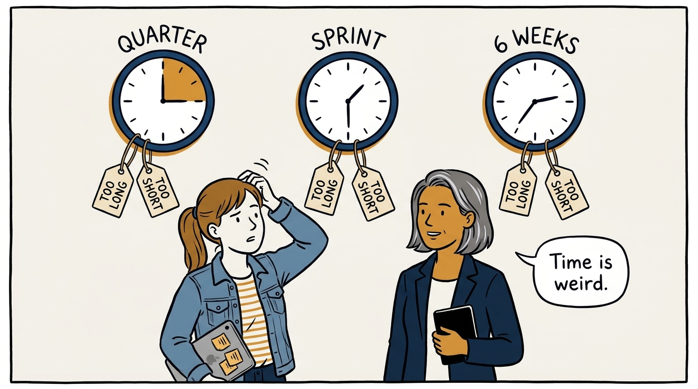
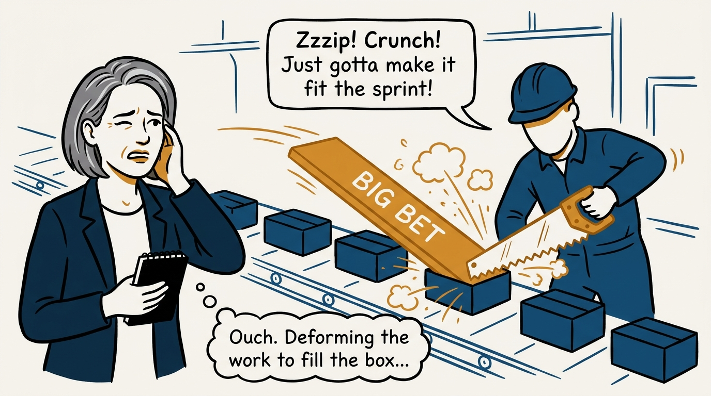
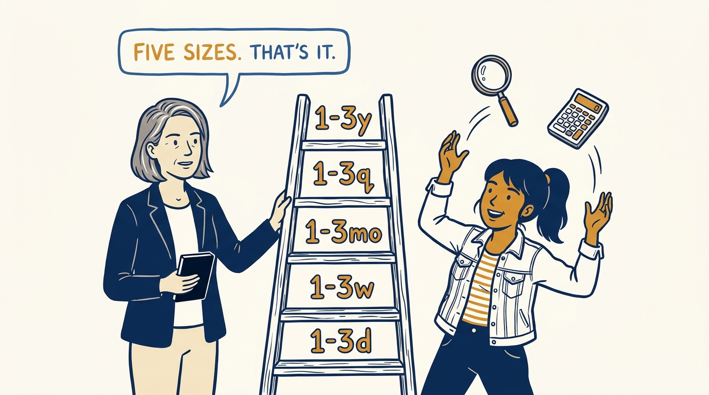
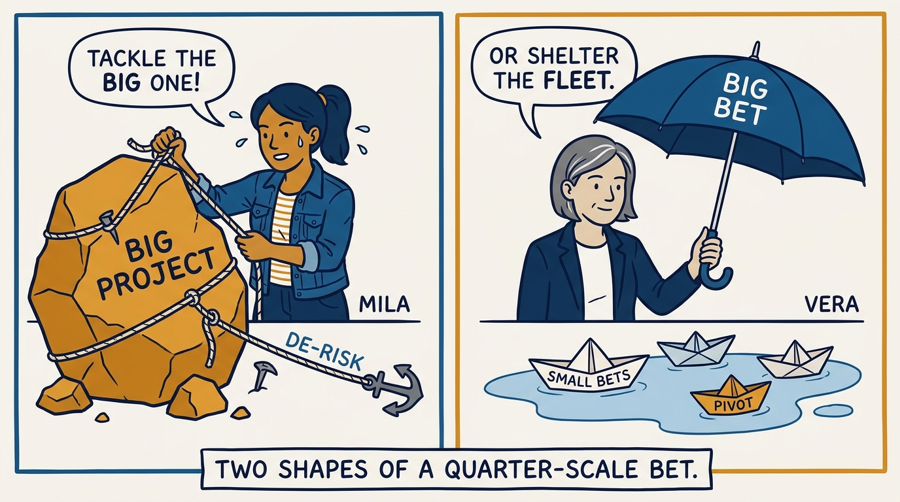
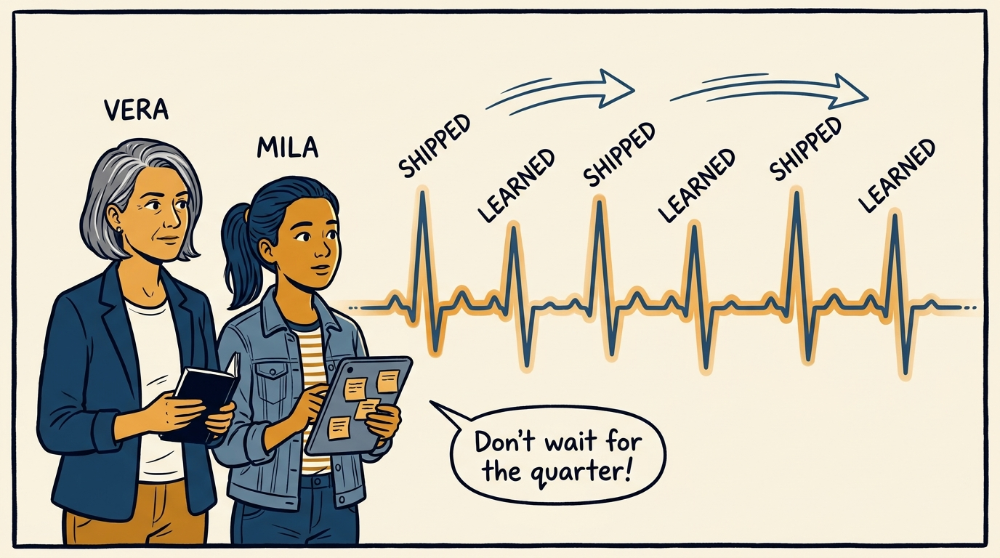

Working small — why tempo beats the perfect cadence, in eight panels.

<!-- comic-style
{
  "cast": "VERA: a calm, seasoned product-minded executive, short gray-streaked hair, dark blazer over a plain t-shirt, carries a small black notebook. MILA: an energetic young product manager, dark hair in a ponytail, denim jacket over a striped shirt, carries a tablet covered in sticky notes.",
  "style": "Clean two-tone explainer comic, thick ink outlines, flat colors with deep blue and amber accents on a light background, generous white space, hand-lettered speech bubbles with SHORT readable text, no photorealism."
}
-->

**Panel 1:** *The hook: everything ships big, late, and all at once.*

**Panel 2:** *The asymmetry: teaching small to think big is coaching; the reverse is a rebuild.*

**Panel 3:** *The environment: interruptions, WIP, and churn kill tempo faster than any skill gap.*

**Panel 4:** *The relativity: every cycle is too long and too short at the same time.*

**Panel 5:** *The perversion: a quarter is not a big sprint, and bets are not box-shaped.*

**Panel 6:** *The ladder: estimate in five coarse sizes — anything finer is waste.*

**Panel 7:** *The shapes: the messy project needs a de-risking rope; the umbrella bet needs pivot points.*

**Panel 8:** *The closer: a weekly heartbeat of shipping and learning — that is progress you can sense.*
