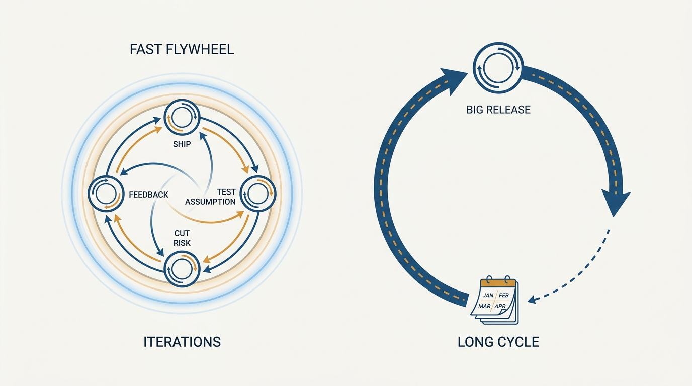
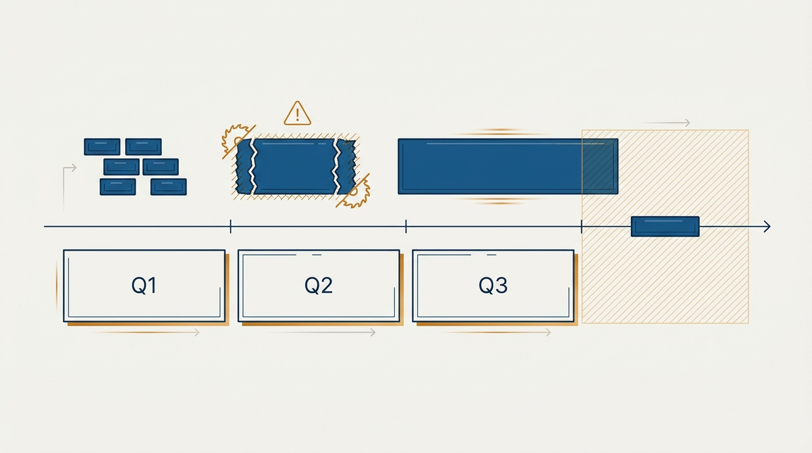
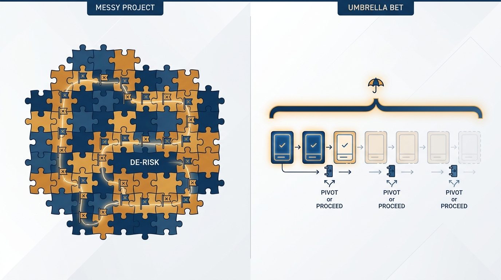

> **Status**: DRAFT
>
> **Principle**: It is far easier to teach a team that works small to think big than to teach a team that thinks big to work small — so a team that can deliver continuously, get frequent feedback, and keep the tempo of assumptions tested and risk reduced high is a gift, and I protect it hardest. I treat every planning cycle as a forcing function rather than a box to fill, estimate only at coarse resolutions, and expect real progress — even on big, hard things — to be sensed daily and weekly. Ship. Learn. Don't wait for the quarter.

## Statement

My operating model for size and tempo has five parts:

- **Protect the team that works small.** Continuous delivery, frequent feedback, high tempo of assumptions tested and risk reduced — where that exists, it is the most valuable asset in the portfolio, and I defend it before I optimize anything else.
- **Build the environment and the skill.** Working small dies under constant interruption, strategy churn, WIP overload, and premature convergence on estimates. It also requires skill — rapidly considering options and slicing them for maximum leverage — that must be hired for and nurtured.
- **No cycle is "the" cycle.** Quarters, two-week sprints, and six-week cycles are each simultaneously too long and too short. I use cycles as forcing functions and refuse to let any of them become the unit reality must be cut to fit.
- **Estimate in five sizes.** 1–3 days, 1–3 weeks, 1–3 months, 1–3 quarters, 1–3 years — at the atomic level of the actual bet. Any finer resolution is waste.
- **Expect progress daily and weekly.** Even the big, hard stuff. The job is coaching teams to break work up without losing the big picture — and to get changes into the world and measure their impact.

## How to Read This

This record is grounded in John Cutler's "20 Unfiltered Operating Takes" (TBM 435), read through the same practitioner-executive lens as the rest of this journal. It answers two questions I am asked constantly: *"How do I get my team to ship smaller and faster?"* and *"What is the right planning cadence?"* — and explains why my answer to the second is "wrong question." The working checklist, derived from the essay, lives in the **Checklist** tab.

## Rationale

**The asymmetry is the whole argument.** A team that can work small has the mechanics of learning: it can take shots, and you can't make shots you don't take. Teaching that team ambition is coaching. A team that thinks big but cannot work small has no feedback loop to learn *with* — every lesson costs a quarter. Both directions are possible, but they are not symmetric, which is why, given the choice, I hire and build for working small first.

**Figure 1:** *Working small is a learning flywheel: many laps of ship, feedback, test, de-risk while the big loop completes one.*

**Environment eats skill.** People who worked small brilliantly at their last company will flounder if I interrupt them constantly, change strategy under them, load them with WIP, and demand they converge prematurely on estimates. When a team stops shipping small, my first suspect is the environment I own, not the team's competence. But environment alone is not enough either — slicing options for leverage is a real skill, and a team that has never done it needs coaching, not just calm.

**Every cadence is too long and too short.** Quarters are too long to keep you working small and too short for the meaningful multi-quarter things. Two-week sprints are too long for true small work and too short for anything big. Six weeks is a genuinely decent forcing function — real things fit in six weeks — yet at any scale you will still occasionally tackle bigger things and still need the durable lanes that live in the one-to-three-quarter range. Time is weird: it always feels like both. The conclusion is not a better cycle; it is refusing to be beholden to any one cycle, because life and learning are only happening *now*.

**"Boxes to fill" is the perversion.** The damage begins when a cycle stops being a checkpoint and becomes a container: every bet magically resized to exactly one quarter, teams chasing their tails through wholesale quarterly rebalancing, work waiting at the border for the next planning window. A quarter is not a big sprint; scaling "sprint" up until it is corporate-compatible inverts the idea it came from. And a quarterly rebalance that reshuffles everything is a diagnostic, not a ritual: it means the work is too big *and* the real prioritization questions live on a longer horizon than a quarter.

**Figure 2:** *Work is not box-shaped: treat cycles as checkpoints to pass through, not containers to fill.*

**Coarse estimates, honest shapes.** The five-size ladder works only when applied at the atomic level of the actual bet. A big messy 1–3-quarter project is what it is — imagining the 1–3-week pieces that "add up" to it may help, but the commitment is the quarter-scale bet, and what it needs from me is a de-risking strategy and wise use of the company's money.

A different 1–3-quarter bet is an umbrella: experiment-friendly, funded iteratively, housing 1–3-week and 1–3-month bets where only the first couple need to work. The two look identical on a roadmap and are entirely different relationships between the parts — in the messy project you need significant progress across the pieces; in the umbrella you need pivot-or-proceed points. Precision beyond the ladder adds nothing to either; knowing which shape you hold changes everything. Either way, the team still meets weekly, and inertia toward the goal is still daily.

**Figure 3:** *Same size on a roadmap, different physics: the messy project needs progress across its parts; the umbrella needs only its first bets to work.*

**Progress you cannot sense weekly is not progress.** Big and hard does not exempt work from observability. If weeks pass with nothing shipped, nothing learned, and nothing de-risked, the work is not "in progress" — it is in hiding. The coaching job is teaching teams to break things up without losing the big picture, so that the biggest bet in the portfolio still produces a weekly heartbeat of shipped changes and tested assumptions.

## What This Means in Practice

| What this principle says | What it does **not** say |
| --- | --- |
| Cycles are forcing functions we use deliberately. | Cadences are worthless — a good six-week checkpoint is a fine tool. |
| Estimates come in five coarse sizes, at the level of the real bet. | Estimation is pointless — sizing a bet honestly is how it gets funded. |
| Big bets must produce weekly evidence of progress. | Everything must be small — some bets are legitimately quarter-scale. |
| Ship and learn continuously; don't wait for the planning window. | Ship anything regardless of impact — [[outcomes]] still governs what counts. |
| Protect small-working teams from interruption and WIP. | Teams choose their own strategy free of any constraint. |

## Anti-Patterns

- **The quarter-shaped bet.** Every initiative in the portfolio mysteriously takes exactly one quarter. Reality is not that tidy; the planning container did the sizing.
- **The wholesale rebalance.** Each quarter boundary reshuffles everything everyone is doing — the tell that work is too big and the real prioritization horizon is longer than the cycle.
- **Precision theater.** Debating whether a bet is 13 or 16 story points, or five or seven weeks, when the honest answer is "1–3 months."
- **The interrupted sprinter.** Leadership laments slow shipping while loading the team with WIP, mid-cycle pivots, and premature estimate demands.
- **Iterating to nowhere.** Working small degrading into a functional feature factory — high tempo, usable output, no needle moved. Tempo is necessary, not sufficient.
- **Waiting for the window.** Finished, shippable learning held back because "that lands next cycle."

## Related Records

- [[right-processes]] — the discovery and delivery loop this tempo runs inside; that record picks processes, this one sizes the work flowing through them.
- [[outcomes]] — the guard against the feature-factory failure mode of working small; the needle still decides what ships next.
- [[lanes]] — the durable direction that keeps small work pointed somewhere; lanes give the daily tempo its multi-quarter meaning.
- [[routines]] — the weekly heartbeat where progress is sensed and assumptions are retested.
- [[team-objectives]] — how ambition gets set so that working small has something big to think about.

## Scope and Revisiting

This principle governs how work is sized, estimated, and paced across every product team I am responsible for. I revisit it if a domain emerges where weekly-sensible progress is genuinely impossible rather than merely uncomfortable — deep research bets may earn a longer heartbeat, explicitly and per bet — and whenever I catch a planning cadence quietly becoming the unit that reality gets cut to fit.

## Authoritative References

- John Cutler, "TBM 435: 20 Unfiltered Operating Takes", *The Beautiful Mess*, August 2026 — the source essay; this record distills its Shipping Smaller/Faster, Cycles, and Estimation sections and the "real progress can be sensed daily and weekly" take.
