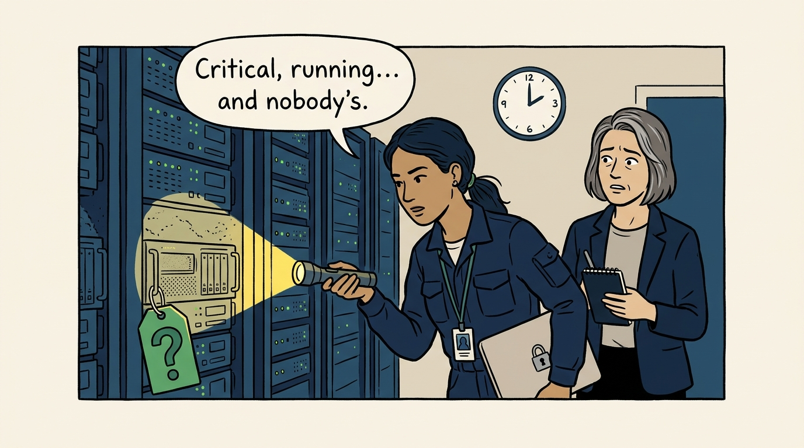
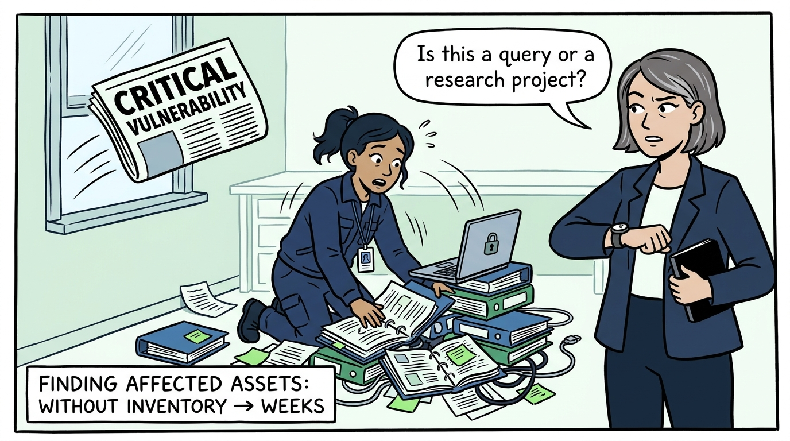
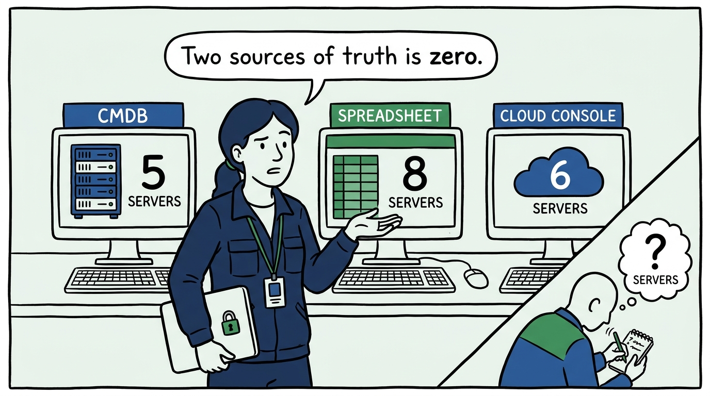
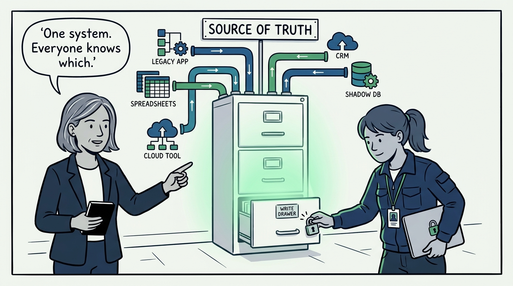
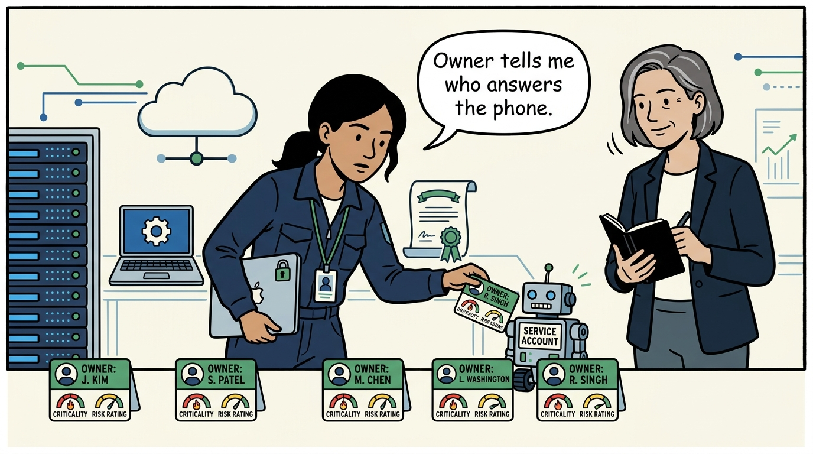
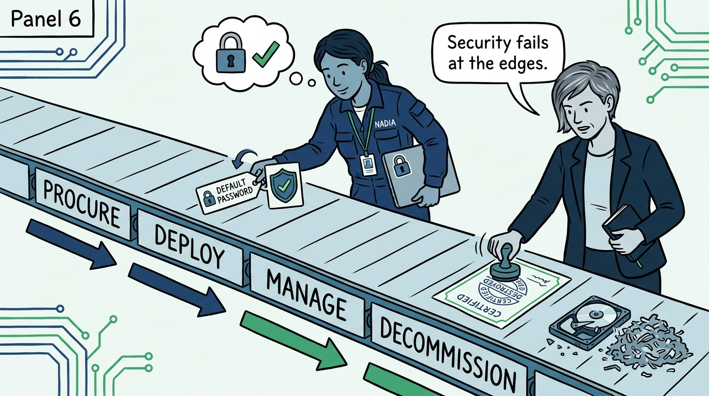
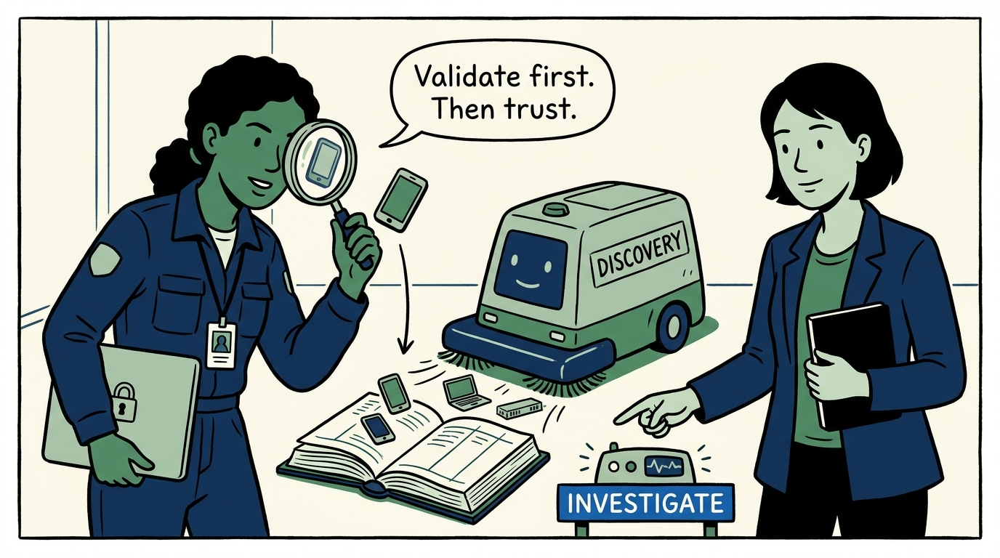
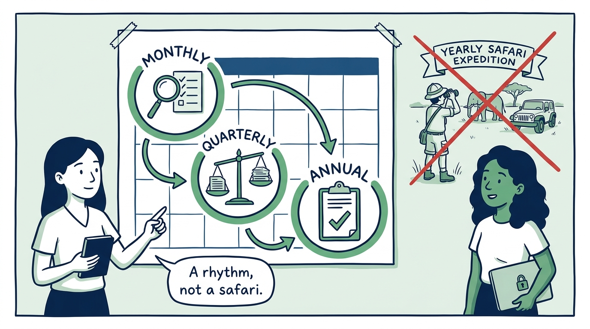
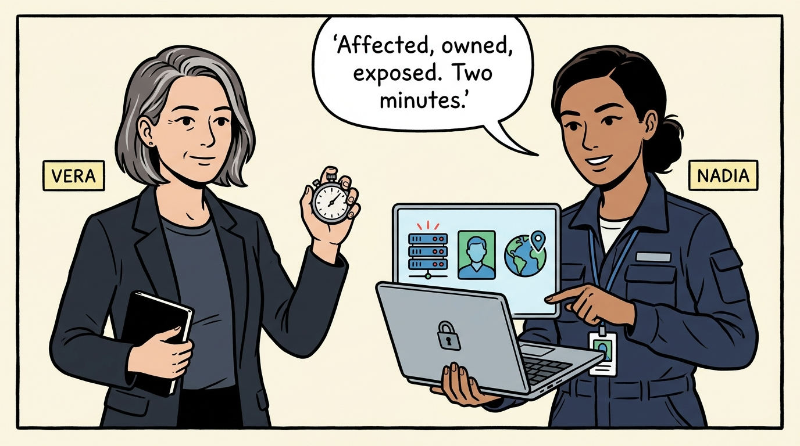

Why the organization cannot defend what it does not know it has — in nine panels.

<!-- comic-style
{
  "cast": "VERA: a calm, seasoned engineering executive, short gray-streaked hair, dark blazer over a plain t-shirt, carries a small black notebook. NADIA: a hands-on defensive-security lead, shoulder-length dark hair tied back, navy utility jacket over a plain shirt, an access badge on a lanyard, laptop with a padlock sticker under one arm.",
  "style": "Clean two-tone explainer comic, thick ink outlines, flat colors with deep blue and green accents on a light background, generous white space, hand-lettered speech bubbles with SHORT readable text, no photorealism."
}
-->

**Panel 1:** *The hook: the ownerless server — critical, running, and nobody's, discovered at 2 a.m. when no one can approve shutting it down.*

**Panel 2:** *The problem: when a critical vulnerability lands on a Friday night, 'which assets run this?' is either a two-hour query or a two-week research project.*

**Panel 3:** *The wrong way: the three competing inventories — when they disagree, every team keeps a private fourth, and each copy decays independently.*

**Panel 4:** *The principle: one authoritative system, and every team knows which one it is — a decision about where arguments end, not a tooling decision.*

**Panel 5:** *Every asset — including the service accounts nobody thinks they own — carries an owner, a criticality, and a risk rating; owner is the single highest-value field.*

**Panel 6:** *The lifecycle's dangerous moments are its edges: deploy hardened and scanned, decommission with revoked access and verified, documented data destruction — no eBay hard drives.*

**Panel 7:** *Automation feeds the inventory; validation keeps it honest — and an unmanaged asset is a process failure to investigate, not a record to quietly add.*

**Panel 8:** *The cost of staying honest: a standing rhythm — monthly discoveries and expirations, quarterly reconciliation, annual full review — not a heroic yearly spreadsheet safari.*

**Panel 9:** *The closer: the test with a stopwatch — which assets are affected, who owns them, what faces the internet, answered in minutes and actually used for decisions.*
