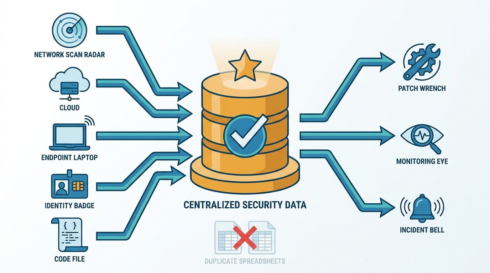
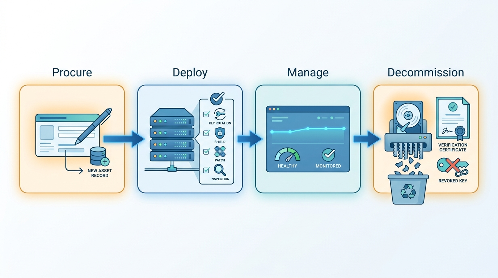
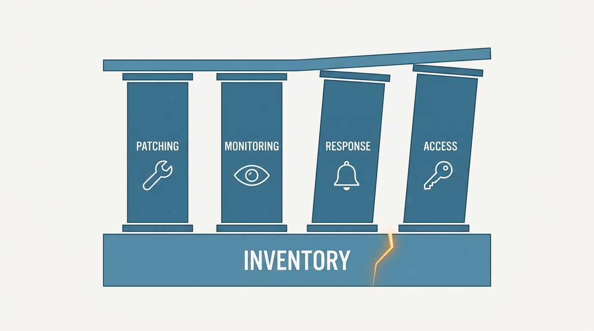

> **Status**: DRAFT
>
> **Principle**: My organization cannot defend what it does not know it has — so **asset management is an ongoing security program, not a one-time inventory exercise**. **One authoritative system is the source of truth**; every asset carries **an owner, a criticality, and a risk rating**; the inventory spans every class that can be attacked — network equipment, servers, endpoints, users and accounts, applications, cloud resources, certificates and domains. **The lifecycle is managed end to end** — procure, deploy, manage, decommission — with **verified data destruction at disposal**. Discovery and reconciliation are **automated, then validated before being trusted**, and an unmanaged asset is treated as a process failure, not a device problem. The test I hold the inventory to: **it answers security questions in minutes — which assets a new vulnerability affects, who owns a critical system, what faces the internet — and it is actively used for security decisions, not simply maintained as documentation**.

## Statement

When my organization manages its assets, this is the program I hold it to.

**Asset management is a program, not a project.**

- **Scoped, owned, and sponsored.** The program has defined scope and objectives, an executive sponsor, a cross-functional team, documented process and procedures, consistent naming conventions — and it runs continuously, not annually.
- **Everything has an owner.** Every asset or asset group has an owner or custodian, and roles for maintaining asset information are explicit.

**There is one source of truth.**

- One authoritative system holds asset records, and every team knows which system that is. Existing data sources are integrated where practical; processes prevent duplicate and conflicting records; who may create, modify, and delete records is defined; the inventory is backed up, versioned, and regularly reviewed for accuracy.
- **The repository fits the organization — and is replaced before it breaks.** A spreadsheet may be honest for a small environment; growing environments evaluate dedicated platforms; the migration away from basic tools is planned before they become unmaintainable. Whatever the system, it supports the required security controls, scale, reporting, and integration.

**Figure 1:** *One authoritative system is the source of truth: every data source feeds it, every security decision draws from it, and competing copies are retired.*

**The schema is rich enough to act on.**

- Every applicable asset records identity (ID, name, type, description, manufacturer, model, serial), ownership (owner, custodian, assigned user, department), value (business function, criticality, risk rating, data classification), state (lifecycle status, location, configuration, versions, patch level), and continuity (dependencies, backup and recovery information, warranty and support, last verification date).

**Data is classified and its owners are interviewed.**

- A simple, documented classification scheme — Public, Internal, Confidential, Highly Confidential — is applied to systems, applications, and data stores, with handling, access-control, encryption, sharing, retention, and disposal requirements defined per class and staff trained on the scheme.
- Each department is asked what data it handles, where it lives, how it is accessed and shared, what regulations apply, and what has gone wrong before — the inventory reflects the business, not just the network.

**Criticality and risk connect the inventory to operations.**

- Each significant asset's criticality reflects business impact if unavailable or compromised; each asset's risk reflects threats, vulnerabilities, likelihood, and impact. Those ratings prioritize patching, vulnerability remediation, monitoring, incident response, backup and recovery, access reviews, security testing, and replacement decisions. An inventory that drives no decisions is documentation.

**Every asset class is inventoried.**

- Network equipment, physical and virtual servers, desktops and endpoints, users and accounts — including privileged, service, and shared accounts, each with an owner and periodic access reviews — applications with their data flows and third parties, cloud assets (monitoring and logging, users and secrets, network infrastructure, databases, compute and storage, IAM policies), and certificates and domains, with expiration alerting and dangling-DNS review.

**The lifecycle is managed end to end.**

- **Procure**: the record is created when the asset is acquired. **Deploy**: default credentials replaced, security configuration and patches applied, endpoint software installed, vulnerabilities scanned, encryption verified, record confirmed complete. **Manage**: location, ownership, upgrade, repair, and configuration changes tracked; criticality reassessed when purpose changes. **Decommission**: accounts, tokens, certificates, and access revoked; monitoring and DNS/DHCP records removed; data destroyed by an approved method, destruction verified and documented, and the asset marked retired in the inventory.

**Figure 2:** *The lifecycle is managed end to end — and its dangerous moments are the edges: hardening proven at deployment, destruction verified at decommissioning.*

**Automation feeds the inventory; humans keep it honest.**

- Discovery uses every practical source — ARP and DHCP data, network scanning, SNMP, OS management interfaces — and integrates vulnerability scanners, endpoint management, IAM, cloud-provider inventory, and infrastructure-as-code state. Change tracking records additions, removals, and modifications with enough history to support investigations. Alerts fire on expirations, unsupported software, unknown devices, missing endpoint protection, and disabled encryption. And **automated data is validated before it is treated as authoritative**.
- **Unmanaged assets are findings.** A device not in the inventory is investigated: who owns it, why it bypassed the process — and the process is corrected, not just the record.

**The program runs on a rhythm.**

- Monthly: new discoveries, high-risk vulnerabilities on critical assets, unauthorized software, approaching expirations, missing owners. Quarterly: source reconciliation, privileged accounts, cloud resources, stale assets. Annually: the complete review — policy, classification scheme, lifecycle and disposal procedures, naming standards, integrations, and the effectiveness of the source of truth itself.

## How to Read This

This record is the second in **The Security Program** section: [[security-program]] documents the baseline once, to ground the program; this record makes knowing-what-we-have a standing capability that everything else consumes. It is grounded in the "Asset Management and Documentation" chapter of the *Defensive Security Handbook* — the book's argument that the inventory is the control every other control silently depends on. The full working checklist — all thirty-two sections through the final program validation — lives in the **Checklist** tab; the management summary is in the **TL;DR** tab and the conversation in the **Conversation** tab.

## Rationale

**The inventory is the control every other control depends on.** Patching assumes you know what is deployed; monitoring assumes you know what is normal; incident response assumes you can find the machine; access reviews assume you know the accounts. When a critical vulnerability lands at nine on a Friday, the difference between a two-hour response and a two-week one is whether "which assets run this software?" is a query or a research project. That is why the record's final validation is phrased as questions with a stopwatch attached — and why the last question is the hardest: is the inventory actively used for security decisions, or simply maintained as documentation?

**Figure 3:** *The inventory is the control every other control depends on: patching, monitoring, response, and access reviews all stand on knowing what exists.*

**Two sources of truth is zero.** The moment the CMDB, the spreadsheet, and the cloud console disagree, every consumer of asset data starts keeping their own copy, and each copy decays independently. Declaring one authoritative system — and telling every team which one it is — is not a tooling decision; it is a decision about where arguments end. Everything else in the source-of-truth discipline follows from that: integration instead of duplication, defined write access, backups, version history, and regular accuracy reviews.

**An asset without an owner is an incident without a responder.** Owner is the single highest-value field in the schema. Criticality tells me how much an asset matters; owner tells me who answers the phone, who approves the maintenance window, who decides whether the strange login was expected. The record extends this to the accounts themselves — service accounts get owners precisely because they are the accounts nobody thinks they own — and to the review that catches drift: access removed promptly when people leave or change roles.

**Classification turns "protect everything" into instructions.** An organization that protects all data equally protects its crown jewels at spreadsheet level. A four-class scheme is deliberately simple — simple enough for every department to apply — and it converts vague intent into specific requirements: this class is encrypted, shared only through these methods, retained this long, destroyed this way. The owner interviews matter just as much: the departments know what data exists, where the regulator's attention sits, and what leaked last time — the inventory has to capture what the business knows, not only what the scanner sees.

**The lifecycle's dangerous moments are its edges.** In the middle of an asset's life, ordinary operations keep it roughly visible. At the edges, security fails silently: a device deployed with default credentials and no endpoint protection, or a server decommissioned with its disks intact and its service accounts still live. The record therefore front-loads deployment — credentials replaced, configuration applied, scanned, encrypted, record complete — and treats decommissioning as a security procedure with proof: approved destruction method, verified sanitization, retained certificates. A retired asset the inventory cannot vouch for is a breach with a delay timer.

**Automation feeds the inventory; validation keeps it honest.** An inventory maintained by hand is stale by definition — the estate changes faster than any human process. So discovery, integration, correlation, and alerting are automated wherever practical. But automation inherits every blind spot of its sources, which is why the record insists on the step most programs skip: validate automated data before treating it as authoritative, and reconcile the sources against each other on a schedule. The robot fills the register; the quarterly reconciliation is where the register earns trust.

**An unmanaged asset is a process failure, not a device problem.** Quietly adding a discovered mystery device to the inventory fixes the record and preserves the leak. The record's sequence is deliberate: find the owner, determine why the asset bypassed the process, add or remove it — and then correct the process that let it stay undocumented. Shadow assets are how organizations get breached through systems nobody was defending; the fix is upstream.

## What This Means in Practice

| What this record says | What it does **not** say |
| --- | --- |
| One authoritative system is the source of truth for asset records. | A specific CMDB product is mandated — a spreadsheet can be the honest answer for a small environment, with a planned migration. |
| Every asset has an owner, a criticality, and a risk rating. | Every field in the schema is filled for every asset on day one — coverage follows criticality. |
| Criticality and risk drive patching, monitoring, and response priorities. | The inventory is a compliance artifact — an inventory that drives no decisions has failed the final validation. |
| Discovery, correlation, and expiration alerting are automated. | Automated data is authoritative by default — it is validated and reconciled first. |
| Decommissioning ends with verified, documented data destruction. | Deleting the asset record is retirement — the disk, the accounts, and the DNS entries outlive the record. |
| Unmanaged assets are investigated and the bypass process corrected. | Discovered devices are quietly added to the inventory — that fixes the record and preserves the leak. |
| The program runs monthly, quarterly, and annual reviews. | The annual review is the inventory — the yearly spreadsheet safari is the anti-pattern this record exists to end. |

Concretely: when a critical vulnerability is announced, my first question is *"which assets are affected, who owns them, and which are internet-facing?"* — and I expect the answer from the inventory in minutes. If the answer requires a meeting, the asset-management program has failed its test, whatever its documentation says.

## Anti-Patterns

- **The annual spreadsheet safari.** A heroic once-a-year inventory, stale within a month — a project wearing a program's name.
- **The three competing inventories.** The CMDB, the finance spreadsheet, and the cloud console all disagree, so every team keeps a private fourth.
- **The ownerless server.** Critical, running, and nobody's — discovered at 2 a.m. during an incident when no one knows who can approve shutting it down.
- **The write-only inventory.** Data flows in, no decision ever flows out; patching and monitoring priorities are set by gut feel while the register gathers dust.
- **The trusting robot.** Automated discovery treated as gospel — its blind spots inherited silently, its duplicates merged into fiction, never reconciled against reality.
- **The eBay hard drive.** A decommissioned device leaves the building with its data intact — no approved destruction method, no verification, no certificate.
- **The quietly adopted stray.** An unknown device found on the network and simply added to the inventory — the record fixed, the process that let it bypass controls left broken.
- **The dangling domain.** Expired certificates, abandoned DNS records, forgotten subdomains — an internet footprint nobody tracks, waiting for a takeover.

## Related Records

- [[security-program]] — the baseline sweep there is the snapshot; this record is the standing capability, and its criticality data feeds the risk register.
- [[vulnerability-management]] — vulnerability-to-asset correlation and criticality-driven remediation priorities are the seam between these records.
- [[cloud-infrastructure]] — cloud assets are inventoried and tagged here; hardening them lives there.
- [[endpoints]] — the endpoint inventory here is the prerequisite for the endpoint hardening bar there.
- [[logging-and-monitoring]] — the alerting hooks here (unknown devices, missing protection, disabled encryption) land in the monitoring pipeline there.
- [[policies]] — the asset-management, classification, and disposal policies this record operates under get their document discipline there.
- [[incident-response]] — responders consume this inventory: affected systems, owners, dependencies, and sensitive-data locations in minutes.

## Scope and Revisiting

This record is `draft`. It applies to every asset class my organization operates — physical, virtual, cloud, and the certificates and domains around them — and as the audit bar for the inventory we already keep. I revisit it if the final validation questions stop being answerable in minutes (the program failing its own test), if reconciliation repeatedly finds the source of truth losing to shadow inventories (the single-source claim failing in practice), or if the estate shifts materially — a major cloud migration, an acquisition — in ways the schema and discovery integrations were not built for.

## Authoritative References

- *Defensive Security Handbook*, 2nd edition (Lee Brotherston, Amanda Berlin, and William F. Reyor III) — the "Asset Management and Documentation" chapter, whose checklist (including the final program validation) this record distills.
