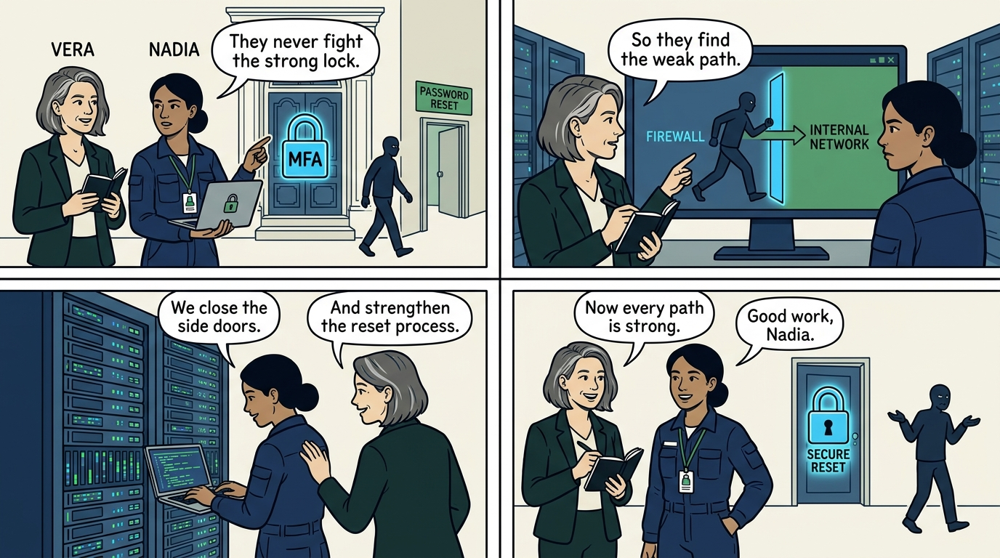
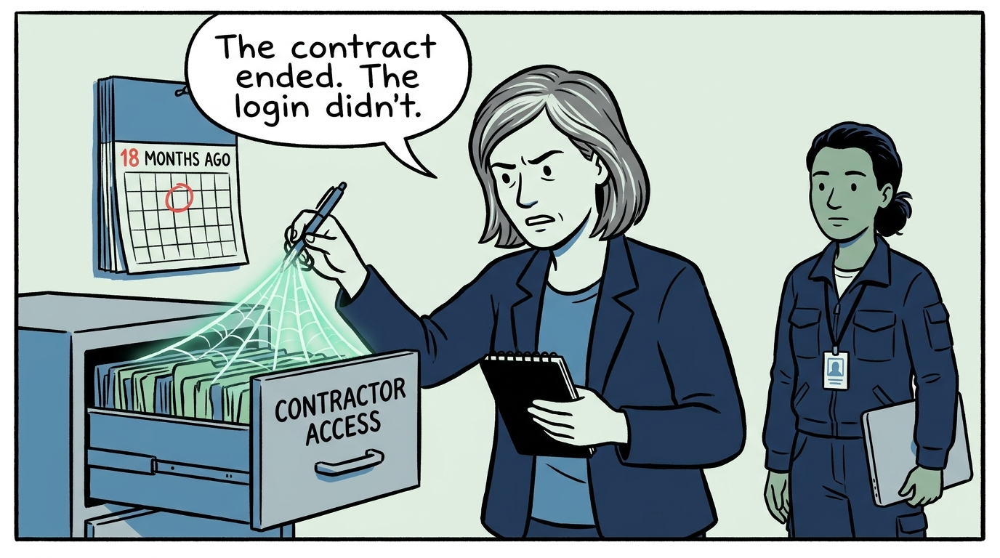
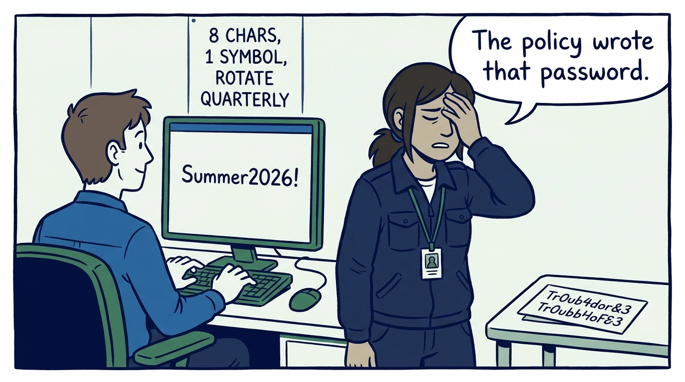
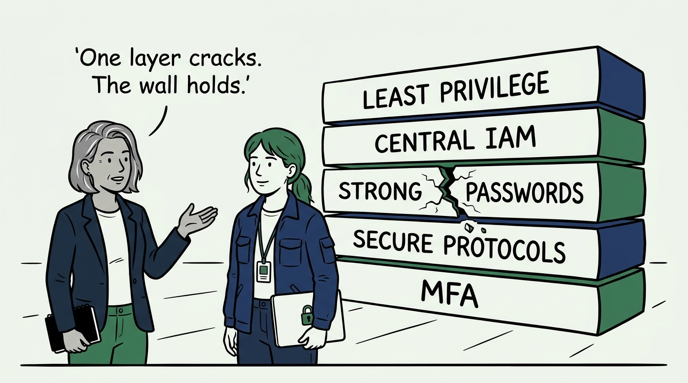
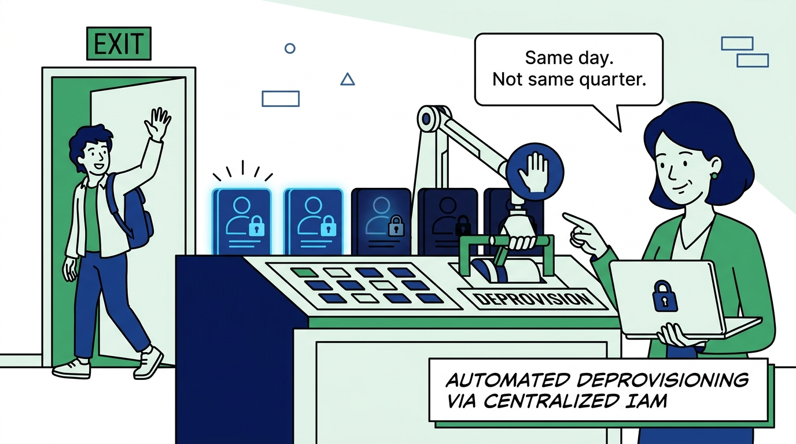
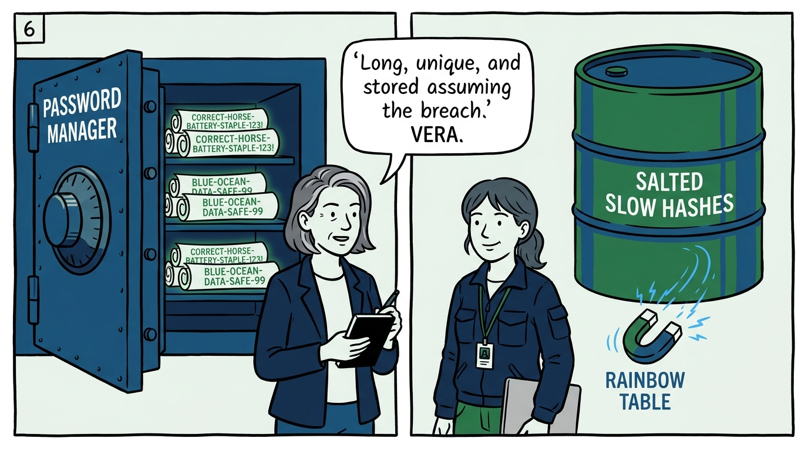
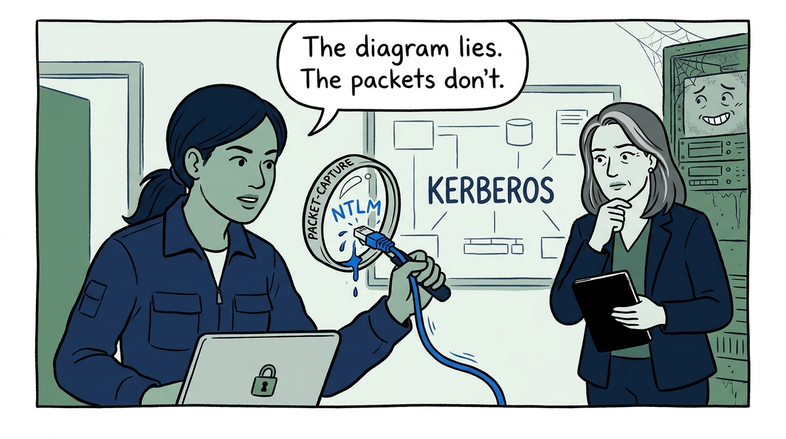
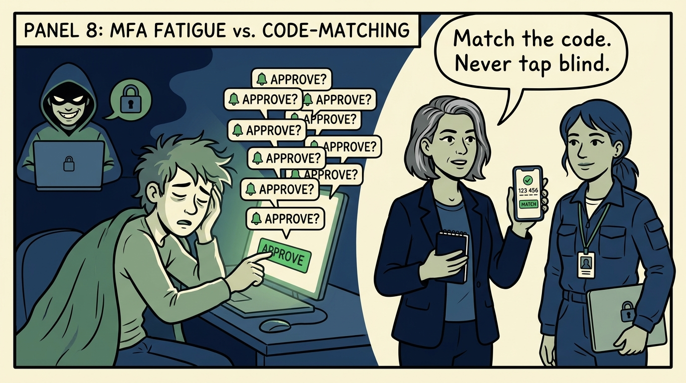
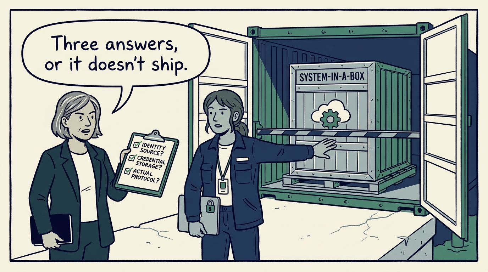

Why no single authentication control is ever asked to carry the day alone — in nine panels.

<!-- comic-style
{
  "cast": "VERA: a calm, seasoned engineering executive, short gray-streaked hair, dark blazer over a plain t-shirt, carries a small black notebook. NADIA: a hands-on defensive-security lead, shoulder-length dark hair tied back, navy utility jacket over a plain shirt, an access badge on a lanyard, laptop with a padlock sticker under one arm.",
  "style": "Clean two-tone explainer comic, thick ink outlines, flat colors with deep blue and green accents on a light background, generous white space, hand-lettered speech bubbles with SHORT readable text, no photorealism."
}
-->

**Panel 1:** *The hook: attackers never fight the strong control — they find its weak sibling, and the weakest login path is the real posture.*

**Panel 2:** *The problem: dormant identity — valid credentials, monitored by no one, missed by no one, surviving long after their owner left.*

**Panel 3:** *The wrong way: complexity theater — rules that produce 'Summer2026!' on schedule while banning the long passphrase that would actually resist attack.*

**Panel 4:** *The principle: layered defense — least privilege, centralized IAM, strong passwords, secure protocols, and MFA together; remove any one layer and the others still hold.*

**Panel 5:** *Practice: centralize identity — SSO and automated provisioning mean accounts appear and disappear with the people they belong to, the day they leave.*

**Panel 6:** *Practice: length beats complexity, uniqueness beats reuse — passphrases live in a vetted manager, and storage assumes the breach with salted, deliberately slow hashes.*

**Panel 7:** *Practice: protocol literacy — know NTLM's and Kerberos's attacks, and verify what a system actually speaks in configuration, logs, and packets before believing the diagram.*

**Panel 8:** *The cost: MFA is necessary and insufficient — push bombing exploits the approve reflex, so the record buys MFA's value at its honest price: code-matching, protected enrollment, reviewed exclusions.*

**Panel 9:** *The closer: before anything ships — where does its identity come from, how are credentials stored, which protocol does it actually speak? No answers, no launch.*
