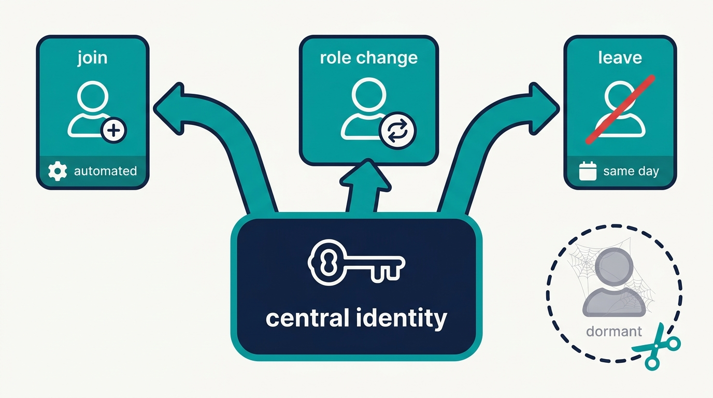
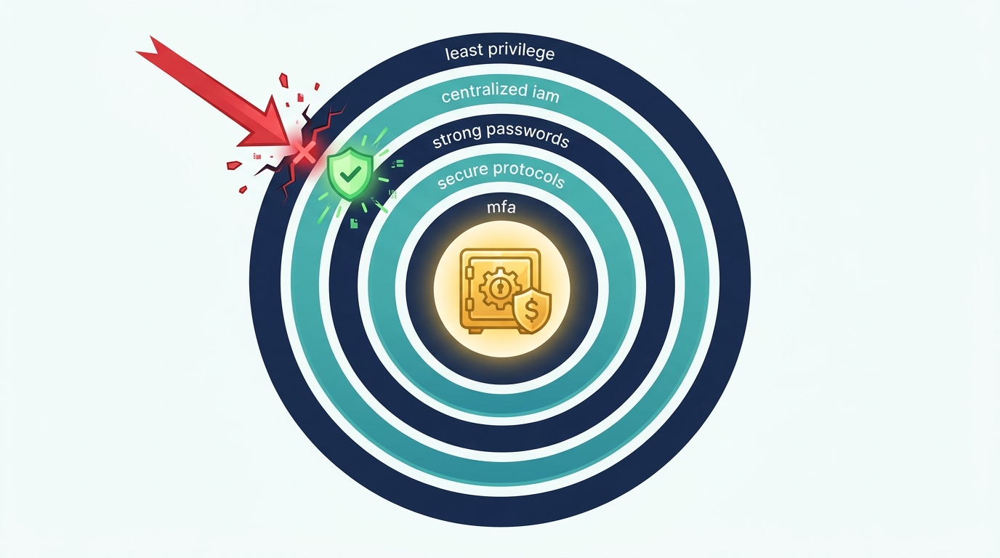
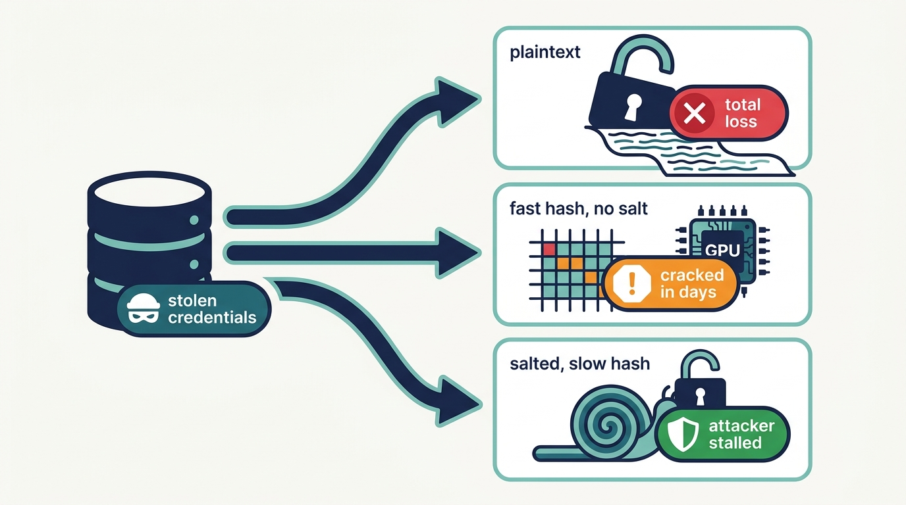

> **Status**: DRAFT
>
> **Principle**: In my organization, **identity is the first control plane** — and no single authentication control is ever asked to carry the day alone. **Identity is managed centrally under least privilege**: SSO against password sprawl, automated provisioning and deprovisioning, dormant accounts removed, access disabled the day an employee or vendor leaves. **Passwords are long, unique, and held in a vetted manager**, never shared and never reused, with credential stuffing assumed. **Credentials are stored only as salted hashes under modern algorithms** — MD5, SHA-1, and DES/3DES retired without nostalgia. **Authentication protocols are known with their attacks, verified in actual use, and chosen with threat modeling**; plaintext protocols are disabled. **MFA is required where it matters most** — privileged accounts, remote access, VPN, email — deployed consistently and treated honestly as a control with known weaknesses. The test I hold the stack to: **least privilege, centralized IAM, strong passwords, secure protocols, and MFA work together as a layered defense** — remove any one layer and the others still hold the line.

## Statement

When a system in my organization proves who someone is, this is the bar it is held to, end to end.

**Identity is managed centrally and pruned relentlessly.**

- **Least privilege is the default posture.** Every account gets the access its role requires and nothing more, and no single security control is relied on alone.
- **Authentication and account management are centralized** where practical — SSO reduces password sprawl, and SCIM-style automation handles provisioning and deprovisioning so accounts appear and disappear with the people they belong to.
- **Dormant identity is removed, not tolerated.** Unnecessary, obsolete, and unused accounts are deleted; access for departing employees and vendors is disabled promptly — the same day, not the same quarter.

**Figure 1:** *Accounts appear and disappear with the people they belong to: provisioning is automated, departure disables access the same day, and dormant identity is removed, not tolerated.*

**Passwords are long, unique, managed — and never trusted alone.**

- **Length beats complexity.** Long, unique passphrases are the standard; short passwords with clever substitutions are not accepted, and randomly generated passphrases are preferred.
- **No sharing, no reuse, no plaintext.** Passwords are never shared — not with coworkers, not with the help desk — and users are trained to report anyone who asks. Reuse across services is forbidden because exposed credentials will be tested everywhere through credential stuffing.
- **Password managers are vetted tools, not conveniences.** The manager is protected by a strong master password and MFA, its storage encryption, lockout, auditing, and generation features are reviewed, and the software comes directly from the vendor with integrity verified.
- **The reset path is as strong as the login path.** Weak knowledge-based questions are avoided; where questions cannot be, answers are randomized and stored in the manager; resets are protected with MFA where possible.

**Credentials are stored as salted, modern hashes.**

- **The team knows the difference between encryption, hashing, and salting** — and applies each where it belongs. Passwords are stored as hashes, never plaintext; every stored password gets its own random salt.
- **Algorithm hygiene is enforced.** MD5, SHA-1, DES/3DES, and weak RSA/DSA key sizes are retired; password hashing uses modern, deliberately slow functions with NIST-aligned salts and work factors; post-quantum risk is on the radar, not on the backlog.

**The infrastructure that authenticates is hardened.**

- **Default credentials die on arrival.** Servers and management interfaces never run vendor defaults; BMC/iLO/IPMI interfaces are protected and segmented onto restricted networks.
- **Windows authentication is hardened deliberately** — SMB signing required, SMB encryption where appropriate, SMBv1 disabled, fallback to weak dialects prevented, insecure guest authentication off, current Microsoft guidance reviewed.
- **Policy fits the population.** Fine-grained password policies apply stronger requirements where justified, verified against the right groups, without needless complexity. Cloud IAM is selected on requirements — banned-password lists, conditional access, scale — not on the assumption that cloud solves access control by itself.

**Protocols are known, verified, and chosen deliberately.**

- **The team can explain what it runs**: NTLM's challenge-response flow and why pass-the-hash makes it legacy; the Kerberos ticket flow and its attack family — pass-the-ticket, Golden and Silver Tickets, Kerberoasting, AS-REP roasting; LDAP binds and why they run over LDAPS/TLS; RADIUS AAA and its EAP mechanisms; OIDC's token risks and SAML's assertion attacks.
- **Actual usage is verified, not assumed** — configuration, logs, and packet analysis confirm which protocol a system really speaks. Protocols that transmit credentials in plaintext — Telnet, FTP, SNMPv2, HTTP, old SMB — are disabled.
- **Protocol choice is an engineering decision** — requirements, scale, management complexity, interoperability, and threat modeling before production, not whatever the vendor defaulted to.

**MFA is required where it matters and treated honestly.**

- **MFA is mandatory for privileged accounts, remote access, VPN, email, and portals**, and extended to vendors, consultants, and other users where appropriate — in addition to strong passwords, never instead of them.
- **MFA's weaknesses are managed, not denied.** MFA does not eliminate phishing; fatigue and push-bombing attacks are recognized, users are trained to refuse unexpected prompts, and code-matching methods are preferred over blind approval.
- **The edges are covered.** Enrollment and reset processes are protected, systems excluded from the rollout are reviewed, and implementation is consistent across the organization — because implementation quality, not the acronym, determines what MFA is worth.

## How to Read This

This record opens the **Identity and Network** section of the journal — who gets in, before what can talk to what. It is grounded in the Authentication chapter of the *Defensive Security Handbook*, and it sits at the boundary the whole estate depends on: [[windows-infrastructure]], [[cloud-infrastructure]], and every service with a login inherit the bar set here. The full working checklist — IAM, passwords, cryptography, every protocol, MFA, and the chapter's Final Review — lives in the **Checklist** tab; the **TL;DR** tab carries the management summary and the **Conversation** tab the dialog.

## Rationale

**Layering is the design, not a slogan.** The chapter's closing question — can I explain how least privilege, centralized IAM, strong passwords, secure protocols, and MFA work together as a layered defense? — is the whole record in one line. Every individual authentication control fails somewhere: passwords get phished, MFA gets fatigued, protocols get downgraded. The commitment is never that a control is unbreakable; it is that no single failure is sufficient. That is why the record refuses to let any one mechanism — including MFA — be treated as the control that makes the others optional.

**Figure 2:** *No single control is unbreakable and none carries the day alone: the commitment is that no single failure is sufficient — remove one layer and the others still hold the line.*

**Centralization is what makes discipline enforceable.** A rule that must be applied by hand in forty systems is applied in thirty of them. SSO and centralized account management turn password policy, lockout, conditional access, and deprovisioning into decisions made once and enforced everywhere — and automated provisioning is really a deprovisioning guarantee. The day someone joins, automation is a convenience; the day someone leaves, it is the difference between access ending at once and an account nobody remembers surviving for years. Dormant accounts are the attacker's favorite identity: valid, monitored by no one, missed by no one.

**Length wins because arithmetic wins.** Brute-force difficulty grows with every character far faster than with any substitution trick, which is why a long dull passphrase beats a short clever password — and why the record bans the predictable substitutions and personal facts that dictionary attacks eat first. Uniqueness is the second half of the same argument: breaches happen elsewhere, and credential stuffing means every reused password is only as safe as the least secure site it was ever typed into. A password manager is the only realistic way humans hold both lines at once, which is why the record treats it as vetted infrastructure — encrypted, MFA-protected, audited — rather than a browser convenience.

**Storage discipline assumes the breach.** Hashing exists for the day the credential database is stolen. Plaintext turns that day into a total loss; fast general-purpose hashes turn it into a weekend of GPU time; unsalted hashes turn it into a rainbow-table lookup. Salted, deliberately slow, NIST-aligned hashing is the difference between an incident and a catastrophe — and weak passwords stay weak even when hashed, which is why storage discipline never excuses password discipline.

**Figure 3:** *Hashing exists for the day the credential database is stolen: plaintext turns it into a total loss, fast hashes into a weekend of GPU time, salted slow hashing into an incident instead of a catastrophe.*

**Legacy protocols carry their attacks with them.** NTLM ships with pass-the-hash; Kerberos, for all its strengths, ships with a named attack family from Golden Tickets to Kerberoasting; plaintext LDAP hands out credentials to anyone on the path. This is why protocol literacy is a defensive requirement, not trivia — the team that cannot describe the Kerberos ticket flow cannot recognize which of its failures matter. And because systems lie by default, the record requires verifying what a system *actually* speaks — in its configuration, its logs, and when needed its packets — before believing the architecture diagram.

**MFA is necessary and insufficient.** Requiring MFA on privileged accounts, remote access, VPN, and email is the cheapest large risk reduction available to my organization — and the moment it is treated as a spell, attackers route around it with push bombing, fatigue, hijacked enrollment, and the systems the rollout skipped. So the record buys MFA's enormous value at its honest price: code-matching over blind approval, protected enrollment and reset, the exclusion list reviewed, and consistency across the estate — because an attacker only needs the one door where MFA was postponed.

**The reset path and the management port are the same lesson.** Attackers do not fight the strong control; they find the weak sibling. A login hardened with MFA means little if the reset flow accepts a mother's maiden name, and a hardened server means little if its BMC still answers with the vendor's default password on the office LAN. The record's insistence on reset security and on segmented, non-default management interfaces is the same principle applied twice: the weakest authentication path *is* the authentication posture.

## What This Means in Practice

| What this record says | What it does **not** say |
| --- | --- |
| Identity is centralized: SSO, automated provisioning and deprovisioning, prompt disablement on departure. | Every system must federate tomorrow — "when practical" is real, but local exceptions are tracked, not forgotten. |
| Passwords are long, unique passphrases held in a vetted password manager. | Complexity rules and forced rotation theater — length and uniqueness do the work. |
| Credentials are stored as salted hashes under modern, slow algorithms. | Hashing excuses weak passwords — weak passwords stay vulnerable even when hashed. |
| MD5, SHA-1, DES/3DES, and plaintext protocols are retired. | Retirement waits for the legacy app's convenience — exceptions are risk-accepted in writing, with an end date. |
| Protocol usage is verified in configuration, logs, and packets. | The architecture diagram is evidence — systems are believed only after inspection. |
| MFA is required for privileged accounts, remote access, VPN, and email, extended outward from there. | MFA everywhere on day one, or MFA as a replacement for password discipline and least privilege. |
| MFA weaknesses are managed: code-matching, protected enrollment, reviewed exclusions. | MFA ends phishing — it narrows it, and the narrowing is worth having. |

Concretely: every new system in my organization answers three questions before it ships — where does its identity come from, how are its credentials stored, and which protocol does it actually speak? If the answers are "its own user table", "we're not sure", and "whatever the default was", it does not ship.

## Anti-Patterns

- **The dormant account.** A contractor's login still valid eighteen months after the contract ended — valid credentials, zero oversight, the attacker's favorite way in.
- **The complexity theater.** Eight characters, one symbol, rotated quarterly — a policy that produces `Summer2026!` on schedule while banning the long passphrase that would actually resist attack.
- **The spreadsheet vault.** Shared credentials in a plaintext file "just for the team" — every reader is a breach vector, and history never forgets.
- **The immortal protocol.** SMBv1 or NTLM kept alive indefinitely for one legacy application — the whole estate inherits pass-the-hash so one system can avoid an upgrade.
- **The push-approval reflex.** Users trained by their own MFA to tap "approve" at anything — push bombing works precisely because the control taught the habit that defeats it.
- **The reset-path backdoor.** A login guarded by MFA while the recovery flow accepts a pet's name from a public profile — attackers use the door with the weaker lock.
- **The default that shipped.** A BMC/iLO/IPMI interface on the corporate LAN with the vendor password — a hardened server with an unlocked side entrance.
- **The partial rollout that stalled.** MFA on email but not VPN, on staff but not vendors — the exclusion list is the attack surface, and nobody owns it.

## Related Records

- [[network-security]] — the devices that carry authentication traffic, hardened; this record's segmented management interfaces live on that record's networks.
- [[network-segmentation]] — the restricted networks and VLANs this record puts management interfaces on; least privilege applied to traffic instead of accounts.
- [[windows-infrastructure]] — Kerberos, NTLM, and SMB hardening in their native habitat: the Active Directory estate.
- [[cloud-infrastructure]] — cloud IAM, conditional access, and banned-password lists as they appear in the cloud estate this record says to select on requirements.
- [[user-education]] — the program that trains people to refuse password requests and unexpected MFA prompts, which this record depends on.
- [[phishing-response]] — what happens when credentials are phished anyway; this record narrows that path, that one handles it.
- [[asset-management]] — you cannot remove obsolete accounts and assets you do not know exist; the inventory this record's pruning depends on.

## Scope and Revisiting

This record is `draft`. It applies to every system in my organization that authenticates a human or a service — on-premises, cloud, and vendor-hosted alike. I revisit it if an audit finds accounts surviving their owners' departure (the deprovisioning claim failing in practice), if a credential-storage review finds fast or unsalted hashing still in production, if MFA coverage reporting shows the exclusion list growing rather than shrinking, or if post-quantum guidance from the standards bodies moves from awareness to action — the algorithm-hygiene commitments must follow it.

## Authoritative References

- *Defensive Security Handbook*, 2nd edition (Lee Brotherston, Amanda Berlin, and William F. Reyor III; O'Reilly) — the Authentication chapter, whose checklist (including its Final Review) this record distills.
- NIST recommendations for password hashing and key derivation, which the chapter names as the bar for algorithm hygiene.
- Microsoft's current SMB and Windows authentication hardening guidance, which the chapter names for the Windows estate.
